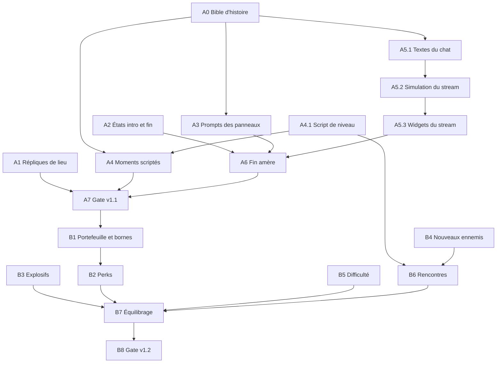

# PLAN — La suite de `PROJET_CASSANDRE` : le live, les sponsors, le second magasin

> Plan établi le 2026-10-03, après la livraison de la v1.0.0. Le jeu est jugé
> amusant et réussi visuellement ; ce chantier l'approfondit au lieu de le
> refaire. Trois étapes : **v1.1 « Le live »** (l'histoire), **v1.2 « Les
> sponsors »** (l'économie et la variété du combat), **v2.0** (quatrième arme
> et second niveau). Le plan est découpé en **lots autonomes** : chacun peut
> être confié à un agent différent avec la seule consigne « prends le lot X de
> `PLAN_SUITE.md` ».

---

## 0. Cadrage

### Décisions actées (échange du 2026-10-03)

| Question | Décision |
|---|---|
| Ordre | **L'histoire d'abord**, les mécaniques ensuite |
| Cutscenes | **Panneaux illustrés** en intro et en fin, hors simulation, plus **quelques moments scriptés en jeu** qui ne retirent jamais le contrôle. Pas de caméra scriptée |
| Images des panneaux | Générées par l'utilisateur avec une IA d'image. Le chantier fournit les **prompts** et l'outil de mise au format ; il ne génère rien lui-même |
| Fin | **Victoire amère** : le chat crie au trucage, la vidéo est démonétisée, le héros se sent persécuté |
| Chaîne | « Réveil du peuple », déjà affichée dans le HUD (`RÉVEIL_DU_PEUPLE`, `src/ui/hud/widgets/LiveCam/LiveCam.tsx`) |
| Héros | **Pas de nom civil, seulement un pseudo.** Aucun nom de personne réelle ou connue |
| Nouvelles répliques | D'abord **en texte**. La voix vient après le playtest, sur une sélection (3 820 crédits ElevenLabs restants au 2026-10-03) |
| Mécaniques retenues | Nouveaux ennemis, explosifs et décor réactif, quatrième arme, niveaux de difficulté, et **l'économie du stream** : des spectateurs s'abonnent et donnent selon les actions du joueur, l'argent débloque des perks |
| Où dépenser | **Pendant la partie**, à des bornes posées dans le niveau. Pas de boutique entre les parties |

### Décisions ouvertes

Chaque ligne a une valeur par défaut : un lot peut avancer avec elle, et la
corriger coûte peu.

| # | Question | Valeur par défaut | Bloque |
|---|---|---|---|
| D1 | Pseudo du héros | Le nom de la chaîne sert de pseudo ; le chat l'appelle « le Réveil » (« rendors-toi, le Réveil ») | A0, A5 |
| D2 | Version A, B ou C des répliques de lieu | Version A partout ; l'utilisateur corrige la table à la relecture | A1 |
| D3 | Rejouer l'intro | Affichée à la première partie, passable, absente au « Rejouer », accessible depuis le menu | A2 |
| D4 | Chat affiché par défaut | Oui, avec une option pour le masquer (Options › Affichage) | A5 |
| D5 | Monnaie | Euros | A5, B1 |
| D6 | Identité du donateur mystère | Un employé de la plateforme de diffusion, qui veut de l'audience et garde les revenus ; révélée dans le dernier panneau. L'idée d'un cadre visant le poste du Directeur a été refusée le 2026-10-03 : elle annonçait un second magasin | A0, A5, A6 |
| D7 | Ce que le camion du quai livre | Des bacs d'œufs, marqués « produits frais » — **validé le 2026-10-03** | A4 |
| D8 | Nom de l'enseigne et titre du niveau | « Hyper Varan », slogan « le sang-froid des prix bas » ; niveau « Inventaire exceptionnel » | A3, A4 |

### Ce que le code offre déjà

Relevé du 2026-10-03, à re-vérifier par chaque lot avant d'écrire.

| Élément | Où | État |
|---|---|---|
| Répliques du héros | `src/game/session/presentation/heroLines.ts`, `triggerHeroLine` dans `src/game/session/player/feedback.ts` | 58 répliques branchées, délai global de 15 s, règles `priority` / `once` / `chance`. Une réplique sans prise de voix s'affiche en texte seul (`playHeroVoice` ignore une clé absente) |
| Catalogue de répliques | `docs/6-reference/repliques-niveau-v2.md` | 199 situations × 3 versions. Les ~45 répliques de lieu (section 1, statut « R ») ne sont pas branchées |
| Compteur de spectateurs | `grantKillViews` (`feedback.ts`), flux `session.viewsRandom`, widget `ViewerCount` | Monte à chaque kill, tiré dans le pas fixe |
| Boîtes par espace | `tools/audio/ia_ambiances.py::rectangles`, d'après `tools/level_v2/plan_de_masse.py` | Convertit déjà les espaces du plan de masse en boîtes du repère du jeu, pour les ambiances |
| Flux d'écran | `src/app/navigation/gameFlowMachine.ts` | `loading → playing → levelComplete`, sans état d'histoire |
| Volumes `trig_*` | `src/game/level/loading/loader.ts` | Chargés comme capteurs Rapier, mais aucun système de jeu ne les exploite |
| Écrans animés | `EcranSystem`, `src/game/level/interactions/ecrans.ts` | Chaîne fixée à l'import (`journal`/`pub`/`mire`/`foot`/`cctv`), pas de changement en cours de partie |
| Objets `use_*` | `InteractionSystem`, `src/game/level/interactions/interactive.ts` | Un gestionnaire par usage ; aucune notion d'achat |
| RNG | `DeterministicRandom`, un flux par propriétaire ([ADR 0033](docs/decisions/0033-rng-presentation-et-portee-du-rejeu.md)) | Tout nouveau tirage prend son propre flux et sa propre graine |

### Règles communes à tous les lots

1. **Lire `CLAUDE.md` en entier**, invariants compris. Une demande qui viole un
   invariant se refuse avec explication, elle ne se contourne pas.
2. **Avant tout code Effect** : lire `node_modules/effect/AGENTS.md` en entier.
   Avant tout code React : lire les quatre règles de `docs/6-reference/react-*.md`.
3. **Toute logique de jeu vit dans le pas fixe** (invariants #1 et #11) et tire
   ses hasards d'un flux `DeterministicRandom` dédié (#12). Les délais se
   comptent en temps de jeu (`session.stats.gameplayElapsed`), jamais en temps
   mural.
4. **Le HUD lit le store zustand, à 10 Hz au plus** (#2). Chaque widget lit ses
   propres données.
5. **Rien ne fige le joueur** (#10) : ni achat, ni réplique, ni moment scripté.
6. **Satire** : marques, pseudos et organisations inventés uniquement. Aucun
   vrai streamer, aucune vraie marque, aucune personne réelle.
7. **Pas de fichier-barrel `index.ts`.** Gestionnaire de paquets : `pnpm`.
8. **Preuve avant de déclarer fini** : `pnpm verify` vert, plus la preuve
   propre au lot. Seul `qa-evidence` déclare une étape terminée.
9. **Commits** : aucune mention d'IA, aucun `Co-Authored-By`.
10. **Compte rendu court** : ce qui a changé, ce qui reste, la preuve.

### Fichiers à forte contention

Plusieurs lots touchent ces fichiers. Deux agents ne les modifient pas en même
temps : soit les lots s'enchaînent, soit chacun travaille dans son worktree et
l'intégration se fait lot par lot.

| Fichier | Lots |
|---|---|
| `src/game/session/presentation/heroLines.ts` | A1, A4, A5, B2, B3 |
| `src/game/session/gameSession.ts` | A1, A4, A5, B1 |
| `src/game/loop/updateGameplay.ts` | A1, A4, A5, B3 |
| `src/game/hud/state.ts`, `src/game/hud/hudTypes.ts` | A5, A6, B1, B5 |
| `src/app/navigation/gameFlowMachine.ts` | A2, B5 |
| `tools/blender/validate_level.py`, `tools/level_v2/espaces/*.py` | A4, B1, B3, B6 |

### Vue d'ensemble des dépendances

Quatre pistes peuvent tourner en parallèle dès le départ : **A1** (répliques),
**A2** (flux d'écran), **A4.1** (script de niveau) et **A0** (écriture). En
v1.2, **B3**, **B4** et **B5** sont indépendants les uns des autres.

### Suivi

| Lot | Titre | Agent | Taille | État |
|---|---|---|---|---|
| A0 | Bible d'histoire | principal | S | **validée le 2026-10-03** (D1, D6, D7, D8 actées) |
| A1 | Répliques de lieu en texte | `level-pipeline` puis `shell` | M | **livré le 2026-10-03** : 31 lieux branchés ; 8 sous-zones attendent A4.1 |
| A2 | États `intro` et `outro` | `shell`, `ui-forge` | M | **livré le 2026-10-03** |
| A3 | Prompts et outil des panneaux | principal, `level-forge` | S | **livré le 2026-10-03** ; les 8 images sont déposées, le registre des licences reste à compléter |
| A4 | Script de niveau et moments scriptés | `level-pipeline`, `level-forge`, `entity-designer` | L | **système et quatre moments livrés le 2026-10-03** ; restent la cargaison du camion et l'enseigne Hyper Varan (travail de décor) |
| A5 | Chat, abonnés et dons | principal, `shell`, `ui-forge` | L | **livré le 2026-10-03** ; valeurs de départ à régler en playtest |
| A6 | Fin amère | `shell`, `ui-forge` | S | **livré le 2026-10-03** |
| A7 | Documentation et gate v1.1 | `doc-keeper`, `qa-evidence` | S | **documentation livrée le 2026-10-03** ; contrôles automatiques verts (`pnpm verify -- --level --docs`) ; reste la partie complète de l'utilisateur |
| A8 | Voix (facultatif) | `sound-forge` | S | après playtest |
| B1 | Portefeuille et bornes | `level-pipeline`, `level-forge`, `shell` | M | **livré le 2026-10-03** : quatre bornes (galerie 5 €, réserve 20 €, personnel 50 €, bureaux 100 €) ; les perks n'ont pas encore d'effet (B2), prix à régler (B7), documentation de référence due au lot B8 |
| B2 | Perks | `feel-tuner`, `entity-designer` | M | **livré le 2026-10-03** : les six effets, une marque et une lecture de pub par perk ; variante de la boisson (A, B ou C) à trancher par l'utilisateur ; VPN et aimant n'ont pas encore de borne |
| B3 | Explosifs | `level-pipeline`, `retro-render`, `sound-forge` | L | **livré le 2026-10-03** : matière `gaz`, souffle, réaction en chaîne, quinze bonbonnes posées des caisses aux bureaux ; son d'explosion synthétisé, à écouter ; rayon et dégâts à régler (B7) |
| B4 | Nouveaux ennemis | `entity-designer`, `retro-render`, `sound-forge` | L | **Rampant livré le 2026-10-03**, à jouer dans la salle d'essai (`?level=gym`) ; le Vigile attend ce verdict, comme le veut l'ordre du lot |
| B5 | Difficulté | `shell`, `entity-designer` | S | à faire |
| B6 | Rencontres | `level-forge`, `entity-designer` | M | à faire |
| B7 | Équilibrage de l'économie | `feel-tuner` | M | à faire |
| B8 | Documentation et gate v1.2 | `doc-keeper`, `qa-evidence` | S | à faire |

Tailles : S = une séance, M = deux ou trois, L = davantage, avec une boucle de
playtest.

---

## 1. v1.1 — « Le live »

**But** : le même niveau, mais qui raconte. Le joueur comprend qui il est,
pourquoi il est là, et finit sur une chute.

**Terminé quand** : une partie complète montre l'intro, au moins trente
répliques de lieu distinctes, les quatre moments scriptés, un chat et des dons
qui réagissent à ce que fait le joueur, et les panneaux de fin ; `pnpm verify`
est vert.

### A0 — Bible d'histoire

- **Agent** : principal, avec validation de l'utilisateur. **Dépend de** : rien.
- **Livrable** : `docs/2-fonctionnel/histoire.md`.
- **Contenu** :
  - Le héros : pseudo (D1), ton, ce qu'il veut prouver, ce qu'il ignore.
  - L'arc en cinq temps : l'indice, l'entrée, la découverte (réserve et quai),
    la révélation (Directeur), la chute (personne ne le croit).
  - Le donateur mystère (D6) : cinq ou six interventions réparties sur la
    progression, de plus en plus précises.
  - La liste des quatre moments scriptés et des huit panneaux, avec une phrase
    d'intention pour chacun.
  - Le registre du chat : trolls, sceptiques, fidèles, un ou deux habitués
    reconnaissables.
- **Hors périmètre** : aucun texte définitif de chat ni de panneau, seulement
  les intentions.
- **Preuve** : le document est relu et validé par l'utilisateur.

### A1 — Répliques de lieu en texte

- **Agent** : `level-pipeline` (A1.1, A1.2), `shell` (A1.3). **Dépend de** : D2.
  **Parallèle avec** : A2, A4.1.

**A1.1 — Manifeste des espaces.** Extraire la conversion de
`ia_ambiances.py::rectangles` dans un module partagé de `tools/level_v2/`, et
produire `public/assets/levels/niveau_v2.espaces.json` : une boîte par espace
du plan de masse (`id`, `x`, `y`, `z` dans le repère du jeu). Le jeu ne lit pas
le manifeste des ambiances pour cela : la simulation ne dépend pas de l'audio.

**A1.2 — Espace courant.** Un module pur dans `src/game/level/navigation/`
donne l'espace qui contient un point (la plus petite boîte gagne, comme pour
les ambiances). Le manifeste se charge à la frontière asynchrone, avec le
niveau (`game/level/loading/`), et son décodage passe par un schéma comme les
autres manifestes. Un niveau sans manifeste reste jouable, sans répliques de
lieu.

**A1.3 — Déclenchement.**
- Ajouter les répliques de lieu à `HERO_LINES`, toutes en `once: true`, sans
  `priority`. Table de correspondance entre l'identifiant d'espace du plan de
  masse (`parking_ext`, `pc_secu`…) et l'identifiant du catalogue (`parking`,
  `pc_securite`…).
- Règles, tirées du catalogue :
  - La réplique part après un court temps d'observation dans l'espace
    (valeur de départ : 1,5 s).
  - Elle est abandonnée si un ennemi est en alerte.
  - Si le délai global la bloque, elle est retentée tant que le joueur reste
    dans l'espace, puis abandonnée à la sortie ; elle reste disponible pour une
    visite ultérieure.
  - Un événement précis (secret, carte, arme) passe avant la réplique de la
    pièce.
- Première passe : les espaces qui ont une boîte dans le plan de masse. Les
  sous-zones sans boîte propre (mezzanine, surgelés, bureaux individuels)
  attendent le lot A4.1, qui sait déclencher une réplique depuis un `trig_*`.

- **Hors périmètre** : aucune voix, aucun changement de la durée d'affichage.
- **Preuve** : tests unitaires de la recherche d'espace et des règles de
  déclenchement ; une partie de bout en bout avec la liste des répliques
  affichées, relevée depuis la console.

### A2 — États `intro` et `outro`

- **Agent** : `shell` (câblage), `ui-forge` (apparence). **Dépend de** : D3.
  **Parallèle avec** : A1, A4.1.
- **Flux** :
  - `loading → intro → playing` à la première partie ; `loading → playing` au
    « Rejouer » ou si l'intro a déjà été vue.
  - `playing → outro → levelComplete` quand le niveau est terminé. La mort ne
    passe pas par `outro`.
- **Simulation** : aucun pas fixe ne tourne pendant ces états, comme en pause.
  Le lot vérifie comment la pause arrête la boucle et réutilise ce mécanisme ;
  `gameplayElapsed` ne doit pas avancer.
- **Composant** : un écran `src/ui/screens/story/StoryScreen/`, alimenté par une
  liste de panneaux (image, lignes de légende, durée minimale). Avance à la
  touche, « Passer » toujours visible. Les légendes sont du texte posé par le
  jeu, jamais incrustées dans l'image.
- **Données** : la liste des panneaux vit hors de `src/ui/`
  (`src/game/session/presentation/`). L'indicateur « intro déjà vue » se range
  avec les réglages (`src/game/settings/`).
- **Images provisoires** : huit aplats numérotés, remplacés un par un quand l'outil du lot A3 livre une image.
- **Preuve** : captures des deux séquences ; test de la machine d'état
  (transitions, cas « Rejouer », cas mort) ; vérification que le chronomètre
  du récap ne compte pas l'intro.

### A3 — Prompts et outil des panneaux

- **Agent** : principal (prompts), `level-forge` (outil). **Dépend de** : A0.
- **Livrables** :
  - `assets_src/panneaux/PROMPTS.md` : les règles communes, les huit prompts
    et la procédure de dépôt. Même rangement que `assets_src/affiches/`.
  - `tools/textures/generate_panneaux.py` : prend une image brute de
    `assets_src/panneaux/raw/` et sort un PNG 640×360 en 64 couleurs dans
    `public/assets/story/`. Les bruts sont versionnés, comme ceux des
    affiches : une image générée ne se retélécharge pas. La palette est propre
    à chaque panneau : celle des textures du jeu déformait les teintes.
- **Cohérence du héros** : chaque prompt renvoie à la planche du portrait du
  stream (`docs/assets/portrait-stream-animations-v1.png`) comme image de
  référence.
- **Les huit panneaux** :

  | # | Séquence | Sujet |
  |---|---|---|
  | 1 | Intro | La chambre : mur de ficelles rouges, installation de stream, « 200 abonnés » |
  | 2 | Intro | L'indice : un ticket de caisse au symbole étrange, l'affiche « fermeture exceptionnelle pour inventaire » |
  | 3 | Intro | Le parking de nuit, l'enseigne qui grésille, le live démarre avec trois spectateurs |
  | 4 | Intro | Carton-titre |
  | 5 | Fin | La sortie à l'aube, la carte Platine à la main |
  | 6 | Fin | Le chat : « beaux effets spéciaux », « fake », « rendors-toi » |
  | 7 | Fin | L'avis de démonétisation ; le héros, persécuté et ravi de l'être |
  | 8 | Fin | De retour dans la chambre : la chaîne suspendue, et le dernier message du donateur, signé de la plateforme |

- **Licence** : noter dans `assets_src/LICENCES_ASSETS.md` l'outil de
  génération utilisé et ses conditions, avant d'intégrer une image.
- **Preuve** : un panneau d'essai passé par l'outil et affiché dans l'écran du
  lot A2, capture à l'appui.

### A4 — Script de niveau et moments scriptés

- **Agent** : `level-pipeline` (A4.1), puis `level-forge` et `entity-designer`
  (A4.2). **Parallèle avec** : A1, A2.

**A4.1 — Script de niveau.** Donner enfin un usage aux `trig_*` : un système
`src/game/level/scripting/` qui, dans le pas fixe, détecte l'entrée du joueur
dans un volume et exécute une liste d'actions, une seule fois par partie.

- Propriétés Blender lues sur un `trig_*` : `evenement` (nom d'un scénario
  déclaré dans le code) ou `replique` (identifiant d'une réplique du héros).
  Une valeur inconnue est une erreur de `validate_level.py` et un avertissement
  bruyant du loader, comme pour les `use_*`.
- Actions disponibles en première version : dire une réplique, afficher une
  annonce du magasin (canal texte distinct de celui du héros), réveiller un
  groupe d'ennemis, changer la chaîne d'un groupe d'`ecran_*`, verrouiller ou
  ouvrir une porte.
- Les délais entre actions se comptent en pas fixes.
- Deux ajouts côté systèmes existants : un point d'apparition peut naître
  endormi et appartenir à un `groupe` ; `EcranSystem` accepte un changement de
  chaîne en cours de partie.
- Un ADR consigne la décision (numéro suivant : 0037).

**A4.2 — Les quatre moments.**

| Moment | Lieu | Déroulé | Travail de niveau |
|---|---|---|---|
| L'annonce | Caisses | Annonce « un client non identifié est attendu en caisse », puis le premier combat se déclenche | Un `trig_*`, un groupe de `spawn_suit_*` |
| Les écrans | Atelier SAV (déplacé : l'électroménager n'a aucun `ecran_*`, son mur d'écrans est un décor fixe) | Les quarante écrans passent sur la vidéosurveillance, réplique du héros | Un `trig_*`, les `ecran_sav_*` existants |
| La livraison | Quai | Le hayon du camion est ouvert sur sa cargaison (D7), réplique, premier message précis du donateur mystère | Habillage du camion, un `trig_*` |
| L'interphone | Avant le bureau du Directeur | Le Directeur s'adresse au héros par l'interphone avant le combat | Un `trig_*` ; la révélation existante n'est pas modifiée |

- **Enseigne** (D8) : le décor n'affiche que « HYPER » (`tools/textures/generate_trims.py`). Poser le nom complet sur l'enseigne du parking, et l'utiliser dans le libellé du niveau et l'écran de fin.

- **Preuve** : tests du système de script (une fois par partie, ordre des
  actions, délais) ; `pnpm verify -- --level` ; une capture par moment.

### A5 — Chat, abonnés et dons

- **Agent** : principal (A5.1), `shell` (A5.2, câblage de A5.3), `ui-forge`
  (apparence de A5.3). **Dépend de** : A0, D4, D5.

**A5.1 — Textes.** Fichier de données dans `src/game/session/stream/`.
Volumes de départ : une trentaine de pseudos, environ 120 messages de chat
répartis par situation (kill, série, casse, secret, dégâts subis, temps mort,
toilettes, boss), une quarantaine de messages de don, et les interventions du
donateur mystère. Les trolls restent satiriques, sans insulte réelle.

**A5.2 — Simulation.** Module `src/game/session/stream/`, exécuté dans le pas
fixe, avec son propre flux RNG et sa propre graine.

- **Intérêt du live** : une jauge interne qui monte avec les actions
  spectaculaires et retombe quand il ne se passe rien. Elle pilote le nombre de
  spectateurs, qui remplace le gain par kill actuel (`grantKillViews`) sans
  changer le widget.
- **Abonnés** : partent de 200 et montent par paliers ; le « 200 abonnés » de
  `LiveCam` devient une donnée du store.
- **Dons** : déclenchés par les actions notables, avec une probabilité et un
  montant qui dépendent de l'action. L'argent s'accumule dans un portefeuille
  de session. En v1.1 il ne s'achète rien : le portefeuille prépare le lot B1.
- **Chat** : un message toutes les deux à quatre secondes au plus, choisi dans
  la catégorie de la dernière action notable.
- **Donateur mystère** : ses messages ne sont pas tirés au hasard, ils sont
  liés à des étapes de progression (carte Argent, réserve, quai, carte Or,
  escalier).
- Toutes les valeurs sont des réglages nommés, à ajuster en playtest.
- Un ADR consigne le flux RNG, la portée et le lien avec le score (numéro
  suivant : 0038).

**A5.3 — Widgets.** Un dossier par composant dans `src/ui/hud/widgets/` :
`StreamChat` (quatre ou cinq lignes, qui s'effacent), `DonationAlert` (un don à
la fois), le portefeuille, et les abonnés dynamiques dans `LiveCam`. Le chat ne
recouvre ni le viseur ni les compteurs de vie et de munitions. Option pour le
masquer (D4).

- **Preuve** : tests de la simulation (même séquence d'actions, mêmes dons) ;
  captures du HUD en combat et au repos ; mesure que le store n'est pas écrit à
  plus de 10 Hz.

### A6 — Fin amère

- **Agent** : `shell`, `ui-forge`. **Dépend de** : A2, A3, A5.
- **Travail** : brancher les quatre panneaux de fin, ajouter au récap les
  lignes du live (spectateurs au pic, abonnés gagnés, dons reçus), et le
  bandeau « vidéo démonétisée ». Les lignes du live sont informatives : elles
  ne changent pas le score, pour ne pas fausser les records existants.
- **Preuve** : capture de la séquence de fin complète, du dernier pas de jeu au
  récap.

### A7 — Documentation et gate v1.1

- **Agent** : `doc-keeper` puis `qa-evidence`. **Dépend de** : tous les lots A.
- **Travail** : mettre à jour `docs/2-fonctionnel/` (histoire, interface,
  expérience de jeu), le glossaire, la table des conventions de nommage
  (`trig_*` et ses propriétés) dans `CLAUDE.md` et dans
  `docs/6-reference/conventions-nommage.md`, le journal, le `CHANGELOG.md`.
- **Gate** : `pnpm verify -- --level --docs` vert et une partie complète jouée
  par l'utilisateur. Le plafond de lots de dessin est abandonné (ADR 0039).

### A8 — Voix (facultatif, après le playtest)

- **Agent** : `sound-forge`. **Dépend de** : le verdict de playtest de la v1.1.
- **Budget** : 3 820 crédits, soit environ 3 800 caractères. L'utilisateur
  choisit les répliques qui méritent une voix ; les autres restent en texte.
- Rappel : Howler exige le `.ogg` **et** le `.m4a`.

---

## 2. v1.2 — « Les sponsors »

**But** : l'argent du live sert à quelque chose, et le combat cesse d'être un
seul type de rencontre répété.

**Terminé quand** : une partie permet d'acheter au moins deux perks à des
bornes, croise deux nouveaux types d'ennemi et des explosifs, se joue dans
trois difficultés, et le gate B8 est vert.

### B1 — Portefeuille et bornes

- **Agent** : `level-pipeline`, `level-forge`, `shell`. **Dépend de** : A5.
- **Niveau** : une borne est un `use_*` qui porte deux propriétés nouvelles,
  `perk` (identifiant) et `prix`. Trois ou quatre bornes, posées sur du
  mobilier qui existe déjà (caisses automatiques, distributeurs), dans la
  galerie, la réserve, les coulisses et les bureaux, à prix croissants.
  `validate_level.py` refuse un `perk` inconnu.
- **Jeu** : achat direct à la touche d'interaction, sans menu et sans figer le
  joueur. Une borne vend un seul perk. Solde insuffisant : un message et une
  réplique, rien d'autre.
- **HUD** : l'invite d'interaction affiche le nom du perk et son prix.
- **Preuve** : tests d'achat (solde, achat unique, borne épuisée) ;
  `pnpm verify -- --level` ; capture d'un achat.

### B2 — Perks

- **Agent** : `feel-tuner` (ce qui touche au déplacement et aux armes),
  `entity-designer` (ce qui touche aux ennemis). **Dépend de** : B1.
- **Principe** : chaque perk est un placement de produit que le héros accepte,
  avec une marque inventée et une réplique de « lecture de pub ».
- **Liste de départ** :

  | Perk | Effet | Sensible |
  |---|---|---|
  | Boisson énergisante | Pointe de vitesse brève après un kill | Oui : le déplacement est validé, `feel-tuner` propose des variantes A/B, l'utilisateur tranche |
  | VPN | Les Costards repèrent le joueur plus tard | Non |
  | Gilet « tactique » en promo | PV maximum augmentés | Non |
  | Abonnement premium | Munitions maximum augmentées | Non |
  | Perche à selfie renforcée | Dégâts du pied-de-biche augmentés | Non |
  | Aimant à pourboires | Les ramassages viennent au joueur de plus loin | Non |

- **Règle** : un perk modifie une valeur de configuration de la session, jamais
  une constante globale ; une nouvelle partie repart sans perk.
- **Preuve** : un test par perk ; harnais A/B pour la boisson énergisante.

### B3 — Explosifs et décor réactif

- **Agent** : `level-pipeline` (système), `retro-render` (effets),
  `sound-forge` (son), `level-forge` (pose). **Indépendant de** B1, B2, B4, B5.
- **Niveau** : une nouvelle `matiere`, `gaz`, sur les `prop_*` (bonbonnes,
  aérosols, palettes de produits ménagers).
- **Jeu** : à la casse, dégâts en rayon sur le joueur et les ennemis, impulsion
  sur les props voisins, réaction en chaîne avec un délai compté en pas fixes.
- **Placement** : les explosifs se posent là où un combat a lieu, sur le
  chemin principal : le joueur doit les rencontrer.
- **Preuve** : tests de la réaction en chaîne (même état de départ, même
  résultat) ; capture d'une explosion.

### B4 — Nouveaux ennemis

- **Agent** : `entity-designer` (comportement), `retro-render` et `level-forge`
  (sprites), `sound-forge` (sons). **Indépendant de** B1, B2, B3, B5.
- Le Costard tire déjà à distance. Les deux nouveaux venus occupent les rôles
  qui manquent :

  | Ennemi | Rôle | Comportement |
  |---|---|---|
  | Le Rampant | Reptilien sans costume : rapide, fragile, au corps-à-corps, en meute | Force à reculer et à viser bas ; sort des gaines et de la chambre froide |
  | Le Vigile | Lourd, lent, protégé de face par un bouclier | Force à contourner ou à utiliser un explosif |

- **Contraintes** : pas d'ECS (invariant #8) ; la machine d'état partagée par
  le Costard et le Directeur est étendue, pas dupliquée ; sprites pré-rendus
  en huit directions selon l'[ADR 0028](docs/decisions/0028-sprites-ennemis-pre-rendus.md),
  à partir de modèles CC0 dont la licence est confirmée avant intégration.
- **Ordre** : le Rampant d'abord, livré et joué, puis le Vigile.
- **Preuve** : tests de la machine d'état ; planche de sprites ; une rencontre
  jouable par ennemi dans la salle d'essai avant la pose dans le niveau.

### B5 — Difficulté

- **Agent** : `shell`, `entity-designer`. **Indépendant de** B1 à B4.
- Trois niveaux, aux noms dans le ton : « Client », « Habitué », « Lanceur
  d'alerte ». Ils règlent les PV et les dégâts des ennemis, la taille des
  groupes réveillés par le script de niveau, et la générosité des dons.
- Choix au lancement de la partie, mémorisé avec les réglages, affiché dans le
  récap. Les records sont tenus par difficulté.
- **Preuve** : tests des multiplicateurs ; capture de l'écran de choix.

### B6 — Rencontres

- **Agent** : `level-forge`, `entity-designer`. **Dépend de** : A4.1, B4.
- Trois rencontres construites avec le script de niveau, sans ajouter de
  décor : une arène verrouillée dans la réserve, une montée en tension au
  parking souterrain (les Rampants), un Vigile qui garde l'escalier des
  bureaux.
- **Preuve** : `pnpm verify -- --level` ; durée de partie mesurée, qui reste
  entre 8 et 12 minutes.

### B7 — Équilibrage de l'économie

- **Agent** : `feel-tuner`. **Dépend de** : B2, B3, B5, B6.
- Régler les montants des dons et les prix pour qu'une partie normale permette
  deux ou trois perks sur six, jamais tous. `feel-tuner` propose des variantes
  et des relevés ; l'utilisateur tranche.
- **Preuve** : relevé du portefeuille au fil de trois parties types.

### B8 — Documentation et gate v1.2

- Même forme que A7 : documentation fonctionnelle et de référence, conventions
  de nommage (`perk`, `prix`, `matiere: gaz`), ADR des bornes et des explosifs,
  `CHANGELOG.md`, puis gate `qa-evidence` et playtest de l'utilisateur.

---

## 3. v2.0 — esquisse

À détailler quand la v1.2 sera jouée. Rien ici n'est engagé.

- **Quatrième arme**, à rôle net : de zone ou explosive (cloueuse, fusées de
  détresse). Viewmodel, sons, ramassage, selon l'[ADR 0029](docs/decisions/0029-armes-en-vue-subjective.md).
- **Second niveau** : **pas un autre magasin** (décision du 2026-10-03). Piste
  ouverte par le dernier panneau : le siège de la plateforme de diffusion. Il suppose de
  décider ce qui passe d'un niveau à l'autre (portefeuille, perks, armes) et
  d'ajouter un état de transition au flux d'écran.
- **Histoire** : la plateforme, et ce qu'elle fait des images.

---

## 4. Préalables et points en attente

- **Arbre de travail** : des modifications non commitées existent au
  2026-10-03. Les commiter avant de lancer des agents en worktree.
- **ADR 0027** (filtrage des textures réduites) : toujours en attente de
  validation. Indépendant de ce plan.
- **`docs/2-fonctionnel/le-niveau.md`** : réécriture du jalon N10 toujours
  due ; le lot A7 la reprend avec les moments scriptés.
- Ce plan est cité dans `CLAUDE.md`, section « Phase courante », depuis le
  2026-10-03.
