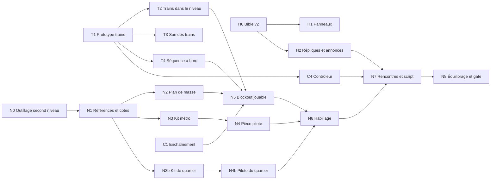

# PLAN — v2.0 : le métro

> Première version du 2026-10-05, écrite à partir de l'idée de l'utilisateur :
> **le second niveau est le métro qui mène au siège de l'entreprise.** On part
> de la rue, on descend dans une station, on se faufile dans les tréfonds du
> réseau et on ressort au pied de l'immeuble. Des trains circulent vraiment.
>
> Ce document est une **proposition à approfondir ensemble**. Quatre décisions
> de cadrage ont été prises le 2026-10-05 (§0) ; tout ce qui est marqué
> « proposition » ou qui figure dans les décisions ouvertes peut encore changer.
>
> **Place dans l'ensemble** (précisé le 2026-10-06) : le magasin n'était qu'un
> point de départ. Le métro et la tour sont deux grandes étapes d'une histoire
> plus vaste, pas sa fin. Le métro est un **niveau de transition** : il dilue
> l'intrigue par petites touches et ne révèle rien.
>
> Titre de travail du niveau : **« Trafic interrompu »**, d'après l'affichette
> collée sur la grille de la station, comme « Inventaire exceptionnel » venait
> de l'affiche du magasin.

---

## 0. Cadrage

### Ce qui est déjà acté et que ce plan respecte

| Sujet | Décision | Source |
|---|---|---|
| Décor | Pas un second magasin | `PLAN_SUITE.md` §3, 2026-10-03 |
| Destination | La chute du niveau 1 ouvre sur le siège de la **plateforme de diffusion** : le héros « sait où aller ensuite » | [bible d'histoire](docs/2-fonctionnel/histoire.md), panneau 8 |
| Ton | Le héros a toujours raison sur les faits et ne gagne jamais la reconnaissance | bible, Règles |
| Satire | Aucune marque, plateforme, ligne ou personne réelle. Le réseau de métro est inventé | bible, Règles |
| Contrôle | Aucun élément d'histoire ne retire le contrôle au joueur. Seuls les panneaux se regardent | bible, Règles |
| Technique | Les invariants de `CLAUDE.md` : pas fixe, Rapier KCC, RNG déterministe, pas d'ECS avant 12 types d'ennemis, aucune animation ne bloque le joueur | `CLAUDE.md` |
| Méthode de décor | Board de références, boucle rendu → regard → critique, **pièce pilote jugée par l'utilisateur avant le reste** | retours des coulisses, 2026-09-26 |
| Un seul sol par colonne | Les ennemis se repèrent sur un graphe en 2,5D : **aucun sol praticable au-dessus d'un autre**. La descente se déroule en plan | `tools/level_v2/plan_de_masse.py`, contrôle du niveau 1 |

### Décisions prises le 2026-10-05

| # | Question | Décision |
|---|---|---|
| D1 | Quelle entreprise ? | La **plateforme de diffusion**, jamais nommée |
| D2 | Périmètre de la v2.0 | **Le métro seul.** Le niveau finit au pied de la tour ; l'intérieur du siège est le niveau suivant |
| D3 | Ce que font les trains | **Danger mortel à horaire lisible**, plus **une séquence à bord** d'une rame |
| D4 | Comment on voyage à bord | Par trucage : **la rame reste immobile et le tunnel défile.** Jamais un joueur porté par un corps qui bouge |
| D6 | Ce qui passe d'un niveau à l'autre | **Tout se garde** : armes, munitions, perks et cagnotte |
| D5 | Le direct, alors que la chaîne est suspendue | **La chaîne est rétablie** à la seconde où il relance un direct : il fait de l'audience |
| D13 | La réponse de fond | **La couveuse** : des œufs couvés par la chaleur des serveurs, que l'audience fait monter. Elle guide les indices ; **le métro ne la montre ni ne la nomme** |
| D14 | Le donateur mystère | Il revient en **compte officiel**, badge vérifié, ton d'entreprise |
| D15 | « Vendu » | **Gardé pour la tour** (2026-10-06). Le métro finit sur un seuil, sans accusation |
| D19 | Après le métro | La tour, avec **un premier gros boss** ; ensuite, piste d'un **temple ou d'un laboratoire** |

### Règles des trains, décidées le 2026-10-06

| # | Question | Décision |
|---|---|---|
| D20 | Ce que fait une rame au joueur | **Mort immédiate** |
| D21 | Comment les rames arrivent | **Mixte** : horaire régulier là où l'on apprend et où l'on traverse, plus quelques passages mis en scène |
| D22 | Pouvoirs du joueur | Les rames **tuent aussi les ennemis** ; des **aiguillages** les dévient ; des boîtiers d'**arrêt d'urgence** suspendent le trafic |
| D23 | Où l'on a affaire aux voies | **Des traversées d'abord, puis une section de tunnel** parcourue sur la voie |

### Forme du niveau, décidée le 2026-10-06

| # | Question | Décision |
|---|---|---|
| D28 | Profondeur | **Trois paliers francs** : la rue, la station, les tréfonds |
| D29 | La rue | **Un vrai quartier** : place, ruelles, façades, premier combat dehors, un secret |
| D30 | Le milieu | **Un carrefour à deux objectifs**, dans l'ordre qu'on veut |
| D31 | Retours sur ses pas | **Un seul aller-retour** : le tunnel du poste d'aiguillage |

### Campagne, décidée le 2026-10-06

| # | Question | Décision |
|---|---|---|
| D33 | Ce qui passe en plus des armes, munitions, perks et cagnotte | **Les points de vie et la difficulté.** L'audience ne passe pas |
| D34 | Mourir dans le métro | **On recommence le niveau**, comme au niveau 1, avec l'état qu'on avait en y entrant |
| D35 | Accès au niveau 2 | **Débloqué en finissant le niveau 1.** « Continuer » reprend l'état de sa dernière fin de niveau 1 ; rejouer le métro seul donne un équipement type |
| D36 | Ce que vendent les bornes du métro | **Les perks qu'on n'a pas, puis des consommables** (munitions, soins) |

### Le nouvel ennemi, décidé le 2026-10-06

| # | Question | Décision |
|---|---|---|
| D8 | Combien d'ennemis nouveaux | **Un seul : le Contrôleur.** Costards, Vigiles et Rampants reviennent |
| D41 | Son rôle | **Le pousseur** : il charge en ligne droite et son coup projette le joueur |
| D42 | Sa place | **Rare et marquant** : une dizaine dans le niveau, là où le terrain le rend dangereux |
| D43 | Le sommet du voyage à bord | **Un chef de brigade**, plus coriace, mène la dernière vague. Ce n'est pas un boss |

### Corrections du 2026-10-06

| Sujet | Ce que l'utilisateur a dit |
|---|---|
| Portée du complot | Il n'a jamais été limité au magasin : le magasin est un point de départ |
| Place du métro et de la tour | Deux grandes étapes, pas la fin |
| Nature du niveau | Une transition : l'intrigue s'y dilue subtilement |
| **Refusé** | La révélation à la station privée (afficheur liant audience, température et éclosions) |
| **Refusé** | Le badge de « créateur partenaire » à prendre pour sortir |

### Décisions ouvertes

Chaque ligne a une valeur par défaut, celle que le reste du plan suppose.

| # | Question | Valeur par défaut (proposition) | Change quoi |
|---|---|---|---|
| D37 | Contenu de l'équipement type | Les trois armes à demi-chargées, les trois perks les plus achetés (perche, boisson, aimant), 40 €, PV pleins : la fin d'une partie « normale » du relevé simulé | l'équilibrage, le lot C1 |
| D38 | Audience de départ du niveau 2 | Une valeur propre au niveau, plus haute que celle du niveau 1, fixée à l'équilibrage | l'économie, les textes |
| D39 | Records du métro | Un seul carnet par niveau et par difficulté, qu'on soit arrivé riche ou avec l'équipement type | l'écran de fin |
| D40 | Un joueur qui arrive presque mort | Des soins dès le quartier (nourriture, comme au niveau 1), avant le premier combat | le lot N7 |
| D7 | Clés de progression | Trois **badges** (Voyageur, Agent, Dépôt) qui reprennent le système des trois cartes : de simples clés, sans charge d'histoire | le lot C3 |
| D18 | Temple ou laboratoire, après la tour | Non tranché. Un indice de fond de niveau l'annoncera, posé seulement une fois le choix fait | un indice du lot N6 |
| D24 | Une rame déjà annoncée quand on tire l'arrêt d'urgence | **Elle passe quand même** : l'arrêt retient les suivantes. C'est un outil pour préparer une traversée, pas un bouton de panique | §3, le prototype T1 |
| D25 | L'arrêt d'urgence a-t-il un prix ? | Un délai avant de resservir, commun à toute la voie. Piste à essayer : le chat s'ennuie pendant l'arrêt | §3, l'économie |
| D26 | Sens des rames dans le tunnel | D'abord **de face** (on voit les phares), puis de dos après l'aiguillage | le plan de masse |
| D27 | Les trains et la difficulté | Le préavis, l'intervalle et la durée de l'arrêt d'urgence se règlent par difficulté | [ADR 0042](docs/decisions/0042-difficulte.md) |
| D44 | Une poussée peut-elle tuer ? | **Jamais par elle-même.** Elle met le joueur en danger, seul un train tue : pas de vide ni de fosse mortelle à portée d'un Contrôleur | le plan de masse, la machinerie |
| D45 | Un Contrôleur dans un tunnel ? | Non : dans un tube où l'on ne peut pas faire un pas de côté, sa charge ne s'esquive pas | le placement |
| D46 | Où vont les anciens ennemis | Costards en guetteurs dans le quartier et en tireurs d'un quai à l'autre ; Vigiles aux passages gardés ; Rampants dans les galeries et par les trappes de toit de la rame | le lot N7 |
| D47 | La voix du Contrôleur | Une voix à lui, choisie par un casting comme celle des annonces ; en attendant, celle du Costard | le lot C4, les crédits de génération |
| D9 | Fin du niveau | Pas de boss : le premier gros boss est dans la tour (D19). Le sommet du métro est la **séquence à bord** | §2, le lot T4 |
| D10 | Quatrième arme (esquissée dans `PLAN_SUITE.md`) | **Hors du chemin critique** : un lot à part, livrable avant ou après le métro | le lot C5 |
| D11 | Nom du réseau, de la ligne et des stations | Réseau **MUE** (Métro Urbain Express), **ligne S**, stations Zone commerciale · Mairie-Annexe · Sang-Froid · Dépôt, terminus sans nom marqué du seul symbole | panneaux, signalétique, annonces |
| D16 | Le symbole de la plateforme | Celui du ticket de caisse du niveau 1, repris sur les rames, les bacs, les écrans et la tour. À dessiner | décor, panneaux |
| D12 | Durée visée | **13 à 15 minutes** pour une première partie : le quartier ajoute deux minutes au trajet. Pour rester à 12, raccourcir les galeries | le plan de masse, le temps de référence |
| D32 | La tour vue depuis le quartier | Une silhouette au loin, dans le ciel, qui fume : le but du voyage est visible dès la première minute | le ciel du niveau, le lot N1 |

### Ce que le code offre déjà

Relevé du 2026-10-05, à re-vérifier par chaque lot avant d'écrire.

| Besoin du métro | Ce qui existe | Manque |
|---|---|---|
| Un second niveau au catalogue | `LevelDef` (`src/game/level/catalog/levels.ts`) : `gltfName`, `lighting`, `ciel`, `parTime`, `spaces` | une entrée, et le choix du niveau dans le menu |
| Panneaux d'intro et de fin par niveau | `levelStory(levelId)` (`storyPanels.ts`) | les panneaux du niveau 2 |
| Enchaîner deux niveaux | flux `levelComplete → REPLAY / RETURN_TO_MENU` | une transition « niveau suivant » (lot C1) |
| Scénarios déclenchés par zone | script de niveau : annonce, réplique, réveil de groupe, verrou de portes, chaîne d'écrans ([ADR 0037](docs/decisions/0037-script-de-niveau.md)) | des actions pour les trains et les aiguillages |
| Portes à badge | cartes de fidélité, `use_*` avec `card` / `requires` | un habillage par niveau (libellés, sprites) |
| Bornes et perks | `use_*` avec `perk` et `prix` ([ADR 0040](docs/decisions/0040-bornes-et-perks.md)) | rien : un distributeur de quai est une borne |
| Écrans animés | `ecran_*` et ses chaînes ; `cam_*` et consoles | une chaîne « prochain train » pilotée par l'horaire |
| Annonces sonores | voix du magasin, effet haut-parleur à la finalisation (`ia_voix.py`) | une voix et une salle « station » |
| Ambiances par zone | une nappe par espace du plan de masse (`zoneAmbience.ts`) | six à huit nappes de métro |
| Décor cassable, explosifs | `prop_*`, `vitre_*`, bonbonnes de gaz ([ADR 0041](docs/decisions/0041-explosifs.md)) | rien |
| Ennemis en meute, garde à bouclier | Rampant, Vigile, rencontres scriptées | le Contrôleur |
| **Géométrie de niveau qui se déplace** | **rien** : une porte est un corps fixe dont le collider s'active fermé | tout le système de trains (lot T1) |
| Son placé dans l'espace | à vérifier ; au 2026-10-01 les sons d'ennemis n'étaient pas spatialisés | le passage d'une rame (lot T3) |
| Construire un niveau dans Blender | profils magasin/métro des commandes `cassandre`, générateurs séparés et bibliothèque d'assets (lot N0 préparé le 2026-10-06) | le kit et le tracé réel du métro (lots N1–N3) |
| Savoir ce que vivent les joueurs | télémétrie par zone, fin de partie, auteur du dernier coup ([ADR 0043](docs/decisions/0043-telemetrie.md)) | `train` comme cause de mort, les trains dans les faits marquants |

### Hors périmètre

- L'intérieur du siège : c'est le niveau d'après.
- Sauter sur une rame qui roule dans le niveau, ou s'y tenir debout : la
  séquence à bord est un trucage (D4), les rames de ligne restent mortelles.
- Une sauvegarde en cours de niveau, et tout point de passage : la mort ramène
  au début du niveau (D34). Seul l'état d'arrivée au niveau 2 est gardé.
- Tout réseau réel : plans, noms de stations, logos, typographies reconnaissables.

### Risques assumés

| Risque | Pourquoi il compte | Parade |
|---|---|---|
| Un train tue sans prévenir | une mort injuste dans un tunnel noir fait quitter le jeu | règle de lisibilité (§3) vérifiée par test, prototype jugé avant tout décor |
| Le tunnel se ressemble partout | un niveau linéaire lasse et désoriente | un repère fort par section (couleur, lumière, objet), des boucles, jamais plus de 60 m de tunnel sans événement |
| Le noir à 640×360 | une silhouette sombre sur fond sombre ne se lit pas | éclairage par flaques, ennemis toujours devant une source, phares de rame comme éclairage de combat |
| Le joueur et un corps mobile | le contrôleur de personnage de Rapier ne transporte pas le joueur | la rame du voyage ne bouge pas, c'est le tunnel qui défile (D4) |
| La projection du joueur | c'est une mécanique nouvelle, et aucune animation ne doit bloquer le joueur (invariant #10) | la poussée ajoute une vitesse et ne retire jamais les commandes ; réglée en salle d'essai avant d'entrer dans le niveau |
| Être poussé sous une rame sans rien pouvoir faire | la combinaison Contrôleur et train peut devenir une mort imparable | une poussée ne tue jamais seule (D44) ; un quai se remonte en un saut ; aucun Contrôleur n'est posé là où la rame arrive en moins de temps qu'il n'en faut pour remonter |
| Le trucage se voit | un tunnel qui défile mal, ou un raccord visible au départ et à l'arrivée, casse le sommet du niveau | prototype T4 jugé par l'utilisateur ; départ et arrivée dans le noir d'un tunnel, jamais à quai |
| Le joueur arrive riche ou pauvre | avec tout qui se garde, la même rencontre est triviale pour l'un et injuste pour l'autre | deux profils de référence, pauvre et riche (§4) ; le niveau doit se finir avec l'un comme avec l'autre |
| Mourir à la douzième minute | on recommence quinze minutes de niveau, et un train tue d'un coup : c'est le moment où l'on ferme l'onglet | la règle de lisibilité des trains, tenue sans exception ; l'abandon après une mort suivi par la télémétrie dès le blockout |
| Arriver blessé, et le rester | les PV se gardent et la mort ramène à l'état d'entrée : qui arrive à 15 PV recommence toujours à 15 PV | des soins dans le quartier avant le premier combat (D40) |
| L'arrêt d'urgence tue la tension | un joueur qui suspend le trafic à chaque traversée ne joue plus avec les trains | délai commun à la voie, durée courte, réglée par difficulté ; à juger sur le prototype |
| Les ennemis et les voies | un graphe de navigation qui traverse une voie active envoie les ennemis sous les rames, ou les fige | voies exclues du graphe sauf traversées désignées ; un ennemi sur la voie meurt comme le joueur |
| Poids du niveau | le niveau 1 pèse 38 Mo, la télémétrie mesure le temps de chargement | kit de tunnel instancié, budget de poids suivi dès le blockout |
| Deux décors au lieu d'un | le quartier est un second kit complet (façades, mobilier urbain, véhicules) en plus du métro | le quartier a son lot de kit et sa propre pièce pilote ; il se construit après le métro, qui porte le cœur du jeu |
| Les lampes | le niveau 1 tient avec 48 lampes ; un quartier de nuit et des tunnels éclairés par flaques en demandent beaucoup | budget de lampes posé dès le plan de masse, phares et signaux pris sur le même pool |
| Le décor posé « au pif » | cause du refus des coulisses v1 | pièce pilote, board de références, gates d'utilisateur |

---

## 1. L'histoire

La bible est écrite : [`docs/2-fonctionnel/histoire-metro.md`](docs/2-fonctionnel/histoire-metro.md).
Elle distingue ce que l'utilisateur a décidé de ce qui reste une proposition.
L'essentiel, pour lire la suite de ce plan :

- **Le métro est une transition.** On change d'échelle, on se rapproche de la
  tour, on n'apprend rien de décisif. Le niveau finit sur une porte.
- Le héros va réclamer sa monétisation. Sa chaîne est rétablie dès qu'il
  relance un direct ; il y voit une victoire.
- **Des indices, pas de révélation.** Une dizaine de détails de décor, un par
  espace, jamais expliqués : l'air tiède, les bacs, une branche absente du
  plan, un symbole discret. Chacun se rate sans conséquence.
- La réponse de fond retenue (la couveuse) guide le choix des indices et reste
  hors du niveau.
- Le premier abonné revient en compte vérifié et le guide.
- **« Vendu » est gardé pour la tour.** Le métro en pose le terrain : la
  plateforme met son direct en avant, des spectateurs nouveaux arrivent.
- **Après ce niveau** : la tour et son premier gros boss, puis un temple ou un
  laboratoire.

Ce que l'histoire demande au niveau et au code :

| Demande | Où elle retombe |
|---|---|
| Quatre moments en jeu : l'annonce, le premier passage, la cargaison, le départ de la rame | lots N7, T2 et T4 |
| Un indice par espace, tenu par le décor seul | lots N2 et N6 |
| Un symbole discret, sur les rames, les bacs et les plaques | lots N1 et N3 |
| La tiédeur : buée, suintement, soufflerie, sans insistance | lots N6 et T3 |
| Huit panneaux, six interventions du compte vérifié, un nouveau registre de chat | lots H1 et H2 |

---

## 2. Le niveau

La forme générale est décidée (D28 à D31). Les cotes ci-dessous sont un
premier tracé : le lot N2 les reprend dans un plan de masse vérifié par calcul,
comme `tools/level_v2/plan_de_masse.py` le fait pour le niveau 1.

**Candidat N2 coté, préparé le 2026-10-06 :**
[plan et relevés](docs/assets/plan-metro.md). Son emprise est de
212,75 × 500,5 m, avec 19 niches et des galeries en coudes. Il reprend le
croquis ci-dessous en distinguant quais et rails et en ajoutant les vrais
raccords ; l’utilisateur donne son accord pour poursuivre le 2026-10-06 ; le blockout doit encore être joué.

### Trois paliers

| Palier | Altitude du sol | Espaces | Lumière et ambiance |
|---|---|---|---|
| La rue | 0 m | quartier, puis parvis à la sortie | nuit, lampadaires, vitrines éteintes ; l'aube sur le parvis |
| La station | −5 à −9 m | salle des billets, quais | néons blancs, carrelage, publicités |
| Les tréfonds | −18 à −22 m | tunnels, galeries, dépôt, machinerie, station privée | noir, flaques de lumière, sodium au dépôt ; marbre froid à la station privée |

Aucun espace n'est au-dessus d'un autre : chaque palier est décalé du
précédent en plan. Restent trois endroits où le joueur passe au-dessus d'un sol
où les ennemis ne vont pas (cabine du poste d'aiguillage au-dessus des voies,
passerelles de la machinerie au-dessus de la fosse du ventilateur, toit d'une
rame garée). Ils sont à vérifier avec le graphe de navigation dans le lot N0.

### Parcours

| # | Espace | Rôle | Ce qu'on y apprend ou affronte | Objets signature |
|---|---|---|---|---|
| 1 | Le quartier | départ, nuit | une place et ses ruelles à explorer, avec de quoi se soigner ; la bouche de métro est grillée ; un fourgon et des guetteurs devant ; la trappe de service est dans une cour | bouche de métro, kiosque, abribus, laverie, épicerie de nuit, fourgon, la tour au loin |
| 2 | Salle des billets | première station | on y entre par l'arrière du guichet ; premier badge, première borne ; enjamber le portique déclenche l'annonce | portiques, guichet, distributeurs, plan de ligne |
| 3 | Quais | la leçon | les trains passent ; l'afficheur donne le compte à rebours ; deux traversées de voie, la seconde sous le feu | bancs, affiches, afficheur, miroir de quai |
| 4 | Tunnel A | l'épreuve | parcourir la voie de niche en niche, rames de face ; premier boîtier d'arrêt d'urgence à l'entrée ; une grille barre la voie à mi-chemin | niches, signaux, câbles, boîtiers |
| 5 | Galeries de service | respiration, puis meute | conduits étroits, Rampants ; contournent la grille et la rouvrent de l'intérieur | gaines, ventilateurs, armoires, vestiaire des agents |
| 6 | Dépôt | **carrefour** | la rame de fret est là, sans courant et mal aiguillée ; rames garées à traverser de voiture en voiture ; une rame de manœuvre coupe l'arène, un aiguillage permet de l'envoyer sur un groupe | rames garées, fosses, pont roulant, bidons de gaz |
| 7 | Tunnel B | l'aller-retour | calme à l'aller ; au retour, les rames de ligne y passent, dans le dos | niches, signaux |
| 8 | Poste d'aiguillage | objectif A | un levier trace la route de la rame de fret, et envoie les rames de ligne dans le tunnel B | pupitre, tableau lumineux de la ligne, levier |
| 9 | Machinerie | objectif B | rétablir le courant de la voie de fret ; passerelles à garde-corps au-dessus du grand ventilateur, qui souffle l'air chaud vers le réseau | sous-station, pompes d'exhaure, ventilateur |
| 10 | À bord | **le sommet** | la rame part avec lui : combat de voiture en voiture pendant que le tunnel défile | bacs « produits frais », portes de communication, trappes de toit |
| 11 | Station privée | arrivée | un quai sans nom, du marbre, personne | plaques au seul symbole, escalier mécanique |
| 12 | Parvis | sortie | la vapeur au pied de la tour, la porte du hall | grilles de ventilation, la tour |

Le carrefour : depuis le dépôt (6), l'aiguillage (7 et 8) et la machinerie (9)
se font dans n'importe quel ordre. Les deux faits, le retour vers la rame de
fret déclenche une arène, pendant qu'elle se met sous tension.

Boucles :

- la grille de la bouche de métro s'ouvre depuis la salle des billets :
  retour direct sur la place ;
- les galeries (5) rouvrent la grille du tunnel A ;
- la machinerie (9) remonte au dépôt par un second escalier, côté atelier.

Secrets, quatre comme au niveau 1 : dans le quartier, un toit ou une
arrière-boutique ; la station désaffectée « Sang-Froid », au bout des
galeries ; le dessus d'une rame garée au dépôt ; un local derrière le grand
ventilateur.

### Premier tracé

Repère de Blender : X vers l'est, Y vers le nord, mètres. Le niveau file vers
le nord, la tour au bout.

| # | Espace | Emprise (X × Y) | Sol | Surface | Relié à |
|---|---|---|---|---|---|
| 1 | Quartier | 80 × 72 m | 0 | ≈ 2 400 m² praticables | 2 par la trappe de la cour, puis par la bouche |
| 2 | Salle des billets | 36 × 24 m | −5 | 860 m² | 3 par l'escalier des quais |
| 3 | Quais | 72 × 18 m, deux voies | −9 | 650 m² de quai | 4 par la rampe du bout de quai |
| 4 | Tunnel A | 140 m, en courbe | −9 à −18 | 630 m² | 5 par une porte de service ; 6 au bout |
| 5 | Galeries | 44 × 70 m, couloirs de 2,5 m | −14 à −18 | ≈ 700 m² | 4 en deux points ; le secret 2 |
| 6 | Dépôt | 64 × 44 m | −18 | 2 800 m² | 7, 9 et la rame de fret |
| 7 | Tunnel B | 80 m | −18 | 360 m² | 8 |
| 8 | Poste d'aiguillage | 16 × 16 m, cabine surélevée | −18 | 100 m² | — |
| 9 | Machinerie | 32 × 32 m | −22 | 900 m² | 6 par deux escaliers |
| 10 | Rame de fret | 4 voitures de 15 m | −18 | 200 m² | 6 d'un côté, 11 de l'autre |
| 11 | Station privée | 64 × 18 m | −18 | 760 m² | 12 par l'escalier mécanique |
| 12 | Parvis | 48 × 34 m | 0 | 1 400 m² | la porte du hall, fin du niveau |

Total : environ 13 000 m² praticables sur une emprise de 300 × 340 m. Le
niveau 1 en fait 14 700 sur 138 × 206 m : **le chantier de décor est de la même
taille**, étiré en longueur, avec deux kits au lieu d'un.

### Les voies

| Voie | Où | Rames | Horaire de départ |
|---|---|---|---|
| V1, V2 | quais | de ligne, sens opposés | toutes les 30 s, décalées de 15 s |
| V2 | tunnel A | de ligne, de face | toutes les 20 s |
| VB | tunnel B | aucune à l'aller ; de ligne, de dos, après l'aiguillage | toutes les 20 s |
| M | dépôt | de manœuvre, lente | une boucle de 40 s ; déviable par l'aiguille du dépôt |
| F | voie de fret | la rame de fret | à l'arrêt ; le voyage, 60 à 90 s |

### Temps de trajet

Estimation d'une première partie, combats et attentes compris.

| Tronçon | Durée |
|---|---|
| Quartier | 2 min |
| Descente et salle des billets | 1 min 15 |
| Quais | 1 min 30 |
| Tunnel A et galeries | 2 min 30 |
| Dépôt, à l'arrivée | 1 min |
| Tunnel B, poste, retour | 2 min |
| Machinerie | 1 min 30 |
| Arène du dépôt | 1 min |
| À bord | 1 min 15 |
| Station privée et parvis | 1 min |
| **Total** | **environ 15 min** |

### Règles de tracé

- **Lignes de vue** : un ennemi voit à 22 m et tire à 16 m. Aucun tunnel ne
  reste droit plus de 60 m ; les courbes cachent aussi le bout du décor.
- **La tour comme repère** : visible du quartier, puis invisible pendant toute
  la traversée, puis au-dessus de la tête sur le parvis.
- **Un repère par section** : une couleur de carrelage, une lumière ou un objet
  qu'on ne voit que là.
- **Les quais se remontent** : bord proposé à 0,75 m de la voie en N1/N2, sous la hauteur de
  saut, et un escalier à chaque bout. Tomber sur la voie n'est pas une
  condamnation.
- **Aucun point d'apparition dans un gabarit**, ni à moins de 16 m de l'endroit
  où le joueur débouche à découvert (règle du niveau 1).

### Cotes de départ

Elles se dérivent du joueur (capsule, saut, marche à 9 m/s, course à 13 m/s)
dans le lot N1. Celles des trains sont au §3, avec la règle qui les justifie.

| Élément | Valeur de départ | D'où elle vient |
|---|---|---|
| Longueur d'une rame de ligne | 3 voitures de 15 m | elle passe un point en 2 s environ |
| Quai | 72 m | une rame et de la marge à chaque bout |
| Tunnel entre deux événements | 60 m au plus | contre la monotonie |
| Durée du voyage à bord | 60 à 90 s | assez pour deux vagues, pas assez pour lasser |

---

## 3. Les trains

### Les règles, vues du joueur

1. **Dans le gabarit d'une rame qui roule, on meurt.** Le joueur, les ennemis,
   les props. Pas de dégâts partiels, pas de flanc inoffensif : si la rame
   occupe l'endroit où l'on se tient, c'est fini.
2. **Le gabarit se voit au sol.** Une bande jaune et noire le borde partout où
   l'on peut marcher. Entre les bandes on risque sa vie, en dehors jamais.
3. **Une rame s'annonce toujours.** Au moins 5 s avant, par deux canaux à la
   fois : un signal de voie ou un afficheur, et le son. Les phares s'y ajoutent
   quand elle vient de face.
4. **Une voie a un horaire, et on peut l'apprendre.** Période et décalage fixes,
   comptés en temps de jeu, sans hasard. L'afficheur de quai donne le compte à
   rebours.
5. **Quelques passages sont mis en scène**, déclenchés par la progression. Ils
   obéissent à la règle 3 comme les autres.
6. **Les rames tuent les ennemis.** Un ennemi qui poursuit le joueur à travers
   une voie n'en sait rien et s'y fait prendre. Le coup compte comme un kill et
   vaut au direct un évènement à part, mieux payé qu'un tir.
7. **Une rame qui passe est un mur.** Elle coupe les lignes de tir pendant deux
   secondes : on traverse derrière elle, on recharge, on change de côté.
8. **Un aiguillage dévie les rames suivantes.** Jamais celle qui est déjà
   annoncée. Un tableau lumineux, près du levier, montre la route avant et
   après.
9. **Un boîtier d'arrêt d'urgence retient les rames suivantes** quelques
   secondes. L'afficheur l'indique et décompte. Une rame déjà annoncée passe
   quand même. Le boîtier met un moment avant de resservir.
10. **Une rame à l'arrêt est du décor** : on y entre, on s'y bat, on monte
    dessus. Une seule part avec le joueur à bord, la rame de fret, et c'est lui
    qui la fait partir.

Pas de rail électrifié : un danger au sol invisible dans le noir contredit la
règle 2.

### Trois rames

| Rame | Vitesse | Où | Rôle |
|---|---|---|---|
| De ligne | rapide, 24 m/s | quais, tunnel | le danger : on ne la distance pas, on l'évite |
| De manœuvre | lente, 4 m/s | voies de garage | un mur qui avance : couvert mobile, arène redécoupée, arme si on l'aiguille |
| De fret | à l'arrêt, puis le voyage | voies de garage, à bord | le but du milieu de niveau et le sommet |

### La leçon, dans l'ordre

Le niveau n'introduit qu'une idée à la fois. Chaque étape reprend la
précédente et lui ajoute une chose.

| # | Où | Ce que le joueur fait | Ce qui s'ajoute |
|---|---|---|---|
| 1 | Quais | regarde passer la première rame, à l'abri sur le quai | le danger existe ; l'afficheur le prédit |
| 2 | Quais | traverse deux voies éclairées, intervalle long | traverser à l'horaire |
| 3 | Quais, bout de station | traverse sous le feu d'ennemis postés en face | la rame comme mur ; un ennemi qui poursuit se fait prendre |
| 4 | Entrée du tunnel | essaie un boîtier d'arrêt d'urgence, sans y être obligé | suspendre le trafic |
| 5 | Tunnel | parcourt la voie de niche en niche, rames de face | marcher dans le gabarit |
| 6 | Poste d'aiguillage | dévie les rames | choisir où est le danger |
| 7 | Tunnel, au retour | même voie, rames de dos | lire le signal et le son, sans les phares |
| 8 | Voies de garage | arène coupée par la rame de manœuvre, un aiguillage à portée | tout ensemble, avec des ennemis |

### La règle de lisibilité, chiffrée

Pour tout point du gabarit où le joueur peut se tenir :

`distance au refuge le plus proche ÷ vitesse de marche + 1 s de réaction ≤ préavis`

Un refuge est une niche, un quai ou tout sol hors gabarit. La vitesse de marche
(9 m/s) sert de référence, pas la course : un joueur qui ne court pas doit s'en
sortir.

| Grandeur | Valeur de départ | Conséquence |
|---|---|---|
| Préavis | 5 s (7 en Client, 4 en Lanceur d'alerte) | la rame de ligne est annoncée à 120 m |
| Écart entre deux niches | 40 m | 20 m au pire, soit 2,2 s de marche : il reste 1,8 s de marge |
| Intervalle entre deux rames de ligne | 30 s à la première traversée, 20 s dans le tunnel | le rythme d'une section |
| Durée d'un arrêt d'urgence | 8 s | de quoi traverser et se retourner |
| Délai avant de resservir | 30 s, commun à la voie | pas de trafic suspendu en permanence |

Un contrôle automatique refait ce calcul sur le niveau exporté, point par point
le long de chaque voie, et vérifie qu'un signal ou un afficheur est en vue. Un
niveau qui y échoue ne s'exporte pas, comme pour les autres erreurs de
validation.

### Les ennemis et les voies

- Le graphe de navigation exclut les voies. Il ne les franchit qu'aux
  **traversées** désignées dans le niveau.
- Les ennemis ne connaissent pas l'horaire. Ils ne fuient pas une rame et ne
  l'attendent pas : c'est ce qui rend le piège possible, et drôle.
- Aucun ennemi n'apparaît ni ne patrouille dans le gabarit.
- Les Rampants, qui vivent dans les galeries, ne sortent sur la voie que pour
  poursuivre.

### La séquence à bord (décisions D3 et D4)

- **Le joueur la déclenche.** La rame de fret part quand il actionne la
  commande en cabine, une fois le courant rétabli et la route tracée. Rien ne
  l'y enferme avant.
- **La rame ne bouge pas.** Elle est posée à demeure entre les voies de garage
  et la station privée, qui se touchent dans le niveau alors que l'histoire les
  sépare de plusieurs kilomètres. On monte par un côté, on descend par l'autre.
- **Le tunnel défile** autour d'elle : parois, lampes, câbles et signaux
  passent en boucle, sans collision. Les phares, les étincelles et le son
  vendent la vitesse. Le départ et l'arrivée se font dans le noir d'un tunnel,
  où le raccord ne se voit pas.
- **Pendant le voyage**, les portes extérieures sont verrouillées, comme les
  rideaux de l'arène de la réserve (ADR 0037). Le joueur garde tout son
  contrôle à l'intérieur : des Contrôleurs remontent la rame de voiture en
  voiture, des Rampants entrent par les trappes de toit. Le chef de brigade
  mène la dernière vague (§5).
- **À l'arrivée**, le défilement ralentit, la station privée apparaît côté
  quai et les portes s'ouvrent.
- Cette séquence a son propre prototype (lot T4) : c'est un trucage, il doit
  être jugé à l'œil avant qu'on construise le niveau autour.

### Technique (proposition, à trancher par le prototype T1)

- Un système `TrainSystem` dans `src/game/level/trains/`, mis à jour dans le
  pas fixe.
- **L'horaire est une fonction du temps.** La position d'une rame se calcule à
  partir du temps de gameplay de la voie, sans intégration ni dérive. Un arrêt
  d'urgence retarde ce temps ; il ne freine aucune rame. Tout reste rejouable
  (invariant #12), et aucun tirage aléatoire n'intervient.
- **Un aiguillage se lit à l'entrée de section** : la rame garde la route
  qu'elle avait quand elle a été annoncée.
- **Un passage mis en scène** est une rame de plus, insérée par une action du
  script de niveau ; elle prend la place du prochain passage régulier.
- **La mort se décide par un test de volume**, celui du gabarit balayé pendant
  le pas, contre la capsule du joueur et celles des ennemis. Pas par une
  collision physique.
- Le collider de la rame sert aux tirs, aux props et aux lignes de vue.
- Le rendu interpole la position entre deux pas, comme le reste (invariant #1).
- Les phares et les signaux sont des lampes du pool existant.
- Chaque voiture est un lot de dessin de plus : un objet qui bouge ne rejoint
  jamais un lot de décor fusionné (ADR 0039, coût connu, pas de plafond).
- La difficulté règle le préavis, l'intervalle et l'arrêt d'urgence, lus à la
  construction de la partie comme ses autres règles (ADR 0042).

### Convention glTF (à écrire en ADR dans le lot T2)

| Préfixe | Effet à l'import (proposition) |
|---|---|
| `rail_<voie>_NN` | points d'un tracé, dans l'ordre |
| `train_*` | une rame ; propriétés `voie`, `periode`, `decalage`, `vitesse`, `voitures`, `sens` |
| `train_*` avec `arret: true` | rame garée : décor fixe avec ses colliders |
| `aiguille_*` | bascule un tracé entre deux branches |
| `use_*` avec `aiguille` | le levier qui actionne cette aiguille |
| `use_*` avec `arret_urgence` | un boîtier ; la valeur nomme la voie |
| `signal_*` | feu de voie, lit l'état de la `voie` nommée |
| `ecran_*` avec `chaine: "train"` | afficheur de quai, lit l'horaire de la `voie` nommée |
| `refuge_*` | volume sûr (niche, quai) : sert au contrôle de lisibilité |
| `traversee_*` | volume où le graphe de navigation peut franchir une voie |

Action de script en plus : lancer un passage mis en scène sur une voie.

### Ce que le prototype T1 doit trancher

Une salle d'essai en boîtes grises : une station à deux voies et sa traversée,
150 m de tunnel à niches, un aiguillage, un boîtier, quatre ennemis postés en
face. Un panneau de réglage propose des variantes à comparer.

| Question | Variantes à essayer |
|---|---|
| La rame fait-elle peur sans être injuste ? | vitesse 18, 24, 30 m/s |
| Le préavis laisse-t-il le temps de décider ? | 4, 5, 7 s |
| Le rythme tient-il ? | intervalle 20, 30 s |
| L'arrêt d'urgence est-il une soupape ou une triche ? | 5, 8, 12 s ; avec et sans délai commun |
| Sent-on la rame arriver de dos ? | signal seul, son seul, les deux |
| Attirer un ennemi sous une rame est-il faisable exprès ? | à l'essai |
| Mourir sous une rame donne-t-il envie de recommencer ? | à l'essai |

Rien n'y est habillé. Ce qu'on y juge, c'est la règle.

---

## 4. La campagne

### Ce qui se garde

| Élément | D'un niveau à l'autre | Pourquoi |
|---|---|---|
| Armes possédées | se garde | D6 |
| Munitions | se gardent | D6 |
| Perks | se gardent, avec leurs effets | D6 |
| Cagnotte | se garde | D6 |
| Points de vie | se gardent | D33 |
| Difficulté | se garde | D33 |
| Audience : spectateurs, abonnés | repart d'une valeur propre au niveau | D33 |
| Cartes et badges | ne se gardent pas : ce sont les clés d'un niveau | — |
| Score, secrets, temps, records | propres à chaque niveau | — |

Cet ensemble s'appelle ici **l'état d'arrivée**. Il est relevé à l'instant où
le joueur franchit la sortie du niveau 1.

### Trois façons d'entrer dans le métro

| Entrée | Quand | État d'arrivée |
|---|---|---|
| **En enchaînant** | fin du niveau 1 : panneaux, récapitulatif, puis « Continuer » | celui de la partie qu'on vient de finir |
| **« Continuer » au menu** | plus tard, sur le même navigateur | celui de sa dernière fin de niveau 1, gardé dans le navigateur |
| **Le métro seul** | choix du niveau, une fois débloqué | l'équipement type |

Le métro est verrouillé tant que le niveau 1 n'a pas été fini une fois. En
développement, `?level=` y entre directement, avec l'équipement type.

### L'équipement type

Il représente un joueur moyen à la sortie du magasin. Le relevé simulé
(`pnpm economy`, difficulté Habitué) donne, pour une partie « normale » :
169 € de dons, trois perks achetés, et les trois armes en main.

| Élément | Valeur de départ |
|---|---|
| Armes | pied-de-biche, pistolet, pompe |
| Munitions | la moitié du maximum de chaque arme |
| Perks | perche, boisson, aimant : les trois les plus achetés |
| Cagnotte | 40 € |
| Points de vie | pleins |

Il sert aussi de **référence d'équilibrage** : c'est avec lui que le niveau
est réglé. La télémétrie le corrigera quand de vraies fins de niveau 1
arriveront.

### Mourir

La mort ramène au début du niveau, avec l'état d'arrivée **tel qu'il était en
entrant** : les mêmes armes, la même cagnotte, les mêmes points de vie. Ce qui
a été acheté ou ramassé depuis est perdu.

Conséquence à tenir dans le décor : le quartier offre de quoi se soigner avant
le premier combat, pour que celui qui arrive blessé ne recommence pas
indéfiniment blessé.

### Deux profils pour régler le niveau

Le niveau doit se finir avec l'un comme avec l'autre.

| Profil | État d'arrivée | Ce qu'il lui faut |
|---|---|---|
| **Pauvre** | pied-de-biche et pistolet, peu de munitions, aucun perk, 0 €, 20 PV | des soins et des munitions tôt ; chaque arme se retrouve dans le niveau |
| **Riche** | trois armes pleines, cinq perks, 150 €, PV pleins | des bornes qui servent encore, et des rencontres que l'argent ne dissout pas : les trains tuent tout le monde pareil |

Les trains sont l'égaliseur du niveau : aucun perk ne protège d'une rame.

### Les bornes

Chaque borne vend un des six perks existants, choisi à la construction du
niveau. Si le joueur le possède déjà, elle propose un consommable à la place :
des munitions ou des soins.

Sur deux niveaux, un joueur moyen reçoit de quoi acheter les six perks (230 €)
avant la fin du métro. Les consommables donnent donc un usage à la cagnotte
jusqu'au bout. Leur prix se règle avec le reste de l'économie.

### Ce qui change à l'écran

- **Menu** : « Continuer » quand un état d'arrivée existe, « Nouvelle partie »,
  et le choix du niveau parmi ceux qui sont débloqués.
- **Fin du niveau 1** : le récapitulatif propose « Continuer » en plus de
  « Rejouer » et du retour au menu.
- **Choix de la difficulté** : au début d'une nouvelle partie, et quand on
  lance un niveau seul. Pas en enchaînant.
- **Écran de mort du métro** : inchangé, « Rejouer » relance le niveau avec
  l'état d'arrivée.

### Technique (proposition)

- Un type **état d'arrivée** : armes, munitions, perks, cagnotte, points de
  vie, difficulté. La partie se construit avec lui, ou sans (niveau 1).
- Il est relevé dans le pas fixe à la fin du niveau, et écrit dans le
  navigateur hors du pas fixe, comme les records.
- Les perks sont reposés par le chemin existant, qui applique leurs effets à
  la partie et jamais à une configuration globale (ADR 0040).
- La difficulté de l'état d'arrivée remplace celle des réglages pour cette
  partie (ADR 0042).
- Le flux d'écran gagne une transition « niveau suivant », du récapitulatif
  vers le chargement.
- `pnpm economy` apprend à enchaîner les deux niveaux, pour relever la
  cagnotte et les perks à l'arrivée et à la sortie du métro.
- La télémétrie note, au début d'une partie, par où l'on est entré et avec
  quoi : c'est ce qui dira si les joueurs arrivent pauvres ou riches.

---

## 5. Les ennemis

### Le Contrôleur

Un agent du réseau en uniforme, casquette et sacoche. Humain d'apparence, comme
le Costard et le Vigile. Il demande son titre de transport au héros, qui n'en a
pas.

**Ce qu'il fait.** Il repère le joueur, s'arrête, l'interpelle et baisse
l'épaule : c'est le signal. Puis il **charge en ligne droite**, plus vite que
le joueur ne court, sur une douzaine de mètres, sans pouvoir tourner. S'il
touche, le coup blesse peu et **projette le joueur de quelques mètres** dans le
sens de la charge.

**Comment on lui répond.**

- Un pas de côté : il passe, emporté par son élan, et reste un instant
  vulnérable, de dos.
- Un coup de pompe à bout portant casse sa charge.
- Le faire charger en travers d'une voie quand une rame arrive.

**Pourquoi il est dangereux.** En terrain dégagé, sa poussée ne coûte presque
rien. Au bord d'un quai, elle envoie sur la voie. Ce n'est pas lui qui tue :
c'est le train qui arrive pendant qu'on remonte.

| Grandeur | Valeur de départ | D'où elle vient |
|---|---|---|
| Signal avant la charge | 0,8 s | le temps d'un pas de côté |
| Vitesse de charge | 16 m/s | au-dessus de la course du joueur (13 m/s) : on ne le fuit pas, on l'esquive |
| Longueur de charge | 12 m | une largeur de station |
| Projection | 5 m | de quoi passer d'un quai à la voie, pas de la traverser |
| Dégâts du coup | faibles | le danger est le terrain |
| Résistance | entre le Costard et le Vigile | il doit survivre à une esquive ratée du joueur |
| Temps de récupération après une charge manquée | 1 s | la fenêtre pour le punir |

Ces valeurs se règlent en salle d'essai, comme l'ont été le Rampant et le
Vigile.

### Le chef de brigade

Un Contrôleur qu'on reconnaît à sa casquette galonnée. Il mène la dernière
vague du voyage à bord. Trois fois plus résistant, il enchaîne deux charges.
Il n'a ni barre de vie, ni phases, ni arène : le premier gros boss est dans la
tour.

### Où on les rencontre

Une dizaine de Contrôleurs dans le niveau. Le premier se rencontre loin de
toute voie, pour apprendre la poussée sans en mourir.

| Espace | Contrôleurs | Pourquoi là |
|---|---|---|
| Salle des billets | 1 | la leçon : terrain dégagé, la poussée ne coûte rien |
| Quais | 2 | le bord de quai : la poussée envoie sur la voie |
| Tunnels | 0 | on ne peut pas y faire un pas de côté (D45) |
| Galeries | 1 | un couloir étroit, avec des Rampants autour |
| Dépôt | 3 | l'arène, près de la rame de manœuvre et de ses voies |
| Machinerie | 1 | les passerelles, bordées de garde-corps |
| À bord | 2, plus le chef de brigade | les voitures : il remonte la rame, la poussée renvoie d'une voiture à l'autre |

### Les anciens, dans ce décor

| Ennemi | Rôle dans le métro |
|---|---|
| Costard | guetteur en civil dans le quartier ; tireur posté sur le quai d'en face, que la rame qui passe masque deux secondes |
| Vigile | garde les passages : l'accès aux quais, le poste d'aiguillage |
| Rampant | vit dans les galeries, contre les conduites chaudes ; entre par les trappes de toit pendant le voyage |

### Règles de placement

- **Une poussée ne tue jamais par elle-même.** Pas de vide, de fosse ni de
  puits mortel à portée d'un Contrôleur. Seul un train tue.
- Aucun Contrôleur là où une rame arrive plus vite qu'on ne remonte du fond de
  la voie.
- Aucun ennemi n'apparaît dans un gabarit, ni à moins de 16 m de l'endroit où
  le joueur débouche à découvert.
- Les ennemis ne franchissent les voies qu'aux traversées désignées (§3). Un
  Contrôleur qui charge s'arrête au bord d'un quai ; à une traversée, il
  continue.

### Technique (proposition)

- Le Contrôleur est une quatrième espèce de la machine à états partagée des
  ennemis, pas un système à part : on reste loin des douze types qui
  justifieraient autre chose (invariant #8).
- La charge est une variante de l'attaque : direction figée au signal,
  déplacement en ligne droite hors du graphe de navigation, arrêt au premier
  mur ou au bord d'un quai.
- **La projection du joueur** est une vitesse ajoutée au contrôleur de
  personnage, dans le pas fixe, qui s'éteint en une fraction de seconde. Le
  joueur garde ses commandes pendant toute sa durée (invariant #10), et c'est
  toujours le contrôleur de Rapier qui résout les collisions (invariant #6).
- Sprites en huit directions et quatre carnations, par la chaîne de rendu des
  ennemis existante ; le chef de brigade en est une variante.
- La télémétrie note le Contrôleur comme auteur d'un coup, et les poussées qui
  finissent sur une voie.
- Le direct paie mieux un Contrôleur tué par une rame que par une balle.

---

## 6. Lots

Trois pistes avancent en parallèle et se rejoignent au blockout. Tailles :
S (une séance), M (quelques séances), L (un chantier).

### Piste histoire

| Lot | Contenu | Taille | Gate |
|---|---|---|---|
| H0 | Bible du niveau : `docs/2-fonctionnel/histoire-metro.md` (place du niveau, trajet, indices, compte vérifié, noms) | S | **réécrite le 2026-10-06 après correction ; propositions à valider par l'utilisateur** |
| H1 | Prompts des panneaux d'intro et de fin, mise au format ; images générées par l'utilisateur | S | images déposées |
| H2 | Catalogue de répliques du niveau, annonces de station, textes du chat et des dons | M | relecture |

### Piste technique

| Lot | Contenu | Taille | Gate |
|---|---|---|---|
| T1 | **Prototype des trains dans la salle d'essai** : traversée, tunnel à niches, aiguillage, arrêt d'urgence, mort du joueur et des ennemis, variantes à comparer (§3) | L | **l'utilisateur joue et tranche les sept questions du §3** |
| T2 | Trains dans le pipeline : conventions glTF, chargement, validation, action de script, contrôle de lisibilité, voies exclues du graphe de navigation, évènement de direct, réglages par difficulté, ADR | L | `pnpm verify -- --level` |
| T3 | Son des trains : passage placé dans l'espace, rail qui chante, annonce ; ambiances de métro par zone | M | écoute |
| T4 | **Prototype de la séquence à bord** en salle d'essai : rame immobile, tunnel qui défile, départ et arrivée, une vague d'ennemis | M | **l'utilisateur dit si le trucage tient** |
| C1 | Campagne (§4) : état d'arrivée qui se garde, déblocage par le niveau 1, « Continuer », équipement type, transition « niveau suivant », consommables aux bornes, relevé simulé sur deux niveaux | L | niveau 1 → métro avec le même état ; « Continuer » après rechargement de la page ; métro seul avec l'équipement type |
| C3 | Badges : habillage des trois clés par niveau | S | — |
| C4 | Le Contrôleur (§5) : charge et projection du joueur, quatrième espèce de la machine partagée, sprites, sons et voix, chef de brigade en variante | L | **essai en salle jugé par l'utilisateur**, d'abord sans train, puis au bord d'une voie du prototype T1 |
| C5 | Quatrième arme (si retenue, D10) | L | essai en salle jugé |

### Piste niveau

| Lot | Contenu | Taille | Gate |
|---|---|---|---|
| N0 | Outillage : rendre `tools/level_v2/` et les commandes `cassandre` capables de construire un second niveau sans toucher au premier | M | le niveau 1 se reconstruit à l'identique |
| N1 | Board de références et charte : images choisies avec l'utilisateur, contraintes mesurables, cotes dérivées du joueur | S | **board validé** |
| N2 | Plan de masse vérifié par calcul, à partir du premier tracé du §2 : cotes sur la grille, un seul sol par colonne, lignes de vue, tracés des voies, budget de lampes | M | relecture du plan |
| N3 | Kit métro : sections de tunnel, quai, voiture de rame, escaliers, signalétique | L | planche de rendu |
| N3b | Kit de quartier : façades, vitrines, mobilier urbain, véhicules, bouche de métro, silhouette de la tour | L | planche de rendu |
| N4 | **Pièce pilote** : un quai et 60 m de tunnel habillés, éclairés, sonorisés | M | **l'utilisateur la juge avant tout autre habillage** |
| N4b | **Pièce pilote du quartier** : la place et sa bouche de métro | M | **l'utilisateur la juge avant le reste du quartier** |
| N5 | Blockout gris jouable de bout en bout, trains compris | L | **l'utilisateur le joue : rythme, longueur, orientation** |
| N6 | Habillage espace par espace, dans l'ordre du parcours | L | une revue par espace |
| N7 | Rencontres, script, secrets, bornes, placement des ennemis | M | partie complète |
| N8 | Équilibrage sur relevés, documentation, gate, publication | M | `pnpm verify -- --level --docs`, playtest |

### Ordre conseillé

1. **H0, T1 et T4 d'abord.** H0 dit ce qu'on raconte ; T1 et T4 disent si les
   deux idées fortes du niveau, les trains qui tuent et le voyage à bord, sont
   amusantes et crédibles. Tant qu'ils ne sont pas jugés, aucun décor.
2. N0, N1, N2 pendant ce temps : ils ne dépendent que du cadrage.
3. N3 et N4 : la pièce pilote fixe le niveau de finition attendu.
4. N5, le premier moment où le niveau entier se joue. C'est le gate qui coûte
   le moins cher à rater.
5. Le reste dans l'ordre du graphe.

---

## 7. Mesurer

La télémétrie existe avant ce niveau (branche `feat/telemetrie`, à fusionner) :
s'en servir dès le blockout.

- Ajouter `train` aux causes de mort, et les traversées de voie réussies ou
  ratées aux faits marquants.
- Lire, sur les parties de test puis sur le public : la mortalité par zone,
  la part des morts par train, le temps par zone, l'endroit des abandons.
- Seuils de départ à discuter : une section où plus d'une mort sur trois vient
  d'un train est injuste ou mal annoncée ; une zone où l'on passe plus de deux
  minutes sans combat ni évènement est trop longue.

---

## 8. Suivi

| Lot | État |
|---|---|
| Cadrage (§0) | histoire et règles des trains décidées (D1 à D6, D13 à D15, D19 à D23) ; **à valider : D7, D10 à D12, D16, D18, D24 à D27, D32, D37 à D40, D44 à D47** |
| Règles des trains (§3) | écrites le 2026-10-06 ; valeurs à régler sur le prototype T1 |
| Ennemis (§5) | décidés le 2026-10-06 (D8, D41 à D43) ; valeurs à régler en salle d'essai |
| Campagne (§4) | décidée le 2026-10-06 (D33 à D36) ; valeurs de l'équipement type à régler |
| Tracé du niveau (§2) | forme décidée le 2026-10-06 (D28 à D31) ; premier tracé coté, à vérifier par le lot N2 |
| H0 | bible réécrite le 2026-10-06, propositions à valider |
| T1 | prototype jouable préparé le 2026-10-06 : `?level=essai_trains`, deux voies, tunnel à niches, aiguillage, arrêt, contacts mortels, quatre Costards et variantes ; **principe du prototype accepté par l’utilisateur le 2026-10-06** (« pas mal pour un proto […] on peut avancer ») ; réglages fins à confirmer, son provisoire, prime de kill et télémétrie au lot T2. [Fonctionnement et essai](docs/4-technique/prototype-trains.md) |
| T4 | prototype du voyage à bord jouable préparé le 2026-10-06 : `?level=essai_voyage_rame`, trois wagons fixes, tunnel défilant, départ/arrivée, une vague et variantes 30/60/90 s ; **sensation de voyage validée par l’utilisateur le 2026-10-06** (« pas mal la sensation est bonne ») ; rythme et combat à régler. [Fonctionnement et essai](docs/4-technique/prototype-voyage-rame.md) |
| N0 | outillage préparé le 2026-10-06 : profils magasin/métro, plans et sorties séparés, audit générique et atelier technique exporté ; reconstruction du magasin identique entre sélection historique et explicite sur 3 952 objets, après correction de deux défauts préexistants du générateur. [Relevés et limites](docs/journal/metro-outillage-2026-10.md) |
| N1 | board préparé le 2026-10-06 : huit images consultées, mesures chromatiques, charte et cotes dérivées du joueur, coupe SVG ; **board et charte validés par l'utilisateur le 2026-10-06** (« je valide »). Cotes à vérifier au blockout. [Planche et fiche](docs/assets/board-metro.md) |
| N2 | candidat préparé le 2026-10-06 : plan SVG et données métriques, trois paliers décalés, deux objectifs au dépôt, galeries en coudes, 19 niches, quatre secrets et budget de 118 marqueurs fixes ; relevé sans chevauchement de supports, enveloppes horizontales de voitures échantillonnées ; **accord utilisateur pour poursuivre reçu le 2026-10-06**. [Plan et limites](docs/assets/plan-metro.md) |
| N3 | kit métro candidat préparé le 2026-10-06 ; bibliothèque Blender et planche de rendu. **Accord pour lancer N4 reçu le 2026-10-06.** [Pièces et limites](docs/assets/kit-metro.md) |
| N4 | candidat jouable préparé le 2026-10-06 : quai de 24 m, tube de 60 m, cinq refuges, 29 lampes, deux nappes et deux événements originaux. **Pilote accepté par l’utilisateur le 2026-10-06** (« on est pas mal la tu peux continuer »), après correction de la rame et des suspensions de luminaires. [Pilote et limites](docs/4-technique/pilote-metro.md) |
| T2 | candidat d’intégration préparé le 2026-10-06 : modèle N3 dans le GLB, voies et commandes Blender, scénario, panneaux, contacts balayés, navigation exclue, difficultés et compteurs locaux. [Essai et limites](docs/4-technique/trains-metro.md). Gate automatisé et raccord de télémétrie encore ouverts ; prochain préalable de N5 : C1. |
| Autres lots | non commencés ; N3b/N4b et blockout N5 suivent leurs gates |
