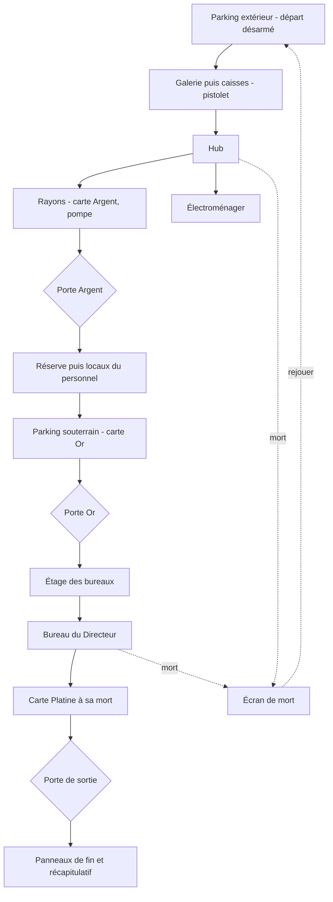

# Expérience de jeu

## Ce que vit le joueur

Le signal s'ouvre sur un menu principal habillé comme une diffusion piratée :
un bandeau défilant annonce un canal non autorisé, un nombre d'abonnés
dérisoire. « Rejoindre le direct » demande d'abord un profil de difficulté
(Client, Habitué ou Lanceur d'alerte). La première fois, quatre panneaux
d'introduction suivent, qu'on avance ou qu'on passe ; ensuite le niveau se
lance directement, et le menu propose de les revoir. Quatre autres panneaux précèdent le récapitulatif
de fin — voir [Histoire](histoire.md).

Vous apparaissez sur le parking extérieur de l'hypermarché, de nuit,
désarmé. Un pied-de-biche traîne sur le capot d'une voiture à quelques pas :
c'est votre première arme, ramassée en marchant dessus. Deux employés en
costume-cravate rôdent au loin, trop distants pour réagir — un premier
contact visuel qui installe la menace sans la déclencher.

Vous entrez par la galerie marchande, transit calme entre kiosques et
devantures baissées, avant de déboucher aux caisses pour le premier vrai
combat et le premier pistolet, ramassé sur un tapis. Au-delà s'ouvre le hub :
un carrefour qui donne à l'ouest sur les rayons, à l'est sur l'électroménager,
et au nord sur une porte verrouillée. Deux Costards y patrouillent, bien
visibles — ce carrefour doit rester lisible, pas être une embuscade.

Les rayons et l'électroménager s'explorent dans l'ordre de votre choix.
Les rayons donnent le fusil à pompe et la première carte de fidélité, la
carte Argent — combat en allées, embuscades aux croisements.
L'électroménager offre du butin devant son mur d'écrans. La carte Argent ouvre
le sas du hub qui mène à la réserve : un grand espace vertical, avec son quai
surélevé et son camion. C'est là que le magasin se referme sur vous : les
issues tombent, deux vagues arrivent, et il faut tenir pour qu'elles se
rouvrent.

Tout au long du parcours, les dons du direct remplissent une cagnotte, et six
bornes de sponsors proposent de la dépenser : un pied-de-biche plus violent,
des ennemis qui vous voient de moins loin, plus de vie. Elle ne paie pas tout :
il faut choisir.

De la réserve, vous passez de plain-pied dans les locaux du personnel :
atelier SAV, PC sécurité, vestiaires, fournil. L'escalier des bureaux y est
verrouillé par la carte Or, qui vous attend au parking souterrain, près de la
voiture de direction. Il faut descendre la chercher entre les piliers, où des
Rampants vous tombent dessus, puis remonter. Au retour, un Vigile à bouclier
garde l'escalier.

L'étage aligne quatre bureaux (sécurité, comptabilité, ressources humaines,
salle de pause) avant de refermer sur le bureau du Directeur. Dans le
couloir, il vous parle par l'interphone. Puis le combat final : le Directeur,
escorté, engage sans détour. À sa mort, sa peau se déchire pour révéler le
reptilien en dessous, et il lâche la carte Platine : la clé de l'issue de
secours qui termine le niveau. La franchir ouvre les panneaux de fin, puis le
récapitulatif.

Deux détours sont facultatifs. La cafétéria, près de l'entrée, propose des
toilettes façon Duke 3D — s'y soulager sur une cuvette ou un urinoir intacts
rend un peu de vie, avec un long délai avant de recommencer ; un sanitaire
cassé au tir laisse couler une eau qu'on peut boire à volonté, par petites
gorgées. Quatre secrets sont disséminés dans le niveau : un labo caché
derrière un pan de mur qu'un photomaton efface, un campement sur le toit
des gondoles des rayons, une couvée dans un local technique atteint par
une bouche d'aération, et la planque du vigile au fond du local compacteur.
Chacun récompense l'exploration.

Mourir coupe le signal : un écran « STREAM COUPÉ » affiche un récapitulatif
partiel et propose de reconnecter (rejouer depuis le début) ou de revenir au
menu — un vrai redémarrage de partie, pas un rechargement de page. Tout du
long, le jeu commente sa propre fiction : un HUD façon overlay de stream
(webcam, spectateurs, abonnés, cagnotte, mention « EN DIRECT »), un chat qui
réagit à ce que vous faites, des dons de spectateurs, les répliques du héros
et les annonces du magasin, et des marques de supermarché inventées dans les
rayons — le ton et le détail de cette satire sont décrits dans
`2-fonctionnel/interface.md` et `2-fonctionnel/son.md`.

Le chemin de progression, avec ses deux verrous à carte et sa boucle de
mort :

## Règles

- Le joueur démarre désarmé sur ce niveau : le pied-de-biche au sol est la
  première arme, ramassée en marchant dessus, sans confirmation.
- Une carte de fidélité s'obtient en marchant sur son emplacement ou, pour
  la carte Platine, en vainquant le Directeur qui la lâche à sa mort.
- Une porte à carte refuse de s'ouvrir tant que la carte requise n'est pas
  en poche, avec un message et un son d'échec ; elle reste réessayable.
  Une fois ouverte avec la bonne carte, elle le reste pour toute la partie.
- La carte Argent se trouve dans les rayons et ouvre la réserve ; la carte Or
  se trouve au parking souterrain et ouvre l'étage des bureaux.
- Un secret compte pour le score une fois trouvé, même sans y ramasser sa
  récompense.
- Un sanitaire intact rend de la vie en l'utilisant, avec un long délai
  avant de pouvoir recommencer ; un sanitaire cassé au tir laisse une eau
  qu'on peut boire sans limite.
- Franchir la porte de sortie déverrouillée met fin au niveau et ouvre
  l'écran de fin ; mourir avant ouvre l'écran de mort avec un récapitulatif
  partiel, sans bonus de rapidité.
- Rejouer ou revenir au menu depuis un écran de fin remet la partie à zéro
  pour de vrai, cartes et progression comprises.

## Valeurs

Détail chiffré des dégâts, points de vie, munitions, temps de référence et
barème de score : `6-reference/valeurs-deplacement.md`,
`6-reference/valeurs-ennemis.md`. Détail des préfixes et conventions du
niveau (dont les cartes de fidélité) : `6-reference/conventions-nommage.md`.

## État

- Validé en playtest : la sensation de déplacement (« Quake / Half-Life
  1 »), et le combat contre plusieurs Costards jugé fun malgré des sprites
  provisoires. La structure du niveau v2 (circulation, durée, lisibilité,
  sans aucun habillage) a été jouée et validée avant l'habillage.
- En attente de verdict : toute la v1.2 — profils de difficulté, sponsors,
  explosifs, Rampant, Vigile et les trois rencontres.
- En attente de verdict aussi : l'habillage complet du niveau v2 (décor, éclairage,
  contenu des dix espaces), les sprites d'ennemis pré-rendus, les modèles
  d'armes en vue subjective, les sanitaires façon Duke 3D, l'écran de fin
  avec récapitulatif, et le menu Pause/Options en cours de partie.

## Pour aller plus loin

- `2-fonctionnel/deplacement-et-controles.md` — comment on se déplace et vise.
- `2-fonctionnel/armes.md` — pied-de-biche, pistolet, pompe.
- `2-fonctionnel/ennemis.md` — Costard et Directeur.
- `2-fonctionnel/le-niveau.md` — les dix espaces et le plan de masse.
- `2-fonctionnel/objets-interactifs.md` — portes, sanitaires, ramassages.
- `2-fonctionnel/secrets-et-score.md` — secrets et barème de score.
- `2-fonctionnel/interface.md` — menus, HUD « stream », écrans.
- `2-fonctionnel/son.md` — ambiances et répliques.
