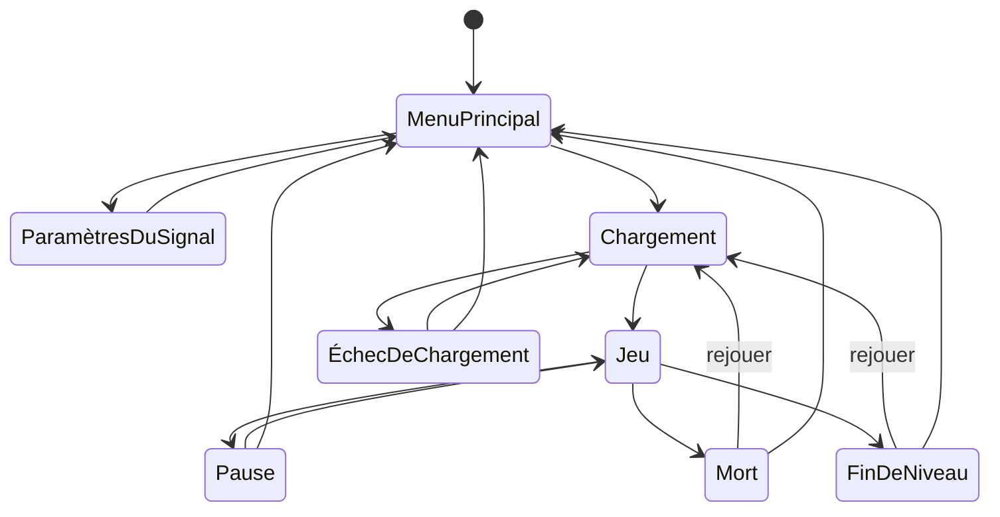

# Interface

## Ce que vit le joueur

### Le parcours d'écrans

Le jeu s'ouvre sur un menu principal, jamais directement en jeu. De là, un
chargement mène à la partie ; la partie peut se mettre en pause, se terminer
par une mort ou par une vraie sortie de niveau ; chacune de ces fins ramène
soit à une nouvelle partie, soit au menu.

Rejouer ou revenir au menu repart d'une partie neuve : cartes, munitions et
progression ne survivent pas.

### Menu principal

Le premier écran habille tout de suite le jeu en diffusion piratée : un
bandeau « SIGNAL INTERCEPTÉ », une légende de caméra
(« CAM_04 · RÉVEIL_DU_PEUPLE »), le titre « PROJET_CASSANDRE » sous
l'accroche « RÉVEIL_DU_PEUPLE — la vérité, en direct », et un bandeau
défilant sans lien avec la partie (« SIGNAL NON AUTORISÉ », « 200
ABONNÉS »…). Trois actions : « REJOINDRE LE DIRECT » lance directement le
niveau, « PARAMÈTRES DU SIGNAL » ouvre les options, « COUPER LA DIFFUSION »
tente de fermer l'onglet et l'explique en toutes lettres quand ça échoue.

### Paramètres du signal (options)

Deux onglets (souris ou flèches) : « CONTRÔLES » et « AFFICHAGE », un seul
bouton de sortie « ◀ RETOUR », écran identique depuis le menu principal ou
la pause. **Contrôles** : interrupteur pour la nappe/musique (touche `M`
en jeu), liste des actions et leur touche (cliquer une ligne attend la
prochaine touche pressée, `Échap` annule), bouton de réinitialisation.
**Affichage**, quatre réglages : le *filtrage des textures lointaines* en
trois choix décrits par ce qu'on voit — « gros pixel partout, y compris au
loin » (origine), « gros pixel de près, lissé au loin », « gros pixel de
près, net même en rasant » (actuel) — sans jamais changer la netteté de
près ; la *résolution interne* ; le *champ de vision* de base ;
l'*intensité du screenshake* à l'impact (0 à 100 %).

### Chargement

Une barre de progression réelle, pourcentage et libellé de l'étape, à côté
d'une petite phrase qui change toutes les quelques secondes sur un ton
pince-sans-rire (« Décongélation du rayon surgelés… », « Le directeur est
en réunion. Il vous recevra. ») — jamais ce que fait vraiment le
chargement, c'est le rôle du libellé. En cas d'échec, elle laisse place à
un message d'erreur et un bouton « RÉESSAYER ».

### Pause

Déclenchée par la perte du verrouillage du pointeur (par exemple `Échap`),
jamais par un bouton dédié. Le jeu reste visible derrière, assombri et
flouté : « STREAM EN PAUSE », sous « La caméra tourne encore. Personne ne
le sait. » Trois actions : « ▶ REPRENDRE » redemande le verrouillage du
pointeur, « ⚙ PARAMÈTRES » ouvre le même écran d'options, « ◀ QUITTER VERS
LE MENU » abandonne la partie. Rouvrir la pause repart toujours de ce
menu ; un réglage d'affichage changé en pause s'applique sans reprendre.

### Mort et fin de niveau

Mourir affiche « STREAM COUPÉ » (« Ils ont eu ta connexion. Encore une
preuve, pense les 200 abonnés restants. »), les spectateurs au moment de
la coupure, et un récapitulatif **partiel** — sans bonus de rapidité, un
message le rappelle. Deux actions : « ▶ RECONNECTER » et « ◀ RETOUR AU
MENU ».

Franchir la sortie déverrouillée affiche « TRANSMISSION ACHEVÉE » puis
« ÉCHAPPÉ DE L'HYPERMARCHÉ » (« Le monde n'est pas prêt à entendre la
vérité. Mais toi, tu es dehors. »), les spectateurs, le temps comparé au
temps de référence, et un récapitulatif **complet**, bonus de rapidité
compris. Deux actions : « ▶ REJOUER » et « ◀ RETOUR AU MENU ».

Dans les deux cas, le récapitulatif se révèle ligne par ligne, boutons
utilisables pendant toute la révélation. Barème complet :
[Secrets et score](secrets-et-score.md).

### Le HUD « stream »

Toute la partie garde la même blague en fond : le joueur est un streameur
clandestin. En haut à droite, une fausse webcam de coin (tête et épaules en
silhouette, badge clignotant « EN DIRECT », légende « RÉVEIL_DU_PEUPLE —
200 abonnés ») ; sous elle, un compteur de « spectateurs en direct » qui
grimpe d'un montant disproportionné à chaque ennemi neutralisé, bien plus
pour le Directeur qu'un Costard — un gag sans lien avec le score, remis à
zéro chaque partie ; encore sous lui, les répliques du héros, sous
l'étiquette « RÉVEIL_DU_PEUPLE dit : », avec un délai minimum entre deux.

En bas à gauche : les cartes de fidélité en poche (si au moins une est
détenue), puis les PV en barre et en chiffres, colorés selon la vie
restante. En bas à droite : les munitions de l'arme en main — un compte de
cartouches pour pistolet et pompe, ou « PIED-DE-BICHE »/« À MAINS NUES ».

Deux canaux de message distincts se superposent : la réplique du héros
ci-dessus (cooldown de 15 secondes) et un message système transitoire pour
les faits (porte déverrouillée, carte ramassée), sans aucun cooldown.

Un réticule reste affiché en permanence au centre exact de l'écran, seul
repère fiable de la direction de tir, et pulse à chaque tir. Un marqueur
distinct et plus bref confirme un tir qui a touché un ennemi (variante
propre à un coup qui l'élimine) ; un tir sur le seul décor ne l'affiche pas.

### Menu dev et accessibilité

Réservés au développement, absents du jeu livré : un lien discret du menu
principal vers un choix de niveau parmi les zones de test et blockouts, un
panneau de chiffres bruts à la place du compteur d'images du jeu livré, un
panneau de curseurs à chaud pour la sensation de jeu, replié par défaut et
basculé par une touche dédiée. Détail : `4-technique/debug.md`.

Le HUD grandit avec la fenêtre dans la même proportion que l'image du jeu ;
les écrans modaux (options, mort, fin de niveau, pause) gardent une taille
fixe — écart connu, pas un choix définitif. Chaque bouton est un vrai
bouton actionnable au clavier, les onglets des options se parcourent aux
flèches, les canaux de message et l'écran de chargement s'annoncent aux
lecteurs d'écran comme du contenu qui change. Aucun écran ne se ferme en
soumettant un formulaire.

## Règles

- Le menu principal est toujours le premier écran, sauf reprise d'une
  partie en cours par la pause.
- L'écran d'options est identique depuis le menu principal et la pause ;
  seul le bouton de retour change de destination.
- La pause ne s'ouvre que par perte du verrouillage du pointeur et repart
  toujours de son menu.
- Un récapitulatif de mort n'accorde jamais de bonus de rapidité ; seul un
  récapitulatif de fin de niveau réelle le peut.
- Rejouer ou revenir au menu, depuis n'importe quel écran de fin, repart
  d'une partie entièrement neuve.
- Le compteur de « spectateurs » du HUD est un gag d'affichage sans lien
  avec le score.

## Valeurs

Aucune valeur numérique propre à cette page : barème de score dans [Secrets et score](secrets-et-score.md), contrôles dans `6-reference/controles.md`.

## État

- Validé en playtest : la direction « salle de contrôle » du HUD et sa
  disposition en coins d'écran.
- En attente de verdict : la pause sur perte de verrouillage du pointeur,
  les réglages d'affichage appliqués à chaud en pause, et le récapitulatif
  révélé ligne par ligne — ajoutés à la passe du 2026-09-25, jamais
  déclenchés par une vraie touche en conditions réelles.

## Pour aller plus loin

- Câblage React, store et machine de flux : `4-technique/interface-react.md`.
- Comment l'information passe du jeu vers l'interface : `3-architecture/flux-de-donnees.md`.
- Construction et démolition d'une partie, chargement d'un niveau : `3-architecture/cycle-de-vie.md`.
- Structure et règles d'écriture : `6-reference/react-structure.md`,
  `6-reference/react-bonnes-pratiques.md`, `6-reference/react-css.md`, `6-reference/react-composition.md`.
