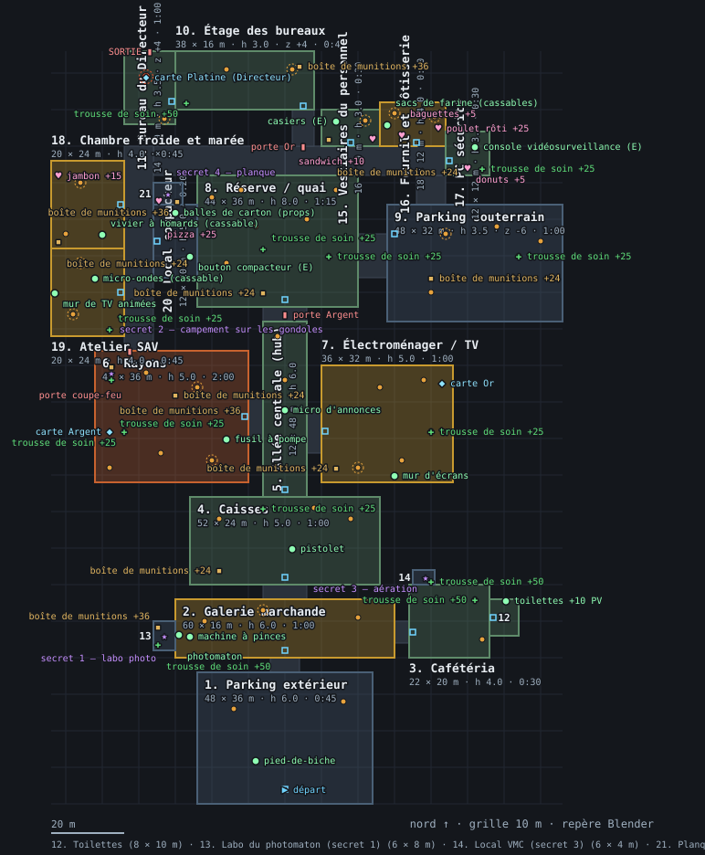
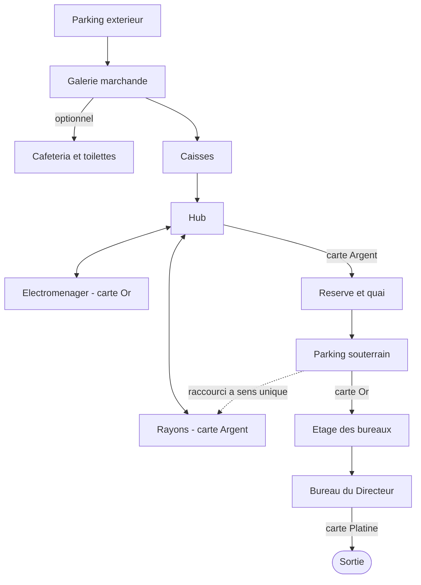

# Le niveau

## Ce que vit le joueur

L'hypermarché est un décor unique, sans coupure de chargement : un magasin
d'années 90 poussé jusqu'à la caricature, néons, marques inventées et
signalétique promotionnelle sur chaque rayon. La nuit tombée dehors contraste
avec l'intérieur, chaud et éclairé aux tubes fluorescents ; l'électroménager
tranche à son tour avec la lumière froide de ses écrans, et le parking
souterrain est le seul endroit vraiment sombre du niveau.

La structure reprend le hub à la Duke Nukem 3D : une zone centrale distribue
plusieurs espaces, et deux d'entre eux gardent une carte de fidélité qui
ouvre la suite. Le trajet obligé est linéaire à l'entrée (parking, galerie,
caisses), s'ouvre en un vrai choix au hub (rayons ou électroménager, dans
l'ordre voulu), se referme sur un second verrou (réserve puis étage des
bureaux), et termine sur une confrontation immédiate suivie de la sortie. Un
détour facultatif (la cafétéria et ses toilettes) et trois secrets récompensent
qui s'écarte du chemin. Au total, le magasin couvre plusieurs dizaines de
milliers de mètres carrés praticables — largement de quoi remplir les
8 à 10 minutes visées pour une traversée complète.

Vue de dessus des espaces et de leurs liaisons :

### Les espaces

| Espace | Ce qu'on y trouve | Comment on y entre |
|---|---|---|
| Parking extérieur | Le spawn, de nuit, à ciel ouvert. Le pied-de-biche sur un capot de voiture. Deux employés au loin, hors de portée : un premier contact visuel qui n'engage rien | Point de départ de la partie |
| Galerie marchande | Un long transit sous verrière, seule lumière naturelle du niveau : kiosques, devantures baissées, machine à pinces et photomaton | Depuis le parking, par des portes automatiques |
| Cafétéria (optionnelle) | Un comptoir de self, des tables, et au fond une salle de toilettes avec cabines, lavabos et urinoirs | Un passage secondaire depuis la galerie, jamais sur le chemin obligé |
| Caisses | Une ligne de caisses à franchir par leurs trouées : le premier vrai combat, et le pistolet, posé sur un tapis | Depuis la galerie |
| Hub (allée centrale) | Le carrefour du niveau : deux employés y patrouillent, bien visibles. Un micro d'annonces au centre | Depuis les caisses |
| Rayons | Des allées de gondoles thématiques, deux allées transversales où se posent les embuscades, un rayon surgelés. La carte Argent, derrière le comptoir du rayon frais, et le fusil à pompe | Depuis le hub, à l'ouest |
| Électroménager | Un mur d'écrans, des rangées de gros électroménager, une cabine de démonstration. La carte Or, en hauteur dans la cabine | Depuis le hub, à l'est |
| Réserve et quai | Le plus gros combat du niveau, avec une vraie verticalité : une mezzanine, des racks qui font un vrai couvert. Une rampe descend au parking souterrain | Depuis le hub, une fois la carte Argent en poche |
| Parking souterrain | Pénombre entre des piliers réguliers : la seule zone où se cacher derrière un pilier suffit vraiment | Depuis la réserve, par la rampe de quai |
| Étage des bureaux | Un couloir de nuit et quatre bureaux (sécurité, comptabilité, ressources humaines, salle de pause), avant le bureau du Directeur | Depuis le parking souterrain, par un escalier de service, une fois la carte Or en poche |
| Bureau du Directeur | La confrontation finale, immédiate dès l'entrée, puis l'issue de secours qui termine le niveau | Au bout de l'étage des bureaux |

Un raccourci relie directement le parking souterrain aux rayons par une porte
coupe-feu : elle ne s'ouvre que du côté du personnel, donc utilisable une
seule fois qu'on l'a atteinte par le chemin normal, mais elle évite ensuite de
tout retraverser. Les trois cachettes de secrets (voir plus bas) sont de
petits espaces à part, chacun accessible depuis l'un des lieux ci-dessus.

### La progression

Deux cartes de fidélité, Argent et Or, se trouvent chacune dans un espace
ouvert au hub sans condition (rayons et électroménager) ; chacune ouvre à son
tour une porte qui mène plus loin dans le niveau. Une troisième carte,
Platine, n'est jamais ramassée dans le décor : le Directeur la lâche à sa
mort, et elle ouvre la sortie.

### Les secrets

Trois secrets récompensent l'exploration, chacun avec un indice plutôt qu'un
emplacement marqué :

- Un labo caché derrière un pan de mur de la galerie marchande, effacé en se
  servant du photomaton voisin.
- Un campement sur le toit des rangées de gondoles des rayons, atteint en
  grimpant depuis une caisse au sol.
- Une couvée dans un local technique de la cafétéria, atteinte par une bouche
  d'aération au-dessus d'un distributeur.

Détail du décompte et du barème de score : `2-fonctionnel/secrets-et-score.md`.

### Les niveaux de test

Le menu de développement propose, en plus du niveau complet, des espaces
isolés qui servent à vérifier une brique à la fois plutôt qu'à être joués
pour de vrai :

- Un **gymnase** : une boîte blanche qui sert à régler le déplacement et le
  tir, sans aucun décor.
- Cinq **zones isolées** (parking, caisses, rayons, réserve, bureau), chacune
  un fragment autonome de l'ancien niveau complet, utile pour tester un
  espace précis sans traverser tout le magasin.
- Une **salle d'essai** consacrée aux rayons, qui sert à juger la richesse
  visuelle d'un espace habillé indépendamment du reste du niveau.
- Un **blockout** du niveau actuel : la structure des espaces et leur
  circulation, en volumes gris, sans aucun décor — c'est la version qui a
  validé la circulation et la durée avant tout habillage.
- Un **niveau complet historique** : les cinq zones isolées reliées bout à
  bout par de vrais couloirs, avant la refonte en hub décrite sur cette page.

Le **vrai jeu** est le niveau habillé décrit plus haut sur cette page : c'est
lui qui porte le décor, l'éclairage et le contenu final des espaces.

## Règles

- Un espace du hub (rayons, électroménager) se visite dans l'ordre de son
  choix : rien n'impose de prendre la carte Argent avant l'Or, ni l'inverse.
- Une porte à carte reste fermée tant que la carte requise n'est pas en
  poche ; une fois ouverte avec la bonne carte, elle le reste pour toute la
  partie.
- Le raccourci de la porte coupe-feu ne s'ouvre que depuis le côté du
  personnel : il faut d'abord l'atteindre par le chemin normal avant de
  pouvoir l'emprunter dans l'autre sens.
- La cafétéria et ses toilettes sont entièrement facultatives : on peut finir
  le niveau sans jamais y entrer.
- Un espace praticable ne se superpose jamais à un autre : il n'y a jamais
  deux sols l'un au-dessus de l'autre au même endroit du plan — un seul sol
  praticable par colonne, ce qui interdit par exemple une mezzanine sous une
  autre mezzanine.

## Valeurs

Cette page ne fixe aucune cote : dimensions exactes des espaces, budget de
lots de dessin et conventions de préfixe d'objet sont dans
`6-reference/conventions-nommage.md`.

## État

- Validé en playtest : la structure du niveau (circulation, durée,
  lisibilité des espaces) a été jouée et validée en volumes gris, avant tout
  habillage.
- En attente de verdict : l'habillage complet des espaces (décor, éclairage,
  contenu), l'étage des bureaux et la confrontation finale, les toilettes et
  leur mécanique façon Duke 3D, les portes animées et les vitres cassables,
  et les trois secrets sur le niveau habillé.
- Connu et pas encore traité : l'éclairage n'est pas encore cuit (aucune
  ombre portée, seules les lampes en temps réel éclairent le niveau) ; des
  packs de décor attendent une licence confirmée avant de pouvoir être
  utilisés ; les caddies ne se poussent pas encore, le rayon surgelés ne se
  brise pas en verre et les écrans de surveillance n'affichent rien de
  dynamique.

## Pour aller plus loin

- [Chargement de niveau](../4-technique/chargement-de-niveau.md) — le
  pipeline qui transforme une scène Blender en niveau jouable.
- [Systèmes de niveau](../4-technique/systemes-de-niveau.md) — portes,
  vitres, props, sanitaires.
- [Outillage Blender](../4-technique/outillage-blender.md) — les scripts qui
  construisent, valident et exportent le niveau.
- [Pipelines de contenu](../3-architecture/pipelines-de-contenu.md) — où ce
  pipeline s'insère parmi les autres.
