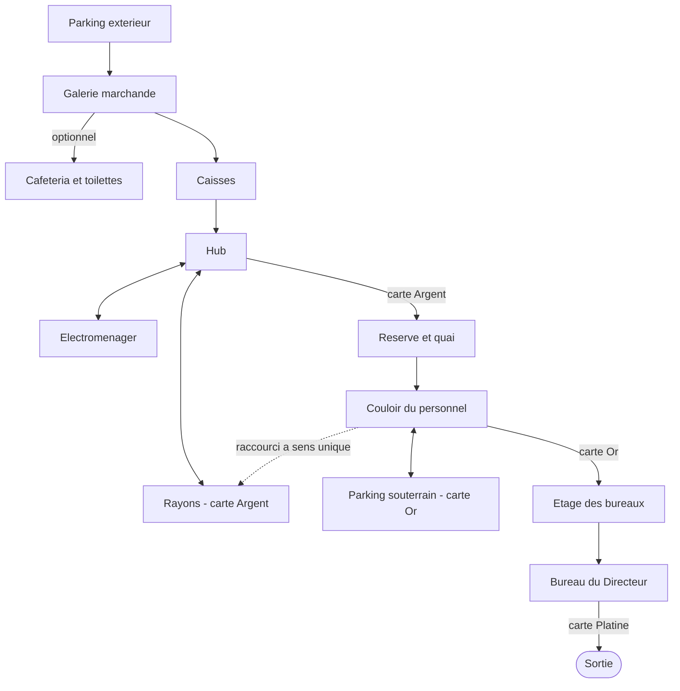

# Le niveau

## Ce que vit le joueur

L'hypermarché Hyper Varan est un décor unique, sans coupure de chargement :
un magasin d'années 90 poussé jusqu'à la caricature, néons, marques inventées
et signalétique promotionnelle sur chaque rayon. La nuit dehors contraste avec
l'intérieur, chaud et éclairé aux tubes fluorescents ; le parking souterrain
est le seul endroit vraiment sombre du niveau. Le niveau s'appelle
« Inventaire exceptionnel ».

La structure reprend le hub à la Duke Nukem 3D. Le trajet est linéaire à
l'entrée (parking, galerie, caisses), s'ouvre au hub (rayons ou
électroménager, dans l'ordre voulu), puis passe derrière le magasin : la
réserve, les locaux du personnel, un aller-retour au parking souterrain, et
l'étage des bureaux. Il se termine sur le Directeur et la sortie. Une
traversée complète vise 8 à 10 minutes.

Vue de dessus des espaces et de leurs liaisons :

### La surface de vente

| Espace | Ce qu'on y trouve | Comment on y entre |
|---|---|---|
| Parking extérieur | Le départ, de nuit. Le pied-de-biche sur un capot. Deux employés au loin, hors de portée | Point de départ |
| Galerie marchande | Un transit sous verrière : kiosques, devantures baissées, machine à pinces, photomaton | Par les portes automatiques |
| Cafétéria et toilettes | Facultatives : un self, des tables, et des sanitaires utilisables façon Duke 3D | Un passage depuis la galerie |
| Caisses | Six travées à franchir : le premier vrai combat, et le pistolet | Depuis la galerie |
| Hub (allée centrale) | Le carrefour du niveau, et le micro d'annonces | Depuis les caisses |
| Rayons | Des gondoles, un rayon frais, un rayon surgelés. La carte Argent et le fusil à pompe | Depuis le hub, à l'ouest |
| Électroménager | Un mur d'écrans et des rangées d'appareils : exploration et butin | Depuis le hub, à l'est |

### Les coulisses

| Espace | Ce qu'on y trouve | Comment on y entre |
|---|---|---|
| Réserve et quai | Le plus gros combat : des racks qui font couvert, et un quai surélevé à l'ouest, avec son camion | Depuis le hub, par le sas, avec la carte Argent |
| Atelier SAV | Un guichet, des établis et un mur de quarante téléviseurs en réparation | Entre la réserve et le couloir du personnel |
| Couloir du personnel | Il distribue le PC sécurité, les vestiaires, le fournil et l'escalier des bureaux | Depuis la réserve, de plain-pied |
| PC sécurité | Une console qui fait défiler six caméras du magasin | Depuis le couloir, ou par la gaine du fournil |
| Vestiaires | Des casiers, une pointeuse, des douches | Depuis le couloir du personnel |
| Fournil | Un four, une rôtissoire, une chambre de pousse qui déborde ; une gaine de ventilation mène au PC sécurité | Depuis le couloir du personnel |
| Parking souterrain | La pénombre entre les piliers. La carte Or, près de la voiture de direction | Par un escalier depuis le couloir du personnel |
| Couloir de service et compacteur | Un local de répit, ses balles de carton, et la planque du vigile | Depuis le couloir du personnel ou la réserve |
| Labo boucherie et chambre froide | Un labo blanc vif, vu depuis les rayons par une vitre, et une chambre froide à carcasses | Par le couloir coupe-feu |
| Étage des bureaux | Un couloir et quatre bureaux : sécurité, comptabilité, ressources humaines, salle de pause | Par l'escalier, avec la carte Or |
| Bureau du Directeur | La confrontation finale, puis l'issue de secours | Au bout de l'étage |

Un raccourci relie le couloir coupe-feu aux rayons : la porte ne s'ouvre que
du côté du personnel, puis évite de retraverser le magasin.

### La progression

La carte Argent est dans les rayons et ouvre la réserve. La carte Or est au
parking souterrain et ouvre l'escalier des bureaux : il faut descendre la
chercher, puis remonter. La carte Platine n'est jamais dans le décor : le
Directeur la lâche à sa mort, et elle ouvre la sortie.

### Les moments scriptés

Quatre moments jalonnent le parcours, sans jamais retirer le contrôle :

| Où | Ce qui se passe |
|---|---|
| Entrée des caisses | Les haut-parleurs attendent « un client non identifié » en caisse centrale |
| Atelier SAV | Les quarante téléviseurs passent ensemble sur la vidéosurveillance |
| Quai | Le héros s'interroge sur ce que le camion livre après la fermeture |
| Couloir des bureaux | Le Directeur s'adresse au héros par l'interphone, avant le combat |

Le héros commente aussi sa première visite de la plupart des lieux. Le sens de
ces moments est dans [Histoire](histoire.md).

### Les rencontres

Trois endroits du parcours ne se traversent pas comme les autres : le niveau y
fait surgir des ennemis au moment où vous arrivez.

| Où | Ce qui se passe |
|---|---|
| Réserve | En franchissant le milieu de la salle, les quatre issues se ferment et une annonce déclare la réserve « fermée pour inventaire exceptionnel ». Une première vague de Costards arrive, puis une seconde avec des Rampants dans votre dos. Tout se rouvre quand la seconde est tombée. |
| Parking souterrain | Au pied de l'escalier, deux Rampants arrivent du fond. La meute entière surgit quand vous atteignez la carte Or. |
| Couloir du personnel | Pendant que vous êtes au parking, l'interphone envoie la sécurité à l'escalier des bureaux. Au retour, un Vigile garde la porte Or, une bonbonne de gaz à portée. |

Le passage nord de la réserve a un rideau métallique, relevé en temps normal :
c'est lui qui tombe au début de l'arène.

Le nombre d'ennemis de chaque vague dépend du profil choisi — voir
[Difficulté](difficulte.md).

### Les bornes

Six bornes de sponsors jalonnent le chemin obligé, de la galerie aux bureaux.
Leur liste et ce qu'elles vendent sont dans [Sponsors](sponsors.md).

### Les secrets

Quatre secrets récompensent l'exploration, chacun avec un indice plutôt qu'un
emplacement marqué :

- Un labo caché derrière un pan de mur de la galerie, effacé en se servant du
  photomaton voisin.
- Un campement sur le toit des gondoles des rayons, atteint en grimpant depuis
  une caisse au sol.
- Une couvée dans un local technique de la cafétéria, cachée derrière
  son distributeur coulissant. Le retour de monnaie actionne le passage ; des
  traces au sol donnent un indice.
- La planque du vigile, au bout du local compacteur : une télé, une pizza et
  son butin.

Détail du décompte et du barème de score : [Secrets et score](secrets-et-score.md).

### Les niveaux de test

Le menu de développement propose, en plus du niveau complet, des espaces
isolés qui servent à vérifier une brique à la fois plutôt qu'à être joués
pour de vrai :

- Un **gymnase** : une boîte blanche qui sert à régler le déplacement et le
  tir, sans aucun décor.
- Cinq **zones isolées** (parking, caisses, rayons, réserve, bureau), chacune
  un fragment autonome de l'ancien niveau complet, utile pour tester un
  espace précis sans traverser tout le magasin.
- Une **salle d'essai** consacrée aux rayons, qui sert à juger la richesse
  visuelle d'un espace habillé indépendamment du reste du niveau.
- Un **blockout** du niveau actuel : la structure des espaces et leur
  circulation, en volumes gris, sans aucun décor — c'est la version qui a
  validé la circulation et la durée avant tout habillage.
- Un **niveau complet historique** : les cinq zones isolées reliées bout à
  bout par de vrais couloirs, avant la refonte en hub décrite sur cette page.

Le **vrai jeu** est le niveau habillé décrit plus haut sur cette page : c'est
lui qui porte le décor, l'éclairage et le contenu final des espaces.

## Règles

- Les rayons et l'électroménager se visitent dans l'ordre de son choix ; seul
  le passage par les rayons est nécessaire, pour la carte Argent.
- La carte Or oblige à descendre au parking souterrain puis à remonter : le
  parking n'est pas un détour facultatif.
- Un moment scripté ne se produit qu'une fois par partie, une rencontre aussi.
- Une arène ne garde jamais le joueur enfermé : si une vague n'est pas tombée
  au bout d'un peu plus d'une minute, la suite s'enchaîne quand même.
- Pendant l'arène, aucune carte n'ouvre les issues de la réserve : la porte
  répond qu'elle est verrouillée par la sécurité du magasin.
- Une porte à carte reste fermée tant que la carte requise n'est pas en
  poche ; une fois ouverte avec la bonne carte, elle le reste pour toute la
  partie.
- Le raccourci de la porte coupe-feu ne s'ouvre que depuis le côté du
  personnel : il faut d'abord l'atteindre par le chemin normal avant de
  pouvoir l'emprunter dans l'autre sens.
- La cafétéria et ses toilettes sont entièrement facultatives : on peut finir
  le niveau sans jamais y entrer.
- Un espace praticable ne se superpose jamais à un autre : il n'y a jamais
  deux sols l'un au-dessus de l'autre au même endroit du plan — un seul sol
  praticable par colonne, ce qui interdit par exemple une mezzanine sous une
  autre mezzanine.

## Valeurs

Cette page ne fixe aucune cote : dimensions exactes des espaces, budget de
lots de dessin et conventions de préfixe d'objet sont dans
`6-reference/conventions-nommage.md`.

## État

- Validé en playtest : la structure d'origine du niveau, jouée en volumes
  gris avant tout habillage, et la nouvelle implantation des coulisses,
  approuvée sur plan le 2026-10-01.
- En attente de verdict : l'habillage complet, les coulisses jouées de bout en
  bout, les quatre secrets, les quatre moments scriptés et les répliques de
  lieu.
- En attente de verdict aussi : les trois rencontres et les six bornes
  (4 octobre 2026). La durée d'une partie avec ces rencontres n'a pas été
  mesurée. Les ennemis d'une vague apparaissent d'un coup à leur place ;
  dans la réserve, certains peuvent être dans le champ de vision.
- Connu et pas encore traité : le camion du quai est fermé, sa cargaison reste
  à poser ; l'enseigne du parking affiche « HYPER » sans « Varan ».

## Pour aller plus loin

- [Chargement de niveau](../4-technique/chargement-de-niveau.md) — le
  pipeline qui transforme une scène Blender en niveau jouable.
- [Systèmes de niveau](../4-technique/systemes-de-niveau.md) — portes,
  vitres, props, sanitaires.
- [Outillage Blender](../4-technique/outillage-blender.md) — les scripts qui
  construisent, valident et exportent le niveau.
- [Pipelines de contenu](../3-architecture/pipelines-de-contenu.md) — où ce
  pipeline s'insère parmi les autres.
