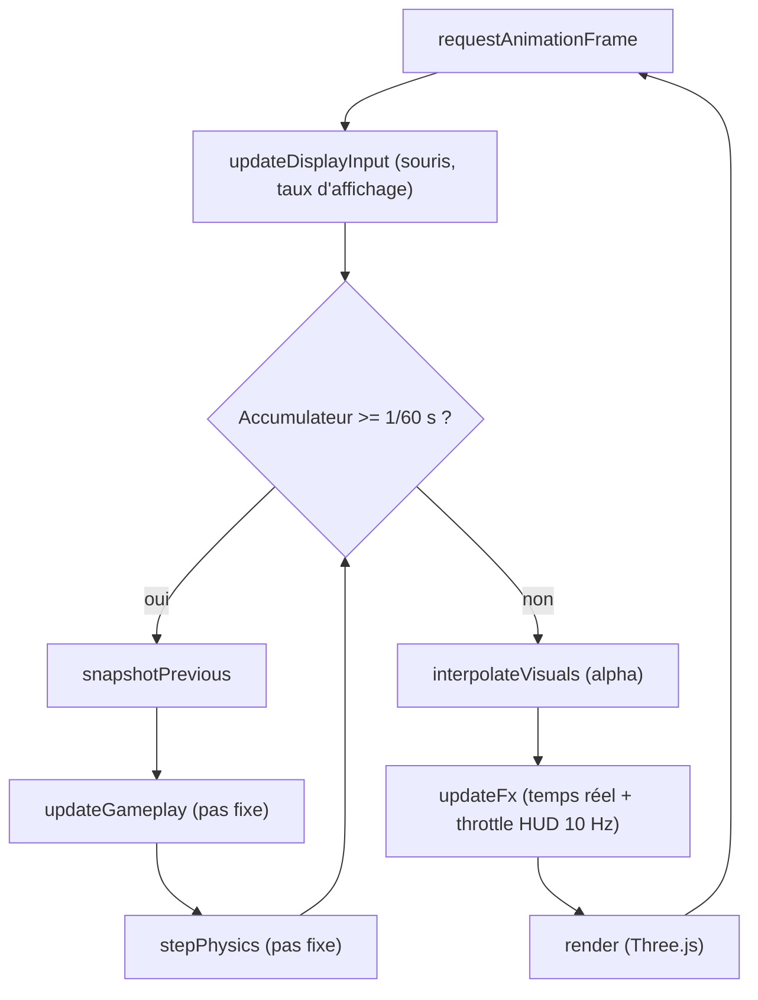

# Boucle et temps

## Rôle

Découper le temps en deux régimes qui n'ont pas le droit de se mélanger : un
**pas fixe** de 1/60 s qui décide l'état du jeu (gameplay, physique), et un
**taux d'affichage** qui en tire une image (interpolation, rendu, HUD). Ce
découpage protège le déterminisme — deux machines qui exécutent la même
séquence d'entrées produisent le même résultat, quel que soit leur
framerate — et la lisibilité de la visée, qui ne doit jamais hériter du
lissage du mouvement.

## Diagramme

Une image d'affichage déclenche zéro, un ou plusieurs pas fixes (selon le
temps écoulé), puis une interpolation et un rendu uniques.

## L'image : accumulateur, clamp, alpha

`startLoop` (`src/core/loop/loop.ts`) mesure `frameTime` entre deux
`requestAnimationFrame`, le clampe à `MAX_FRAME` (0,25 s) puis l'ajoute à un
`accumulator`. Une boucle `while (accumulator >= FIXED_DT)` exécute autant de
pas fixes que l'accumulateur le permet, chacun de durée `FIXED_DT = 1/60`, et
lui retranche `FIXED_DT` à chaque tour. Sans ce clamp, un onglet revenu au
premier plan après une pause rejouerait d'un coup des minutes de pas fixes
(« spirale de la mort ») — [invariant #1](invariants.md).

Le reste de l'accumulateur après la boucle sert à calculer `alpha =
accumulator / FIXED_DT` : la fraction du prochain pas fixe déjà écoulée,
passée à `interpolateVisuals`. Un pas fixe peut ne pas s'exécuter du tout
dans une image (`steps: 0`) à haute fréquence d'affichage — ce n'est pas une
anomalie, `LoopStats` l'expose tel quel au panneau de debug.

## L'ordre exact d'une image, lu dans le code

Séquence de `frame()` dans `src/core/loop/loop.ts` :

| Étape | Fichier | Taux | Ce qu'elle a le droit de modifier |
|---|---|---|---|
| `input.beginFrame()` | `src/core/input/input.ts` | affichage | État interne de l'input (une fois par image) |
| `updateDisplayInput` | `src/game/loop/updateDisplayInput.ts` | affichage | `engine.look.{yaw,pitch}`, `engine.lookDelta` — lit la souris avant tout pas fixe |
| *(boucle : 0..N fois)* `input.beginFixedStep()` | `src/core/input/input.ts` | pas fixe | État interne de l'input (une fois par pas fixe) |
| `snapshotPrevious` | `src/game/loop/stepPhysics.ts` | pas fixe | Copie la pose courante en pose « précédente » (joueur, armes, ennemis, props, portes, balle de test) — matière première de l'interpolation |
| `updateGameplay` | `src/game/loop/updateGameplay.ts` | pas fixe | Tout l'état de jeu : joueur, armes, ennemis, portes, objets interactifs, score, secrets, sortie de niveau |
| `stepPhysics` | `src/game/loop/stepPhysics.ts` | pas fixe | Avance le monde Rapier (`session.physics.step(dt)`), relit les props après coup |
| *(fin de boucle)* | — | — | — |
| `interpolateVisuals` | `src/game/loop/interpolateVisuals.ts` | affichage | Caméra (position, FOV, bob), poses affichées des ennemis/props/portes, viewmodel — jamais l'état de jeu lui-même |
| `updateFx` | `src/game/loop/updateFx.ts` | affichage | Effets visuels/sonores déclenchés par les évènements du pas fixe, pool de lampes, store zustand (throttlé 10 Hz), rendu du réticule/hitmarker |
| `render` | `src/render/*` (appelé depuis `main.ts`) | affichage | Dessine la scène Three.js |
| `input.endFrame()` | `src/core/input/input.ts` | affichage | Doit rester le dernier appel de l'image |

`updateGameplay` lit l'input du pas fixe via `captureInputFrame` (nommé par
action, `core/input/input.ts::GameAction`, pas par touche physique) ou par
`inputRecorder.nextFrame()` en rejeu — jamais les deux à la fois. En dev
seulement (`import.meta.env.DEV`), `handleDevGameplayInput`
(`src/game/loop/devGameplayInput.ts`) consomme F8-F10 (notarget, rejeu
F9/F10) avant le reste du pas.

Deux détails d'ordre à l'intérieur d'`updateGameplay` valent d'être notés
puisqu'ils conditionnent le rejeu exact : l'origine de tir
(`weaponEyeOrigin`) est reconstruite depuis `session.player.position` **après**
`player.update`, jamais depuis la position interpolée du rendu ; et
`suitManager.update`/`directorManager.update` s'exécutent après
`weapons.update`, pour que les `hitEvents` d'un tir soient visibles aux
ennemis dans le même pas.

Si `!engine.flow.isPlaying()` (mort, fin de niveau, menu), `updateGameplay`
retourne avant tout ce tableau — le pas fixe continue de s'exécuter
(l'accumulateur et l'horloge tournent toujours, invariant #1), seul son
contenu est ignoré.

## Hitstop

Le hitstop ralentit le gameplay à l'impact sans jamais arrêter le pas fixe
lui-même. `GameClock.tick(fixedDt)` (`src/core/loop/time.ts`) renvoie `fixedDt`
inchangé la plupart du temps, ou `fixedDt * hitstopScale` (0,05 par défaut)
tant que `hitstopRemaining > 0`, décrémenté à chaque appel. Ce résultat,
`gameplayDt`, est ce que `updateGameplay` propage à tout ce qui doit
ralentir : `advanceGameplayTime`, le délai de soulagement des sanitaires, et
`suitManager.update`/`directorManager.update`.

Les ennemis reçoivent ce `gameplayDt` (jamais un delta d'affichage brut) via
`tickEnemy(actor, dt, ctx)` (`src/game/entities/shared/enemyMachine.ts`, appelé
depuis `Suit.update`/`Director.update`), qui l'ajoute directement à
`ctx.stateTimer`/`ctx.attackCooldownRemaining`/`ctx.animClock`. Aucune
transition XState `after` n'existe dans cette machine : une durée d'état vit
entièrement dans ce champ mutable, avancé une fois par pas fixe. Un hitstop
qui ralentirait `gameplayDt` sans que cette avance en tienne compte
ralentirait le joueur mais pas les ennemis, régression invisible dans un
test isolé mais réelle en jeu — c'est la raison d'être de ce choix
(anciennement l'invariant #13, retiré le 2026-09-25, voir
[Invariants retirés](invariants.md#invariants-retirés)).

## Ce qui est lu au taux d'affichage, et pourquoi

- **Rotation caméra** : capturée une fois par image par `updateDisplayInput`,
  **avant** tout pas fixe, puis recopiée telle quelle sur la caméra dans
  `interpolateVisuals` — jamais interpolée entre deux poses. Interpoler une
  rotation ajouterait une latence geste-écran, le pire défaut pour une visée
  — [invariant #3](invariants.md).
- **Souris** : `input.consumeMouseDelta()` est lu une fois par image dans
  `updateDisplayInput`, pas une fois par pas fixe — plusieurs pas fixes dans
  la même image partagent donc la même lecture de souris déjà appliquée à
  `engine.look`.
- **Position caméra, FOV, viewmodel, poses des ennemis/props/portes** :
  interpolés dans `interpolateVisuals` à partir des deux dernières poses de
  pas fixe (`snapshotPrevious` / état courant) et de `alpha` — fluides
  indépendamment du nombre de pas fixes exécutés cette image.
- **Effets, audio, pool de lampes, HUD** : `updateFx` tourne au taux
  d'affichage avec le vrai delta temps réel (`realDt`), jamais `gameplayDt` —
  un flash de dégâts ou une décroissance de hitmarker ne doit pas ralentir
  avec le hitstop. Le store zustand qui alimente le HUD y est throttlé à
  10 Hz maximum (invariant #2).

## La frontière synchrone

`runGameplaySync` (`src/app/runtime/gameRuntime.ts`) exécute un `Effect` via
`GameRuntime.runSync` et est le seul point de passage autorisé pour le pas
fixe (`updateGameplay`, `stepPhysics`) **et** pour le rendu/l'interpolation
(`interpolateVisuals`, `updateFx`). Tout `Effect.tryPromise`/`Effect.promise`/
`Effect.async`/`Effect.sleep` dans l'un de ces arbres fait suspendre
`runSync`, qui lève un `Cause.AsyncFiberError` — intercepté juste assez pour
logger un message explicite en console avant de relancer l'erreur, jamais
pour l'avaler. Le chargement de niveau et le hot-reload restent hors de cette
frontière, sur `GameRuntime.runPromise`/`runFork` (`game/level/loading/loader.ts`,
`game/level/loading/hotReload.ts`) : ils ne sont jamais appelés depuis
`updateGameplay`. Détail : [invariant #11](invariants.md).

## Pièges

- **Un onglet masqué gèle la boucle entière**, pas seulement le rendu :
  `requestAnimationFrame` ne se déclenche plus quand `document.hidden` est
  vrai, donc l'accumulateur, l'horloge de hitstop et toute action déclenchée
  par une vraie entrée s'arrêtent avec lui. Une vérification automatisée en
  navigateur qui masque l'onglet ne peut rien observer qui dépende du pas
  fixe.
- **`gameplayDt` n'est pas le delta d'affichage.** Toute durée qui doit
  respecter le hitstop (score, cooldowns, minuteries d'ennemis) doit
  descendre de `engine.clock.tick(dt)`, jamais du `dt`/`realDt` brut passé à
  `updateFx`/`interpolateVisuals`.
- **L'origine de tir et la cible de visée des ennemis doivent venir de l'état
  du pas fixe courant**, pas d'une position interpolée pour le rendu : sinon
  le rejeu d'input (F9/F10) diverge d'une exécution à l'autre selon le
  framerate d'affichage au moment de l'enregistrement.
- **`steps: 0` est normal**, pas un bug de boucle gelée : à haute fréquence
  d'affichage, plusieurs images consécutives peuvent s'écouler sans qu'aucun
  pas fixe ne soit dû.

## Invariants concernés

- [Invariant #1](invariants.md) — pas fixe 1/60, delta clampé à 0,25 s : tout
  ce découpage en dépend directement.
- [Invariant #2](invariants.md) — React ne touche jamais la boucle : le
  throttle 10 Hz du store zustand a lieu dans `updateFx`, au taux
  d'affichage, jamais dans le pas fixe.
- [Invariant #3](invariants.md) — rotation caméra jamais interpolée : capturée
  au taux d'affichage, recopiée telle quelle.
- [Invariant #11](invariants.md) — frontière Effect synchrone stricte : tient
  le pas fixe et le rendu/interpolation, jamais le chargement de niveau.
- Choix de code (ex-invariant #13, retiré le 2026-09-25) : `stateTimer`
  avancé par le vrai `gameplayDt`, hitstop compris — voir
  [Invariants retirés](invariants.md#invariants-retirés).

## Décisions

- [ADR 0002 — Fixed timestep](../decisions/0002-fixed-timestep.md)
- [ADR 0010 — Curseur explicite d'événements multi-pas-fixe, jamais inféré](../decisions/0010-curseur-evenements-multi-pas-fixe.md)
  — pourquoi `updateFx` lit des files (`fireEvents`, `hitEvents`…) qui
  s'accumulent sur plusieurs pas fixes avant d'être vidées, une fois par
  image.
- [ADR 0013 — Garde flux vs monde physique](../decisions/0013-garde-flux-vs-monde-physique.md)
  — pourquoi `stepPhysics` garde `isPhysicsSessionLive` en plus de la garde
  de contenu d'`updateGameplay`.
