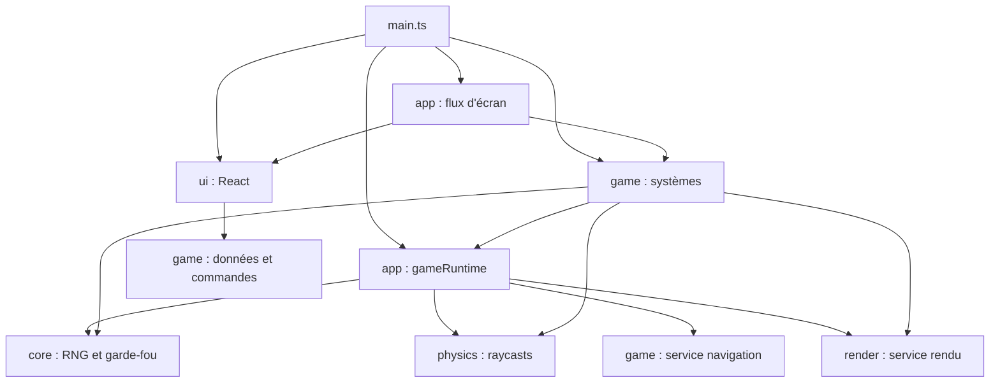

# Carte des modules

## Rôle

Cette carte indique où ranger les responsabilités et comment les modules se
rejoignent. Le relevé du 8 octobre couvre 331 modules TS/TSX de `src/` et
1 322 imports relatifs statiques, types compris (973 imports de valeur). Aucun
cycle entre fichiers à l'exécution n'est détecté ; deux groupes de fichiers ne
se referment que par des imports de type. Les imports dynamiques (3) et les
packages externes sont hors du relevé ; un aller-retour entre dossiers ne
prouve pas un cycle entre fichiers.

## Diagramme

Le diagramme distingue le module de composition Effect du flux d'écran.
Cette distinction évite de confondre l'accès au runtime et le chargement React.

## Règles

### Un rôle par dossier

| Dossier | Responsabilité | Modules représentatifs |
|---|---|---|
| `src/app/navigation/` | Choix initial, acteur de flux et transitions de session. | `bootChoice.ts`, `sessionFlow.ts`, `gameFlowMachine.ts`, `gameFlowTypes.ts`. |
| `src/app/runtime/` | Composition Effect du jeu et runtime unique. | `gameRuntime.ts`. |
| `src/core/` | Infrastructure sans règles de jeu. | `audio/`, `input/`, `loop/`, `loading/`, `effect/`. |
| `src/physics/` | Monde Rapier, controller et requêtes physiques. | `world.ts`, `raycast.ts`. |
| `src/render/` | Ressources et opérations de présentation. | `pipeline/`, `sprites/`, `pickups/`, `viewmodel/`, `overlays/`, `environment/`, `fx/`, `debug/`. |
| `src/game/entities/` | Comportements communs et types d'ennemis. | `shared/`, `suit/`, `rampant/`, `vigile/`, `director/`. |
| `src/game/level/` | Import du niveau, navigation, script et systèmes du décor. | `loading/`, `navigation/`, `scripting/`, `doors/`, `interactions/`, `props/`, `sanitaires/`, `catalog/`. |
| `src/game/loop/` | Orchestration de simulation et présentation. | `updateGameplay.ts`, `stepPhysics.ts`, `updateFx.ts`, `interpolateVisuals.ts`. |
| `src/game/player/` | Déplacement, armes et inventaire du joueur. | `movement/`, `weapons/`, `loyaltyCards.ts`. |
| `src/game/session/` | Construction et données de partie, règles du joueur, présentation, progression et direct. | `lifecycle.ts`, `gameSession.ts`, `gameEngine.ts`, `player/`, `presentation/`, `progression/`, `stream/`. |
| `src/game/devtools/` | Console, cheats et harnais de développement. | `consoleApi.ts`, `movementTuning.ts`, `replay/`, `economy/`. |
| `src/game/hud/` | Store et contrats du miroir HUD. | `state.ts`, `hudTypes.ts`. |
| `src/game/settings/` | Réglages persistants, records et commandes moteur. | `graphicsSettings.ts`, `audioSettings.ts`, `difficultySettings.ts`, `records.ts`. |
| `src/ui/` | Écrans React, contrôles, widgets HUD et panneau de tuning. | `App/`, `screens/`, `components/`, `hud/widgets/`, `dev/`. |

Le détail des dossiers et de leur contenu figure dans
[l'arborescence du dépôt](../6-reference/arborescence.md#code-du-jeu).
Implémentation, contrats et configuration restent regroupés dans chaque
responsabilité ; les tests reprennent les mêmes domaines. Le rangement ne
crée ni nouveau service ni couche de réexport.

### Composition et frontière Effect

`src/app/runtime/gameRuntime.ts` est la racine de composition des quatre services.
Il crée un seul `GameRuntime` par onglet. Sa dépendance vers la navigation
vise le service et ses algorithmes ; ces modules n'importent pas le runtime
en retour. `src/core/effect/runtime.ts` reçoit un runtime pour construire le runner
synchrone : il n'importe ni `game/`, ni `render/`, ni `physics/`, ni `app/`.

Les consommateurs de `runGameplaySync` importent `app/runtime/gameRuntime`.
Cette dépendance explicite reste limitée à ce module de composition :
il ne dépend ni des écrans React ni de `sessionFlow`. Les appels de la
simulation et du rendu gardent ainsi la même instance et le même garde-fou.

### Contrats et interface

Les types partagés vivent dans des modules feuilles par domaine :
`inputTypes`, `audioTypes`, `hudTypes`, `weaponTypes`, `enemyTypes`,
`levelTypes` et les contrats privés de leurs systèmes. Aucun barrel
`index.ts` ni fichier global de types ne rassemble leurs exports.
`state.ts` publie le miroir du HUD ; les données canoniques de partie
appartiennent à `GameSession`.

Le moteur, le noyau, la physique et le rendu n'importent aucun fichier de
`ui/`. `app/navigation/bootChoice`, `app/navigation/sessionFlow` et `main` montent les écrans.
Chaque widget HUD lit ses propres données du store et n'entre pas dans la
boucle. Les réglages persistants et les commandes moteur vivent sous `game/`.

### Dépendances à connaître

- `physics/world.ts` lit `game/player/movement/moveConfig.ts` pour les valeurs par défaut du controller.
- Le bake de navigation lit `game/entities/suit/suitConfig.ts` pour les dimensions et capacités de l'agent.
- Les ressources de ramassage lisent les catalogues de nourriture et de cartes du jeu ; le viewmodel utilise les contrats d'armes par imports de type.
- `core/audio/audio.ts` lit `DoorMovement` depuis `game/level/doors/doorTypes.ts` par un import de type, sans charger le système de portes.

Ces liens sont explicites. Ils ne justifient pas d'importer une implémentation
pour atteindre un type dont le propriétaire est déjà un module feuille.

### Où ranger un nouveau fichier

1. Infrastructure indépendante des règles du jeu : le domaine concerné sous `src/core/`.
2. Construction de `GameLayer` et de son runtime : `src/app/runtime/gameRuntime.ts`.
3. Monde physique ou requêtes Rapier : `src/physics/`.
4. Rendu et ressources de présentation : `src/render/`.
5. Règles du jeu : sous-dossier de `src/game/` correspondant au rôle.
6. Affichage React : famille de `src/ui/`, un dossier par composant.
7. Choix initial et transitions entre écrans et parties : `src/app/navigation/`.

## Invariants concernés

- [Invariant #2](invariants.md) : React ne touche jamais la boucle.
- [Invariant #11](invariants.md) : simulation et rendu passent par `runGameplaySync` ; les acquisitions asynchrones restent à la frontière de chargement.
- [Invariant #12](invariants.md) : les consommateurs utilisent `DeterministicRandom`, avec des flux distincts pour la présentation.
- [Conventions React](../6-reference/react-structure.md) : composants rangés par rôle et commandes moteur hors de `ui/`.

## Décisions liées

- [ADR 0014 — moteur et partie séparés](../decisions/0014-gameengine-persistentengine-separes.md).
- [ADR 0036 — contrats feuilles et store HUD](../decisions/0036-contrats-feuilles-et-store-hud.md), qui remplace l'[ADR 0020](../decisions/0020-state-feuille-de-dependances.md).
- [ADR 0036 — contrats feuilles et store HUD](../decisions/0036-contrats-feuilles-et-store-hud.md).
