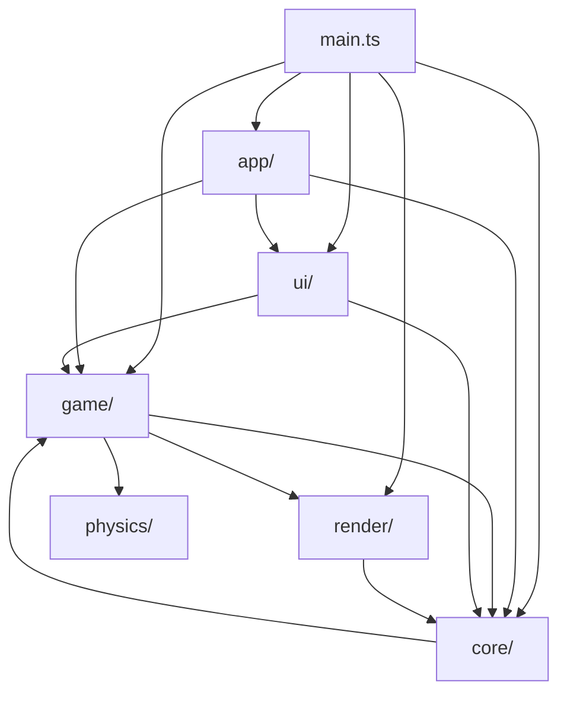

# Carte des modules

## Rôle

Savoir dans quel dossier ranger un fichier neuf, et ce qu'il a le droit
d'importer. Le contenu qui suit est **mesuré**, pas dessiné de mémoire : un
script qui parcourt `src/**/*.ts(x)` (hors `*.test.ts`), résout chaque import
relatif vers son dossier de premier niveau — et pour `game/`/`ui/`, vers leur
sous-dossier — produit la matrice « qui importe qui ». 149 fichiers non-test,
391 lignes d'import, 84 paires de dossiers reliées.

## Diagramme

Comptes d'imports mesurés entre dossiers de premier niveau (arêtes ≥ 2 ; les
arêtes à 1, presque toutes des `import type`, sont dans « Violations et
cycles » plus bas).

## Règles

### Un tableau par dossier

| Dossier | Rôle en une phrase | Fichiers clés | Dépend de | Utilisé par |
|---|---|---|---|---|
| `core/` | Boucle à pas fixe, temps, input, RNG déterministe, audio bas niveau, frontière Effect synchrone | `loop.ts` (accumulateur), `runtime.ts` (`runGameplaySync`, assemble `GameLayer`), `input.ts`, `random.ts` (`DeterministicRandom`), `audio.ts` | `physics`, `render`, `game/level` (composition du runtime Effect, voir plus bas) | `main.ts`, `game/*`, `ui/*` |
| `physics/` | Monde Rapier, groupes de collision, raycast hitscan | `world.ts` (monde, KCC, gravité), `raycast.ts` (`RaycastService`) | `game/player/moveConfig.ts` (1 fichier, voir violations) | `game/player`, `game/entities`, `game/level`, `core` |
| `render/` | Rendu Three.js : résolution interne, sprites 8 directions, effets d'impact, viewmodel | `fx.ts` (impacts, decals), `viewmodel.ts`, `billboard.ts`, `enemySprites.ts`, `renderer.ts` (filtrage, résolution) | `core` (utilitaire `assetPath`), `game/player/weapons.ts` (1 fichier, type only) | `game/*`, `main.ts`, `core` (`renderService.ts`), `ui/screens` (1 fichier, type only) |
| `app/` | Orchestration du boot et du flux d'une session (hors moteur, hors UI) | `bootChoice.ts` (choix du niveau au démarrage), `sessionFlow.ts` (rejouer/retour menu sans recharger) | `game/session`, `ui`, `core` | `main.ts` |
| `game/` (racine) | État partagé sans dépendance interne (`state.ts`) et réglages qui pilotent le moteur (`graphicsSettings.ts`) | `state.ts` (store zustand, ADR 0020), `graphicsSettings.ts` (filtrage, résolution appliqués à chaud) | `state.ts` : rien (`zustand` seul) ; `graphicsSettings.ts` : `render`, `game/player` | `ui/*`, `game/*` |
| `game/entities` | IA de combat : machine à états partagée Costard/Directeur, spawn, mort | `enemyMachine.ts` (machine XState), `suit.ts`/`director.ts`, `suitManager.ts`/`directorManager.ts` | `game/player` (dégâts, config), `physics`, `render`, `game/level/pathfinding.ts` | `game/session`, `game/loop`, `ui/dev` (tuning) |
| `game/level` | Chargement glTF, conventions de nommage, portes/vitres/props/sanitaires, pathfinding, hot reload | `loader.ts` (contrat `col_*`/`spawn_*`/`use_*`…), `pathfinding.ts`, `doors.ts`, `sanitaires.ts`, `props.ts`, `vitres.ts` | `game/player` (armes pour la casse, cartes), `physics`, `game/entities/suitConfig.ts` (1 fichier) | `game/session`, `game/entities`, `game/loop`, `core/audio.ts` (1 fichier, type only) |
| `game/loop` | Étapes appelées une par pas fixe : gameplay, physique, effets, interpolation | `updateGameplay.ts`, `updateFx.ts`, `stepPhysics.ts`, `interpolateVisuals.ts` | `game/session`, `core`, `game/player`, `game/entities`, `game/level` | `main.ts` |
| `game/player` | Déplacement (KCC), armes, viseur, cartes de fidélité | `weapons.ts`, `weaponConfig.ts`, `controller.ts`, `moveConfig.ts` | `physics`, `core` | `game/loop`, `game/level`, `game/entities`, `game/session`, `render/viewmodel.ts`, `ui/dev` (tuning) |
| `game/session` | Cycle de vie d'une partie : `GameEngine`/`GameSession`, score, spawns, portes du niveau | `gameEngine.ts` (ADR 0014), `gameSession.ts`, `lifecycle.ts`, `score.ts`, `spawning.ts` | `game/level`, `game/player`, `game/entities`, `render`, `core`, `physics` | `game/loop`, `game/devtools`, `app`, `main.ts` |
| `game/devtools` | Console `cassandre`, cheats de dev, harnais de test/tuning | `consoleApi.ts` (seul point qui écrit `window.cassandre`), `cheats.ts`, `testHarness.ts` | `game/session`, `game/level`, `game/entities`, `game/player`, `core` | `main.ts`, `ui/dev`, `game/loop`, `game/entities` |
| `ui` (racine + `hud`) | Overlay React : montage, flux d'écran, HUD lu au store | `App.tsx`, `gameFlowMachine.ts`, `hud/widgets/*` (un widget = ses propres données du store) | `game/state.ts` uniquement (jamais un autre `game/*` sauf exceptions ci-dessous) | `app`, `main.ts` |
| `ui/screens`, `ui/components` | Écrans (menu, mort, fin, options, pause) et primitives visuelles composées par `children` | `DeathScreen.tsx`, `MainMenu.tsx`, `OptionsScreen.tsx`, `RecapTable.tsx` | `ui/components`, `ui/lib`, `game/state.ts`, `game/graphicsSettings.ts` (1 écran, réglages qui pilotent le moteur) | `ui`, `ui/dev` |
| `ui/dev` | Menu dev, panneau de debug, panneau de tuning (`feel-tuner`) | `DebugPanel.tsx`, `TuningPanel.tsx`, sections `hitFeedback/*` | `game/devtools`, `game/player` (config live), `game/entities/suitConfig.ts`, `ui/screens` | `ui`, `main.ts` |

### Règle écrite vs constat

- **Écrite (invariant #2 / #14, `docs/6-reference/react-structure.md`)** : React
  ne touche jamais la boucle, un widget du HUD lit ses propres données du
  store, et un module qui persiste ou pilote le moteur ne vit pas dans
  `src/ui/`. **Constat** : tenue — `ui/hud/*` n'importe que `game/state.ts` ;
  les deux réglages qui pilotent vraiment le moteur (`graphicsSettings.ts`,
  les configs de tuning) vivent sous `game/`, pas sous `ui/`, et `ui/screens`/
  `ui/dev` les importent directement (bypass volontaire du store, pas une
  violation — c'est la raison d'être de ces fichiers).
- **Écrite (ADR 0020)** : `game/state.ts` n'importe jamais un autre module de
  `src/game/*`. **Constat** : tenu — son seul import est `zustand`.
- **Écrite (`CLAUDE.md`, § outillage)** : `game/devtools` seul point qui
  expose `window.cassandre`. **Constat** : tenu — `consoleApi.ts` est le seul
  fichier du dépôt à l'écrire.
- **Constat, aucune règle écrite ne l'impose** : `core/` importe presque
  uniquement des utilitaires (`assetPath`) en retour de `render/`, sauf
  `runtime.ts` qui assemble le runtime Effect (`GameLayer`) et référence à ce
  titre `physics/raycast.ts`, `render/renderService.ts` et
  `game/level/pathfinding.ts` — un point de composition, pas une dépendance
  montante généralisée du reste de `core/`.
- **Constat, aucune règle écrite** : aucun `index.ts` dans `src/` (règle
  utilisateur « jamais de barrel » — vérifié, `find src -name index.ts` ne
  retourne rien).

### Violations et cycles trouvés

Aucune violation d'une règle **écrite** trouvée. Quatre dépendances
inhabituelles, toutes mesurées, aucune ajoutée à `ecarts.md` faute de règle
écrite qu'elles enfreignent :

- `core/audio.ts` → `game/level/doors.ts` (`import type { DoorMovement }`,
  type seul, aucun couplage à l'exécution).
- `render/viewmodel.ts` → `game/player/weapons.ts` (`import type`, idem).
- `ui/screens/options/display/DisplayTab/displayChoices.ts` →
  `render/renderer.ts` (`import type { FiltrageTexture }`, idem).
- `physics/world.ts` → `game/player/moveConfig.ts` (import de **valeur** :
  `moveConfig` sert de défaut à `createCharacterController`). C'est la seule
  dépendance non typée d'un dossier bas niveau vers `game/`.

Trois cycles de groupes (aucun cycle fichier-à-fichier direct : aucun des
fichiers listés à droite n'est réimporté par celui de gauche) :

- `physics/world.ts` ↔ `game/player/{weapons,controller}.ts` : `physics`
  fournit gravité/KCC et lit `moveConfig` en retour pour ses défauts.
- `game/level/pathfinding.ts` ↔ `game/entities/{suitManager,directorManager,
  enemyMachine}.ts` : le graphe de navigation lit `suitConfig.ts` (rayon
  d'agent, pente franchissable) pendant que les managers d'ennemis
  consomment le graphe.
- `core/runtime.ts` ↔ `render/{ciel,viewmodel,pickups,enemySprites}.ts` :
  `runtime.ts` compose `RenderService` ; les quatre fichiers de `render/`
  n'importent en retour que l'utilitaire `core/assetPath.ts`.

### Où ranger un nouveau fichier

1. Logique indépendante du jeu (temps, RNG, input brut, audio bas niveau,
   composition du runtime Effect) → `src/core/`.
2. Monde physique, colliders, raycast → `src/physics/`.
3. Rendu Three.js, sprites, effets visuels → `src/render/`.
4. Règle ou système du domaine du jeu → `src/game/<sous-dossier par rôle>` :
   IA ennemie → `entities/` · chargement/contrat glTF → `level/` · étape de
   la boucle par pas fixe → `loop/` · joueur/armes → `player/` · cycle de vie
   d'une partie → `session/` · console/cheats de dev → `devtools/`. Partagé
   par tout `game/*` sans dépendance interne → directement sous `game/`.
5. Affichage React qui ne pilote jamais le moteur → `src/ui/<famille par
   rôle>` (`hud/`, `screens/`, `components/`, `dev/`), un dossier par
   composant, jamais d'`index.ts` — détail :
   [conventions React](../6-reference/react-structure.md).
6. Orchestration du boot ou du flux d'une session → `src/app/`.
7. Aucun de ces cas : ne pas créer de dossier de premier niveau sans en
   discuter — la carte ci-dessus doit rester à jour.

## Invariants concernés

- [Invariant #2](invariants.md) — React ne touche jamais la boucle : tenu,
  aucun `ui/*` n'importe `core/` ou `physics/` directement.
- [Invariant #11](invariants.md) — frontière Effect synchrone stricte : c'est
  `core/runtime.ts` qui compose les services (`RaycastService`,
  `PathfindingService`, `RenderService`) consommés depuis cette frontière,
  d'où ses dépendances vers `physics/`, `render/` et `game/level/`.
- [Invariant #14](invariants.md) — conventions React : tenu, cf. « Règle
  écrite vs constat » ci-dessus.

## Décisions

- [ADR 0014 — GameEngine et PersistentEngine séparés](../decisions/0014-gameengine-persistentengine-separes.md)
- [ADR 0020 — `game/state.ts` comme feuille de dépendances](../decisions/0020-state-feuille-de-dependances.md)
