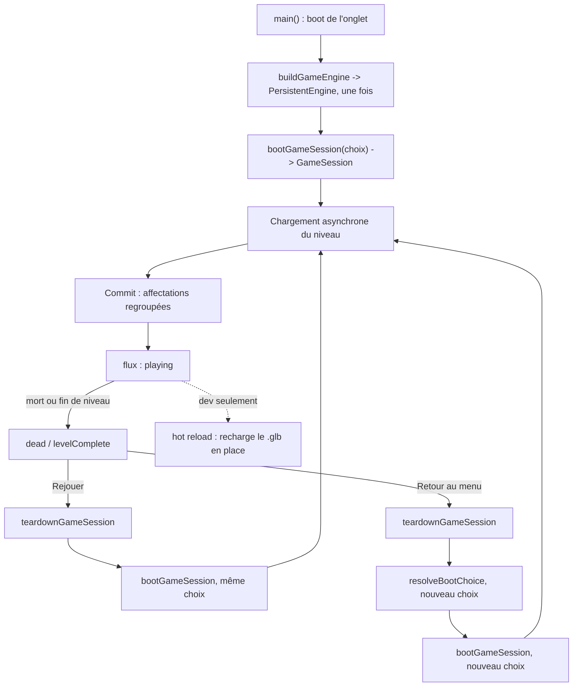

# Cycle de vie

## Rôle

Séparer ce qui se construit **une seule fois pour tout l'onglet**
(`PersistentEngine`) de ce qui se reconstruit **à chaque partie**
(`GameSession`), et border le seul point vraiment asynchrone du jeu — le
chargement d'un niveau — pour qu'une partie abandonnée en cours de
chargement (rejouer, retour au menu, changement de niveau depuis la
console) ne puisse jamais écrire dans la partie qui l'a remplacée. C'est ce
découpage qui rend « Rejouer »/« Retour au menu » instantanés et sans fuite,
sans jamais recharger la page ([ADR 0019](../decisions/0019-machine-xstate-flux-ecran.md)).

## Diagramme

Du tout premier boot à un reset, et la place du hot reload à côté.

## Qui vit combien de temps

| Objet | Construit par | Détruit par | Durée de vie |
|---|---|---|---|
| `PersistentEngine` (scène, caméra, renderer, horloge, `FxSystem`, viewmodel, atlas d'ennemis, `InteractionSystem`) | `buildGameEngine` (`src/game/session/gameEngine.ts`), une fois dans `main()` | Jamais explicitement — meurt avec l'onglet | Onglet |
| `GameFlowActor` (`gameFlowMachine`) | `createGameFlowActor` (`src/main.ts`), une fois | Jamais — un seul acteur pour tout l'onglet | Onglet |
| `GameSession` (monde Rapier, joueur, armes, managers d'ennemis, systèmes de niveau, score) | `bootGameSession` (`src/game/session/lifecycle.ts`) | `teardownGameSession` | Partie |
| `LevelSession` (niveau `.glb` courant, sondage de hot reload) | `createLevelSession`, appelée par `loadGltfLevel` à chaque `bootGameSession` sur le chemin glTF | `.stop()`, appelée par `teardownGameSession` et par tout remplacement explicite (console, `?level=`) | Partie (recréée à chaque partie, pas seulement rechargée) |
| `LevelHandle` (géométrie, colliders, spawns d'un `.glb` précis) | `loadLevel` (`src/game/level/loader.ts`), à l'intérieur d'une `LevelSession` | `.dispose()`, appelé par la `LevelSession` à son remplacement ou à son arrêt | Niveau chargé (survit à un hot reload raté, remplacé par le suivant à un hot reload réussi) |
| `NavGraph`, `LightPool`, `PropSystem`, `DoorSystem`, `VitreSystem`, `SanitaireSystem`, billboards d'armes au sol | Fonction `prepare` de `loadGltfLevel`, à chaque commit de niveau (premier chargement ET hot reload) | Remplacés au commit suivant ; le dernier jeu meurt avec la `GameSession` | Commit de niveau (plus court qu'une partie si le hot reload recharge plusieurs fois) |
| `cards`, `unlockedDoors`, `foundSecrets`, `playerHp`, `stats` (score) | `bootGameSession`, dans l'objet `GameSession` | `teardownGameSession` (implicitement, avec le reste de `GameSession`) | Partie — un hot reload les laisse intacts (voir plus bas) |
| Pose interpolée (joueur, ennemis, props, portes, viewmodel) | `snapshotPrevious` / `interpolateVisuals` (`src/game/loop/`) | Écrasée au pas fixe suivant | Image |

## Le chargement de niveau

Le chargement d'un `.glb` est le seul endroit du jeu qui traverse
sciemment la [frontière asynchrone](boucle-et-temps.md#la-frontière-synchrone)
plutôt que le pas fixe : `loadGltfLevel` (`src/game/session/spawning.ts`)
et `createLevelSession`/`loadLevel` (`src/game/level/hotReload.ts`,
`src/game/level/loader.ts`) tournent sur `GameRuntime.runPromise`/`runFork`,
jamais sur `runGameplaySync`. Deux évènements peuvent redemander un
chargement pendant qu'un autre est encore en vol : un hot reload déclenché
par le sondage HTTP, et un « Rejouer »/« Retour au menu » qui détruit la
session en cours. Le code empêche par construction qu'un chargement
obsolète écrive quoi que ce soit :

- **Un jeton de génération** (`session.levelLoadGeneration`, entier
  incrémenté à chaque appel de `loadGltfLevel`) capture sa valeur au moment
  de l'appel. Si elle a changé quand le `.glb` téléchargé revient
  (`generation !== session.levelLoadGeneration`), l'installation est
  abandonnée sans toucher `session` — c'est ce qui protège un changement de
  niveau déclenché deux fois de suite depuis la console.
- **Un candidat séparé de l'état affiché**, dans `createLevelSession` :
  `loadLevel` construit un `LevelHandle` entièrement neuf (`candidate`)
  pendant que `currentHandle` reste inchangé. Si `stopped` est devenu vrai
  pendant le téléchargement (la session a appelé `.stop()`), le candidat est
  aussitôt disposé sans jamais être installé.
- **Un commit en une passe synchrone** : la fonction `prepare` de
  `loadGltfLevel` construit `NavGraph`/`LightPool`/`DoorSystem`/etc. sans
  muter `session`, puis retourne une closure de commit. `createLevelSession`
  n'appelle cette closure qu'après avoir revérifié `stopped`, juste avant de
  remplacer `currentHandle` — toutes les affectations sur `session.*`
  atterrissent d'un coup, jamais partiellement.
- **Un `Semaphore` à un jeton** sérialise les tentatives de chargement de la
  même `LevelSession` (`reloadInFlight`/`reloadSemaphore` dans
  `hotReload.ts`) : deux rechargements demandés pendant qu'un premier tourne
  encore se coalescent sur la même promesse plutôt que de lancer deux
  téléchargements concurrents.

**Si on clique « Rejouer » pendant un chargement** : `teardownGameSession`
incrémente `levelLoadGeneration` puis attend `session.gltfLevelSession.stop()`,
qui attend elle-même tout chargement en vol avant de disposer le handle
courant — le candidat en cours de téléchargement, s'il finit après, se
retrouve avec une génération périmée et se jette lui-même à l'arrivée. Le
nouveau `bootGameSession` ne démarre qu'une fois ce `teardown` résolu
(`src/app/sessionFlow.ts::replay`/`returnToMenu`, tous deux `async`).

**Un échec de chargement** (`.glb` introuvable, export à moitié écrit)
retourne `{ status: "failed" }` sans jamais toucher `currentHandle` : la
session garde le niveau précédent affiché — ou l'écran de chargement, au
tout premier boot — et `waitForGameSessionReady` (`src/app/sessionFlow.ts`)
boucle sur une nouvelle tentative après un délai, sans jamais démarrer la
boucle sur une scène vide.

## Le lien avec la machine de flux d'écran

`gameFlowMachine` (`src/ui/gameFlowMachine.ts`) ne connaît que des noms
d'état (`mainMenu`, `loading`, `playing`, `paused`, `dead`,
`levelComplete`...) — jamais `PhysicsWorld` ni `GameSession`. Le VRAI reset
vit dans `src/game/session/lifecycle.ts` et `src/app/sessionFlow.ts`,
déclenché par les mêmes boutons qui envoient un évènement à l'acteur :
`replay()`/`returnToMenu()` envoient `REPLAY`/`RETURN_TO_MENU` **avant**
`teardownGameSession`, puis `BEGIN_LOAD`, puis attendent
`waitForGameSessionReady` avant d'envoyer `PLAY` — le flux ne passe à
`playing` qu'après un commit de niveau réussi, jamais avant. Le pont vers
le jeu lui-même est `GameFlowPort` (`src/game/session/flowPort.ts`), une
petite interface (`isPlaying`, `isPhysicsLive`, `playerDied`,
`levelCompleted`, `pause`, `resume`) que `main.ts` implémente par-dessus
l'acteur réel — `updateGameplay`/`stepPhysics` lisent ce port, jamais
l'acteur XState directement. Détail des écrans et de ce que voit le
joueur : `2-fonctionnel/interface.md` (page pas encore écrite, D24).

## Hot reload

Actif uniquement sous `import.meta.env.DEV` (`src/game/level/hotReload.ts`) :
la branche de sondage HTTP `HEAD` disparaît du bundle de production au
lieu d'y dormir. Un hot reload appelle le même chemin `prepare`/commit
qu'un premier chargement, mais avec `isFirstLoad: false` : `loadGltfLevel`
ne repositionne le joueur sur `spawn_player` et ne fait apparaître aucun
`spawn_suit_*`/`spawn_director_*` que sur le tout premier chargement d'une
session ([ADR 0011](../decisions/0011-hot-reload-sondage-http.md)). Ce
qu'un hot reload préserve, parce que ça vit sur `GameSession` et non sur le
`LevelHandle` remplacé : position et PV du joueur, cartes en poche
(`session.cards`), portes déjà déverrouillées (rouvertes silencieusement
après le commit), secrets déjà trouvés, score en cours. Ce qu'il remet à
l'état du fichier : PV des props/vitres/sanitaires, position des portes non
déverrouillées, pool de lampes.

## Règles

- **`PersistentEngine` ne connaît jamais `GameSession`** — c'est le type
  que reçoivent `bootGameSession` et tout ce qu'elle appelle
  (`spawnSuitAt`, `spawnDirectorAt`, `loadGltfLevel`), pour qu'ils ne
  puissent pas lire par erreur l'ancienne session en cours de remplacement
  ([ADR 0014](../decisions/0014-gameengine-persistentengine-separes.md)).
- **Aucune fonction de spawn ne lit `engine.session`** : `session` leur est
  toujours passé en paramètre explicite, précisément pour qu'un spawn en
  cours de construction ne puisse jamais atterrir dans l'ancienne partie.
- **Un commit de niveau est une seule affectation groupée**, jamais une
  suite de mutations étalées : soit le niveau candidat devient la vérité
  d'un coup, soit il ne devient jamais rien.
- **`stepPhysics` ne s'exécute que si `isPhysicsSessionLive(engine)`**,
  une garde distincte de `flow.isPlaying()` : le monde Rapier peut être en
  cours de reconstruction (`loading`, `loadFailed`) sans que le flux soit
  sur `playing`, et inversement il reste vivant pendant `dead`/
  `levelComplete` ([ADR 0013](../decisions/0013-garde-flux-vs-monde-physique.md)).
- **Le chargement de niveau ne passe jamais par `runGameplaySync`** :
  `loadGltfLevel`/`createLevelSession`/`loadLevel` restent sur
  `GameRuntime.runPromise`/`runFork`, jamais appelés depuis
  `updateGameplay` (invariant #11).

## Pièges

- **Une fonction de spawn qui lirait `engine.session`** au lieu de recevoir
  `session` en paramètre pousserait silencieusement une entité dans la
  partie en cours de remplacement — aucune exception, l'entité semble juste
  ne jamais apparaître. Même risque pour un commit de niveau qui affecterait
  `session.*` progressivement au lieu d'une closure unique : une fenêtre où
  un `teardownGameSession` concurrent verrait un mélange d'ancien et de
  nouveau niveau.
- **`teardownGameSession` doit incrémenter `levelLoadGeneration` avant
  d'attendre `gltfLevelSession.stop()`** — dans l'autre ordre, un
  chargement qui termine pendant l'attente croirait sa génération valide.
- **`isPhysicsSessionLive` et `flow.isPlaying()` ne sont pas
  interchangeables** : les confondre fige le rendu pendant `dead`/
  `levelComplete` (qui doivent rester visuellement vivants, invariant #1),
  ou déclenche un appel physique sur un monde déjà libéré pendant la fenêtre
  `returnToMenu()`.

## Invariants concernés

- [Invariant #1](invariants.md) — pas fixe 1/60 : le monde physique reste
  vivant et le pas fixe continue de tourner pendant `dead`/`levelComplete`,
  seul le contenu du gameplay s'arrête.
- [Invariant #7](invariants.md) — gravité −25 m/s² : la position transitoire
  du joueur (0, 2, 0) sur le chemin glTF avant le commit du niveau s'appuie
  sur cette chute pour rester sans conséquence.
- [Invariant #11](invariants.md) — frontière Effect synchrone stricte : le
  chargement de niveau et le hot reload restent hors de `runGameplaySync`,
  jamais appelés depuis `updateGameplay`.

## Décisions

- [ADR 0011 — Hot reload de niveau par sondage HTTP HEAD](../decisions/0011-hot-reload-sondage-http.md)
- [ADR 0013 — Deux gardes distinctes, état de flux vs existence du monde physique](../decisions/0013-garde-flux-vs-monde-physique.md)
- [ADR 0014 — GameEngine et PersistentEngine séparés](../decisions/0014-gameengine-persistentengine-separes.md)
- [ADR 0019 — Machine XState de flux d'écran plutôt que rechargement de page](../decisions/0019-machine-xstate-flux-ecran.md)
