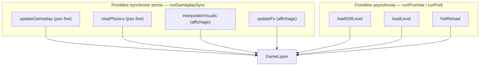
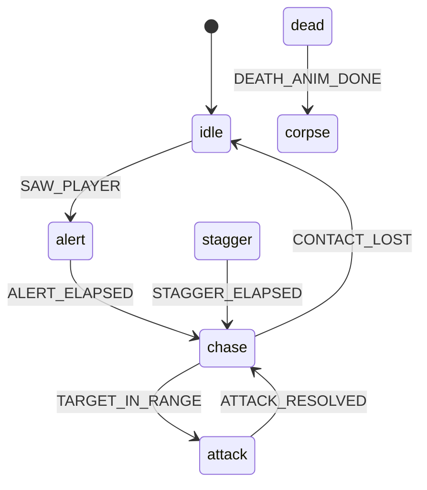

# Effect et XState

## Rôle

Deux bibliothèques, deux problèmes distincts. **Effect** encadre ce qui
n'est pas un pur calcul — Rapier, RNG, rendu — derrière des services typés
et une gestion d'erreur explicite, sans laisser une opération asynchrone se
glisser dans le pas fixe. **XState** rend explicite un comportement qu'un
empilement de booléens rendrait illisible : la table de transition d'un
ennemi, le flux d'écran. Ni l'une ni l'autre ne remplace le
[pas fixe](boucle-et-temps.md) : Effect fournit sa frontière d'exécution,
XState décrit des états que ce pas fixe fait avancer.

Pour aller plus loin : [effect.website/docs](https://effect.website/docs) et
surtout `node_modules/effect/AGENTS.md` (entier, avant tout nouveau code
Effect — `CLAUDE.md` l'impose) ; [stately.ai/docs/xstate](https://stately.ai/docs/xstate) pour XState.

## Effect et XState, en 5 lignes chacun

**Effect** : un `Effect.Effect<A, E, R>` décrit un calcul qui, exécuté,
produit `A` ou une erreur typée `E`, et a besoin des services `R` pour
tourner. Un service se déclare avec `Context.Service`, se fournit par une
`Layer`, se consomme avec `.use(fn)`/`.useSync(fn)`. `Effect.gen` enchaîne
des étapes façon `async`/`await` sans qu'aucune étape ne soit réellement
asynchrone ; un calcul pur reste une fonction TypeScript ordinaire.

**XState** : une machine (`setup({...}).createMachine({...})`) décrit des
états nommés et, pour chacun, les évènements qu'il accepte et l'état suivant
qu'ils déclenchent — un évènement non listé dans l'état courant est ignoré.
`context` porte les données hors du nom d'état. Un `actor` fait vivre une
instance ; `send(event)` la transitionne, `subscribe(fn)` observe ses
changements. Ni `@xstate/react` ni les transitions retardées `after` ici —
voir plus bas.

## Carte des services Effect

Mesurée par `grep -rn "extends Context.Service" src/` — quatre services,
tous assemblés dans `GameLayer` (`src/app/runtime/gameRuntime.ts`) :

| Service | Fichier | Rôle | Consommé par |
|---|---|---|---|
| `DeterministicRandom` | `src/core/effect/random.ts` | Fabrique de générateurs `mulberry32` indépendants (`forSeed`) | `enemyMachine.ts`, `weapons.ts`, `props.ts`, `lifecycle.ts` |
| `RaycastService` | `src/physics/raycast.ts` | Enveloppe Effect de `castRay`/`castRayAndGetNormal`/`castShape` (pas de `THREE.Raycaster`) | `weapons.ts`, `enemyPerception.ts`, `enemyCombat.ts`, `enemyNavigation.ts`, `navBake.ts`, `trainSafety.ts`, `surfaceProbe.ts`, `sanitaires.ts`, `spawning.ts` |
| `PathfindingService` | `src/game/level/navigation/pathfinding.ts` | Bake et requête du graphe de navigation 2.5D | `enemyNavigation.ts`, `navBake.ts`, `spawning.ts`, `lifecycle.ts` |
| `RenderService` | `src/render/pipeline/renderService.ts` | Enveloppe Effect de l'appel de rendu Three.js | `main.ts`, `spawning.ts`, `doucheShader.ts`, `warmTrainModel.ts` |

Chacun est fourni par sa propre `Layer`, assemblées par `GameLayer =
Layer.mergeAll(...)` (`src/app/runtime/gameRuntime.ts`) — racine de composition
**unique**, jamais une `Layer` ad hoc ailleurs ; `GameRuntime =
ManagedRuntime.make(GameLayer)` est construit une fois pour tout l'onglet.
`src/core/effect/runtime.ts::createGameplayRunner` construit le garde-fou générique
à partir du runtime reçu. Ce module ne connaît aucun service du jeu.
`src/app/runtime/gameRuntime.ts` compose les quatre services, crée l'unique runtime
et lie `runGameplaySync` à celui-ci. Les consommateurs importent cette
instance ; ce module ne charge aucun écran ni module React.

Le chargement de niveau (`src/game/level/loading/loader.ts`) est l'exception
délibérée : des `Effect.gen` plats, sans `Context.Service` dédié, à la
frontière asynchrone (ci-dessous) — l'indirection n'y apporterait rien.

## Deux modes d'exécution

`runGameplaySync` (`src/app/runtime/gameRuntime.ts`) exécute un `Effect` via
`GameRuntime.runSync` et est la **seule** porte d'entrée synchrone — jamais
`GameRuntime.runSync`/`Effect.runSync` directement ailleurs. Seul point de
passage autorisé pour le pas fixe **et** le rendu/l'interpolation, qui
réutilise le même garde-fou. Interdit dans cet arbre :
`Effect.tryPromise`/`promise`/`async`/`sleep` — une suspension y lève un
`Cause.AsyncFiberError`, intercepté juste assez pour logger un message
explicite avant de le relaisser remonter (détail de l'ordre d'une image :
[Boucle et temps](boucle-et-temps.md#lordre-exact-dune-image-lu-dans-le-code)).

Le chargement de niveau et le hot-reload restent hors de cette frontière,
sur `GameRuntime.runPromise`/`runFork` (`spawning.ts::loadGltfLevel`,
`hotReload.ts::createLevelSession`) : jamais appelés depuis `updateGameplay`
([Cycle de vie](cycle-de-vie.md#le-chargement-de-niveau)). Exception non
négociable : la rotation caméra reste un accès brut, direct, sans service
Effect ([invariant #3](invariants.md)).

## Erreurs typées

`src/game/level/loading/levelDiagnostics.ts` déclare une vingtaine d'erreurs
`Schema.TaggedError` (`MissingSpawnPlayerError`, `NonBoxTriggerError`,
`UnknownSanitaireKindWarning`…). Patron dominant, répété à chaque site
d'échec — le **fail immédiatement rattrapé** : `Effect.fail(new
XWarning(...)).pipe(Effect.catch((error) => Effect.sync(() =>
console.error(formatX(error)))))`. Contrat interne qui ne remonte jamais à
l'appelant : journalisé, le chargement continue avec une valeur de repli
propre à chaque classe (collider ignoré, propriété à `null`, défaut
appliqué). Seule `LevelFetchError` (échec réseau/parsing du `.glb`) n'est
jamais rattrapée ici : elle remonte à `hotReload.ts`, capturée en
`{ status: "failed", error }`, puis traduite par `waitForGameSessionReady`
(`src/app/navigation/sessionFlow.ts`) en évènement `LOAD_FAILED` pour
`gameFlowMachine`, qui bascule l'écran sur `loadFailed` (`RETRY_LOAD`) — la
seule erreur de chargement qui atteint réellement le joueur.

## Les machines XState

Mesurées par `grep -rln "createMachine\|setup(" src/` : deux, pas une de plus.

### `enemyMachine` — Costard et Directeur

Machine **partagée** entre les deux ennemis (`src/game/entities/shared/enemyMachine.ts`,
[ADR 0009](../decisions/0009-machine-partagee-suit-director.md)) : tout ce qui
est indépendant du gabarit visuel/Rapier de l'entité vit ici (transitions,
perception, évitement, suivi de chemin, knockback) ; `suit.ts`/`director.ts`
ne gardent que le corps Rapier, la config, l'acteur. Sept états :

Non représenté pour la lisibilité (5 états × 2 évènements) : depuis
n'importe quel état vivant, `HIT_NONFATAL` mène à `stagger` et `HIT_FATAL` à
`dead`. `attack` correspond à l'état interne `"aim"` (visée puis tir) ;
`Suit.update`/`Director.update` avancent chacun leur acteur via la
perception (`RaycastService`) et le suivi de chemin (`PathfindingService`).

**Choix de code « pas de temps mural » (ex-invariant #13, retiré le
2026-09-25 — voir [Invariants retirés](invariants.md#invariants-retirés)),
telle qu'appliquée** :
`CLAUDE.md` décrit un évènement `TICK` envoyé par pas fixe — ce n'est pas ce
que fait le code. `tickEnemy(actor,
dt, ctx)` est un **appel de fonction direct** depuis `Suit.update`/
`Director.update`, pas un `send({ type: "TICK" })` : aucun évènement `TICK`
n'existe dans le dépôt. Il MUTE `ctx.stateTimer`/`ctx.attackCooldownRemaining`/
`ctx.animClock` avec le vrai `gameplayDt` (hitstop inclus), puis envoie les
évènements nommés ci-dessus une fois les seuils franchis — jamais un
`after`, sinon le hitstop ralentirait le joueur sans ralentir les ennemis.
Détail : [Boucle et temps](boucle-et-temps.md#hitstop).

### `gameFlowMachine` — flux d'écran

Graphe d'état **pur** (`src/app/navigation/gameFlowMachine.ts`,
[ADR 0019](../decisions/0019-machine-xstate-flux-ecran.md)) : ne connaît ni
`PhysicsWorld`, ni `scene`, ni `bootGameSession`. Douze états (`boot`,
`mainMenu`, `options`, `levelSelect`, `loading`, `loadFailed`, `intro`, `playing`,
`paused`, `dead`, `outro`, `levelComplete`), transitions sur évènement discret,
jamais de minuterie — la règle « pas de temps mural » (ex-invariant #13) y
est vacuously vraie. Un acteur unique
pour tout l'onglet reçoit ses évènements de `sessionFlow.ts`/`main.ts`
(boutons, pointer lock perdu → `PAUSE`, sortie franchie →
`LEVEL_COMPLETED`) ; diagramme des transitions réelles :
[Cycle de vie](cycle-de-vie.md#diagramme). Pont vers le pas fixe :
`GameFlowPort` (`src/game/session/flowPort.ts`), plus étroit — le pas fixe
ne lit jamais l'acteur directement.

## Le RNG

`DeterministicRandom` (ci-dessus) : `forSeed(seed)` retourne un générateur
`mulberry32` indépendant, jamais un flux partagé. Pour un générateur
construit une seule fois : `runGameplaySync(DeterministicRandom.useSync(
(random) => random.forSeed(SEED)))` — `useSync` car `forSeed` retourne une
valeur brute, pas un `Effect`. Jamais `Math.random()` ni le service `Random`
d'Effect ([invariant #12](invariants.md)). La présentation a son propre
flux, isolé de la simulation : [Simulation et présentation](simulation-et-presentation.md#le-rng-de-présentation).

## Recettes rapides et pièges

- **Ajouter un service** : `class MonService extends Context.Service<MonService, Shape>()("cassandre/...")`, un `static readonly layer`, l'ajouter à `Layer.mergeAll(...)` dans `GameLayer` — jamais une `Layer` ad hoc ailleurs (service invisible, risque de double instanciation).
- **L'appeler depuis le pas fixe** : `runGameplaySync(MonService.use((s) => s.methode(...)))` (`.useSync` pour une valeur brute) — jamais `GameRuntime.runSync` direct, qui perd le garde-fou.
- **Ajouter un état à `enemyMachine`** : un bloc `on: { ÉVÈNEMENT: { target, actions } }`, une action qui MUTE `context` en place (jamais `assign(...)`, qui réallouerait `context` à chaque transition), et si l'état a une durée, un test sur `context.stateTimer` dans `tickEnemy` — jamais un `after`.
- **`@xstate/react`, ou chercher un évènement `TICK`** : interdit (pont React = zustand, skill `react-hud-bridge`) ; c'est `tickEnemy`, un appel de fonction, voir plus haut.

## Invariants concernés

- [Invariant #3](invariants.md) — rotation caméra jamais interpolée : seule lecture qui contourne tout service Effect.
- [Invariant #11](invariants.md) — frontière Effect synchrone stricte : sujet central de cette page.
- [Invariant #12](invariants.md) — RNG déterministe uniquement : `DeterministicRandom` seul générateur autorisé.
- Choix de code (ex-invariant #13, retiré le 2026-09-25) : `stateTimer` avancé par `tickEnemy`, jamais un `after` — voir [Invariants retirés](invariants.md#invariants-retirés).

## Décisions

- [ADR 0007 — RNG déterministe unique](../decisions/0007-rng-deterministe.md)
- [ADR 0009 — Machine XState partagée entre Costard et Directeur](../decisions/0009-machine-partagee-suit-director.md)
- [ADR 0019 — Machine XState de flux d'écran plutôt que rechargement de page](../decisions/0019-machine-xstate-flux-ecran.md)
- [ADR 0033 — RNG de présentation séparé et portée du rejeu F9/F10](../decisions/0033-rng-presentation-et-portee-du-rejeu.md)
- `docs/journal/plan-effect-xstate-2026-09.md` (racine du dépôt) — plan du chantier M0-M9 qui a introduit ces deux bibliothèques ; historique, ira au journal.
