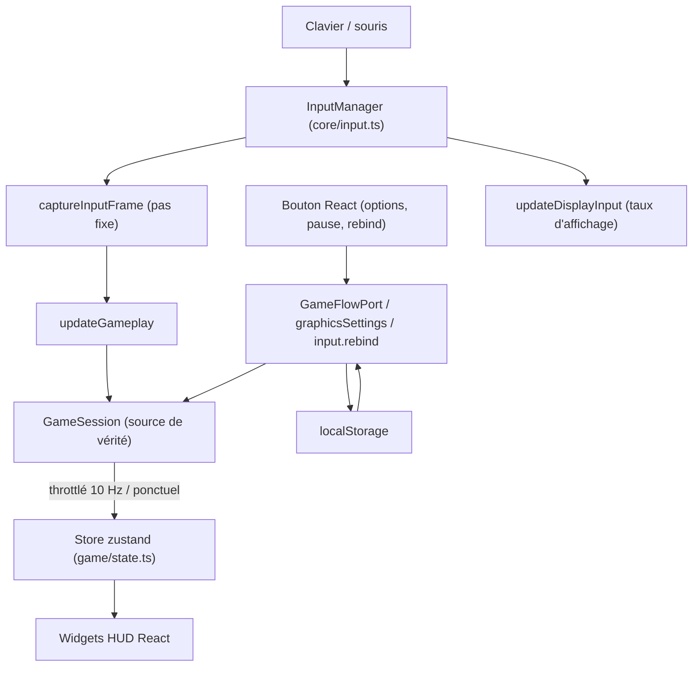

# Flux de données

## Rôle

Faire vivre deux mondes qui ne doivent jamais se toucher directement : la
simulation (pas fixe, source de vérité dans `GameSession`) et l'interface
React (`src/ui/`). Le pont entre les deux est le store zustand
(`src/game/state.ts`), une **feuille de dépendances**
([ADR 0020](../decisions/0020-state-feuille-de-dependances.md)) — tout le
reste du jeu peut l'importer, lui n'importe rien du jeu. Dans le sens
inverse (un bouton React qui doit agir sur le moteur), le pont est un petit
nombre de modules nommés (`GameFlowPort`, `graphicsSettings.ts`,
`input.ts`) qui persistent et pilotent, jamais un composant qui muterait
l'état du jeu lui-même. Cette page suit le chemin complet, clavier/souris
compris, et où `localStorage` intervient.

## Diagramme

Le chemin dans les deux sens, du geste physique à l'écran et retour.

## De la touche au pas fixe

`InputManager` (`src/core/input.ts`) capture au niveau DOM (`keydown`/
`keyup`/`mousemove`/boutons souris) et maintient deux vues d'un même appui :
un Set de fronts en attente d'un pas fixe (`consumeActionJustPressed`,
lecture destructive, un appui = une action) et un Set de fronts de la frame
d'affichage courante (`wasActionJustPressed`, lecture non destructive,
plusieurs lecteurs). La couche par ACTION (`GameAction`, `DEFAULT_BINDINGS`)
traduit un nom d'action rebindable vers un code physique
(`KeyboardEvent.code`) ; `captureInputFrame`
(`src/game/loop/updateGameplay.ts`) lit exclusivement par action, jamais par
code brut, et construit l'`InputFrame` consommé par `session.player.update`.
La rotation caméra suit un chemin séparé et plus court, volontairement hors
du pas fixe : `updateDisplayInput`
(`src/game/loop/updateDisplayInput.ts`) lit `input.consumeMouseDelta()` au
taux d'affichage et écrit `engine.look` directement — l'invariant #3 veut
que la visée ne subisse aucune latence d'interpolation.
`src/core/inputRecorder.ts` s'intercale entre les deux : en enregistrement il
copie chaque `InputFrame` réellement consommé, en lecture il le remplace —
`updateDisplayInput` se tait alors, pour ne pas ajouter un mouvement de
souris à une séquence rejouée.

## Du pas fixe au store, et au HUD

`GameSession` reste la seule source de vérité ; le store n'en est qu'un
miroir écrit à deux rythmes distincts, jamais lu par le pas fixe :

- **Throttlé à 10 Hz** (invariant #2) : le panneau de debug (`DebugState`)
  dans `updateFx` (affichage), qui pousse `fps`/position/compteurs de perf en
  un seul `setDebug(partial)`.
- **Ponctuel**, à l'évènement, jamais par frame : `setPlayerHp` (dégât),
  `incrementSecretsFound` (secret trouvé), `setCards` (ramassage),
  `incrementViews` (kill), `showHudMessage`/`showHeroLine` (message
  système/réplique), `setRecap` (fin de partie) — tous appelés depuis
  `game/session/*.ts` ou `updateFx`, jamais depuis `updateGameplay`
  directement pour du texte ([Simulation et
  présentation](simulation-et-presentation.md#le-hud)). `setFlowState` fait
  exception : il recopie l'état de `gameFlowMachine` à chaque transition
  (`flowActor.subscribe(...)` dans `main.ts`), un évènement discret, jamais
  un flux à 60 Hz.

Chaque widget du HUD lit son propre sélecteur, jamais l'objet `debug`
entier — la règle qui évite qu'un widget se re-rende sur un champ qui ne le
concerne pas :

| Champ du store | Écrit par | Fréquence | Lu par |
|---|---|---|---|
| `debug.fps`, `debug.position`, `debug.gameplayMs`… | `updateFx.ts` (`setDebug`) | 10 Hz max | `DebugPanel` (dev), `FpsCounter` (prod, `debug.fps` seul) |
| `debug.playerHp`/`playerMaxHp` | `game/session/feedback.ts::applyPlayerDamage` (`setPlayerHp`) | ponctuel, au dégât | `HealthPanel` |
| `debug.shotgunAmmo`/`pistolAmmo`/`activeWeapon` | `updateFx.ts` (`setDebug`, dans le même lot 10 Hz) | 10 Hz max | `AmmoPanel` |
| `debug.secretsFound`/`secretsTotal` | `game/session/*.ts` (`incrementSecretsFound`/`setSecretsTotal`) | ponctuel | `DebugPanel` (aucun widget de prod dédié) |
| `debug.cards` | `game/session/cards.ts::grantCard` (`setCards`) | ponctuel, au ramassage | `LoyaltyCards` |
| `debug.views` | `game/session/feedback.ts::grantKillViews` (`incrementViews`) | ponctuel, au kill | `ViewerCount` |
| `hudMessage` | `game/session/feedback.ts::showHudMessage`, `game/session/doors.ts`/`cards.ts`/`sanitaires.ts` | ponctuel | `HudMessage` |
| `heroLine` | `game/session/feedback.ts::triggerHeroLine` | ponctuel, cooldown 15 s côté appelant | `HeroLine` |
| `flowState` | `main.ts` (`flowActor.subscribe`) | à chaque transition d'écran | `PauseScreen`, `DeathScreen`, `LevelCompleteScreen`, `Hud` |
| `recap` | `game/session/score.ts::publishLevelRecap` (`setRecap`) | ponctuel, mort ou fin de niveau | `RecapTable` |

Mesuré par `grep -rn "useGameStore(" src/ui` (un sélecteur par ligne
ci-dessus) et `grep -rn "\.setDebug\|setPlayerHp\|incrementSecretsFound\|setCards\|incrementViews\|showHudMessage\|showHeroLine\|setFlowState\|setRecap" src/game`.

## Sens UI → moteur

Un bouton React n'écrit jamais dans `GameSession` ni dans `moveConfig`/
`weaponConfig` lui-même. Trois portes, selon ce qui est piloté :

- **Le flux d'écran** (Rejouer, Retour au menu, Reprendre) : le composant
  reçoit un callback en prop (`onReplay`, `onReturnToMenu`, `onResume`),
  construit par `src/app/sessionFlow.ts::createSessionFlow` et fermé sur
  `flowActor`/`engine` — un clic envoie un évènement XState
  (`actor.send({ type: "REPLAY" })`…), jamais un accès direct à `GameSession`.
  Côté pas fixe, le sens inverse (mort, fin de niveau, pause perdue) passe
  par `GameFlowPort` (`src/game/session/flowPort.ts`), une interface étroite
  que `updateGameplay` interroge sans savoir que XState existe.
- **Les réglages graphiques** (Options › Affichage : filtrage, résolution,
  FOV, screenshake) : `DisplayTab` appelle `setGraphicsSettings(partial)`
  (`src/game/graphicsSettings.ts`), qui persiste puis applique — FOV et
  screenshake en mutant `moveConfig`/`weaponConfig` (lus en continu par le
  jeu, effet immédiat), filtrage et résolution via
  `applyRenderSettings(scene, camera, renderer)` SI `registerRenderTarget` a
  déjà enregistré une cible (sinon la valeur reste persistée pour le
  prochain boot).
- **Les touches** (Options › Contrôles) : `ControlsTab` appelle
  `input.rebind(action, code)`/`input.resetBindings()` directement sur le
  singleton `InputManager` — pas d'intermédiaire, `InputManager` persiste et
  applique lui-même.

Dans les trois cas, le module qui écrit vraiment (`sessionFlow.ts`,
`graphicsSettings.ts`, `input.ts`) vit **hors de `src/ui/`** : la règle de
`CLAUDE.md` (« un module qui persiste ou pilote le moteur ne vit pas dans
`src/ui/` ») tient — vérifiée par `grep -rn "localStorage" src/ui` (aucune
occurrence) et par les imports de chaque écran cité, qui n'importent que des
fonctions déjà exportées de ces trois modules.

## Persistance

| Clé `localStorage` | Fichier | Contenu | Lu | Écrit |
|---|---|---|---|---|
| `cassandre.keybinds` | `src/core/input.ts` | Bindings action → code (`Record<GameAction, string>`) | Au chargement du module (initialiseur de champ de `InputManager`, avant `attach()`) | À chaque `rebind()`/`resetBindings()` |
| `cassandre.graphics` | `src/game/graphicsSettings.ts` | `{ filtrage, resolution, fovBase, shakeIntensity }` | `initGraphicsSettingsAtBoot()`, tout en haut de `main()` | À chaque `setGraphicsSettings(partial)` |
| `cassandre.musicEnabled` | `src/core/music.ts` | `"true"`/`"false"` (musique de thème coupée ou non — jamais les ambiances) | `initMusic()` au boot | À chaque bascule (touche M, Options › Audio) |
| `cassandre.audio` | `src/game/audioSettings.ts` | `{ general, musique, effets, voix, ambiances, sousTitres, muetEnArrierePlan }` | `initAudioSettingsAtBoot()`, en haut de `main()`, avant la création des sons | À chaque `setAudioSettings(partial)` |

Les quatre modules partagent la même discipline : jamais de `throw`, un
`localStorage` absent (mode privé strict), corrompu ou indisponible
dégrade silencieusement vers les valeurs par défaut, qui restent la table
`DEFAULT_BINDINGS`/`FACTORY_DEFAULTS`/`true`.

## Ce qui est interdit

- **`setState` par frame** — invariant #2 ; les widgets de debug passent par
  le throttle 10 Hz d'`updateFx`, jamais un appel direct depuis le pas fixe.
- **React lit l'état moteur directement** (`GameSession`, `moveConfig`, le
  monde Rapier) : toujours par le store ou par un callback construit hors de
  `src/ui/` — un widget qui importerait `game/session/gameSession.ts` casse
  la feuille de dépendances de l'ADR 0020 et rendrait le HUD inutilisable
  sans partie en cours (`ui/dev/devPreview`).
- **`src/ui/` qui persiste ou pilote le moteur** — la règle citée plus haut ;
  un écran qui appellerait `localStorage` ou muterait `moveConfig` lui-même
  romprait la frontière que ce document décrit.
- **Le pas fixe qui lit `flowState`** — `updateGameplay` interroge
  `engine.flow.isPlaying()` (`GameFlowPort`, déjà synchrone), jamais un
  aller-retour par le store : `state.flowState` n'existe que pour React.

## Invariants concernés

- [Invariant #2](invariants.md) — React ne touche jamais la boucle : throttle
  10 Hz du store, aucun `setState` par frame.
- [Invariant #3](invariants.md) — rotation caméra non interpolée : lue au
  taux d'affichage par `updateDisplayInput`, hors du pas fixe.
- [Invariant #11](invariants.md) — frontière Effect synchrone stricte : le
  pas fixe qui produit les données du store passe par `runGameplaySync`,
  React n'y entre jamais.

## Décisions

- [ADR 0003 — React en overlay DOM, jamais dans la boucle](../decisions/0003-react-hors-boucle.md)
- [ADR 0019 — Machine XState de flux d'écran plutôt que rechargement de page](../decisions/0019-machine-xstate-flux-ecran.md)
- [ADR 0020 — `game/state.ts` comme feuille de dépendances](../decisions/0020-state-feuille-de-dependances.md)
