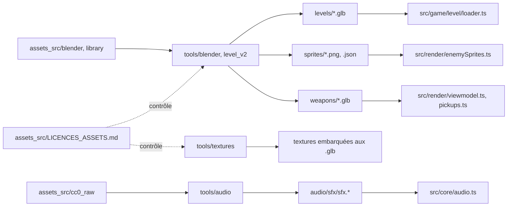

# Pipelines de contenu

## Rôle

Le moteur ne fabrique jamais son propre contenu : niveau, textures, sprites,
armes et son sont produits **hors ligne** par des outils Python/Blender, puis
déposés dans `public/assets/` sous forme de fichiers statiques que le runtime
charge. Ce découpage isole tout ce qui est lourd, non déterministe à la
milliseconde près ou dépendant d'une interface (Blender, un solveur IK, un
encodeur audio) hors de la boucle à pas fixe — voir
[Vue d'ensemble](vue-d-ensemble.md), dont cette page détaille le premier bloc.
Chaque pipeline suit la même forme : une source versionnée, un ou plusieurs
scripts, une sortie servie, un fichier TypeScript qui la consomme, un contrôle
qui empêche une sortie invalide de se charger en silence.

## Diagramme

Six pipelines convergent vers `public/assets/`, que le moteur seul lit.

## 1. Niveau

**Sources** : `assets_src/blender/` (kit modulaire, blockout, niveaux, jamais
servi en runtime) et `assets_src/library/` (bibliothèque d'assets v2).

| Script | Rôle |
|---|---|
| `tools/blender/build_kit.py` | génère le kit modulaire depuis `kit_spec.py` |
| `tools/blender/lib_*.py` | bibliothèque d'assets v2 par catégorie d'espace (`lib_rayons`, `lib_facade`, `lib_electro`, `lib_reserve`, `lib_bureaux`, `lib_helpers`) |
| `tools/level_v2/plan_de_masse.py` | source de vérité des cotes (rectangles, ouvertures, spawns) |
| `tools/level_v2/build_blockout.py` | blockout gris à partir du plan de masse |
| `tools/level_v2/build_niveau.py` + `tools/level_v2/espaces/` | niveau habillé : le registre et `main()`, puis un module par espace ; réutilise `build_blockout` pour la coque |
| `tools/blender/bake_vertex_lighting.py` | bake d'éclairage indirect en vertex colors |
| `tools/blender/validate_level.py` | vérifie le CONTRAT (noms, grille, budgets) |
| `tools/level_v2/audit_niveau.py` | vérifie ce qui ne se voit qu'en jouant |
| `tools/blender/export_level.py` | exporte en `.glb`, seul chemin qui garde le fichier propre |

**Sortie** : `public/assets/levels/*.glb` (`niveau_v2.glb` est le niveau
courant, les autres restent pour test ciblé — registre dans
`src/game/level/levels.ts`).

**Consommateur** : `src/game/level/loader.ts` (colliders, portes, vitres,
sanitaires, props, cartes de fidélité — fusion du décor par
`mergeStaticDecor.ts`).

**Régénérer / contrôler** : chaîne complète (kit → bake → validate → export)
dans `tools/blender/README.md`. `validate_level.py --strict` vérifie le
contrat (0 erreur, warnings connus documentés au cas par cas),
`audit_niveau.py` ce qui ne se voit qu'en jouant (trous, interpénétrations,
objets flottants), et `export_level.py` recharge le fichier qu'il vient
d'écrire pour refuser tout nœud hors du view layer ou issu de `_KIT`/`_LIB`.

**Régénérable vs édité à la main** : tout `.blend` produit par un
`build_*.py` est un artefact reproductible, jamais retouché directement — une
modification passe par `kit_spec.py`/`level_spec.py`/`plan_de_masse.py`, puis
un rebuild. Le préfixe glTF décide de l'effet à l'import (`col_*`,
`spawn_player`, `door_*`, `use_*`, `prop_*`, `vitre_*`, `sanitaire_*`…) :
tableau complet dans
[Conventions de nommage](../6-reference/conventions-nommage.md).

**Session Blender live vs headless** (`CLAUDE.md`) : les scripts tournent
normalement en ligne de commande (`blender -b …`), sans interface. Pour une
passe de level design, le travail se fait dans une session Blender
**ouverte** pilotée par le MCP (regarder à hauteur d'œil, corriger, relancer
`build_niveau.py` dans cette même session) plutôt qu'en reconstruisant à
l'aveugle. Le `.blend` reste régénérable dans les deux cas ; seule la boucle
de vérification change.

## 2. Textures

**Outils** : `tools/textures/build_palette.py` calcule la palette commune
(k-means) dans `assets_src/textures/`, `make_textures.py` réduit les sources
CC0 à 128×128 (64 px/m) et les quantifie dessus. Les autres scripts
(`generate_trims.py`, `generate_labels.py`, `generate_banners.py`,
`generate_facade.py`, `generate_kiosque.py`, `generate_portes.py`,
`generate_surgeles.py`, `generate_ecrans.py`, `generate_affiches.py`,
`generate_ciel.py`, `make_kenney_atlas.py`) produisent chacun un atlas dédié.

**Sortie** : pas de dossier `public/assets/textures/` séparé — embarquées
dans les `.blend`/`.glb` du niveau au bake/export, sauf la skybox
(`public/assets/sky/nuit/*.png`, six faces).

**Consommateur** : chargées comme toute texture du `.glb` par `loader.ts`
(`configureRetroTexture` force `NearestFilter`), la skybox par
`src/render/ciel.ts`. **Contrôle** : `validate_level.py` plafonne la taille
des textures et vérifie la présence des vertex colors.

## 3. Sprites ennemis

**Outil** : `tools/blender/render_enemy_sprites.py`, rendu depuis le modèle
« Man in Suit » CC0 (Quaternius) —
[ADR 0028](../decisions/0028-sprites-ennemis-pre-rendus.md).

**Sortie** : `public/assets/sprites/costard.png`/`.json`,
`public/assets/sprites/directeur.png`/`.json` (+
`public/assets/sprites/directeur_revele.png`, peau de la révélation).

**Consommateur** : `src/render/enemySprites.ts` lit le manifeste JSON
(lignes d'atlas par animation, `pixelsPerMeter`), `BillboardSprite` choisit
la colonne (direction).

**Régénérer / contrôler** : une commande par personnage dans
`tools/blender/README.md` (`--anims`/`--directions`/`--out` pour l'itération
rapide). Contrôle par lisibilité mesurée en pixels par mètre à la distance de
jeu (~38 px de haut à 11 m), pas de validateur automatique.

## 4. Armes

**Outils** : `tools/blender/build_weapons.py` (pied-de-biche, pompe,
pistolet en vue subjective et modèle au sol, tenus par les bras « Man in
Long Sleeves » CC0 — [ADR 0029](../decisions/0029-armes-en-vue-subjective.md)),
`tools/blender/render_weapon_pickups.py` (sprites des armes au sol).

**Sortie** : `public/assets/weapons/armes.glb`,
`public/assets/sprites/weapon_pickups.png`/`.json`.

**Consommateur** : `src/render/viewmodel.ts` (meshes `vm_*`, animés autour
de leur pivot) et `src/render/pickups.ts` (objets au sol : soin, munitions,
armes).

**Régénérer / contrôler** : `tools/blender/README.md` (`build_weapons.py`,
option `--debug`). Le script imprime, pour chaque bras, la distance
épaule-cible et l'écart poignet-cible ; pas de validateur automatique.

## 5. Son

**Sources** : `tools/audio/recipes.py` (38 recettes paramétriques,
déterministes) et `assets_src/cc0_raw/` (enregistrements CC0, ignoré par
git, un contributeur par famille de sons).

**Outils** : `synth.py` (briques DSP), `enregistrements.py` (prises réelles :
licence lue au registre, décodage, découpe), `render_sfx.py` (recettes →
WAV), `analyze_sfx.py` (mesures : timbre, crête, masquage, boucle),
`build_sprite.py` (empaquette en sprite Howler, encode `.ogg`/`.m4a`),
`audition.py` (page d'écoute locale).

**Sortie** : `public/assets/audio/sfx/sfx.ogg`/`.m4a`/`.json` (sprite
unique) et quatre ambiances bouclées (`amb_*.{ogg,m4a}`).

**Consommateur** : `src/core/audio.ts`. Deux vocabulaires séparés exprès :
`SFX_TABLE` associe un identifiant du JEU (`melee_fire`, `enemy_telegraph`…)
à un nom de RECETTE (`crowbar_swing`, `suit_telegraph`…) — seul endroit à
toucher pour renommer l'un sans l'autre.

**Régénérer** : `render_sfx.py` → `analyze_sfx.py` → `build_sprite.py`,
détail dans `tools/audio/README.md`.

**Contrôles qualité** : distance de timbre (< 0,55 entre deux sons censés se
distinguer), facteur de crête, masquage spectral (la télégraphie d'un
Costard ne doit pas être couverte par le tir du joueur), boucle exacte
vérifiée après décodage `.ogg`/`.m4a`. Détail :
`docs/4-technique/studio-audio.md` (à écrire).

**Déterminisme** : même graine, même octet — y compris l'`.ogg`, dont le
numéro de série de flux (tiré au hasard par défaut) est fixé par le nom du
fichier.

## 6. Licences

**Registre** : `assets_src/LICENCES_ASSETS.md` — chaque pack tiers importé
dans `assets_src/` y a une ligne (auteur, source, licence vérifiée sur la
page, pas supposée d'après le nom), avant d'être utilisé.

**Règle** : une ligne marquée « à confirmer » ne s'utilise pas dans le jeu
tant qu'elle n'est pas confirmée. Quatre packs sont dans ce cas au moment
d'écrire cette page (`retro3d_car`, `retro3d_office`,
`pensamientoazul_supermarket`, `aquilarius_retro_textures`).

## Règles

- **Versionné vs ignoré par git** (`.gitignore`) : `assets_src/cc0_raw/`
  (packs et enregistrements CC0, retéléchargeables) et
  `public/assets/audio/sfx/*.wav` (atlas intermédiaire, régénéré par
  `build_sprite.py`) sont ignorés. Tout le reste sous `assets_src/` et
  `public/assets/` — `.blend` sources, `.glb`/`.png`/`.ogg`/`.m4a` livrés —
  est versionné : le jeu reste jouable depuis un clone propre sans relancer
  aucun pipeline.
- **Déterminisme** : même graine, même octet, pour le son comme pour le bake
  d'éclairage. Une chaîne qui ne l'est pas ne peut pas être vérifiée par
  diff.
- **Un `.glb` faux ne lève rien en jeu.** Il se charge, se joue, et le
  défaut se cherche ailleurs — d'où la vérification intégrée
  d'`export_level.py`, qui recharge le fichier qu'elle vient d'écrire au lieu
  de faire confiance à l'opérateur d'export.

## Invariants concernés

- [Invariant #4](invariants.md) — résolution interne et filtrage : les
  textures produites doivent rester compatibles `NearestFilter` à
  l'agrandissement.
- Ex-invariant [#5](invariants.md#invariants-retirés) (retiré le
  2026-09-28) : les `.glb` importés restent reconvertis en Lambert par défaut ;
  des effets ciblés peuvent recevoir un matériau TSL après le chargement.
- Ex-invariant #9 (retiré le 2026-09-25, voir
  [Invariants retirés](invariants.md#invariants-retirés)) — boîtes blanches
  jusqu'à la Phase 5 : c'était la raison d'être du blockout
  (`build_blockout.py`) avant l'habillage (`build_niveau.py`), une séquence
  aujourd'hui dépassée puisque le niveau est entièrement habillé.

## Décisions

- [ADR 0004 — Colliders cuboid plutôt que trimesh](../decisions/0004-colliders-cuboid.md)
- [ADR 0005 — Éclairage baké en vertex colors](../decisions/0005-eclairage-vertex-colors.md)
- [ADR 0021 — `export_vertex_color="ACTIVE"` plutôt que `export_colors`](../decisions/0021-export-vertex-color-enum.md)
- [ADR 0023 — Fusion du décor statique au chargement](../decisions/0023-fusion-decor-au-chargement.md)
- [ADR 0024 — Éclairage hybride](../decisions/0024-eclairage-hybride.md)
- [ADR 0028 — Sprites d'ennemis pré-rendus](../decisions/0028-sprites-ennemis-pre-rendus.md)
- [ADR 0029 — Armes en vue subjective](../decisions/0029-armes-en-vue-subjective.md)
