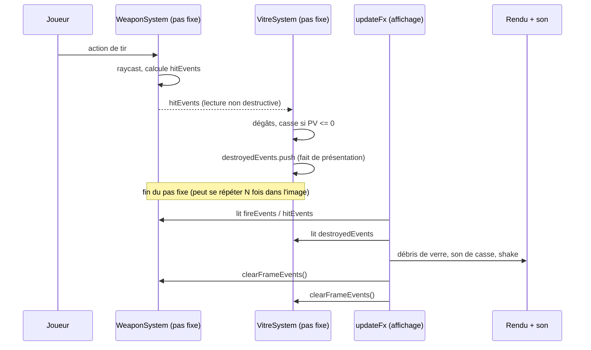

# Simulation et présentation

## Rôle

Séparer ce qui se **décide** (l'état du jeu — dégâts, mort, casse, ouverture
de porte, score) de ce qui se **dessine ou se joue** (effets, sons, decals,
débris, animations, HUD). La décision vit exclusivement dans le pas fixe ; la
présentation lit ce que le pas fixe a produit, au taux d'affichage, sans
jamais elle-même changer une règle du jeu. Cette frontière protège le rejeu
d'input : deux exécutions avec les mêmes entrées doivent prendre les mêmes
décisions, même si leurs effets visuels diffèrent.

## Diagramme

Un tir qui casse une vitre, du pas fixe jusqu'à l'écran.

## Comment l'information passe du pas fixe à l'affichage

Le canal principal est une **file d'évènements par frame** : un système du
pas fixe pousse des faits dans un tableau interne, exposé en lecture seule
(`ReadonlyArray`) ; le code d'affichage le parcourt sans le modifier, puis un
appel unique `clearFrameEvents()` le vide. Ce contrat est celui de
l'[ADR 0010](../decisions/0010-curseur-evenements-multi-pas-fixe.md) :
`clearFrameEvents()` ne se déclenche qu'à un seul endroit (dans `updateFx`,
`src/game/loop/updateFx.ts`), après tous les pas fixes de l'image et après
tous les lecteurs — jamais inféré depuis la longueur du tableau. Quand
plusieurs systèmes du pas fixe lisent la **même** file (`weapons.hitEvents`
est lu par `SuitManager`, `DirectorManager`, `PropSystem` et `VitreSystem`),
chacun garde son propre curseur (`hitCursor`) qui avance sans jamais reculer
tant que `clearFrameEvents()` n'est pas passé — sinon un rattrapage à deux
pas fixes dans la même image traiterait deux fois le même coup.

| Fait | Producteur (pas fixe) | Consommateur (affichage) | Purge |
|---|---|---|---|
| Tir déclenché | `WeaponSystem.fireEvents` (`src/game/player/weapons/weapons.ts`) | `updateFx` : muzzle flash, douille, son, pulsation du réticule, gizmos de debug | `weapons.clearFrameEvents()` |
| Impact | `WeaponSystem.hitEvents` | `updateFx` : decal (si surface fixe), particules, shake, son, hitmarker | `weapons.clearFrameEvents()` |
| Impact (relu par le gameplay) | `WeaponSystem.hitEvents` | `SuitManager`/`DirectorManager`/`PropSystem`/`VitreSystem`/`SanitaireSystem`, chacun au pas fixe suivant, avec son `hitCursor` propre | Même `weapons.clearFrameEvents()`, en aval de ces lecteurs |
| Casse d'un prop | `PropSystem.destroyedEvents` (`src/game/level/props/props.ts`) | `updateFx` : débris colorés par matière, shake, son | `propSystem.clearFrameEvents()` |
| Casse d'une vitre | `VitreSystem.destroyedEvents` (`src/game/level/interactions/vitres.ts`) | `updateFx` : débris de verre, givre éventuel, son | `vitreSystem.clearFrameEvents()` |
| Casse d'un sanitaire | `SanitaireSystem.destroyedEvents` (`src/game/level/sanitaires/sanitaires.ts`) | `updateFx` : gerbe de faïence, jet d'eau permanent, son | `sanitaireSystem.clearFrameEvents()` |
| Ouverture de porte | `DoorSystem.movementEvents` (`src/game/level/doors/doors.ts`) | `updateFx` : son de mouvement | `doorSystem.clearFrameEvents()` |
| Alerte / télégraphie / dégât / mort ennemi | `SuitManager`/`DirectorManager` (`src/game/entities/`) | `updateFx` : son, flash du sprite, gibs, hitmarker | `clearFrameEvents()` de chaque manager |
| Coup encaissé par le joueur | `SuitManager.playerHitEvents`/`DirectorManager.playerHitEvents` | `updateFx` : particules, shake ; `presentPlayerDamage` republie `session.playerHp` vers le store | Même `clearFrameEvents()` que la ligne au-dessus |

Un second canal, plus direct, sert le texte du HUD : les messages système
(`showHudMessage`) et les répliques du héros (`triggerHeroLine`,
`src/game/session/player/feedback.ts`) sont écrits dans le store zustand **depuis le
pas fixe lui-même** (`updateGameplay.ts`, `session/progression/doors.ts`,
`session/progression/cards.ts`, `session/player/sanitaires.ts`), sans passer par une file
consommée à l'affichage. Ce n'est pas une exception à la règle : ces écritures
sont ponctuelles (un ramassage, une porte, un secret), jamais une par frame,
donc sans risque pour l'invariant #2. Leur disparition, elle, est bien de la
présentation : un `setTimeout` mural dans `feedback.ts` remet le champ à
`null` après un délai fixe (1,8 s pour un message, 4 s pour une réplique) —
un temps d'affichage n'a pas besoin d'être déterministe, contrairement à un
temps de jeu, qui reste dans `context.stateTimer` avancé par pas fixe (choix
de code, ex-invariant #13 — voir [Invariants retirés](invariants.md#invariants-retirés)).

## Le RNG de présentation

`FxSystem`, l'audio et l'ambiance de zone possèdent chacun leur propre flux `DeterministicRandom`,
réinitialisé au boot de session, qui ne peut avancer aucun RNG de simulation
— [ADR 0033](../decisions/0033-rng-presentation-et-portee-du-rejeu.md),
qui précise l'[ADR 0007](../decisions/0007-rng-deterministe.md). Le nombre
d'images rendues entre deux pas fixes varie ; un tirage cosmétique (nombre de
particules, variante de pitch d'un son) partagé avec la simulation rendrait
les décisions du jeu dépendantes du framerate d'affichage. À l'inverse, le
direct (audience, dons et chat, `session/stream/streamSim.ts`) est un tirage qui compte pour la
partie : il vit dans un flux propre à `GameSession`, tiré **au pas fixe**, pas
dans `FxSystem`. Le rejeu F9/F10 ne restaure que la pose/vitesse du joueur et
les entrées : il compare le déplacement, pas la reproduction pixel-perfect
d'une séquence d'effets.

## Interpolation

Joueur, ennemis, props et portes ont chacun une pose précédente et une pose
courante, capturées à chaque pas fixe (`snapshotPrevious`) ; c'est ce couple
que `interpolateVisuals` (affichage) lit pour placer la version affichée
entre les deux. Mécanisme complet, `alpha` compris :
[Boucle et temps](boucle-et-temps.md#limage-accumulateur-clamp-alpha).

## Le HUD

Le store zustand (`src/game/hud/state.ts`) est écrit depuis deux points : le
throttle explicite à 10 Hz du panneau de debug dans `updateFx` (invariant #2),
et les écritures ponctuelles de texte décrites plus haut. Les composants React
du HUD s'y abonnent en lecture, jamais l'inverse. Détail du contrat
UI ↔ moteur : [Flux de données](flux-de-donnees.md).

## Ce qui est interdit

- **Décider un fait de jeu au taux d'affichage** — une mort, une casse, un
  score qui dépendrait du nombre d'images rendues romprait le rejeu et
  rendrait la difficulté dépendante du framerate.
- **Faire dépendre une file d'évènements de sa propre longueur** pour détecter
  une nouvelle frame : c'est le bug que corrige l'ADR 0010, silencieux tant
  qu'on ne le cherche pas.
- **Partager un flux RNG entre simulation et présentation** : un changement du
  nombre de particules ferait diverger les dégâts ou les chemins d'ennemis
  (ADR 0033).
- **Utiliser un `setTimeout`/`after` mural pour une durée de jeu** (cooldown
  d'ennemi, hitstop, délai de soulagement d'un sanitaire) : seule une durée de
  présentation (disparition d'un message HUD) peut s'y appuyer, jamais une
  règle qui doit survivre au rejeu — c'est toujours le choix actuel du code
  (`stateTimer`), même si ce n'est plus une règle non négociable
  (ex-invariant #13, [retiré le 2026-09-25](invariants.md#invariants-retirés)).
- **Poser un decal sur une surface qui peut bouger ou disparaître** (prop,
  porte, vitre, sanitaire, ennemi) : `updateFx` les exclut explicitement
  (`isMovableOrBreakableHandle`, `src/game/level/loading/movableColliders.ts`, appelée par `updateFx`) et leur réserve
  une giclée de particules à la place.

## Invariants concernés

- [Invariant #1](invariants.md) — pas fixe 1/60 : c'est lui qui porte toute
  décision, jamais le taux d'affichage.
- [Invariant #2](invariants.md) — React ne touche jamais la boucle : le
  throttle 10 Hz du store a lieu dans `updateFx`, jamais dans le pas fixe.
- [Invariant #11](invariants.md) — frontière Effect synchrone stricte : pas
  fixe et présentation passent tous deux par `runGameplaySync`, avec la même
  garantie de synchronicité.
- [Invariant #12](invariants.md) — RNG déterministe uniquement : la raison
  d'être du RNG de présentation séparé (ADR 0033).
- Choix de code (ex-invariant #13, retiré le 2026-09-25) : la ligne de
  partage entre un délai de présentation (`setTimeout` toléré) et un délai de
  jeu (`stateTimer`) — voir [Invariants retirés](invariants.md#invariants-retirés).

## Décisions

- [ADR 0010 — Curseur explicite d'événements multi-pas-fixe, jamais inféré](../decisions/0010-curseur-evenements-multi-pas-fixe.md)
- [ADR 0018 — Physique jouet, débris cosmétiques](../decisions/0018-physique-jouet-debris-cosmetiques.md)
- [ADR 0033 — RNG de présentation séparé et portée du rejeu F9/F10](../decisions/0033-rng-presentation-et-portee-du-rejeu.md)
