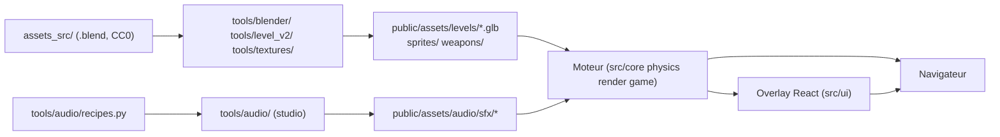
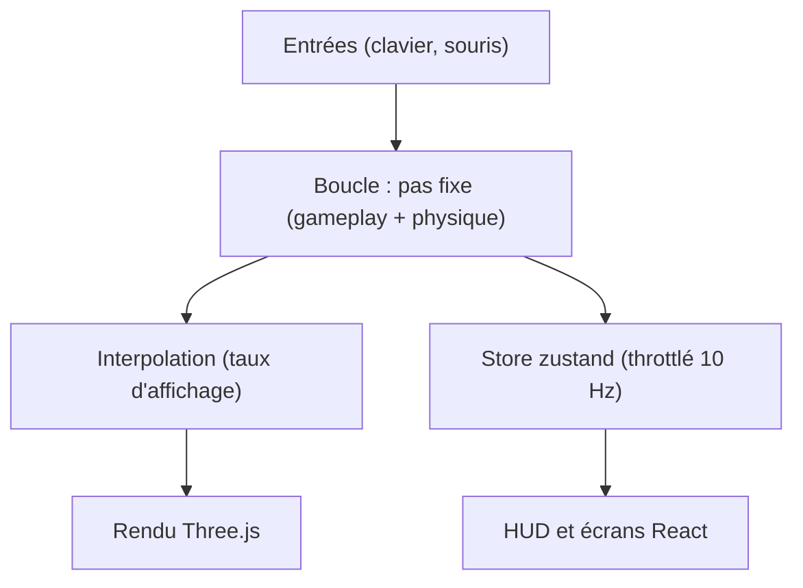

# Vue d'ensemble

## Rôle

PROJET_CASSANDRE assemble quatre blocs : un moteur de jeu TypeScript qui
tourne dans le navigateur, un overlay React posé par-dessus, un outillage
Python/Blender qui fabrique le contenu hors ligne, et un studio audio qui
fabrique le son hors ligne. Les deux outillages ne tournent jamais en
production : ils produisent des fichiers (`.glb`, `.png`, `.ogg`/`.m4a`) que
le moteur charge depuis `public/assets/`. Ce découpage résout un seul
problème : garder le pas fixe et le rendu simples et déterministes en
repoussant ce qui est lourd, asynchrone ou non déterministe hors de la boucle.

## Diagramme

Des sources du dépôt jusqu'au navigateur : les outils fabriquent des assets
servis, que le runtime (moteur + overlay) charge et affiche.

## Les quatre blocs

### Le moteur de jeu (TypeScript)

Fait tourner la simulation : pas fixe, physique Rapier, entités, chargement de
niveau. C'est la seule partie du projet où l'invariant du pas fixe et la
frontière synchrone Effect s'appliquent.

- Dossiers : `src/core` (boucle, temps, input, RNG), `src/physics` (monde
  Rapier, raycast), `src/render` (rendu Three.js, sprites, effets), `src/game`
  (joueur, entités, niveau, session), `src/app` (boot, flux d'une session).
- Langage : TypeScript, Effect (services, frontière synchrone), XState.
- Lancer : `pnpm dev` (Vite), `pnpm build` (`tsc --noEmit` puis build Vite),
  `pnpm test` (Vitest).
- Détail : [Boucle et temps](boucle-et-temps.md),
  [Simulation et présentation](simulation-et-presentation.md),
  [Cycle de vie](cycle-de-vie.md), [Effect et XState](effect-et-xstate.md).

### L'overlay React

Affiche le HUD, les menus et les écrans (mort, fin de niveau, options) par-
dessus le `<canvas>` du moteur. Ne participe jamais au calcul du jeu : il lit
un état qu'on lui pousse.

- Dossiers : `src/ui` (`App.tsx`, `hud/`, `screens/`, `components/`,
  `gameFlowMachine.ts`, `theme/`).
- Langage : React 19 (DOM), CSS Modules. Lancer : même `pnpm dev`/`pnpm build`
  que le moteur — un seul bundle Vite, `src/main.ts` monte React au canvas.
- Détail : `docs/4-technique/interface-react.md` (à écrire).

### L'outillage de contenu (Blender/Python)

Construit et valide le niveau et ses textures hors ligne, en scripts headless
ou en session Blender live. Ne tourne jamais au runtime du jeu : son seul
livrable est un fichier dans `public/assets/`.

- Dossiers : `tools/blender` (kit modulaire, bake, export, validation),
  `tools/level_v2` (blockout, plan de masse, audit géométrique),
  `tools/textures` (atlas et bandeaux) ; sources dans `assets_src/blender`
  (kit et niveaux) et `assets_src/library`, jamais servies en runtime.
- Langage : Python (`bpy`), scripts en ligne de commande.
- Lancer : scripts headless (`python3 tools/blender/build_niveau.py …`, voir
  leurs `README.md`) ou pilotage d'une session Blender ouverte via le MCP.
- Détail : `docs/4-technique/outillage-blender.md`,
  `docs/4-technique/chargement-de-niveau.md` (à écrire).

### Le studio audio

Synthétise et empaquette les sons du jeu hors ligne, de façon déterministe
(même graine, même octet). Ne tourne jamais au runtime : son seul livrable est
l'audio sprite chargé par `src/core/audio.ts`.

- Dossiers : `tools/audio` (`synth.py`, `recipes.py`, `render_sfx.py`,
  `analyze_sfx.py`, `build_sprite.py`, `audition.py`).
- Langage : Python (numpy/scipy). Lancer : scripts en ligne de commande, page
  d'écoute locale (`http://localhost:5173/audition/`).
- Détail : `docs/4-technique/studio-audio.md` (à écrire).

### Les assets générés, entre les deux mondes

Seul lien entre l'outillage et le moteur : des fichiers statiques sous
`public/assets/`, jamais réécrits à la main — `levels/*.glb` (niveaux et
zones de test), `sprites/` (atlas 8 directions, manifestes JSON),
`weapons/armes.glb` (viewmodels), `audio/sfx/sfx.{ogg,m4a,json}` (sprite
audio) et `audio/sfx/amb_*.{ogg,m4a}` (ambiances). Le moteur ne lit jamais
`assets_src/` (frontière détaillée plus bas).

## Ce qui tourne dans le navigateur

À l'intérieur du moteur : une boucle à pas fixe qui décide l'état du jeu, une
interpolation qui en tire une pose affichée, un store zustand throttlé pour
l'overlay React.

Détail : [Boucle et temps](boucle-et-temps.md) (accumulateur, hitstop),
[Simulation et présentation](simulation-et-presentation.md) (pas fixe contre
affichage), [Flux de données](flux-de-donnees.md) (input → HUD).

## Point d'entrée

`src/main.ts` orchestre le boot : choix du niveau (`src/app/bootChoice.ts`),
chargement des atlas et du niveau, construction du moteur persistant
(`buildGameEngine`, `src/game/session/gameEngine.ts`), démarrage d'une
première session (`bootGameSession`, `src/game/session/lifecycle.ts`), montage
de `<App/>` et démarrage de la boucle (`startLoop`, `src/core/loop.ts`).
« Rejouer »/« Retour au menu » passent par `src/app/sessionFlow.ts`, qui
reconstruit une session sans recharger la page — détail :
[Cycle de vie](cycle-de-vie.md).

## Frontières fortes

- **React ne touche jamais la boucle** : pas de `setState` par frame, HUD
  abonné au store zustand, throttlé à 10 Hz — [invariant #2](invariants.md).
- **Frontière synchrone Effect stricte** : pas fixe et rendu/interpolation
  passent uniquement par `runGameplaySync` (`src/core/runtime.ts`) —
  [invariant #11](invariants.md).
- **Le moteur ne lit que `public/assets/`**, jamais `assets_src/` (sources
  Blender, packs CC0 bruts, réservés à l'outillage).
- **L'outillage Python ne tourne jamais au runtime** : Blender et le studio
  audio produisent des fichiers à l'avance, jamais pendant une partie.
- **RNG déterministe uniquement**, jamais `Math.random()` —
  [invariant #12](invariants.md).

Liste complète des invariants actifs et retirés, avec leur raison et leur ADR :
[Invariants](invariants.md).

## Décisions

- [ADR 0001 — Moteur Three.js](../decisions/0001-moteur-threejs.md)
- [ADR 0002 — Fixed timestep](../decisions/0002-fixed-timestep.md)
- [ADR 0003 — React hors boucle](../decisions/0003-react-hors-boucle.md)
- [ADR 0014 — GameEngine et PersistentEngine séparés](../decisions/0014-gameengine-persistentengine-separes.md)
- [ADR 0023 — Fusion du décor au chargement](../decisions/0023-fusion-decor-au-chargement.md)
- [ADR 0024 — Éclairage hybride](../decisions/0024-eclairage-hybride.md)
