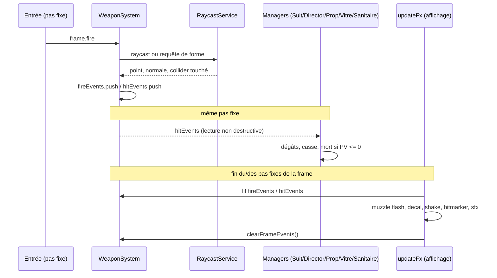

# Armes

## Responsabilité

Fait : sélectionne l'arme active, avance ses cooldowns et ses munitions,
résout ses tirs par raycast ou par requête de forme, déclenche le hitstop et
porte l'état de recul du viewmodel — uniquement des nombres, aucun mesh ni
matériau. Décide aussi, pour les trois ramassages au sol, si le joueur a déjà
l'arme (et donc ce que ramasser change).

Ne fait pas : n'applique aucun dégât — `WeaponSystem` produit des `hitEvents`
en lecture seule, c'est `SuitManager`/`DirectorManager`/`PropSystem`/
`VitreSystem`/`SanitaireSystem` qui les lisent au pas fixe suivant et
décident d'une mort, d'une casse ou de rien ([Simulation et présentation](../3-architecture/simulation-et-presentation.md)).
Ne fait pas la géométrie du ramassage au sol : `InteractionSystem` (`game/level/interactions/interactive.ts`)
détecte la proximité, `WeaponSystem` décide seulement de l'effet. Ne dessine
rien : viewmodel, muzzle flash, decals et sons sont posés par `updateFx`/
`render/`, détaillés dans [Sprites et viewmodel](sprites-et-viewmodel.md)
.

## Fichiers

- `src/game/player/weapons/weapons.ts` — `WeaponSystem` : sélection, munitions,
  cooldowns, raycasts/formes, hitstop, recul.
- `src/game/player/weapons/weaponConfig.ts` — `WeaponConfig` (source unique de
  vérité des nombres), `damageForWeapon`, les quatre tables de variantes
  A/B/C (`RECOIL_VARIANTS`, `IMPACT_VARIANTS`, `HITMARKER_VARIANTS`,
  `CROSSHAIR_VARIANTS`).
- `src/game/level/interactions/interactive.ts` — `InteractionSystem.collectWeapons` : la
  géométrie du ramassage au sol des trois armes, en marchant dessus (commit
  `6b768f1`, voir Pièges).
- `src/game/loop/updateGameplay.ts` — appelle `collectWeapons` puis
  `weapons.update`, dans cet ordre, après `player.update`.
- `src/game/loop/updateFx.ts` — seul lecteur de `fireEvents`/`hitEvents` côté
  présentation ; seul appelant de `weapons.clearFrameEvents()`.
- `src/render/fx/fx.ts` — `MUZZLE_FLASH_PRESETS`, muzzle flash et douille éjectée.
- `src/render/overlays/hitmarker.ts`, `src/render/overlays/crosshair.ts`,
  `src/render/debug/ballisticsDebug.ts` — canaux de confirmation de hit, réticule,
  gizmos de debug (touche `B`).

## Où ça s'insère dans la boucle

Ordre complet : [Boucle et temps](../3-architecture/boucle-et-temps.md). Dans
le même pas fixe :

1. `InteractionSystem.collectWeapons` (armes au sol), avant `weapons.update` —
   même bloc que `collectHeals`/`collectAmmo`. Un ramassage n'est vu par
   `activeWeapon` qu'au pas suivant : un pas de retard, invisible.
2. `weapons.update(gameplayDt, activeFrame, weaponEyeOrigin, yaw, pitch)` —
   `weaponEyeOrigin` est reconstruite depuis `session.player.position`
   **après** `player.update`, jamais depuis une position interpolée (même
   règle que pour l'origine de tir, [Joueur](joueur.md)). `gameplayDt` porte
   déjà le hitstop.
3. Encore dans ce pas fixe, immédiatement après : `suitManager.update`/
   `directorManager.update`/`propSystem.update`/`vitreSystem.update`/
   `sanitaireSystem.update` lisent tous `weapons.hitEvents`, chacun avec son
   propre curseur — un tir touche donc sa cible le même pas fixe où il part,
   jamais un pas de retard.
4. Au taux d'affichage, `updateFx` lit `weapons.fireEvents`/`hitEvents` (muzzle
   flash, douille, sfx, decal, particules, shake, hitmarker, pulsation du
   réticule, gizmos de debug), puis appelle `weapons.clearFrameEvents()` en
   tout dernier — après tous les autres lecteurs de la même frame.

Si `!engine.flow.isPlaying()`, `updateGameplay` retourne avant d'atteindre ce
bloc : aucune arme n'avance, le pas fixe continue de tourner (invariant #1).

Le même tir, du bouton pressé jusqu'à l'écran :

## Données et contrats

**`WeaponKind`** (`"none" | "melee" | "pistol" | "shotgun"`, dans
`src/game/player/weapons/weaponTypes.ts`) et `FiringWeapon` (le même sans
`"none"`, plus `"kick"`) : une arme absente ne produit ni tir
ni impact, `update()` ignore alors silencieusement `frame.fire`.

**Munitions, trois régimes différents** :

| Arme | Munitions | Ramassage répété |
|---|---|---|
| Pied-de-biche | Aucune | Rien (`tryCollectMelee` renvoie `false` si déjà possédé) |
| Pompe | Pool unique fixé au spawn (`shotgunStartingAmmo`), jamais renfloué | Rien (même contrat) |
| Pistolet | Pool rechargeable, plafonné (`pistolMaxAmmo`) | Recharge (`addPistolAmmo`), seule exception des trois |

`tryCollectMelee`/`tryCollectShotgun`/`tryCollectPistol` sont les callbacks de
`WeaponPickupHandlers` (`interactive.ts`) : chacune décide « déjà possédée ? »
et retourne si l'objet doit disparaître du monde. `hasPistolAlready` existe
uniquement pour que l'appelant choisisse entre les deux messages HUD
(« récupéré » vs `+N munitions`) avant l'appel.

**`FireEvent`/`HitEvent`** (fichiers en tête de `weapons.ts`) : deux files
accumulées au pas fixe, lues en lecture seule à l'affichage, contrat détaillé
dans [Simulation et présentation](../3-architecture/simulation-et-presentation.md#comment-linformation-passe-du-pas-fixe-à-laffichage).
`HitEvent.colliderHandle` route le dégât vers l'entité propriétaire sans que
`weapons.ts` connaisse aucun manager d'ennemi. `HitEvent.material` vaut
`"flesh"` (`FLESH_MATERIAL`) ou un placeholder générique (`"concrete"`),
décidé par `materialForCollider` à partir des seuls bits d'appartenance
Rapier (`GROUP.ENEMY`) — jamais du filtre.

**`damageForWeapon(weapon)`** (`weaponConfig.ts`) : table plutôt qu'un
ternaire recopié dans chaque manager — un ternaire à trois armes se trompe en
silence quand une nouvelle arme s'ajoute.

Les dégâts et les autres valeurs configurées sont récapitulés dans la
[référence des armes](../6-reference/valeurs-armes.md). Pour le pompe,
`damageForWeapon` renvoie les dégâts par plomb ; le total dépend du nombre de
plombs qui touchent.

**RNG** : le pompe et le pistolet partagent le même flux
`DeterministicRandom.forSeed(SHOTGUN_SPREAD_SEED)`, construit une fois à la
création de `WeaponSystem` (invariant #12) — jamais `Math.random()`. La
dispersion échantillonne un disque projeté dans le cône de visée (rayon
∝ √u₁, azimut = u₂·2π), une approximation standard d'un cône uniforme.

**Horloges du viewmodel** (`sinceMeleeFire`, `sincePistolFire`,
`sinceShotgunFire`, `sinceSwitch`) : avancées au pas fixe pour que le hitstop
les ralentisse aussi, lues uniquement par le rendu. Aucune ne conditionne un
tir ou un changement d'arme (invariant #10) — un nouveau tir peut partir
avant même que l'arme ait fini de remonter à l'écran.

**Quatre familles de variantes A/B/C** dans `weaponConfig.ts`
(`RECOIL_VARIANTS`, `IMPACT_VARIANTS`, `HITMARKER_VARIANTS`,
`CROSSHAIR_VARIANTS`), chacune isolée sur un seul aspect du feedback (recul,
hitstop/shake mur-vs-ennemi, marqueur de hit, style de réticule) sans jamais
toucher dégâts/cadence/munitions. Protocole de comparaison au pas fixe près
(F9/F10) : [Régler la sensation](../5-guides/regler-la-sensation.md).

## Pièges

**Portée du pied-de-biche : une requête de forme, pas un point.** Le coup
teste une capsule couvrant tout le segment `eyeOrigin` →
`eyeOrigin + direction * meleeRange`, pas une sphère unique à son extrémité.
Une sphère centrée sur le bout de la portée laisse une bande morte devant les
yeux : une cible collée au joueur tombe hors de cette bande et le coup ne
peut géométriquement pas toucher à bout portant, quelle que soit sa taille —
constaté en playtest (« je n'ai pas l'impression de toucher à bout portant »),
pas un choix de feel.

**Le carré blanc était le muzzle flash de la mêlée, pas un bug de rendu.**
Un retour de playtest (« cette espèce de carré blanc… ça fait mal aux yeux »)
a mené à un flash déclenché pour CHAQUE arme sans distinction, avec l'œil du
joueur comme origine pour la mêlée : un quad blanc à 15 cm de la caméra
couvre l'essentiel du champ à 640×360. Corrigé en retirant tout muzzle flash
pour la mêlée — le pied-de-biche n'a pas de canon — et le typage l'empêche
de revenir en silence : `MUZZLE_FLASH_PRESETS` (`render/fx/fx.ts`) est un
`Record<"pistol" | "shotgun", …>`, `"melee"` n'y a pas d'entrée possible.

**L'origine de tir ne vient jamais d'une position interpolée.**
`weaponEyeOrigin` est reconstruite depuis `session.player.position` après
`player.update`, jamais depuis `player.eyePosition()` (le rendu) : sinon le
rejeu d'input (F9/F10) diverge selon le framerate d'affichage à
l'enregistrement — même piège que documenté dans [Joueur](joueur.md#pièges)
et [Boucle et temps](../3-architecture/boucle-et-temps.md#pièges).

**Une arme au sol ne doit jamais concurrencer la touche `E`.**
`InteractionSystem.update` (recherche du `use_*` le plus proche pour l'appui
`E`) exclut explicitement les trois noms d'armes (`isWeaponPickupName`) :
sans cette garde, une arme posée à portée volerait l'appui `E` à un
sanitaire ou une porte plus proche. `collectWeapons` les ramasse séparément,
en marchant dessus, comme une trousse ou une boîte de munitions.

**Le hitstop ne se cumule jamais entre plusieurs plombs d'un même tir.**
`triggerHitstopFor` (appelé jusqu'à `shotgunPelletCount` fois pour un seul
tir de pompe) écrase la durée/l'échelle en cours plutôt que de les additionner
(`GameClock.triggerHitstop`, dernier appel gagnant) — un tir à 9 plombs sur un
Costard ne « sur-arme » donc pas 9× plus fort qu'un plomb seul.

## Tests

- `test/game/player/weapons/weaponClocks.test.ts` — horloges du viewmodel, aucune ne
  bloque un tir ou un changement (invariant #10).
- `test/game/player/weapons/weaponPickups.test.ts` — `tryCollectMelee`/
  `tryCollectShotgun`/`tryCollectPistol` : la décision « déjà possédée »,
  symétrie et exception du pistolet.
- `test/game/player/weapons/pistol.test.ts` — possession, dotation, cadence, plafond
  de munitions (mécanique du tir, pas la balistique — monde physique vide).
- `test/game/level/interactions/pickups.test.ts` — traversée complète loader → `UseObject`
  → `InteractionSystem.collectHeals`/`collectAmmo`/`collectWeapons`.
- `test/game/integration/gameplayStep.test.ts`, `gameSessionReset.test.ts` —
  la place de `WeaponSystem` dans un pas fixe réel et sa survie à un reset.
- `test/render/viewmodel/viewmodel.test.ts` — tirer pendant le changement d'arme remet
  l'arme en place aussitôt (invariant #10).

Aucun test dédié ne couvre `fireMelee`/`firePistol`/`fireShotgun` contre un
monde physique peuplé (géométrie d'impact, matériau perçu) : la couverture
actuelle porte sur la mécanique (munitions, cooldowns, ramassage), pas sur la
balistique elle-même.

## Comment vérifier que ça marche

- `pnpm test -- weaponClocks weaponPickups pistol pickups gameplayStep`.
- Console `cassandre.weapons` : l'instance `WeaponSystem` réelle
  (`activeWeapon`, `shotgunAmmo`, `pistolAmmo`, `fireEvents`, `hitEvents`).
- `cassandre.weaponConfig` : mutation à chaud de tout `WeaponConfig`.
- `cassandre.applyRecoilVariant`/`applyImpactVariant`/`applyHitmarkerVariant`/
  `applyCrosshairVariant("A"|"B"|"C"` ou nom de variante`)` : bascule chaque
  harnais indépendamment.
- Touche `B` (`src/render/debug/ballisticsDebug.ts`) : gizmos des rayons/capsule
  réellement testés par le dernier tir — confirme la portée du pied-de-biche
  et le cône du pompe visuellement.

## Décisions

- [ADR 0029 — Armes en vue subjective](../decisions/0029-armes-en-vue-subjective.md)
- [ADR 0007 — RNG déterministe](../decisions/0007-rng-deterministe.md)
- [ADR 0010 — Curseur explicite d'événements multi-pas-fixe](../decisions/0010-curseur-evenements-multi-pas-fixe.md)
