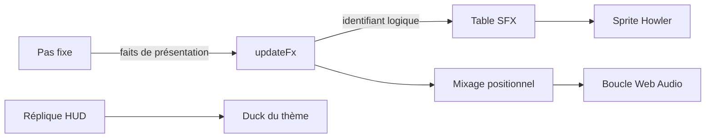

# Audio runtime

## Responsabilité

Le runtime audio transforme les événements de présentation en sons ponctuels et ambiances.
Il ne décide pas quand un événement de gameplay arrive ; cette décision appartient au jeu et à `updateFx`.

## Fichiers

- `src/core/audio/audio.ts` charge le sprite des effets, définit `SFX_TABLE` et lance les lectures ponctuelles.
- `src/core/audio/audioPreparation.ts` attend le décodage, amorce le pool et reprend Web Audio sur une interaction.
- `src/core/audio/waterAmbience.ts` gère la boucle unique des jets d'eau positionnels.
- `src/core/audio/showerAmbience.ts` gère la boucle localisée des douches.
- `src/core/audio/waterAmbienceMix.ts` calcule le gain et le panoramique des jets.
- `src/core/loading/assetPath.ts` construit les chemins d'assets servis par le jeu.
- `src/game/loop/updateFx.ts` consomme les faits de présentation et met à jour les ambiances.
- `src/game/session/player/feedback.ts` publie les répliques.
- `public/assets/audio/sfx/sfx.json` donne les offsets et durées du sprite.
- `public/assets/audio/sfx/sfx.ogg` et `public/assets/audio/sfx/sfx.m4a` sont ses encodages.

## Où ça s'insère dans la boucle

`main.ts` lance le chargement audio avant le menu, en parallèle du démarrage.
Avant d'entrer en jeu, il attend le décodage du sprite et des deux boucles
d'eau. Le contexte audio est repris sur `pointerdown` ou `keydown`, dès le
menu. L'auto-suspension Howler après trente secondes est désactivée pour
éviter un nouveau démarrage du moteur audio au prochain son.
Les faits de tir, d'impact, de casse et d'ennemi sont lus dans `updateFx`, au taux d'affichage.
La boucle positionnelle d'eau calcule son mélange au même endroit.
Le pas fixe n'appelle pas Howler et ne dépend pas de la lecture audio.

Le flux relie l'événement de jeu à sa lecture, sans faire entrer l'audio dans la simulation.

## Données et contrats

### Effets ponctuels

`SfxId` nomme les événements du jeu.
`SFX_TABLE` les associe à une clé de recette, un volume de base et éventuellement une variation de hauteur.
Le nom logique du jeu est distinct du nom de recette du studio.
`playSfx` reçoit une échelle de volume facultative.
Des fonctions spécialisées sélectionnent le son d'arme, d'impact, de matière, de porte ou d'ennemi.
Une matière inconnue retombe sur le son d'impact ou de casse par défaut.
Le pool Howler prévoit douze lectures simultanées par défaut.

`initAudio` est idempotente.
Elle récupère le manifeste et crée le sprite Howler. Sa promesse se résout
après le décodage. Des lectures muettes amorcent les voix du pool natif
Howler ; elles sont arrêtées puis réutilisées par les vrais sons, sans
consommer le RNG. Le manifeste réseau et l'attente du décodage sont bornés à
quinze secondes chacun ; une panne reste non fatale.
Un appel avant disponibilité, ou une clé absente, ne bloque pas la partie ; un avertissement n'est émis qu'une fois par clé.
Le manifeste est généré par `tools/audio/build_sprite.py` et ne se modifie pas à la main.
Le générateur fournit Ogg et M4A car Howler choisit un format pris en charge sans repli d'une source à l'autre.

`window.cassandre.sfx.liste()` expose `present` pour chaque identifiant. Ce
champ indique seulement que sa clé figure dans le manifeste JSON chargé ; il
ne révèle pas si Howler a fini de télécharger ou décoder le fichier. Pour
vérifier un son, contrôlez dans l'onglet Réseau que `sfx.json` et le format
choisi par le navigateur (`.ogg` ou `.m4a`) se chargent sans erreur, vérifiez
l'absence d'avertissement `[audio]` dans la console, puis déclenchez le son
avec `window.cassandre.sfx.joue("shotgun_fire")`.

`setAudioRandom` injecte le flux aléatoire de présentation utilisé pour la variation de hauteur.
Ce flux est distinct de la simulation.
L'absence d'un son ne change donc pas les décisions de gameplay ni le rejeu.

### Pas de musique

Le jeu n'a pas de thème musical : retiré le 2026-10-02, il n'apportait rien
que l'ambiance de zone ne fasse déjà. Sans musique, plus de ducking : une
réplique du héros ne baisse aucun autre canal.

### Ambiances de zone

`core/audio/zoneAmbience.ts` lit `assets/audio/ambiances/ambiances.json`, écrit par
`tools/audio/ia_ambiances.py finalize` : pour chaque zone, sa nappe, ses
événements et les espaces du plan de masse qu'elle couvre (boîtes en repère du
jeu, la plus petite l'emporte). Chaque nappe est amorcée en silence au
chargement ; `updateZoneAmbience`, appelée par `updateFx` au taux
d'affichage, choisit la zone sous la caméra (on garde la précédente entre deux
espaces), fond les nappes en ~0,7 s, fait respirer leur niveau (0,045 Hz,
±12 %) et lâche un événement toutes les 6 à 14 s, panoramique au hasard. Le
tirage passe par un flux `DeterministicRandom` dédié, posé à chaque partie.

À la construction d'une partie, `resetZoneAmbienceSession` remet la
respiration à l'instant zéro, la zone à null, les gains à zéro et le premier
événement à 6 secondes de jeu actif. Le nouveau générateur reprend la seed
`0xa4b1a7`. Au départ, la zone sous la caméra prime ; hors de toute boîte,
la zone par défaut remplace la zone de la partie précédente.

La pause, les écrans de fin et le menu figent l'horloge et le délai ; le
fondu vers le silence continue. La destruction d'une partie arrête aussi
les sons ponctuels en cours. Les Howl préchargés, les gains utilisateur et
les boucles des nappes sont conservés entre parties : le curseur de lecture
audio reste continu. Le calendrier cosmétique dépend du delta d'affichage ;
ce reset ne garantit pas un rejeu sonore identique à des fréquences différentes.

Le fichier d'une nappe porte 0,5 s de marge de chaque côté et le jeu boucle sur
la région du milieu (sprite Howler bouclé) : encodée en ogg ou m4a, une boucle
propre en WAV sortait avec un clic au raccord, l'encodeur abîmant les bords du
fichier. `finalize` mesure le raccord APRÈS décodage. `cassandre.sfx.ambiance()`
donne la zone entendue, le volume de chaque nappe, l'horloge en secondes
et le délai avant le prochain événement (`horloge`, `prochainEvenementDans`).

### Jet d'eau positionnel

`waterAmbienceMix.ts` reçoit la position des jets et la pose de caméra.
Il retourne un gain et un panoramique bornés, lissés ensuite par `waterAmbience.ts`.
Le mix atteint son niveau maximal près de la source, décroît avec la distance et devient muet au-delà de sa portée.
Plusieurs jets additionnent leurs gains jusqu'à un plafond.
Un seul `Howl` Web Audio est amorcé à volume nul pendant le chargement,
avec son panoramique. Il reste en boucle : le mix ne fait ensuite que régler
volume et pan. Sous le seuil de silence, le volume est exactement nul.
Le module s'actualise pendant le jeu ; les écrans de menu et de fin ne produisent pas de jet audible.
La douche suit la même préparation dans `showerAmbience.ts`.
Les réglages de volume et de panoramique attendent la lecture effective
du son. Un fichier décodé peut encore attendre le geste utilisateur ;
envoyer les réglages à chaque image pendant cette attente accumule une
file Howler, qui peut déborder à la reprise du contexte audio.

### Répliques

Depuis le 2026-10-02, les répliques sont dites : `core/audio/heroVoice.ts` charge un
second sprite, `voix.{ogg,m4a,json}` (prises ElevenLabs, voix « Callum »,
produites par `tools/audio/ia_voix.py`). Une seule lecture à la fois — une
nouvelle réplique coupe la précédente — et aucune variation de hauteur.
`triggerHeroLine(session, id)` affiche le sous-titre, joue la prise
`heros_<id>_a`, fait parler le portrait et baisse le thème le temps de la
prise (4 s au moins). Le texte, la priorité, la règle « une fois par partie »
et la probabilité de chaque réplique sont dans `game/session/presentation/heroLines.ts` ;
`triggerHeroBark` joue les cris courts (douleur, réception), sans sous-titre.
`cassandre.voix.liste()`/`joue(cle)` en console.

### Réglages du joueur

Options › Audio (`ui/screens/options/audio/AudioTab/`) présente,
`game/settings/audioSettings.ts` persiste (`cassandre.audio`) et applique. Quatre canaux
— général (`Howler.volume`), effets, voix du héros, ambiances (nappe,
jets d'eau, douches) — chacun un gain multiplié au volume de repos de son
module de `core/` : 100 % rend le mixage d'origine. Le gain est le carré de
la valeur affichée (50 % ≈ −12 dB). S'y ajoutent les sous-titres des
répliques (lus par `triggerHeroLine`) et la coupure du son quand la fenêtre
perd le focus (`Howler.mute`). `initAudioSettingsAtBoot()` passe avant la
création des `Howl`, qui reprennent les gains à leur construction.

## Pièges

- Appeler Howler dans le pas fixe mélange une action de présentation à la simulation.
- Confondre « manifeste disponible » et « audio décodé » reporte le coût sur la première action.
- Modifier les offsets du manifeste à la main est perdu au prochain build du sprite.
- Fusionner les clés de recette et les identifiants du jeu casse leur frontière de nommage.
- Une boucle d'eau HTML5 ne fournit pas le contrôle de panoramique requis par le mix.
- Un lissage exponentiel n'atteint jamais exactement zéro ; la mise au silence utilise donc un seuil.
- Le flux d'aléa des variations audio doit rester indépendant du RNG de gameplay.
- La lecture audio peut être muette si l'asset attendu manque ; le runtime avertit sans interrompre le jeu.

## Tests

- `test/core/audio/waterAmbienceMix.test.ts` vérifie le calcul pur du gain, de la distance et du panoramique.
- Le module Howler `audio.ts` n'a pas de suite de tests d'intégration dédiée.
- L'analyse du studio et le contrôle des boucles sont décrits dans [Studio audio](studio-audio.md).

## Comment vérifier que ça marche

Lancer `pnpm test -- test/core/audio/waterAmbienceMix.test.ts`.
Dans le navigateur de développement, utiliser `window.cassandre.sfx.liste()` pour comparer les identifiants du jeu aux clés du manifeste ; `present` ne confirme pas le décodage du son.
Contrôler les réponses Réseau pour `sfx.json` et le format audio choisi, puis déclencher `window.cassandre.sfx.joue("shotgun_fire")` et écouter le résultat.
Casser un sanitaire, puis observer `window.cassandre.sfx.eau()` pour vérifier l'état de la boucle.
