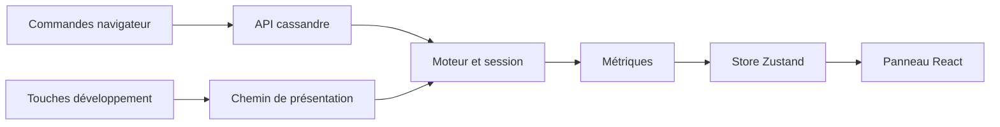

# Debug

## Responsabilité

Les outils de debug exposent l'état du moteur et des moyens contrôlés de reproduire ou mesurer une situation.
Ils sont séparés des commandes de jeu et absents du build de production.

## Fichiers

- `src/game/devtools/consoleApi.ts` construit `window.cassandre` et ses espaces de commande.
- `src/game/devtools/testHarness.ts` contient les comparaisons déterministes, variantes A/B et mesures ponctuelles.
- `src/game/devtools/cheats.ts` expose les aides de développement comme `notarget`.
- `src/game/loop/devGameplayInput.ts` traite F8, F9 et F10 en mode développement.
- `src/game/loop/updateFx.ts` traite les bascules visuelles et met à jour les mesures affichées.
- `src/game/state.ts` définit l'état de debug publié au store.
- `src/ui/dev/DebugPanel/DebugPanel.tsx` affiche les métriques du moteur.
- `src/ui/dev/tuning/TuningPanel/TuningPanel.tsx` expose les paramètres de tuning.
- `src/core/inputRecorder.ts` définit le format des séquences d'input.
- `src/game/session/recording.ts` restaure une séquence dans la session pour son rejeu.
- [Page de debug historique](./debug.md) conserve des explications détaillées du système.

## Où ça s'insère dans la boucle

F8–F10 et les bascules V/B sont lues depuis le chemin de présentation quand le mode développement est actif.
Les métriques continues sont accumulées hors de React puis publiées par `updateFx` au plus à 10 Hz.
Les mutations ponctuelles de tuning ou de triche se font sur commande.
La boucle de jeu ne consulte pas le panneau React.
F9/F10 agissent sur le lecteur de jeu et les entrées enregistrées ; le rejeu utilise ensuite le chemin normal de simulation.

Le diagramme montre les surfaces de diagnostic et leur relation au moteur.

## Données et contrats

### Console `cassandre`

`exposeDebugApi` est appelée une fois depuis `main.ts` seulement si `import.meta.env.DEV` est vrai.
L'API expose des getters vers la session courante afin de rester valide après un redémarrage.
Elle regroupe les états joueur, armes, ennemis, portes, vitres, sanitaires, props, secrets, chemin de navigation, éclairage et audio.
Les méthodes qui modifient le jeu sont explicites : apparition, destruction, octroi de carte, ouverture de porte, variantes et bascules.
Les actions de test ne passent pas nécessairement par la vraie entrée clavier ; elles isolent un comportement difficile à automatiser.

`cassandre.sfx.liste()` énumère les identifiants logiques et leur disponibilité dans le sprite.
`cassandre.sfx.joue(id)` déclenche un effet ponctuel.
`cassandre.sfx.eau()` décrit la boucle positionnelle courante.
L'API garde les accès à la session derrière des getters ; elle ne conserve pas une session qui devient périmée après un reset.

### Enregistrement et rejeu

F9 démarre ou termine un enregistrement d'input pendant une partie.
La séquence contient la version du format, le pas fixe et les frames d'entrées.
F10 rejoue le dernier enregistrement connu.
La session restaure le point de départ du joueur et les entrées du lecteur ; le reste du monde doit être dans le même état initial pour une comparaison pertinente.
Le format JSON peut être exporté et importé depuis l'API de debug.
`checkDeterminism` exécute deux simulations comparables et rapporte leurs écarts.

### Métriques et variantes

`DebugState` porte FPS, temps gameplay/physique/rendu, requêtes A*, draw calls, triangles, position, vitesse, collisions, PV, munitions, cartes, secrets et vues.
`updateFx` limite les écritures continues du store à 10 Hz.
Les changements ponctuels, comme PV ou inventaire, suivent l'événement qui les produit.
Le harnais propose des variantes pour déplacement, recul, impact, hitmarker, réticule, knockback, flash et budget de lampes.
Les mesures de rendu peuvent aussi être prises en dehors de la boucle.

### Touches de développement

F8 bascule `notarget` pour rendre les ennemis aveugles ou les réactiver.
F9 enregistre une séquence d'entrée ; F10 la rejoue si elle existe.
V bascule le mode filaire de la scène.
B bascule les gizmos balistiques.
Ces raccourcis sont réservés au développement.
La touche M est une commande joueur distincte : elle coupe ou réactive le thème musical, mais laisse la nappe d'ambiance active.

## Pièges

- L'API console n'existe qu'en développement ; son absence en production est attendue.
- Une séquence F9/F10 ne restaure pas l'état complet des ennemis, du niveau ou de chaque source aléatoire externe.
- Comparer deux enregistrements issus de positions initiales ou d'états de session différents produit un résultat trompeur.
- `notarget` modifie le comportement des ennemis et peut invalider un test de combat.
- Une valeur mesurée dans `renderer.info` dépend de la scène et du point de vue.
- Les commandes console peuvent modifier le monde ; noter la commande utilisée avant une capture.
- Un rapport de déterminisme ne valide pas le ressenti du mouvement ou du son.
- Le store de debug est une projection ; ne pas le traiter comme source de vérité du jeu.
- Les touches et commandes de debug ne sont pas des contrôles réassignables du joueur.
- Une mesure sans point de vue et scénario fixes n'est pas comparable à une mesure précédente.

## Tests

- `test/core/loop.test.ts` couvre les pas fixes employés pendant le rejeu.
- `test/core/random.test.ts` vérifie le RNG des simulations.
- `test/game/` contient les tests des systèmes observés par les outils.
- `test/render/lightPool.test.ts` vérifie les calculs du budget de lampes.
- L'API `window.cassandre` n'a pas de suite d'intégration dédiée.
- Le module d'enregistrement d'input n'a pas de test unitaire dédié dans `test/`.

## Comment vérifier que ça marche

Lancer `pnpm test -- test/core/loop.test.ts`.
En mode développement, ouvrir la console navigateur et vérifier `window.cassandre`.
Utiliser `window.cassandre.pathfinding.stats()` ou `window.cassandre.sfx.liste()` pour inspecter les états exposés.
En jeu, enregistrer une petite séquence avec F9, puis la rejouer avec F10.
Pour comparer un paramètre, conserver le même scénario et ne changer qu'une variante à la fois.
Dans un build de production, vérifier que `window.cassandre` et les panneaux de développement ne sont pas disponibles.
