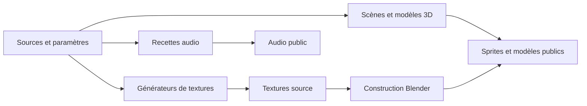

# Générateurs d'assets

## Responsabilité

Les générateurs produisent les textures, atlas, sprites et modèles utilisés par le jeu à partir de sources ou de recettes.
Ils ne s'exécutent pas dans le navigateur.

## Fichiers

- `tools/textures/build_palette.py` prépare la palette commune depuis les groupes de sources configurés.
- `tools/textures/make_textures.py` fabrique les textures de base depuis la palette et leurs spécifications.
- `tools/textures/make_kenney_atlas.py` prépare les atlas de mobilier alimentaire et automobile.
- `tools/textures/generate_affiches.py` compose les affiches et leur manifeste.
- `tools/textures/generate_panneaux.py` réduit les illustrations des panneaux d'histoire en 640×360 et 64 couleurs, et tient la liste des panneaux livrés (`src/game/session/presentation/storyImages.json`).
- `tools/textures/generate_labels.py` compose l'atlas des étiquettes.
- `tools/textures/generate_vending.py` dessine les façades des distributeurs de soda, snacks et café.
- `tools/textures/generate_portes.py` compose les textures d'ouvrants.
- `tools/textures/generate_surgeles.py` génère les visuels du rayon surgelés.
- `tools/textures/generate_ciel.py` génère les six faces du ciel de nuit.
- `tools/blender/render_enemy_sprites.py` rend les sprites huit directions des ennemis.
- `tools/blender/build_weapons.py` construit et exporte les armes.
- `tools/blender/render_weapon_pickups.py` rend l'atlas des armes au sol.
- `tools/textures/generate_card_pickups.py` dessine les trois sprites des cartes de fidélité.
- `tools/audio/` contient le studio audio décrit dans [Studio audio](studio-audio.md).

## Où ça s'insère dans la boucle

Ces scripts s'exécutent hors du runtime, comme étapes de préparation des assets.
Leurs sorties rejoignent soit `assets_src/` pour les sources réutilisées dans Blender, soit `public/assets/` pour les fichiers chargés par le jeu.
Le runtime consomme les sorties ; il ne lance pas les générateurs.

Le diagramme relie les familles de sources aux sorties du runtime.

## Données et contrats

### Textures et palettes

`build_palette.py` et `make_textures.py` produisent des images source sous `assets_src/textures/`.
Les atlas des affiches, étiquettes, trims, bandeaux, portes, écrans, kiosque, chaînes et surgelés sont aussi produits dans ce dossier avec des manifestes JSON associés.
Les familles de générateurs comprennent aussi les façades, bandeaux, chaînes, écrans, kiosques et bordures du kit.
Chaque famille possède un script source distinct afin qu'une retouche ne régénère pas sans raison les atlas indépendants.
Les entrées brutes AmbientCG et Kenney résident sous `assets_src/cc0_raw/`, ignorées par Git.
Les visuels de ciel sont écrits sous `public/assets/sky/nuit/`.
Les générateurs consomment leurs paramètres et sources ; ils ne mettent pas à jour les fichiers de scène Blender seuls.
Les fichiers JSON adjacents décrivent les cellules ou repères quand le runtime ou le constructeur en a besoin.

### Distributeurs

`lib_distributeurs.py` partage les modèles entre le mobilier statique de `lib_bureaux.py` et les trois machines cassables. Chaque machine est un mesh à un matériau, avec un atlas de 128×128 pixels, des produits visibles, des boutons et une trappe en relief. Le café possède une buse et un gobelet. Une carte d'émission de même taille éclaire uniquement les marques, les vitrines et les prix, reprise par `src/render/environment/vendingMachines.ts` à la conversion Lambert. Le distributeur coulissant du secret conserve sa façade dédiée.

La recette Cassandre `rework_vending(preview=…)` remplace localement huit machines dans le niveau existant. Les cinq machines statiques gardent leurs colliders ; les trois `prop_*` gardent leur boîte englobante, leurs propriétés et leur contenu. Leur relief est volontairement approximé par cette boîte pour la physique, ce que signale le validateur. Les deux bornes de sponsor restent utilisables et sont abaissées de 15 cm pour dégager les marques. Les autres couleurs d'éclairage cuites restent intactes.

### Sprites et armes

`render_enemy_sprites.py` utilise un modèle source et écrit les atlas et manifestes sous `public/assets/sprites/`.
Les manifestes associent les directions, animations et rectangles de texture lus par le moteur.
`build_weapons.py` écrit le modèle glTF des armes dans `public/assets/weapons/armes.glb`.
`render_weapon_pickups.py` écrit l'atlas des armes au sol et son manifeste sous `public/assets/sprites/`.
`generate_card_pickups.py` écrit les trois PNG RGBA de 128×80 pixels sous `public/assets/sprites/cards/`. Il réutilise la police pixel de `generate_labels.py` ; ses sorties sont directement consommées par `src/render/pickups/cardPickups.ts`.
Les modèles et textures d'ennemis passent par un rendu Blender, pas par le pipeline de texture 2D.

### Déterminisme et provenance

Chaque script doit être relancé avec les mêmes paramètres et les mêmes sources pour reproduire sa sortie.
Les scripts qui utilisent un générateur pseudo-aléatoire fixent leur graine dans les paramètres ou le code.
La source brute, sa licence et l'outil de génération sont trois informations distinctes.
Les entrées ignorées par Git doivent être récupérées localement depuis leur provenance avant de relancer le pipeline.
Les sorties sous `public/assets/` sont des artefacts servis au joueur ; elles ne remplacent pas les sources du générateur.
Un changement de format de manifeste doit rester compatible avec le lecteur runtime correspondant.
La palette et les images d'entrée sont des dépendances de génération, tandis que le fichier glTF final est une sortie consommée par le jeu.
Un script peut produire dans un dossier temporaire quand ses options le permettent ; vérifier son argument `--out` avant de remplacer un asset livré.

### Construction du niveau

Les atlas sous `assets_src/textures/` sont consommés par les scripts Blender au moment de la construction.
Un visuel modifié ne se retrouve dans le niveau qu'après reconstruction puis nouvel export du fichier glTF.
Les pièces du kit et les objets de la bibliothèque sont intégrés par les scripts Blender selon les conventions glTF.
La génération et l'export du niveau sont décrits dans [Outillage Blender](outillage-blender.md).

## Pièges

- Relancer un générateur sans ses entrées CC0 ignorées peut échouer ou produire une sortie différente.
- Modifier seulement un PNG généré est temporaire ; le prochain build le remplace.
- Modifier une texture source ne change pas automatiquement le fichier glTF déjà exporté.
- Écraser un manifeste sans regénérer les images peut laisser des rectangles ou identifiants périmés.
- Les sources Kenney et AmbientCG brutes sont distinctes des atlas transformés ; l'atlas ne suffit pas à reconstituer toute la provenance.
- Régénérer un sprite ennemi sans mettre à jour son manifeste laisse le runtime avec une grille incohérente.
- Un asset dans `assets_src/` n'est pas nécessairement livré dans le bundle public.
- Un build Blender visuellement correct ne prouve pas que le loader reconnaît les objets ni que le budget de rendu reste conforme.

## Tests

- Les scripts de validation Blender et l'audit de niveau sont décrits dans [Outillage Blender](outillage-blender.md).
- Les manifestes produits par les générateurs sont consommés par `src/render/sprites/enemySprites.ts` et les lecteurs d'assets correspondants.
- `tools/audio/analyze_sfx.py` et `tools/audio/build_sprite.py` vérifient les sorties audio.
- Il n'existe pas de commande unique qui régénère et valide toutes les familles d'assets.

## Comment vérifier que ça marche

Consulter l'en-tête du générateur pour ses arguments, ses sources et son répertoire de sortie avant de l'exécuter.
Comparer les images et manifestes générés avec leurs spécifications puis recharger le consommateur correspondant.
Après une modification de texture de niveau, reconstruire et exporter le fichier glTF, puis le charger dans le jeu.
Après un changement d'atlas ennemi, vérifier les huit directions et les rectangles dans le manifeste.
Après la régénération d'un atlas qui équipe le niveau, reconstruire le fichier Blender ou le niveau concerné avant d'inspecter le runtime.
Comparer le résultat d'un manifeste au lecteur réellement utilisé par `src/render/sprites/enemySprites.ts` ou par le système d'armes.
Pour les recettes et commandes audio, suivre [Studio audio](studio-audio.md).
Conserver côte à côte le PNG et le manifeste générés pour repérer un décalage de rectangles ou d'identifiants.
Pour les textures utilisées par Blender, confirmer que le fichier exporté reflète la nouvelle image et non une sortie précédente.
Inspecter chaque atlas à son échelle native avant de le charger dans le jeu.
Vérifier le nom des fichiers réellement chargés par le niveau avant de supprimer une sortie qui semble redondante.
Garder les entrées brutes sous leur provenance documentée plutôt que de les confondre avec leurs versions quantifiées.
