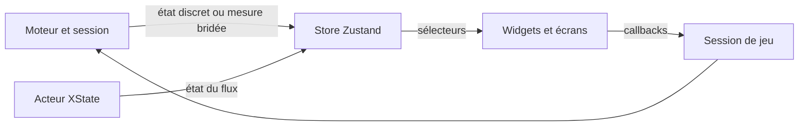
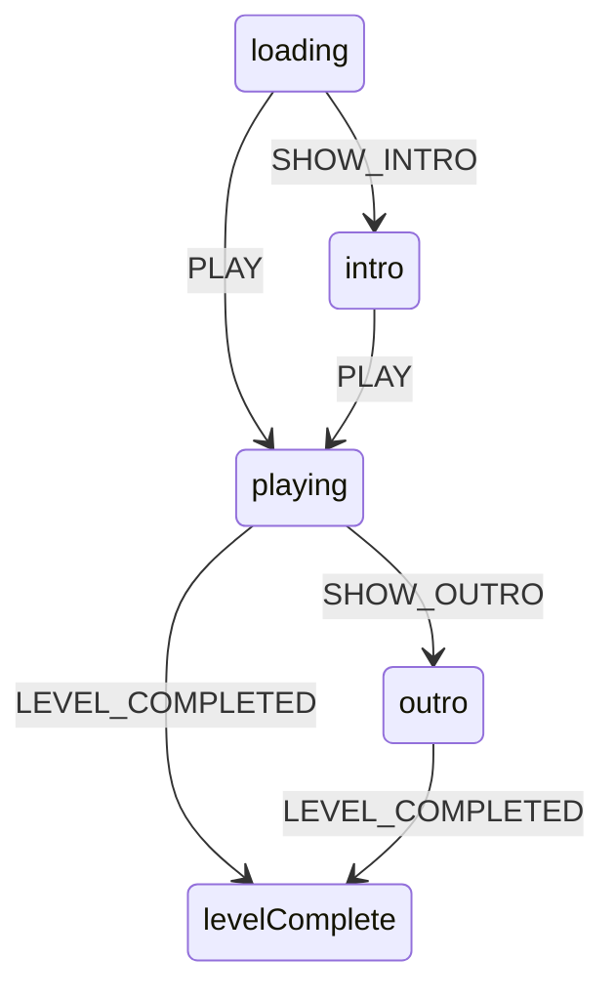

# Interface React

## Responsabilité

`src/ui/` affiche les écrans et le HUD à partir d'un état publié par le moteur.
Il transmet les actions de l'utilisateur aux callbacks de session.
Il ne pilote ni la boucle, ni Rapier, ni le chargement du niveau.

## Fichiers

- `src/main.ts` construit l'acteur du flux d'écran, projette ses changements dans le store et monte l'interface.
- `src/ui/App/App.tsx` compose les écrans en jeu et choisit les panneaux de développement.
- `src/app/navigation/gameFlowMachine.ts` définit les états et transitions de la session ; `gameFlowTypes.ts` porte son contrat.
- `src/game/hud/state.ts` contient le store Zustand ; `src/game/hud/hudTypes.ts` porte les contrats exposés à React.
- `src/ui/hud/Hud/Hud.tsx` compose les widgets du HUD sans s'abonner lui-même au store.
- `src/ui/hud/widgets/` regroupe les widgets qui lisent leurs propres données.
- `src/ui/screens/` contient les écrans de pause, mort, chargement et fin de niveau.
- `src/ui/dev/` contient les panneaux de debug et de réglage réservés au développement.
- `src/app/navigation/bootChoice.ts` gère le choix avant le montage de l'arbre React `App`.
- [Structure React](../6-reference/react-structure.md) fixe l'organisation des composants et dossiers.
- [Bonnes pratiques React](../6-reference/react-bonnes-pratiques.md) précise les conventions du dépôt.
- [CSS](../6-reference/react-css.md) fixe les règles de styles.
- [Composition](../6-reference/react-composition.md) décrit les primitives et leur composition.

## Où ça s'insère dans la boucle

Avant le jeu, `main.ts` résout le choix de démarrage et affiche le chargement.
Après le chargement, React reçoit les transitions discrètes du flux et les changements ponctuels du store.
La boucle appelle `updateFx` pour publier les mesures de debug et le portrait du héros au plus dix fois par seconde.
Les valeurs comme les PV et les cartes sont publiées à l'événement qui les modifie.
React ne reçoit pas une mise à jour à chaque image.

Le diagramme résume la frontière entre le moteur, le store et l'arbre React.

## Données et contrats

### Flux d'écran

`createGameFlowActor` crée un acteur XState au démarrage.
`src/main.ts` s'abonne à ses snapshots et appelle `setFlowState`.
L'acteur vit pendant l'onglet ; relancer une partie ne le recrée pas.
`GameFlowState` est une union de chaînes dans `src/app/navigation/gameFlowTypes.ts`.
Le store expose l'état au rendu ; il n'est pas la source des transitions.

`App` rend l'écran de chargement pour `loading` ou `loadFailed`.
Sinon, il compose le HUD, les superpositions et les écrans de pause, mort, histoire et fin.
L'écran de menu initial est résolu avant le montage de `App`.

### Panneaux d'histoire

Deux états encadrent la partie : `intro` entre `loading` et `playing`, `outro` entre `playing` et `levelComplete`.
Un niveau y passe s'il a une histoire dans `src/game/session/presentation/storyPanels.ts`. La mort ne passe jamais par `outro`.

Le diagramme montre les deux détours ; les autres transitions sont inchangées.

- **Qui décide.** `waitForGameSessionReady` (`src/app/navigation/sessionFlow.ts`) envoie `SHOW_INTRO` quand la partie vient du menu et que l'intro n'a pas encore été vue sur ce navigateur (`src/game/settings/storySettings.ts`). « Rejouer » et le raccourci `?level=` entrent directement en jeu. Le rappel `levelCompleted` de `src/main.ts` envoie `SHOW_OUTRO` si le niveau a des panneaux de fin.
- **Le temps de jeu ne tourne pas.** `isPlayingState` ne vaut que pour `playing` : le pas fixe ignore son contenu pendant les panneaux, et le chronomètre du récapitulatif n'avance pas. Le monde physique reste vivant derrière `outro`, pas derrière `intro`.
- **Les données passent par le store.** La couche de session pose les panneaux dans `story`, puis `StoryScreen` les affiche quand `flowState` vaut sa séquence. `StoryPanels` est la visionneuse : elle ne lit pas le store, ce qui permet au menu principal de rejouer l'intro sans partie.
- **Avancer et passer.** Espace, Entrée ou → avancent ; Échap et le bouton « Passer » terminent la séquence. Une touche maintenue n'avance qu'une fois.
- **Images.** `tools/textures/generate_panneaux.py` réduit chaque image brute de `assets_src/panneaux/raw/` en 640×360 et 64 couleurs, puis inscrit le panneau dans `src/game/session/presentation/storyImages.json`. Un panneau absent de cette liste garde `image: null` et affiche un aplat numéroté ; un panneau livré s'agrandit en pixels francs. Les prompts sont dans `assets_src/panneaux/PROMPTS.md`.

Les overlays canvas (viseur, marqueur de touche, vue caméra) suivent `#ui-root` dans le DOM et se peignent par-dessus lui. `index.html` les masque dès qu'un `Screen` est monté.

### Store et abonnements

`useGameStore` transporte les valeurs nécessaires à l'affichage : mesures, PV, cartes, messages, portrait, flux et récapitulatif.
Un composant qui a besoin d'une valeur s'abonne avec un sélecteur ciblé.
`Hud` assemble les widgets ; chaque widget garde la responsabilité de sa lecture.
Les changements continus restent au plus à 10 Hz.
Les changements ponctuels sont envoyés quand la valeur change.

`resetGameStore` réinitialise les mesures, messages, récapitulatif et panneaux d'histoire.
Il ne remplace pas l'acteur de flux et ne modifie pas son état.
Les callbacks `onReplay`, `onReturnToMenu`, `onResume`, `onIntroDone` et `onOutroDone` délèguent à la couche de session.

### Portrait du héros

`src/game/session/presentation/heroPortrait.ts` choisit le palier de santé, l'expression et
la case d'atlas au pas fixe. Les appels viennent des tirs, impacts, morts
d'ennemis, découvertes, ramassages, soins et répliques acceptées.
La mort et la douleur prennent la priorité sur les autres réactions.
`heroPortrait` transporte une image résolue : atlas, case, réaction, santé,
direction d'impact et compteur de coups. Le setter ignore les images égales.

`src/ui/hud/widgets/HeroFace/HeroFace.tsx` affiche une case du PNG avec des
variables CSS. Il n'appelle ni timer, ni boucle de rendu, ni moteur.
Les clignements et regards sont résolus au pas fixe ; les parasites et le
recul bref restent décoratifs en CSS. Les animations se figent en pause et
respectent la réduction des mouvements. `LiveCam` compose ce visage dans un
cadre de 96 × 54 pixels virtuels. `DeathScreen` reprend la webcam pour rendre
l'effondrement visible au-dessus de la superposition opaque.
La pose initiale et son contrat vivent dans des feuilles sans Zustand (`portraitState.ts`, `hudTypes.ts`).
Les atlas et limites des prises de voix sont décrits dans le
[journal du portrait](../journal/portrait-stream-2026-10.md).

### Structure des composants

Chaque composant possède son dossier, son fichier TSX, son module CSS et ses modules privés éventuels.
Les composants sont regroupés par rôle : contrôles, widgets, écrans ou options.
Les modules partagés d'un domaine résident dans un `lib/` propre à ce domaine.
Aucun fichier `index.ts` ne sert de barrel.
Les styles passent par CSS Modules ; le style inline est réservé à `cssVars()` pour des valeurs dynamiques.
Les primitives reçoivent leur contenu par `children`.
Les composants partagés restent dans la famille de rôle qui les utilise.
Les types utilitaires restent privés au dossier s'ils ne traversent pas une frontière de domaine.
Le module CSS porte les styles du composant plutôt qu'une feuille globale ajoutée au runtime.
Les événements du DOM sont traduits en callbacks ; ils ne récupèrent pas directement l'état interne du moteur.

### Développement et production

`DebugPanel` et `TuningPanel` ne sont rendus qu'en développement.
`window.cassandre` est également exposé seulement sous `import.meta.env.DEV`.
En production, `App` affiche le compteur FPS à la place du panneau de debug.
Les modules qui persistent un réglage ou pilotent le moteur restent hors de `src/ui/`.
`src/game/devtools/movementTuning.ts` possède notamment la reconstruction Rapier et son throttle ; le panneau ne possède que les interactions de ses curseurs.
Les interfaces partagées du tuning sont dans `src/ui/dev/tuning/lib/tuningTypes.ts`, les tables dans `tuningFields.ts` et le hook dans `useConfigEditor.ts`.
Les écrans d'options appellent des modules de domaine pour appliquer et persister les réglages.
Les composants d'options ne possèdent donc pas la cible Three.js ni les clés de persistance.

## Pièges

- Une écriture Zustand par image déclenche des rendus React continus et enfreint l'invariant de découplage.
- S'abonner au store entier fait rerendre un widget pour des données qu'il n'affiche pas.
- Faire lire directement la session par un composant lie l'interface au cycle de vie du moteur.
- Mettre la persistance dans `src/ui/` mélange présentation et pilotage.
- Utiliser `@xstate/react` n'est pas le contrat du projet ; la projection passe par le store.
- Ajouter un menu à l'arbre `App` sans vérifier le parcours de boot peut afficher deux flux concurrents.
- La présence d'un état dans `GameFlowState` ne garantit pas que chaque parcours utilisateur le déclenche actuellement.
- Un composant parent qui lit tout le store annule le bénéfice des abonnements ciblés.

## Tests

- `test/app/navigation/gameFlowMachine.test.ts` vérifie les transitions de la machine de flux.
- `test/ui/lib/format.test.ts` vérifie les fonctions pures de formatage partagées.
- `test/ui/hud/lib/hudFormat.test.ts` couvre le formatage du HUD.
- `test/ui/screens.test.ts` couvre les écrans et leur rendu.
- Il n'existe pas de test dédié qui simule la boucle complète du jeu dans un navigateur React.

## Comment vérifier que ça marche

Lancer `pnpm test -- test/ui` pour exécuter les tests de l'interface.
Lancer `pnpm typecheck` pour vérifier les types.
Dans l'application, vérifier le menu de démarrage, le HUD, la pause, la mort et la fin de niveau.
En développement, confirmer que les panneaux de debug apparaissent et que les composants réagissent aux actions.
Dans un build de production, confirmer que les panneaux de tuning et l'API console de développement sont absents.
