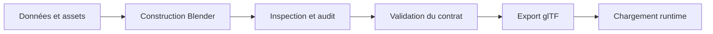

# Outillage Blender

## Responsabilité

Les outils Blender construisent, auditent, valident et exportent les sources 3D.
Ils ne remplacent pas le contrat runtime du chargeur glTF.

## Fichiers

- `tools/blender/README.md` est l'index des scripts, usages et exemples d'exécution.
- `tools/blender/kit_spec.py` déclare les pièces, dimensions et proxies du kit.
- `tools/blender/level_spec.py` porte les données des zones historiques.
- `tools/blender/build_level.py` construit une zone depuis sa définition.
- `tools/blender/build_combined_level.py` assemble les zones historiques.
- `tools/blender/export_level.py` exporte un fichier glTF binaire après contrôle des collections.
- `tools/blender/validate_level.py` contrôle les noms, propriétés, colliders et contraintes de scène.
- `tools/level_v2/plan_de_masse.py` porte les espaces et relations du niveau v2.
- `tools/level_v2/build_niveau.py` construit et habille le niveau v2 depuis ces données.
- `tools/level_v2/audit_niveau.py` mesure la géométrie construite et les problèmes spatiaux.
- `tools/blender/render_ingame.py` produit une vérification visuelle cadrée selon le rendu du jeu.
- `tools/blender/render_preview.py` produit des aperçus de scène.
- `assets_src/blender/` conserve les sources Blender et les builds régénérables.
- `public/assets/levels/` contient les fichiers exportés que le jeu charge.

## Où ça s'insère dans la boucle

Blender s'inscrit dans la préparation du contenu, en dehors de la boucle du jeu.
Une modification de source suit un cycle de construction, inspection, validation, export.
L'export est une étape distincte de la validation.
Le chargeur runtime consomme seulement le fichier final sous `public/assets/levels/`.

Le flux montre les étapes de contenu et la frontière vers le runtime.

## Données et contrats

### Niveau v2 dans la session ouverte

Le travail courant sur le niveau v2 suit les scripts, mais la vérification visuelle se fait dans la session Blender ouverte.
La scène ouverte est reconstruite par `tools/level_v2/build_niveau.py` dans cette session avec le connecteur Blender MCP.
L'audit et les corrections géométriques restent dans les scripts afin que le résultat soit régénérable.
La scène source Blender est un résultat de construction, pas la seule source du niveau.
Avant de sauvegarder une session ouverte, vérifier que son état correspond aux scripts courants.

### Niveaux historiques

`tools/blender/level_spec.py` décrit les zones consommées par `build_level.py`.
Le constructeur de zone et l'assembleur complet partagent les fonctions de géométrie.
Le kit modulaire est défini séparément dans `kit_spec.py` ; il sert aux scripts de construction et à la validation des pièces attendues.
Les outils headless restent adaptés aux rendus, audits et builds reproductibles qui ne demandent pas d'observation live.
Le choix entre session ouverte et exécution headless dépend donc de la tâche décrite, pas du format de sortie.

### Contrôle et audit

`tools/level_v2/audit_niveau.py` mesure les trous, bords ouverts, intersections et objets flottants du niveau v2.
`tools/blender/validate_level.py` vérifie le contrat de nommage, les propriétés extras, les noms de matériaux et les contraintes attendues.
Le code de retour zéro signifie conforme ; l'option `--strict` transforme les avertissements en erreurs.
L'audit géométrique et la validation de contrat couvrent des classes de défauts différentes.
La validation des zones historiques et celle du niveau v2 partagent les conventions glTF, mais leurs scripts de construction diffèrent.
Un avertissement connu doit être comparé au rapport de référence plutôt que supprimé automatiquement.
La sortie du validateur donne les noms et propriétés qui demandent une correction ou une justification.

### Export

`tools/blender/export_level.py` écrit le fichier glTF binaire à l'emplacement fourni.
Il contrôle que le view layer exporté est présent et que les collections d'atelier ne fuient pas dans le résultat.
Il ne lance pas `tools/blender/validate_level.py`.
Le fichier doit ensuite être chargé dans le jeu pour vérifier la reconnaissance des conventions runtime.
Les objets préfixés comme `door_*`, `use_*` et `sanitaire_*` transportent leurs propriétés Blender dans les extras glTF.

### Tâches d'assets

D'autres scripts Blender génèrent les sprites ennemis, les armes en vue subjective et leurs modèles au sol.
Ils partagent les conventions d'export, mais ne passent pas par le validateur du niveau.
Leurs entrées et sorties sont décrites dans [Générateurs d'assets](generateurs.md).

## Pièges

- Construire en headless pendant qu'une ancienne version est ouverte ne met pas à jour la session Blender visible.
- Sauvegarder la scène visible sans vérifier sa provenance peut remplacer une source plus récente par un état périmé.
- Un audit géométrique réussi ne prouve pas que les préfixes et extras répondent au loader.
- Une validation de contrat ne prouve pas l'absence de trous, d'objets flottants ou d'occlusion visuelle.
- Exporter sans lancer le validateur ne prouve que le succès glTF, pas la conformité des conventions.
- Un `door_*` ou un objet interactif composé de plusieurs primitives peut ne pas être reconnu comme un `Mesh` simple par le loader.
- Les collections `_KIT` et `_LIB` sont des ressources d'atelier, pas du décor à exporter.
- Un contrôle visuel dans Blender ne remplace pas une inspection à la résolution et au cadrage du jeu.
- Le fichier exporté ne remplace pas la scène source ni ses scripts de construction.

## Tests

- `tools/blender/validate_level.py` est le contrôle du contrat de contenu.
- `tools/level_v2/audit_niveau.py` est l'audit géométrique du niveau v2.
- `tools/blender/render_ingame.py` permet de contrôler l'apparence au rendu cible.
- Ces scripts valident le contenu et ne font pas partie de `pnpm test`.

## Comment vérifier que ça marche

Dans la session Blender du niveau v2, relancer `tools/level_v2/build_niveau.py` après toute modification des scripts.
Lancer l'audit décrit dans `tools/blender/README.md` et vérifier son rapport.
Lancer la validation stricte sur la scène construite ; expliquer tout avertissement nouveau.
Exporter avec `tools/blender/export_level.py` vers `public/assets/levels/`.
Charger le fichier dans le jeu et contrôler les spawns, portes, triggers et objets interactifs.
Pour une capture d'apparence, exécuter `tools/blender/render_ingame.py` sur la scène construite et inspecter l'image produite.
Comparer les comptes d'objets et le nom du fichier exporté au rapport de validation correspondant.
Pour les commandes et arguments exacts, consulter `tools/blender/README.md`.
