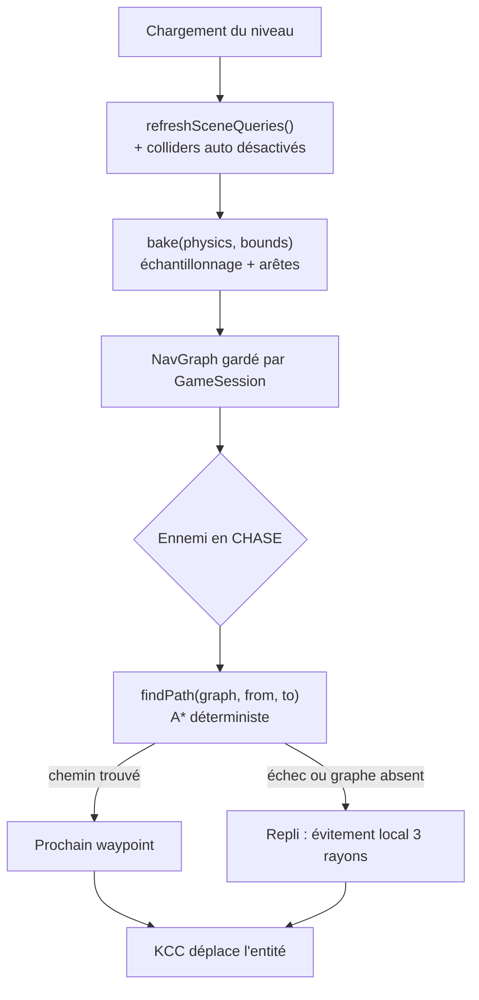

# Pathfinding

## Responsabilité

Fait : construit, une seule fois par niveau chargé, un graphe de
praticabilité 2.5D (`NavGraph`) à partir des colliders du décor, et répond à
des requêtes de chemin par A* déterministe entre deux positions monde
quelconques. Fournit aussi les compteurs de diagnostic de l'A*
(`astarMetricsSnapshot`).

Ne fait pas : ne pilote aucun ennemi. Ne connaît ni `Suit`/`Director` ni la
machine à états — c'est [Ennemis et IA](ennemis-et-ia.md) qui interroge le
graphe à chaque pas fixe et retombe sur l'évitement local à 3 rayons quand
aucun chemin n'est exploitable. Ne stocke jamais le graphe courant lui-même
(voir Données et contrats) : c'est l'appelant qui le garde. Ne lit jamais
`THREE.Object3D`/`LevelHandle` — l'AABB à échantillonner lui est fournie en
paramètre.

## Fichiers

- `src/game/level/pathfinding.ts` — le service complet : constantes de bake,
  `NavGraph`, `bakeNavGraphEffect`, l'A* (`MinHeap`, `astar`), la recherche de
  cellule la plus proche (`nearestWalkableCellIndex`), `PathfindingService`
  (layer réelle et `PathfindingService.test`).
- `src/game/session/spawning.ts` — `loadGltfLevel` : désactive les colliders
  des groupes de portes `auto` puis appelle `refreshSceneQueries()` et
  `PathfindingService.use((pf) => pf.bake(...))` au chargement ;
  `debugFindPath` (wrapper console).
- `src/game/entities/enemyMachine.ts` — `tryComputeChaseDirectionFromPath` :
  seul appelant de `findPath` au pas fixe, dans `runChase`.
- `src/game/level/doors.ts` — `DoorSystem.autoGroupColliders`, les colliders
  désactivés pendant le bake.
- `src/core/runtime.ts` — `PathfindingService.layer` assemblée dans
  `GameLayer`.
- `src/game/loop/updateFx.ts` — lit `astarMetricsSnapshot()` pour le panneau
  de debug.
- `src/game/devtools/consoleApi.ts` — `cassandre.pathfinding` (voir Comment
  vérifier).

## Où ça s'insère dans la boucle

Le bake a lieu **au chargement du niveau**, jamais dans le pas fixe
(`spawning.ts::loadGltfLevel`, avant le premier spawn d'ennemi) : le coût de
l'échantillonnage/des raycasts ne doit jamais retomber sur la boucle de jeu
([Boucle et temps](../3-architecture/boucle-et-temps.md)). `findPath`, lui,
tourne au pas fixe, mais seulement quand `runChase` en a besoin — voir
Données et contrats pour la fréquence réelle. `bake` passe par
`runGameplaySync` comme tout appel Effect synchrone de la frontière stricte
(invariant #11) ; le service consomme `RaycastService` en interne, jamais
exposé à l'appelant.

## Données et contrats

**`NavGraph`** (`pathfinding.ts`) : tableaux typés indexés par
`iz * cols + ix`, jamais une `Map`/`Set` (déterminisme d'itération, accès
O(1)). `groundY` (hauteur de sol monde, `NaN` si non praticable),
`walkable` (0/1), `neighborMask` (masque 8 bits par cellule, un bit par
direction de `DIRS`). `EMPTY_NAV_GRAPH` (0 cellule) sert de valeur par
défaut à `PathfindingService.test()`.

**`PathfindingService`** ne garde AUCUN état : `bake` construit et
**retourne** le graphe, `findPath` le **reçoit** en paramètre. C'est
`GameSession.currentNavGraph` qui le porte, rebâti à chaque chargement de
niveau (même patron que `RaycastService`/`DeterministicRandom` : un service
stateless, testable sans monde Rapier réel via `PathfindingService.test`).

**Bake, en deux passes** (`bakeNavGraphEffect`) :
1. **Hauteur de sol + élagage.** Grille horizontale de pas `NAV_CELL_SIZE`
   (0,5 m, multiple de la grille Blender 0,25 m). Par cellule, un rayon
   vertical descendant (`RaycastService.castRayAndGetNormal`, filtre
   `WORLD_ONLY_RAY_GROUPS` — membership `ENEMY`, filtre `WORLD` seul, jamais
   `PROP` : voir [Physique](physique.md)) trouve le premier collider
   STATIQUE touché ; une normale sous `MIN_FLOOR_NORMAL_Y`
   (`cos(maxSlopeClimbAngleDeg)`) écarte la cellule. Une capsule verticale
   du gabarit du Costard (`intersectionsWithShape`) élague ensuite toute
   cellule sans dégagement debout.
2. **Arêtes, 8-connectées.** Chaque paire adjacente n'est testée **qu'une
   fois** (`FORWARD_DIR_INDICES` : E/SE/S/SW, résultat appliqué aux deux
   cellules) : différence de hauteur sous `MAX_STEP_HEIGHT`
   (`suitConfig.autostepMaxHeight`, voir Pièges) sauf sur une pente continue
   (tolérance `tan(maxSlopeClimbAngleDeg) × distance`), rayon horizontal à
   hauteur d'œil sans mur, puis un balayage de capsule sur sol plat (pas
   sur une pente, qui donnerait un faux contact). Une diagonale n'est
   retenue que si ses deux détours orthogonaux sont aussi ouverts.

**Dimensionné sur le Costard, jamais le Directeur** : le graphe est unique
par niveau, partagé, calé sur `suitConfig` (gabarit légèrement plus petit).
Un couloir juste assez large pour un Costard mais pas pour le Directeur
ressort praticable pour les deux — risque jugé faible, le Directeur est un
boss unique posé dans une salle ouverte.

**Portes que le graphe traverse.** `loadGltfLevel` désactive
`DoorSystem.autoGroupColliders` (tout groupe `auto: true`/`auto: "ennemis"`)
avant `bake`, les réactive juste après : le graphe voit ces portes comme
déjà ouvertes, sinon une pièce derrière une porte automatique ne recevrait
aucune arête vers le reste du niveau. Une porte purement manuelle
(`manuelle: true`, sans `auto`) reste, elle, fermée pendant le bake — le
graphe ne la traverse pas.

**Plafonds sans collider.** Une colonne ne garde que le premier sol touché
en descendant : un plafond muni d'un collider deviendrait « le sol » de
toute la pièce dessous. Les plafonds n'ont donc jamais de collider — sans
rapport avec le rendu, uniquement pour laisser le rayon vertical atteindre
le vrai sol.

**Requête (`findPath`).** `from`/`to` tombent rarement pile sur un nœud de
grille : `nearestWalkableCellIndex` élargit en anneaux carrés jusqu'à
`NEAREST_CELL_SEARCH_RADIUS` (6 cellules), tie-break déterministe par
distance puis par index croissant. L'A* est un tas binaire array-based
(`MinHeap`), tie-break stable par index de grille croissant — jamais l'ordre
d'itération d'une `Map`/`Set` (condition dure du rejeu d'input F9/F10). Le
premier élément du chemin retourné n'est **jamais** la position de départ :
c'est le prochain waypoint.

**Fréquence de recalcul et cache de chemin.** `tryComputeChaseDirectionFromPath`
(`enemyMachine.ts`) ne relance `findPath` que si le chemin courant est épuisé
(`currentWaypointIndex >= currentPath.length`) ou si la cible a bougé de plus
de `PATH_REQUERY_DISTANCE` (1,5 m) depuis la dernière requête
(`lastPathQueryTarget`) — pas à chaque pas fixe. Le chemin est gardé dans le
contexte de l'entité (`currentPath`/`currentWaypointIndex`), avancé quand la
distance horizontale au waypoint courant descend sous
`WAYPOINT_REACHED_DISTANCE` (0,6 m).

**Combinaison avec l'évitement local.** Les deux mécanismes ne coexistent
JAMAIS sur le même pas : `runChase` essaie d'abord
`tryComputeChaseDirectionFromPath` ; si elle retourne `false` (pas de graphe,
`findPath` en échec, ou aucun chemin exploitable), repli complet sur
`computeAvoidedDirection` (3 rayons), inchangé depuis avant ce service. Le
pathfinding est prioritaire, l'évitement local est un filet de sécurité, pas
un raffinement appliqué en plus.

**Sans chemin.** `findPath` échoue avec `PathNotFoundError` si `from`/`to`
n'ont aucune cellule praticable à proximité, ou si les deux cellules
trouvées appartiennent à des composantes non connectées du graphe.
`tryComputeChaseDirectionFromPath` avale cette erreur
(`Effect.catch(() => Effect.succeed(null))`) et retourne `false` — jamais
d'exception qui remonterait au pas fixe.

## Pièges

**`MAX_STEP_HEIGHT` (0,35 m) est calé sur `autostepMaxHeight`, la vraie
marche du KCC ennemi — pas une valeur indépendante.** Le graphe ne simule
aucune trajectoire Y : il décide seulement si deux cellules adjacentes sont
reliées par une surface que le `KinematicCharacterController` (invariant #6)
peut réellement gravir. Utiliser une constante différente romprait cette
garantie sans avertissement : les deux valeurs sont identiques dans le code
actuel, `MAX_STEP_HEIGHT = suitConfig.autostepMaxHeight`.

**Broad-phase vide au premier bake.** Un `bake` lancé avant le premier
`world.step()` de la session (colliders du niveau qui vient d'être chargé
encore invisibles aux rayons) sort un graphe entièrement vide. C'est la même
cause racine que l'occlusion de ligne de vue non fiable
([Physique](physique.md), [ADR 0025](../decisions/0025-occlusion-lignes-de-vue-cause-racine.md)).
**Règle** : le pathfinding n'a réellement fonctionné en jeu qu'à partir du
2026-09-11 — `refreshSceneQueries()` manquait avant le bake, et le graphe
sortait vide en silence (aucune erreur, juste 0 cellule praticable) jusqu'à
ce que quelqu'un le remarque. `loadGltfLevel` appelle maintenant
`session.physics.refreshSceneQueries()` juste avant `bake`, sans exception —
tout retour de playtest sur le comportement de poursuite antérieur à cette
date est à lire à cette lumière.

**Élagage de sol sous une mezzanine.** Une seule hauteur de sol par colonne
XZ (le premier collider touché en descendant) : une zone entièrement
recouverte par un étage supérieur ressort comme la surface DU DESSUS, jamais
celle du dessous. Un vrai navmesh volumétrique lèverait cette limite —
explicitement hors scope.

**Le bake désactive les colliders `auto`, pas les `manuelle`.** Une porte à
carte ou une porte libre sans `auto` reste fermée pendant le bake ; si elle
doit être traversable par les ennemis avant d'être ouverte pour de vrai,
elle a besoin de `auto: "ennemis"` en plus de sa condition d'ouverture — pas
un oubli à corriger ici, un contrat de nommage glTF
(`6-reference/conventions-nommage.md`, pas encore écrite).

## Tests

- `test/game/level/pathfinding.test.ts` — bake contre un vrai monde Rapier
  (sol plat, pente à 45°, rebord de 0,8 m, mezzanine, diagonale coupée),
  `PathfindingService.test()` scriptée sans Rapier,
  `PhysicsWorld.refreshSceneQueries` (colliders neufs visibles au bake).
- `test/game/entities/suit.test.ts` / `director.test.ts` — sections
  « poursuite (chase) : pathfinding puis repli sur l'évitement local » :
  chemin scripté suivi jusqu'au bout, repli sur rayon direct dégagé quand
  `findPath` échoue (comportement par défaut de `PathfindingService.test()`).

## Comment vérifier que ça marche

- `pnpm test -- pathfinding suit director`.
- Console : `cassandre.pathfinding.graph()` (le `NavGraph` courant),
  `cassandre.pathfinding.stats()` (résumé agrégé), `cassandre.pathfinding.findPath(from, to)`
  (chemin direct, sans passer par un ennemi).
- Log au chargement : `[pathfinding] graphe baké — X/Y cellules praticables,
  Z arêtes (grille … pas …)` (`spawning.ts::loadGltfLevel`) — un graphe à 0
  cellule praticable après cette ligne signale le piège de broad-phase vide
  ci-dessus.
- Panneau de debug (`updateFx.ts`) : compteurs `astarMetricsSnapshot()`
  (requêtes, échecs, nœuds développés, durée dernière/max) — diagnostiques
  seulement, n'influencent jamais le chemin choisi ni le RNG.
