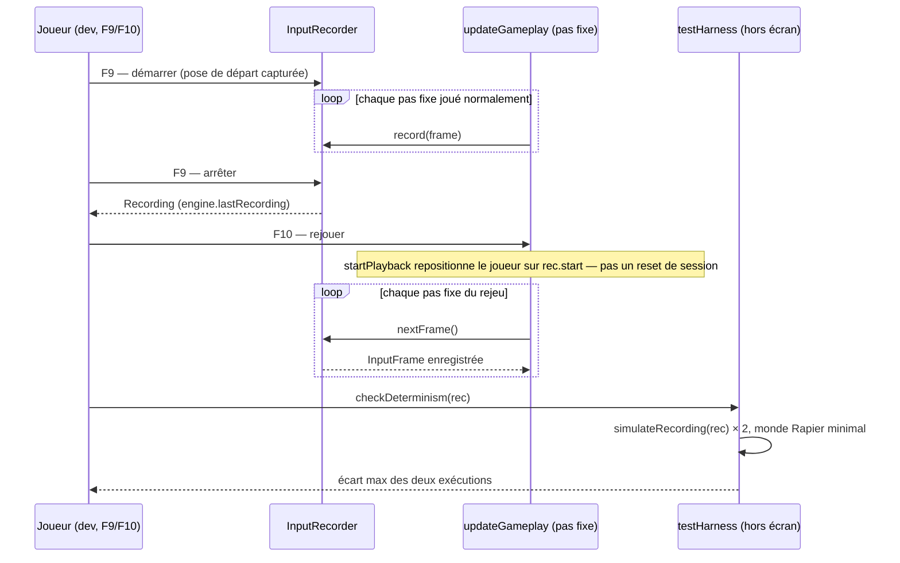

# Rejeu et déterminisme

## Responsabilité

Fait : garantit que le pas fixe produit toujours la même suite d'états à
entrées égales — condition posée par [Boucle et temps](../3-architecture/boucle-et-temps.md)
(invariant #1) et par l'invariant #12 (RNG déterministe) de
[Invariants](../3-architecture/invariants.md). Porte deux outils construits
sur cette garantie : `core/inputRecorder.ts` (enregistrer/rejouer une
séquence d'`InputFrame`, harnais F9/F10) et `core/random.ts::DeterministicRandom`
(seule source de nombres aléatoires du gameplay). Porte aussi la preuve hors
écran (`game/devtools/testHarness.ts::checkDeterminism`) qui rejoue deux fois
la même séquence et compare.

Ne fait pas : ne restaure aucun état du monde (ennemis, PV, portes, flux
RNG déjà consommés) au démarrage d'un rejeu — seule la pose du joueur est
repositionnée ([ADR 0033](../decisions/0033-rng-presentation-et-portee-du-rejeu.md)).
N'est pas une preuve de déterminisme du COMBAT ou du niveau : la preuve
hors écran ne couvre que le déplacement du joueur (position, vitesse, bob,
FOV, réception), pas les ennemis, les armes contre un monde physique peuplé,
ni Rapier lui-même. Ne fournit aucun RNG de présentation : ce flux est
séparé et documenté dans [Simulation et présentation](../3-architecture/simulation-et-presentation.md#le-rng-de-présentation).

## Fichiers

- `src/core/inputRecorder.ts` — `InputRecorder` (enregistrement, rejeu),
  `InputFrame`/`Recording`/`RecordingStart`, `recordingToJson`/`recordingFromJson`.
- `src/game/session/recording.ts` — `startRecording`/`startPlayback` :
  wrappers qui ajoutent l'état joueur (position/vitesse/yaw/pitch) à
  `inputRecorder`, rien de plus.
- `src/game/loop/devGameplayInput.ts` — détection des touches F8/F9/F10 au
  pas fixe, DEV seulement.
- `src/game/loop/updateGameplay.ts` — point où `activeFrame` vient soit du
  rejeu (`inputRecorder.nextFrame()`), soit de la capture live
  (`captureInputFrame`).
- `src/core/random.ts` — `DeterministicRandom` (service Effect), seule
  implémentation de `mulberry32` du dépôt.
- `src/core/runtime.ts` — `GameLayer`/`GameRuntime`/`runGameplaySync` :
  fournit `DeterministicRandom` au reste du jeu, protège la frontière
  synchrone (invariant #11, détail [Boucle et temps](../3-architecture/boucle-et-temps.md#la-frontière-synchrone)).
- `src/game/devtools/testHarness.ts` — `simulateRecording`/`checkDeterminism` :
  rejoue une séquence dans un monde Rapier minimal, hors rendu.
- `src/game/devtools/consoleApi.ts` — expose `recorder`, `lastRecording`,
  `playRecording`, `export/importRecording`, `simulateRecording`,
  `checkDeterminism` sous `cassandre.*`.

## Où ça s'insère dans la boucle

`handleDevGameplayInput` tourne seulement si `import.meta.env.DEV &&
engine.flow.isPhysicsLive()` — comme le hot reload de niveau, l'enregistrement/
rejeu n'existe pas dans un build de production. F9 bascule
`inputRecorder.isRecording()` : premier appui, `startRecording` capture la
pose actuelle du joueur puis démarre ; second appui, `stopRecording` range la
séquence dans `engine.lastRecording` (un seul emplacement, écrasé au F9
suivant). F10 exige `engine.lastRecording` non nul et appelle `startPlayback`,
qui téléporte le joueur sur `rec.start` (position, vitesse, yaw, pitch) **dans
la session en cours** — ni la `GameSession` ni ses systèmes de niveau ne sont
reconstruits, seule la capsule du joueur bouge.

Dans `updateGameplay`, avant tout le reste du pas fixe : si
`inputRecorder.isPlaying()`, `activeFrame` vient de `nextFrame()` (et
`engine.look.yaw`/`.pitch` sont réécrits depuis la frame rejouée) ; sinon,
`captureInputFrame` lit l'input réel et, si un enregistrement est en cours,
`inputRecorder.record(frame)` en garde une copie. Quand la séquence rejouée
s'épuise, `nextFrame()` retourne `null` une fois (frame vide ce pas-ci), puis
`isPlaying()` redevient faux et la capture live reprend au pas suivant.

## Données et contrats

**`InputFrame`** : mouvement (`forward`/`back`/`left`/`right`/`sprint`, état
tenu) et fronts déjà CONSOMMÉS (`jump`/`fire`/`switchTo*`/`use`, un appui = un
booléen vrai pour un seul pas fixe — jamais `isDown` brut, sinon un rejeu
répéterait l'action à chaque pas). `yaw`/`pitch` sont la valeur de visée AU
MOMENT du pas fixe, pas un delta (`dx`/`dy`, gardé à titre diagnostic
seulement) : c'est ce contrat — l'input TEL QUE CONSOMMÉ par le pas fixe,
jamais les évènements bruts du navigateur — qui rend un rejeu indépendant du
framerate d'affichage à l'enregistrement.

**`Recording`** : `version` (1, `recordingFromJson` refuse toute autre
valeur), `fixedDt` (celui de l'enregistrement, pas forcément celui de la
machine qui rejoue), `start` (`RecordingStart` : position/vitesse/yaw/pitch),
`frames`. Sérialisable (`recordingToJson`/`recordingFromJson`), donc
transportable hors du process qui l'a produit.

**`DeterministicRandom.forSeed(seed)`** (`core/random.ts`) fabrique un
générateur `mulberry32` INDÉPENDANT à chaque appel — jamais un flux partagé
entre appelants, sinon l'ordre d'appel romprait le rejeu. Consommé via
`runGameplaySync(DeterministicRandom.useSync((random) => random.forSeed(seed)))`
(détail du service : [Effect et XState](../3-architecture/effect-et-xstate.md#le-rng)).
Graines et propriétaires, jamais dérivées de `Math.random()`/`Date.now()` :

| Flux | Graine | Portée |
|---|---|---|
| Dispersion du pompe et du pistolet | `SHOTGUN_SPREAD_SEED` | Un seul flux, partagé par les deux armes, construit une fois à la création de `WeaponSystem` |
| Jitter de visée / déviation d'un Costard | `BASE_SUIT_SEED + index * SEED_STRIDE` (pas impair) | Une instance par ennemi spawné, jamais partagée entre deux Costards |
| Jitter de visée / déviation du Directeur | `BASE_DIRECTOR_SEED + index * SEED_STRIDE` | Même principe, base distincte — deux types d'ennemis ne partagent jamais une séquence |
| Gains de « vues » par kill | graine dédiée dans `session.viewsRandom` | Un flux par `GameSession`, avancé au pas fixe (à la mort d'un ennemi) |
| Répliques occasionnelles du héros | `HERO_LINE_SEED` dans `session.heroLineRandom` | Un flux par `GameSession`, avancé au pas fixe, seulement quand le cooldown laisse passer une réplique à probabilité (`heroLines.ts`) |
| FX / audio (cosmétique) | graines dédiées dans `lifecycle.ts` (`bootGameSession`) | Un flux par `GameSession`, réinitialisé au boot ; ne peut avancer aucun flux de simulation |

Tous ces flux, sauf le dernier, sont consommés DANS le pas fixe et entrent
donc dans la portée du rejeu déterministe (invariant #12). Le dernier (FX/
audio) en est délibérément exclu : voir [Simulation et présentation](../3-architecture/simulation-et-presentation.md#le-rng-de-présentation)
et [ADR 0033](../decisions/0033-rng-presentation-et-portee-du-rejeu.md).

**Portée réelle du rejeu F9/F10** : capture/restaure la pose et la vélocité
du joueur, rejoue les entrées pas fixe par pas fixe. Ne capture ni ne
restaure : les PV/positions des ennemis, l'état des portes/vitres/props/
sanitaires, l'inventaire de cartes, ni la position de lecture d'un flux
`DeterministicRandom` déjà entamé. Comparer deux variantes de combat au F10
exige donc de démarrer l'enregistrement à un état de cible connu (cible
fraîche à PV pleins), jamais après un combat déjà engagé.

## Pièges

**Le déterminisme de Rapier est une hypothèse, jamais prouvée dans ce
dépôt.** `checkDeterminism` prouve la reproductibilité du `PlayerController`
et de la vue (bob/FOV/réception) sur un monde minimal (un sol, aucun
ennemi) — pas celle du solveur Rapier en présence de dizaines de corps
dynamiques/kinématiques. Rien dans les tests ne détecterait un ordre
d'itération instable du monde physique lui-même.

**L'origine de tir ne vient jamais d'une position interpolée.**
`weaponEyeOrigin` (`updateGameplay.ts`) est reconstruite depuis
`session.player.position` après `player.update`, jamais depuis
`player.eyePosition(alpha, …)` (le rendu, [Simulation et présentation](../3-architecture/simulation-et-presentation.md)) :
une origine interpolée dépend du nombre d'images rendues entre deux pas
fixes, donc du framerate d'affichage à l'enregistrement — un rejeu sur une
machine plus rapide ou plus lente diverge en silence, sans qu'aucune erreur
ne s'affiche. Même règle pour `frame.yaw`/`frame.pitch` : la direction de
visée vient de la valeur capturée au pas fixe, jamais d'un angle lu au taux
d'affichage.

**Un seul emplacement de dernier enregistrement.** `engine.lastRecording`
n'a qu'une case : un nouveau F9/F10 écrase l'enregistrement précédent, il n'y
a pas de pile ni d'historique. `exportRecording`/`importRecording`
(console) existent pour en conserver plusieurs en dehors du moteur.

**Le rejeu ne survit pas à la production.** La garde
`import.meta.env.DEV && engine.flow.isPhysicsLive()` retire tout le module de
la boucle d'un build livré — un F9/F10 pressé en production ne fait
strictement rien, par construction plutôt que par convention respectée.

**Les répliques se décident au temps de gameplay.** Le cooldown
(`session.lastHeroLineAt`) et l'écart entre deux cris se comparent à
`stats.gameplayElapsed`, et le tirage d'une réplique occasionnelle n'a lieu
qu'après ce test : à entrées identiques, le rejeu dit les mêmes répliques au
même pas. Seule la durée d'AFFICHAGE du sous-titre suit la prise
enregistrée et une minuterie murale ; aucune décision de simulation n'en
dépend.

## Tests

- `test/core/random.test.ts` — séquences de référence de `DeterministicRandom`
  pour les graines réelles du jeu (pompe/pistolet, deux premiers spawns
  Costard et Directeur), calculées indépendamment du code de production ;
  prouve aussi que deux générateurs `forSeed` distincts ne s'entrelacent
  jamais.
- `test/game/updateDisplayInput.test.ts` — bascule sur `inputRecorder.isPlaying()`
  mocké, côté capture d'input au taux d'affichage.
- Aucun test vitest dédié à `InputRecorder` lui-même, ni à
  `testHarness.ts::simulateRecording`/`checkDeterminism` : ce sont des
  outils de console, vérifiés manuellement (voir ci-dessous), pas couverts
  par une suite permanente.

## Comment vérifier que ça marche

- `pnpm test -- random` — les trois séquences de référence et le test de
  non-entrelacement.
- En jeu (build DEV) : `F9` pour démarrer, se déplacer quelques secondes,
  `F9` pour arrêter, `F10` pour rejouer — la trajectoire doit visuellement
  se répéter.
- `cassandre.checkDeterminism(cassandre.lastRecording())` — rejoue deux fois
  la dernière séquence hors écran et rapporte l'écart maximal (attendu
  `< 1e-6`) sur position, vitesse, distance parcourue, bob, FOV et
  enfoncement de réception.
- `cassandre.exportRecording(cassandre.lastRecording())`/`importRecording(json)`
  pour conserver une séquence entre deux sessions de test.
- Pour diagnostiquer un vrai bug de simulation suspecté non déterministe :
  `5-guides/diagnostiquer-un-bug-de-simulation.md`.

## Décisions

- [ADR 0007 — RNG déterministe unique](../decisions/0007-rng-deterministe.md) — `DeterministicRandom` comme seule source, raison d'être de `forSeed` en fabrique.
- [ADR 0033 — RNG de présentation séparé et portée du rejeu F9/F10](../decisions/0033-rng-presentation-et-portee-du-rejeu.md) — ce que F9/F10 prouve et ce qu'il ne prouve pas, séparation simulation/présentation.
