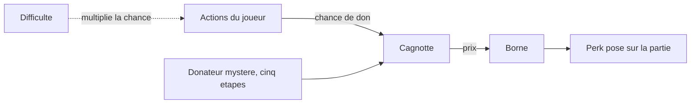

# Session et score

## Responsabilité

Fait : porte ce que `src/game/session/` ajoute AU-DESSUS de la
`GameSession` elle-même ([Cycle de vie](../3-architecture/cycle-de-vie.md)) —
comptage du score au pas fixe (`score.ts`), messages HUD et répliques du
héros (`feedback.ts`), inventaire des cartes de fidélité (`cards.ts`),
portes à carte et fin de niveau (`doors.ts`), règle des sanitaires
(`sanitaires.ts`), harnais d'enregistrement/rejeu (`recording.ts`) et filet
de chute (`fallRescue.ts`). Chaque module est appelé depuis
`game/loop/updateGameplay.ts`, jamais l'inverse.

Ne fait pas : ne construit ni ne détruit la `GameSession` ([Cycle de
vie](../3-architecture/cycle-de-vie.md)) ; ne décide pas des PV encaissés au
combat (`feedback.ts` applique un montant déjà calculé par les managers
d'ennemis, [Ennemis et IA](ennemis-et-ia.md)) ; ne connaît aucune arme,
aucune géométrie de porte/vitre/sanitaire (déléguée à `session.doorSystem`/
`vitreSystem`/`sanitaireSystem`, construits par `spawning.ts`, détail
[Systèmes de niveau](systemes-de-niveau.md)) ; ne rejoue rien
lui-même (`recording.ts` positionne le joueur puis délègue à
`inputRecorder`, détail [Rejeu et déterminisme](rejeu-et-determinisme.md)).

## Fichiers

- `src/game/session/gameSession.ts` — l'interface `GameSession` : champ →
  rôle documenté ci-dessous.
- `src/game/session/progression/score.ts` — `SessionStats`, les `record*`, le barème
  nommé (`SCORE_*`), `buildLevelRecap`/`publishLevelRecap`.
- `src/game/session/player/feedback.ts` — `showHudMessage` (canal système),
  `triggerHeroLine` (canal réplique, cooldown 15 s), `showAnnouncement`
  (canal annonce), `applyPlayerDamage`/`presentPlayerDamage` (PV et mort).
- `src/game/session/progression/difficulty.ts` — les trois difficultés et ce
  que chacune règle ; `src/game/settings/difficultySettings.ts` garde le choix.
- `src/game/settings/records.ts` — meilleur score et meilleur temps, par
  niveau et par difficulté.
- `src/game/session/progression/recap.ts` — publie le récapitulatif et
  inscrit un niveau terminé aux records.
- `src/game/session/progression/perks.ts` — achat à une borne, effet d'un perk.
- `src/game/session/stream/streamSim.ts` — simulation du direct, barème des
  dons (`streamConfig`) et journal du portefeuille.
- `src/game/devtools/economy/` — relevé simulé du portefeuille :
  `economyProfiles.ts` (parcours et profils de joueur), `economySim.ts` (le
  relevé), `economyVariants.ts` (variantes d'équilibrage) ;
  `tools/economy/releve.mjs` l'exécute hors du jeu.
- `src/game/session/presentation/difficultyOptions.ts` — ce que l'écran de
  choix montre de chaque difficulté.
- `src/game/session/progression/cards.ts` — `hasCard`/`grantCard`/`syncCardsToStore` :
  inventaire des cartes de fidélité.
- `src/game/session/progression/doors.ts` — `unlockDoor`/`tryOpenCardDoor`,
  `estPorteDeSortie`, `setupExitDoorTracking`/`triggerLevelComplete`.
- `src/game/session/player/sanitaires.ts` — `trySanitaire` (visée + dispatch),
  `relieveAtSanitaire`/`drinkFromSanitaire` : la règle Duke 3D.
- `src/game/devtools/replay/recording.ts` — `startRecording`/`startPlayback` : pose
  le joueur au point de départ enregistré avant de déléguer à
  `inputRecorder` (F9/F10).
- `src/game/session/player/fallRescue.ts` — `recordSafeGround`/`shouldRescue`,
  `RESCUE_FALL_DEPTH` (détail du calcul : [Joueur](joueur.md#pièges)).
- `src/game/session/spawning.ts` — `spawnSuitAt`/`spawnDirectorAt` (couvert
  par [Ennemis et IA](ennemis-et-ia.md)) et `loadGltfLevel` : construit
  `DoorSystem`/`VitreSystem`/`SanitaireSystem`/`LightPool`/`PropSystem`, bake
  le graphe de navigation, dresse les billboards d'armes/soin/munitions au
  sol, publie tout en un seul commit ([Cycle de vie](../3-architecture/cycle-de-vie.md)
  pour le mécanisme candidat/génération).
- `src/game/loop/updateGameplay.ts` — orchestre tous ces modules, dans
  l'ordre décrit plus bas.

## Où ça s'insère dans la boucle

Ordre complet du pas fixe : [Boucle et temps](../3-architecture/boucle-et-temps.md).
Dans `updateGameplay` (`Effect.gen`, un seul `runGameplaySync` englobant) :

1. `advanceGameplayTime` — avec le `gameplayDt` réel (hitstop compris).
2. Décrément de `session.sanitaireReliefCooldown` par le même `gameplayDt`.
3. `player.update`, puis le filet de chute.
4. `engine.interaction.update(...)` (`use_*` : cartes, portes, micro,
   `use_toilet`). Si rien n'est consommé, `trySanitaire` ; si toujours rien,
   `session.doorSystem?.actionner(...)`. L'ordre est signifiant : sans lui,
   le bouton d'une porte et la porte elle-même pourraient réagir au même
   appui.
5. Ramassages sans touche (munitions, armes au sol, trousses).
6. `weaponEyeOrigin` reconstruite depuis `session.player.position`, puis
   `weapons.update(...)` : `recordShot` compare `hitEvents` avant/après pour
   savoir si CE tir a touché `FLESH_MATERIAL`.
7. `suitManager`/`directorManager.update` (delta sur `deathEvents` →
   `recordSuitKills`/`recordDirectorKills` + `streamEvent`/réplique
   « premier kill » ; delta sur `playerHitEvents` → `applyPlayerDamage`),
   puis `propSystem`/`vitreSystem`/`sanitaireSystem.update(hitEvents)` (même
   technique de delta → `record*Destroyed`), puis `doorSystem.update(...)`
   — après les managers, pour lire des positions déjà avancées.
8. Phase finale : ramassage de la carte du Directeur (`grantCard`), test de
   franchissement de `exitDoorTracking` (`triggerLevelComplete`), test AABB
   des secrets (`foundSecrets`/messages/réplique).

`applyPlayerDamage`/`triggerLevelComplete` peuvent terminer la partie — le
pas fixe qui produit l'évènement va jusqu'au bout (invariant #1) ; c'est le
**pas suivant** qui trouve `engine.flow.isPlaying()` à `false` et retourne
avant tout le reste. `recording.ts` est hors de cette séquence : appelé
depuis `game/loop/devGameplayInput.ts` (F9/F10, dev seulement).

## Données et contrats

**Champ → rôle de `GameSession`** :

| Champ | Rôle |
|---|---|
| `choice` | `LevelDef` de boot — pour que « Rejouer » reconstruise le même choix. |
| `difficulty` | Difficulté de la partie, lue une fois à sa construction. |
| `perks`, `pickupRadius`, `killRushRemaining` | Perks achetés et les valeurs de partie qu'ils modifient. |
| `levelScript` | Déclencheurs franchis, scénarios en cours et ennemis réveillés par groupe. |
| `physics`, `player`, `weapons` | Monde Rapier, contrôleur joueur, armes — pages dédiées. |
| `suitManager`/`suitSprites`, `directorManager`/`directorSprites` | Ennemis et leur sprite — [Ennemis et IA](ennemis-et-ia.md). |
| `gymRoot`/`ballMesh`/`ballBody` | Géométrie de la gym (chemin `"gym"`). |
| `gltfLevelSession` | Porte le `LevelHandle` affiché et le hot reload. |
| `levelLoadGeneration` | Jeton anti-course d'un chargement différé. |
| `currentNavGraph`, `lightPool`, `propSystem`, `doorSystem`, `vitreSystem`, `sanitaireSystem`, `weaponPickupBillboards` | Systèmes du niveau COURANT, reconstruits ensemble à chaque commit — jamais partiellement. |
| `sanitaireReliefCooldown` | Délai global de soulagement — état de PARTIE, remis à 0 par `bootGameSession`. |
| `droppedCardBillboard`, `cards` | Carte au sol après la mort du Directeur (`directorManager.droppedCard`) ; inventaire réel (`Set`, jamais le store). |
| `unlockedDoors`, `exitDoorTracking`, `foundSecrets` | Portes déjà déverrouillées ; suivi de franchissement de la sortie ; secrets trouvés (`WeakSet`). |
| `lastSafeGround` | Filet de chute. |
| `playerHp`, `firstKillTriggered`, `lowHpLineTriggered`, `stream`, `streamRandom`, `deathHandled`, `levelCompleteHandled`, `lastHeroLineAt`, `lastHeroBarkAt`, `heroLinesSaid`, `heroLineRandom` | PV, drapeaux d'idempotence, répliques déjà dites, deux flux `DeterministicRandom` DÉDIÉS (vues, tirage des répliques occasionnelles — jamais `Math.random()`, invariant #12). |
| `stats` | `SessionStats`, ci-dessous. |

**`SessionStats`** : `suitKills`, `directorKills`, `shotsFired`/
`shotsHitEnemy` (un tir compte s'il a réellement déclenché l'arme, touche
s'il a au moins un impact sur `FLESH_MATERIAL`), `propsDestroyed`/
`vitresDestroyed`/`sanitairesDestroyed`, `gameplayElapsed` (somme de
`gameplayDt`), `hpLost` (informatif). Chaque `record*` MUTE `stats` en
place.

**Barème nommé** : `SCORE_SUIT_KILL` = 100, `SCORE_DIRECTOR_KILL` = 1000
(dix fois un Costard — distinct du multiplicateur de vues ×4),
`SCORE_SECRET` = 500, `SCORE_ALL_SECRETS_BONUS` = 1000, `SCORE_PAR_TIME_POINTS_PER_SECOND`
= 10, `SCORE_ACCURACY_MAX_POINTS` = 1000 (réparti sur `shotsHitEnemy /
shotsFired`), `SCORE_VANDALISM_PROP` = 10, `_VITRE` = 25, `_SANITAIRE` = 50.
Constantes nommées comme point de départ, pas un tuning arrêté.

**`parTime`** : champ optionnel de `LevelDef` (`src/game/level/catalog/levels.ts`),
absent sur la gym et les zones de test. La ligne « Rapidité » n'apparaît
que si non nul ; au-delà, « Temps de référence dépassé », 0 point.

**Récap partiel vs complet** : `buildLevelRecap` est PURE (compteurs déjà
figés). `publishLevelRecap(session, includeTimeBonus)` est le seul point
impur, appelé deux fois : `doors.ts::triggerLevelComplete` (`true`, récap
COMPLET, avant l'évènement de flux) et `feedback.ts::applyPlayerDamage`
(`false`, récap PARTIEL — une mort n'a pas gagné son bonus de chrono).

**Cartes de fidélité** : `session.cards` (`Set<LoyaltyCard>`) est la source
de vérité ([ADR 0036](../decisions/0036-contrats-feuilles-et-store-hud.md)) ;
`grantCard` ignore un doublon en silence (hot reload). Détail des trois
cartes et de leurs portes : [Objets interactifs](../2-fonctionnel/objets-interactifs.md)
et [Joueur](joueur.md#données-et-contrats) — pas répété ici.

**Portes à carte et fin de niveau** : `unlockDoor` délègue au
`doorSystem` et ouvre le GROUPE entier (porte double), `false` si le nom ne
correspond à aucun `door_*`. `tryOpenCardDoor` refuse sans consommer si la
carte manque (réessayable). `estPorteDeSortie` reconnaît `door_e_exit`
(Zone E) et `door_exit` (niveau v2). Seule une porte de sortie arme
`ExitDoorTracking` : axe dérivé de la VRAIE rotation du corps, signe fixé à
la position du joueur au déverrouillage. `triggerLevelComplete` gardé par
`levelCompleteHandled`.

**Sanitaires** ([ADR 0032](../decisions/0032-sanitaires-utilisables.md)) :
`trySanitaire` lance un rayon depuis l'œil (origine/direction authentiques,
jamais interpolées) à `SANITAIRE_AIM_RANGE_METERS` (1,4 m, plus court que
les 2 m d'un `use_*` générique), délègue à `SanitaireSystem.resolveAim`,
dispatche : intact → `relieveAtSanitaire` (+10 % PV max, puis
`SANITAIRE_RELIEF_COOLDOWN_SECONDS` = 220 s GLOBAL ; à PV pleins ou en
délai, la chasse d'eau part sans soigner, délai non consommé à PV pleins) ;
cassé → `drinkFromSanitaire` (+1 PV/appui, illimité). `onToiletUse`
(compatibilité) appelle directement `relieveAtSanitaire`.

**Feedback joueur** : `showHudMessage` est FACTUEL, sans cooldown
(1,8 s d'affichage). `triggerHeroLine` est une RÉACTION enregistrée
(`heroLines.ts`) : cooldown global 15 s sauf pour les répliques
prioritaires, tirage dans `session.heroLineRandom` pour les occasionnelles.
Le direct (`session/stream/`, [ADR 0038](../decisions/0038-simulation-du-direct.md)) tire dans `session.streamRandom`
(flux dédié) : audience, dons et chat — sans lien avec le score du récap.
`applyPlayerDamage` décrémente `playerHp`, déclenche la réplique « PV bas »
au premier franchissement de 30 % du max (sinon une réplique ou un cri de
douleur), publie le récap PARTIEL et
appelle `engine.flow.playerDied()` à la mort (gardé par `deathHandled`).
`presentPlayerDamage` ne fait que publier au store (invariant #2).

### Difficulté

`buildGameSession` lit la difficulté mémorisée et la range dans la partie
([ADR 0042](../decisions/0042-difficulte.md)). Elle sert à trois endroits, tous
à la construction ou dans le pas fixe :

- les gestionnaires d'ennemis reçoivent un réglage de PV et de dégâts, posé
  sur une copie de chaque configuration ;
- la simulation du direct reçoit un multiplicateur de probabilité de don ;
- le script de niveau ne réveille qu'une part d'un groupe (`wokenSpawns`, dans
  `difficulty.ts`).

Changer le réglage mémorisé en cours de partie n'a aucun effet sur elle.

### Records

`publishLevelRecap(session, completed)` construit le récapitulatif avec le nom
de la difficulté. Si le niveau est terminé, il inscrit la partie
(`submitRun`) et pose sur le récapitulatif l'état du record de score. Une
mort publie un récapitulatif sans record.

Un record est rangé sous la clé `niveau/difficulté`. Le score et le temps
progressent chacun de leur côté. Le tout est gardé dans le `localStorage` du
navigateur ; s'il manque ou ne se décode pas, le carnet repart vide.

### Économie du direct

La cagnotte est un état de la simulation du direct
([ADR 0038](../decisions/0038-simulation-du-direct.md)). Elle a trois entrées
et une sortie, que ce diagramme résume.

Le barème est dans `streamConfig` : une probabilité et des montants par sorte
d'évènement, et un montant par étape du donateur mystère. Chaque don et
chaque achat s'ajoutent au journal de la partie (`StreamState.ledger`), daté
en secondes de jeu, avec le solde.

Trois réglages complets existent, les variantes A, B et C
(`src/game/devtools/economy/economyVariants.ts`). La B est celle du jeu : ses
dons sont les valeurs de `streamConfig`, ses prix ceux que la recette pose
dans le niveau. Un test vérifie que les trois restent d'accord. Une variante
à l'essai impose ses prix par-dessus ceux du niveau (`perkPrices`).

Le relevé (`economySim.ts`) rejoue une partie type à travers la vraie
simulation : une suite d'étapes du niveau, un profil de joueur, une graine.
Il rend le solde devant chaque borne et le nombre de perks achetés. Les
profils sont des hypothèses, pas des mesures : le journal d'une vraie partie
fait foi.

## Pièges

La [campagne](campagne.md) conserve l’équipement de sortie du magasin et
construit le métro avec cette arrivée. La mort emploie sa copie d’entrée,
jamais l’inventaire au moment de mourir. Le mode `--campagne` du relevé
économique ajoute un second parcours hypothétique jusqu’à N5.

- Le don du Directeur arrive après la dernière borne : il compte pour le
  bilan, pas pour les achats. Le relevé distingue le total reçu de ce qui est
  utile.
- Le relevé ne sait rien du niveau réel : son parcours est une table écrite à
  la main dans `economySim.ts`. Ajouter une borne ou une rencontre demande de
  la mettre à jour.
- Un enregistrement d'input ne porte pas la difficulté ; rejoué dans une
  autre, il diverge.

**L'ordre de priorité d'un appui sur `E` est signifiant.** `use_*` avant
sanitaire avant porte manœuvrable : sans cet ordre, le bouton d'une porte
coupe-feu et la porte elle-même réagiraient au même appui.

**Le récap partiel n'a pas droit au bonus de chrono, et ce n'est pas un
oubli.** `includeTimeBonus: false` force `parTimeSeconds` à `null` : une
mort n'a pas fini le niveau, calculer une rapidité n'aurait aucun sens.

**Le délai de soulagement suit le VRAI `gameplayDt`.** Un hitstop qui
ralentit le gameplay ralentit aussi l'écoulement des 220 s — surprenant si
on s'attend à un minuteur mural.

**Le compteur de vues et le score de fin de partie ne partagent RIEN.**
Deux échelles indépendantes, chacune son multiplicateur pour le Directeur
(×4 contre un facteur 10 dans le barème) — confondre les deux en lisant le
code est facile, voir le glossaire.

## Tests

- `test/game/session/progression/score.test.ts` — partie PURE de `score.ts` avec de
  simples objets, sans DOM/Three.js/Rapier ; `publishLevelRecap` non testé
  directement.
- `test/game/session/player/feedback.test.ts` — `applyPlayerDamage` (PV, mort au
  même pas logique, idempotence), `presentPlayerDamage`.
- `test/game/session/stream/streamSim.test.ts` et `streamTexts.test.ts` — déterminisme du direct, série de kills, ennui, délai entre dons, rythme du chat, et tenue des textes.
- `test/game/session/progression/difficulty.test.ts`, `recap.test.ts`,
  `test/game/settings/records.test.ts` et `difficultySettings.test.ts` —
  règles des trois difficultés, taille des groupes, records par difficulté,
  récapitulatif publié. `test/game/session/presentation/difficultyOptions.test.ts`
  — ce que l'écran de choix en montre.
- `test/game/devtools/economy/economySim.test.ts` et
  `economyVariants.test.ts` — relevé déterministe, cible de la variante B,
  accord entre `streamConfig`, la variante et les prix du niveau.
- `test/game/session/player/sanitaires.test.ts` — orchestration avec un rayon
  Rapier scripté (`RaycastService.test(...)`) ; la géométrie du « neartag »
  est couverte par `test/game/level/sanitaires/sanitaires.test.ts`.
- `test/game/session/player/fallRescue.test.ts` — y compris le piège du joueur
  téléporté qui se déclare au sol dans le vide.
- `test/game/session/lifecycle.test.ts` — `bootGameSession`/
  `teardownGameSession`, hors périmètre de cette page.
- `test/game/player/loyaltyCards.test.ts` — `parseLoyaltyCard` ; `cards.ts`
  lui-même n'a pas de test dédié (couvert indirectement).

Aucun test dédié ne couvre `doors.ts` ni `spawning.ts::loadGltfLevel` :
vérifiés en jeu via la console, pas par une suite permanente.

## Comment vérifier que ça marche

- `pnpm test -- score feedback sanitaires fallRescue lifecycle loyaltyCards`.
- `cassandre.recap.stats()`/`.recap()` — compteurs bruts et dernier récap
  publié ; `.completeLevel()`/`.killPlayer()` déclenchent le vrai chemin de
  fin de partie sans jouer jusqu'au bout.
- `cassandre.cards()`/`.giveCard(carte)` — inventaire et ramassage forcé.
- `cassandre.bornes.liste()` — les bornes du niveau et leur prix ;
  `cassandre.economie.journal()` — les dons et achats de la partie ;
  `cassandre.economie.releve()` — le relevé simulé avec les réglages en place.
- `pnpm economy` — le même relevé hors du jeu, pour les trois variantes.
- `cassandre.doors()`, `cassandre.doorSystem.liste()`/`.ouvrir(nom)`/
  `.actionner()` — état et pilotage direct des vantaux.
- `cassandre.sanitaires.liste()`/`.casser(nom)`/`.jets()`/`.delai()`/
  `.forcerDelai(secondes)`.
- `cassandre.secrets()` — volumes AABB des `secret_*` du niveau chargé.

## Décisions

- [ADR 0036 — Contrats feuilles et store HUD](../decisions/0036-contrats-feuilles-et-store-hud.md) — l'inventaire de cartes et les PV vivent dans `GameSession`.
- [ADR 0031 — Portes animées et vitres](../decisions/0031-portes-animees-et-vitres.md) — le contrat `DoorSystem` que `doors.ts` pilote.
- [ADR 0032 — Sanitaires utilisables](../decisions/0032-sanitaires-utilisables.md) — la règle complète et ses écarts volontaires à Duke 3D.
- [ADR 0033 — RNG de présentation et portée du rejeu F9/F10](../decisions/0033-rng-presentation-et-portee-du-rejeu.md) — les flux dédiés (vues, réplique de soulagement).
- [ADR 0038 — Simulation du direct](../decisions/0038-simulation-du-direct.md) — la cagnotte comme état de partie.
- [ADR 0040 — Bornes et perks](../decisions/0040-bornes-et-perks.md) — l'achat en partie.
- [ADR 0042 — Difficulté](../decisions/0042-difficulte.md) — un réglage posé sur la partie, des records séparés.
- [ADR 0013 — Deux gardes distinctes](../decisions/0013-garde-flux-vs-monde-physique.md) — la garde `engine.flow.isPlaying()` testée avant tout ce que cette page décrit.
