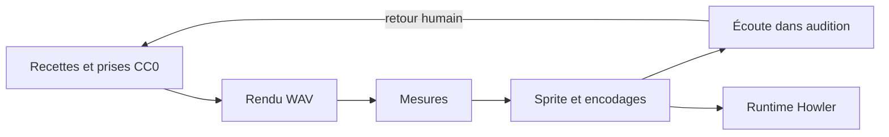

# Studio audio

## Responsabilité

Le studio audio transforme des recettes et des prises sous licence en fichiers sonores mesurables et empaquetés.
Il ne lit pas ces assets pendant le jeu ; le runtime les charge depuis `public/assets/audio/`.

## Fichiers

- `tools/audio/synth.py` fournit les briques de synthèse et de traitement du signal.
- `tools/audio/recipes.py` décrit les recettes paramétriques et leur graine.
- `tools/audio/enregistrements.py` lit et prépare les prises CC0.
- `tools/audio/render_sfx.py` rend une sélection de recettes en fichiers WAV.
- `tools/audio/analyze_sfx.py` calcule les mesures, spectrogrammes, masquage et raccord de boucle.
- `tools/audio/build_sprite.py` assemble les sons en sprite et encode les fichiers servis au runtime.
- `tools/audio/audition.py` génère une page locale d'écoute et de comparaison.
- `tools/audio/README.md` documente la chaîne, les recettes et les commandes.
- `assets_src/cc0_raw/` contient les sources CC0 brutes, ignorées par Git.
- `assets_src/LICENCES_ASSETS.md` tient le registre des licences.
- `public/assets/audio/sfx/` reçoit le sprite final et les ambiances encodées.

## Où ça s'insère dans la boucle

Le studio s'exécute hors du jeu comme une chaîne de préparation d'assets.
Les recettes et prises alimentent le rendu WAV, puis les mesures et l'encodage.
Le résultat rejoint les autres assets publics.
Le runtime lit le manifeste sans appeler les scripts du studio.

Le diagramme résume la chaîne de fabrication et sa vérification humaine.

## Données et contrats

### Origines des sons

La direction audio sépare les sons d'objets physiques des sons sans source physique.
Les objets doivent venir d'enregistrements CC0 distincts par famille ; l'interface et les phénomènes impossibles peuvent être synthétisés.
Les deux origines se rencontrent dans une même recette.
À l'état actuel, `ceramic_break` combine des prises de vaisselle Kenney et des couches synthétiques.
Les autres recettes du catalogue sont synthétisées tant que les prises utilisateur attendues ne sont pas présentes.
Le registre de licence doit couvrir chaque fichier source utilisé.

### Recette et rendu

`recipes.py` expose des recettes reproductibles à graine égale.
`render_sfx.py` peut rendre tout le catalogue, une recette ou des variantes.
Le catalogue déclare 38 recettes réparties entre armes, impacts, ramassages, ennemis, interactifs, interface et ambiances.
Une variante sert à comparer une recette sans remplacer sa définition versionnée.
Une prise absente ou non enregistrée fait échouer le build correspondant ; le reste peut être rendu pour diagnostic, mais ce dossier incomplet ne doit pas être empaqueté.
Les WAV sont des intermédiaires de build.
Les sources éditables restent la recette, les paramètres et les fichiers bruts autorisés.

### Mesures audio

`analyze_sfx.py` examine niveau, crête, facteur de crête et spectre.
L'option `--mask` compare deux sons qui peuvent se chevaucher dans une scène.
La mesure de timbre compare des bandes log après retrait de la moyenne.
La commande de boucle cherche un raccord dans la forme d'onde.
Ces mesures signalent des défauts mesurables ; elles ne décident pas si un son évoque bien son objet.

### Sprite et codecs

`build_sprite.py` produit le manifeste `sfx.json` et les variantes Ogg et M4A.
Le manifeste associe le nom de la recette à un début et une durée exprimés en millisecondes.
Le jeu consomme ces clés par `SFX_TABLE`.
Les ambiances streamées sont encodées à part du sprite ponctuel.
Les boucles déclarées exactes sont décodées après encodage puis contrôlées au raccord.
Les ambiances de zone utilisent une procédure de fondu croisé distincte du jet d'eau périodique.
Le manifeste des SFX ne remplace pas les fichiers d'ambiance streamés.

### Écoute humaine

`audition.py` écrit une page locale pour écouter le catalogue, ses variantes et ses mesures.
Un spectrogramme décrit l'énergie fréquentielle et son évolution, pas l'impression d'objet.
L'écoute humaine reste la vérification finale du timbre, du rythme et du niveau perçu.
Un agent qui n'écoute pas l'audio ne peut pas déclarer cette étape validée.

## Pièges

- Empaqueter des WAV issus d'un rendu incomplet peut omettre les recettes dont les prises sont manquantes.
- Un encodeur absent ou défectueux peut produire un seul codec ou un fichier invalide ; le build vérifie les deux sorties attendues.
- Un son encodé avec perte peut dépasser son niveau de crête d'origine.
- Le fondu croisé adapté à une ambiance légère peut creuser un bruit dense et périodique.
- Une recette déterministe ne garantit pas que le résultat sonne comme l'objet attendu.
- Des fichiers bruts ignorés par Git rendent le build non reproductible sur une autre machine s'ils ne sont pas récupérés depuis leur source autorisée.
- Le fichier audio ne suffit pas à documenter sa licence ; conserver le registre et la provenance.
- Les mesures de similarité et de masquage dépendent de la paire analysée et ne remplacent pas l'écoute de la scène.

## Tests

- `tools/audio/analyze_sfx.py` propose les contrôles de spectre, masquage, niveau et raccord.
- `tools/audio/build_sprite.py` vérifie les encodages présents et les boucles exactes déclarées.
- Il n'y a pas de fichiers de tests unitaires Python dédiés dans `tools/audio/` ; l'analyse et le build du sprite servent de contrôles sur les sorties.
- Aucun résultat de mesure ne remplace l'écoute des sons par une personne.

## Comment vérifier que ça marche

Suivre la chaîne et les arguments de `tools/audio/README.md`.
Rendre les recettes dans un dossier WAV temporaire, puis lancer l'analyse avant l'empaquetage.
Écouter les fichiers sur la page locale créée par `audition.py`.
Vérifier que `public/assets/audio/sfx/sfx.json`, `sfx.ogg` et `sfx.m4a` existent après le build.
Dans le jeu, vérifier les identifiants avec `window.cassandre.sfx.liste()` et déclencher un son de test.
Pour tester le masquage, choisir une paire de sons susceptibles de coïncider en combat et lire le rapport avec leur scénario d'usage en tête.
Pour tester une boucle, écouter plusieurs répétitions consécutives, puis compléter l'écoute par la mesure de raccord encodé.
