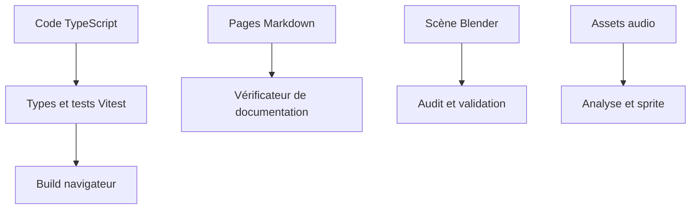

# Tests et qualité

## Responsabilité

Les contrôles vérifient les contrats de code, de documentation et de contenu.
Ils ne remplacent pas l'inspection visuelle, l'écoute ou un playtest quand le défaut porte sur le ressenti.

## Fichiers

- `package.json` définit les commandes pnpm du dépôt.
- `vitest.config.ts` configure l'exécution des tests TypeScript.
- `test/` contient les tests du moteur, du rendu, du jeu et de l'interface.
- `tools/docs/check_docs_links.py` contrôle les liens et la structure documentaire.
- `tools/docs/` contient les tests Python du vérificateur de documentation.
- `tools/blender/validate_level.py` valide les contrats du contenu Blender.
- `tools/level_v2/audit_niveau.py` inspecte la géométrie du niveau v2.
- `tools/audio/analyze_sfx.py` mesure les assets sonores.
- `tools/audio/build_sprite.py` contrôle l'empaquetage audio.

## Où ça s'insère dans la boucle

Les suites unitaires et le contrôle des types s'exécutent hors de la boucle du jeu.
Le build vérifie les types puis produit les bundles du navigateur.
Les validateurs Blender et audio s'exécutent sur les assets après leur génération.
Les contrôles documentaires s'exécutent sur les pages et leurs liens.
Aucune de ces commandes n'ajoute de travail au pas fixe ni au rendu.

Le diagramme distingue les contrôles selon leur surface.

## Données et contrats

### Commandes du dépôt

`pnpm test` lance `vitest run` sur les fichiers `test/**/*.test.ts`.
`pnpm typecheck` lance le contrôle TypeScript sans produire de bundle.
`pnpm build` exécute TypeScript puis Vite.
`pnpm check` enchaîne typecheck, tests, contrôle documentaire strict et build.
`pnpm check:docs` lance seul le validateur documentaire en mode strict, tout en tolérant les pages volontairement vides.
`pnpm check:docs:test` lance les tests Python du validateur.

### Tests TypeScript

Les tests Vitest s'exécutent dans l'environnement `node`.
Ils couvrent notamment les calculs purs, les systèmes de physique, l'import de niveau, le rendu, les machines d'ennemis, l'interface et le déterminisme.
La suite n'émule pas tout le navigateur ni tous les parcours de jeu.
Un test unitaire garantit le contrat qu'il appelle ; il ne garantit pas la qualité sensorielle d'un effet visuel ou sonore.
Les tests sont regroupés par domaine sous `test/core/`, `test/game/`, `test/physics/`, `test/render/` et `test/ui/`.
Les tests de documentation sont une suite Python distincte de Vitest.
Vitest ne lance pas Blender ni les outils du studio audio.
Le code des tests et leurs fixtures sont donc propres à chaque domaine.
Un résultat de commande doit être lu avec ses avertissements et son code de sortie.

### Documentation

`check_docs_links.py` vérifie les champs de frontmatter, les chemins de sources, les liens Markdown et les ancres.
Le mode `--allow-empty-drafts` tolère les squelettes explicitement marqués brouillon.
Les pages documentaires actuelles passent aussi en mode strict.
Les tests du checker valident ses règles et cas d'entrée, pas le contenu métier de chaque page.

### Contenu et assets

Le validateur Blender contrôle les conventions d'objet et de scène ; `audit_niveau.py` contrôle des défauts géométriques.
L'analyse audio mesure les fichiers rendus et l'empaquetage.
Ces outils de contenu sont des commandes séparées, pas des étapes automatiques de `pnpm check`; le vérificateur documentaire, lui, est inclus.
La validation sensorielle nécessite de voir la scène au rendu jeu, d'écouter les sons et de jouer la situation concernée.
Une validation documentaire ne certifie pas les pages contre l'expérience en jeu.

## Pièges

- Un typecheck propre ne prouve pas que le jeu se comporte correctement.
- Un test vert couvre uniquement les assertions de son fichier.
- `pnpm build` ne remplace pas les tests Vitest.
- `pnpm check:docs` tolère les squelettes explicitement marqués brouillon, mais échoue sur les liens et ancres invalides.
- Le validateur Blender ne remplace pas l'audit géométrique ni l'export glTF.
- Les contrôles audio ne disent pas si le son est évocateur à l'écoute.
- Une capture isolée ne confirme pas qu'une interaction complète fonctionne.
- Les outils de contenu ne s'exécutent pas automatiquement dans le cycle pnpm standard.
- Lancer un contrôle sur une sortie générée ancienne ne prouve pas que la source actuelle reconstruit le même résultat.
- La commande `pnpm check` est plus large et plus coûteuse qu'un test ciblé.

## Tests

- `test/core/loop/loop.test.ts` couvre la boucle à pas fixe.
- `test/core/effect/random.test.ts` couvre le générateur pseudo-aléatoire déterministe.
- `test/game/`, `test/physics/` et `test/render/` couvrent leurs domaines respectifs.
- `test/ui/` couvre le flux d'écran, le formatage et les écrans.
- `tools/docs/test_check_docs_links.py` couvre les règles du vérificateur documentaire.
- Le format de l'enregistreur d'input n'a pas de fichier de test dédié dans `test/`.
- Les vérifications de contenu sont décrites dans [Outillage Blender](outillage-blender.md) et [Studio audio](studio-audio.md).

## Comment vérifier que ça marche

Pour le périmètre complet du code, lancer `pnpm check`.
Pour cette phase documentaire, lancer `pnpm check:docs`.
Pour valider le vérificateur documentaire, lancer `pnpm check:docs:test`.
Pour isoler un domaine Vitest, passer le chemin de test après `pnpm test --`.
Pour les assets, exécuter leurs outils de validation après génération et inspecter le résultat dans son contexte de jeu.
Lire aussi les avertissements émis par les outils ; un code de sortie nul ne les efface pas.
Pour un échec, relancer d'abord la commande du domaine concerné avant le contrôle global afin de localiser la couche responsable.
Archiver les sorties visuelles ou audio de référence avec leur scène, paramètres et version d'asset quand elles servent à comparer deux rendus.
Le statut de documentation `brouillon` décrit une page non relue indépendamment ; ce n'est pas une erreur du programme de validation.
Un contrôle doit correspondre à l'état courant des sources et des assets employés pour la mesure.
Une comparaison de performance exige une scène et une pose de caméra identiques.
Les vérifications manuelles complètent les assertions, sans se substituer à elles.
