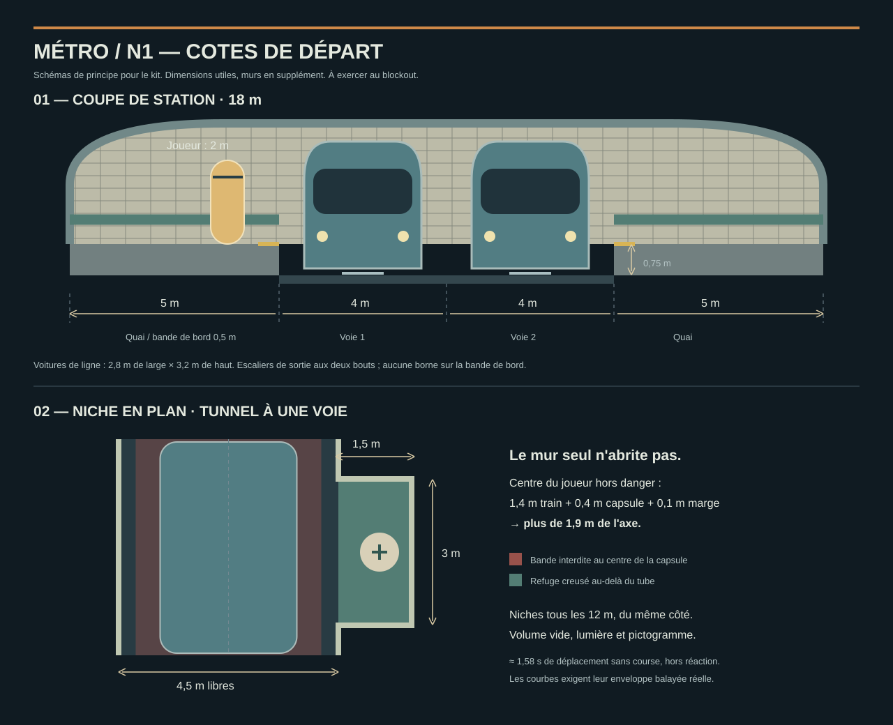

# Métro — références, charte et cotes

Lot N1 de `PLAN_V2.md`. **Board et charte validés par l'utilisateur le
6 octobre 2026** (« je valide »). N2 et les kits N3/N3b suivent cette direction.
Le principe de T1 et la sensation de T4 sont acceptés ;
leur décor et toutes leurs dimensions ne le sont pas pour autant.

[Ouvrir la planche de huit photos](board-metro.html).
Les images sont chargées depuis leurs sites d'origine ; une connexion est
nécessaire. Les crédits sont sous chaque image. Les photos servent à la
recherche, ne deviennent ni textures ni images distribuées dans le jeu.

## 1. Direction validée

**Un métro de quartier vieilli, prolongé par une infrastructure industrielle,
puis une station privée froide et vide.** Les lieux ont un usage lisible :
on vend les billets, on circule, on entretient les rames, on distribue le
courant. Chaque objet se rattache à cet usage ou raconte l'histoire.

| Séquence | Signature | Repère propre au lieu |
|---|---|---|
| Quartier | façades mates, trottoirs, vitrines chaudes dans une nuit ardoise | bouche grillée ; silhouette originale de la tour au nord |
| Billets et quais | carrelage ivoire, frise pétrole, voûte, cadres de publicités | guichet, portiques et afficheur de départ |
| Tunnel A | béton charbon, chemin de câbles, lumière ambre | niches éclairées, panneaux de refuge et grille à contourner |
| Galeries | métal gris-vert, plafond plus bas, gaines | armoires et vestiaire qui expliquent l'accès de service |
| Dépôt | charpente et rails parallèles, grand volume, îlots de sodium | rame de fret et pont roulant ; deux objectifs visibles |
| Poste et machinerie | pupitre vitré / ventilateur et faisceaux de gaines | route lumineuse au tableau / alimentation à rétablir |
| À bord | fenêtres continues, banquettes périphériques, plafond clair | bacs et trappes, sans barre plantée au milieu de l'allée |
| Station privée | surfaces froides, grand axe, mobilier rare | marbre proposé et plaques au symbole de la plateforme |
| Parvis | retour au jour, grilles de ventilation, vapeur | la tour occupe le cadre ; aucune tour réelle reconnaissable |

Le nom MUE, la ligne S, les noms des stations et le symbole de la plateforme
restent des propositions du cadrage. N1 ne les valide pas implicitement.
Les photos ne sont pas des modèles de logos, de plans ou de typographies.

## 2. Les huit images et ce qu'on en tire

Toutes les images de la planche sont **ouvertes et regardées** le 6 octobre
2026. Les proportions décrites ici sont qualitatives ; aucune cote du
bâtiment n'est mesurée sur une photographie en perspective.

| # | Source | Lecture visuelle | Transfert au jeu |
|---|---|---|---|
| 01 | [Joanna Lemanska, Paris in the rain](https://www.misscoolpics.com/blog/2016/11/7/paris-in-the-rain-1) | façades verticales, vitrines et points chauds au sol, ciel sombre | deux fronts de rue, retraits des commerces et taches de couleur dans la texture du sol |
| 02 | [Funini, MF77 à quai, photo 06](https://funini.com/train/france/paris_metro/mf77/) | voûte et carrelage clairs, frise basse, ouverture noire et rails fuyants | contraste quai/tunnel, continuité de la frise, phare visible dans l'ouverture |
| 03 | [Cyril83, Porte Maillot, photo 56723500](https://www.cheminots.net/topic/37304-ligne-1-du-m%C3%A9tro-de-paris-latelier-de-la-porte-maillot-portes-ouvertes-lors-des-journ%C3%A9es-europ%C3%A9ennes-du-patrimoine-samedi-14-septembre-2013/) | alignement des luminaires et des câbles, grille de service, profondeur sombre | câbles qui suivent la voie ; niches ajoutées pour le gameplay |
| 04 | [Cyril83, Porte Maillot, photo 64316600](https://www.cheminots.net/topic/37304-ligne-1-du-m%C3%A9tro-de-paris-latelier-de-la-porte-maillot-portes-ouvertes-lors-des-journ%C3%A9es-europ%C3%A9ennes-du-patrimoine-samedi-14-septembre-2013/) | passage latéral, garde-corps, installations au plafond, rame en entretien | vocabulaire du service et équipements groupés ; ce quai d'atelier ne donne pas la largeur d'une galerie |
| 05 | [Métropolitor, MF77 n°31189, photo 15476](https://metropolitor.fr/id/489) | voies parallèles, fosses, hautes travées, deux faces de rames distinctes | trois familles de silhouettes : rames, charpente, matériel de maintenance |
| 06 | [Île-de-France Mobilités, MF19 d'essai](https://www.iledefrance-mobilites.fr/dossiers/decouvrir-le-mf19) | face arrondie, vitrage sombre continu, portes et fenêtres répétées | face originale à deux phares et rythme des baies ; livrée inventée |
| 07 | [Alstom / IDFM, intérieur MF19](https://www.iledefrance-mobilites.fr/dossiers/decouvrir-le-mf19) | vue traversante, plafond lumineux, sièges latéraux, barres centrales | conserver la vue traversante, déplacer les obstacles hors de l'allée de combat |
| 08 | [Foster + Partners, Canary Wharf, galerie Archilovers](https://www.archilovers.com/projects/68513/canary-wharf-underground-station.html) | montée axiale, grand vide central, béton et métal, lumière au débouché | compresser la monumentalité dans un hall de 6 m ; le marbre froid est une proposition propre au jeu |

Le constructeur de référence propose des MF19 de 61 à 77,5 m selon la
composition. Cela confirme l'intérêt de voitures répétées, sans fixer nos
dimensions. [Fiche officielle IDFM](https://presse.iledefrance-mobilites.fr/le-mf19-le-metro-ferre-nouvelle-generation-se-devoile/?lang=fr).

## 3. Mesures chromatiques et adaptation

Les sept photos d'environnement sont analysées en cinq groupes. La photo
extérieure du MF19 est écartée de la palette intérieure : son ciel et le
bâtiment blanc fausseraient ce relevé. Les images complètes sont réduites à
200 px sur leur plus grand côté, sans recadrage.

Le profil reprend les fonctions de `tools/refs/extract_palette.py`.
La quantification utilise Pillow MEDIANCUT à 24 couleurs, car scikit-learn
n'est pas installé dans le runtime disponible. L'indice de luminance du
profil est calculé sur RGB encodé, entre 0 et 1 ; ce n'est pas une mesure
physique d'éclairage. Le ratio de contraste utilise du sRGB linéarisé.
[Mesures, palettes et empreintes des sources](metro-reference-mesures.json).

| Groupe | Clé / indice moyen | Écart-type | Saturation moyenne | Sombre / clair | Température classée | Couleur candidate / contraste minimal |
|---|---|---|---|---|---|---|
| Rue | basse / 0,285 | 0,222 | 0,242, modérée | 58,7 % / 5,6 % | chaude | `#e9ddcc` / 6,27 |
| Station | moyenne / 0,519 | 0,350 | 0,426, modérée | 34,5 % / 35,5 % | chaude | `#7a6343` / 1,81 |
| Technique | basse / 0,263 | 0,182 | 0,500, saturée | 57,6 % / 3,0 % | chaude | `#d8d5cc` / 7,03 |
| Intérieur de rame | moyenne / 0,442 | 0,219 | 0,135, désaturée | 20,5 % / 6,0 % | neutre | `#d8dfd6` / 1,52 |
| Arrivée | moyenne / 0,424 | 0,191 | 0,079, désaturée | 17,9 % / 3,8 % | chaude | `#d7d9d2` / 1,67 |

Sombre = indice < 0,25 ; clair = indice > 0,75. La température est celle
du classement de teintes de l'outil ; elle ne donne pas des kelvins. La
faible saturation de l'arrivée rend son classement chaud peu significatif.

**Conséquence : une couleur d'ennemi unique ne suffit pas.** Les quais et
la rame échouent au seuil indicatif de 3 contre leurs six couleurs dominantes.
N4 devra poser les ennemis sur des fonds choisis et éclairer leur silhouette.
Les candidats ci-dessus n'imposent aucun changement des sprites existants.

Palette artistique validée, distincte du relevé photographique :

| Famille | Fond | Surface | Accent | Lumière |
|---|---|---|---|---|
| Rue | `#17232e` | `#596064` | `#cf934b` | `#cbc3ae` |
| Station | `#434d55` | `#d8d0b8` | `#537d74` | `#deb44b` |
| Tréfonds | `#202d32` | `#586566` | `#a36632` | `#dfb657` |
| Privée | `#222c36` | `#d8dce0` | `#6e7b81` | `#aebec2` |

La station reste claire ; le sodium devient un accent technique. Le bleu
froid de l'arrivée distingue le pouvoir du service. Les reflets de la rue
se traduisent d'abord par texture et contraste ; ils ne supposent pas un
nouveau système de réflexion.

## 4. Cotes réellement dérivées du joueur

Sources : `src/game/player/movement/moveConfig.ts`,
`src/game/player/movement/controller.ts` et `src/physics/world.ts`.
Il s'agit des valeurs par défaut, sans perk ni réglage utilisateur.

| Mesure du moteur | Valeur | Conséquence |
|---|---|---|
| Rayon / diamètre | 0,4 / 0,8 m | 1 m est une limite serrée ; éviter sur le chemin obligé |
| Demi-segment de capsule | 0,6 m | hauteur totale = 2 × (0,6 + 0,4) = **2 m**, pas 1,2 m |
| Marge du contrôleur | 0,01 m | un plafond à exactement 2 m ne convient pas |
| Yeux | 1,6 m | cadrer annonces, commandes et débouchés à cette hauteur |
| Autostep | 0,35 m | marches de 0,25 m sur la grille fine |
| Saut théorique / gravité | 1,1 m / −25 m/s² | rebord de quai proposé à 0,75 m ; marge nominale de 0,35 m |
| Marche / course | 9 / 13 m/s | calculer les refuges sans course ni perk |
| Accélération nominale | 0,08 s jusqu'à la vitesse cible | conserver une réserve de temps au départ arrêté |
| Pente maximale du contrôleur | 50° | viser ≤ 30° pour les rampes de circulation |

Ces calculs n'établissent pas une réussite en jeu : rebords, plafonds et
sorties sous poussée sont à exercer au blockout et à la pièce pilote.

## 5. Grammaire de construction proposée

Toutes les valeurs suivantes sont des **cibles de jeu**, pas des normes
d'un réseau réel. Grilles : 0,25 m pour les détails, 1 m pour le placement,
modules répétables de 2 / 4 / 8 m. Dimensions utiles après murs et mobilier.

| Élément | Cible N1 | Justification / contrôle suivant |
|---|---|---|
| Rue / ruelle / trottoir | 8–12 / 4 / 2,5 m | combat dehors, détour latéral, passage sans voiture gênante |
| Façade | travée de 4 m, étage de 3 m | répétition facile ; variations aux commerces et à la cour |
| Porte principale | 1,5 × 2,5 m libres | capsule et traversée en mouvement |
| Galerie | 2,5 × 3 m libres | déplacement debout et esquive ; élargissement à 4 m pour un combat |
| Passage bas facultatif | 1,25 × 2,25 m libres au minimum | pas d'accroupissement ; éviter d'y mettre une meute |
| Escalier | marche 0,25 m, giron 0,5 m ; largeur 2,5 m | pente ≈ 26,6°, sous l'autostep ; palier tous les 2 m de dénivelé |
| Quai public | 72 × 5 m de chaque côté, dont 0,5 m de bande de bord | 4,5 m hors bande ; bancs et bornes en alcôves |
| Station en coupe | 5 + 4 + 4 + 5 = 18 m libres | deux couloirs de voie et deux quais ; murs en supplément |
| Niveau du quai au-dessus de la voie | **0,75 m** | remonter en sautant avec marge ; accès par escalier aux deux bouts |
| Voiture de ligne | 15 × 2,8 × 3,2 m | largeur, hauteur et longueur déjà utilisées dans T1 |
| Rame de ligne | 3 voitures, corps de 45 m hors raccords | durée de passage ≈ 1,88 s à 24 m/s, pas un chronomètre définitif |
| Tunnel à une voie | largeur libre 4,5 m, couronne à 4,25 m au moins | reste hostile : la bande au pied du mur n'est pas un refuge |
| Niche | ouverture le long de la voie 3 m, profondeur 1,5 m au-delà du mur, hauteur 2,75 m | attendre à l'abri avec recul ; aucun meuble dans le volume sûr |
| Espacement des niches | 12 m, même côté sur un tronçon | éviter une traversée forcée pendant la fuite |
| Tunnel | section de kit 4 m, repère tous les 12–24 m, événement au plus tous les 60 m | signal, courbe ou embranchement rompt la répétition |
| Dépôt | travée 8 m, hauteur 8 m ; allées libres 4 m | pont roulant et rames lisibles, dégagement de l'arène |
| Fosse de maintenance | 0,75 m de profondeur au plus là où un Contrôleur pousse | remontable ; garde-corps sur les fosses profondes et passerelles |
| Rame de fret jouable | caisse extérieure 3,75 m ; hauteur intérieure 3 m ; allée 2 m | proche du prototype T4 élargi à 3,6 m ; distingue la caisse de combat de la rame de ligne |
| Communication entre voitures | 2,25 × 2,5 m libres, sol continu | pas de seuil ni trou qui bloque une esquive |
| Fret final | 4 voitures de 15 m, raccords à ajouter | cible du plan ; T4 n'en a que trois, durée et combat à confirmer |
| Hall privé | hauteur 6 m, montée axiale 4 m large | contraste avec les galeries ; vide central de 70 % au moins |

### Refuge : volume et délai

Pour une rame de ligne droite de 2,8 m, le centre du joueur doit se trouver
à plus de **1,4 + 0,4 + 0,1 = 1,9 m** de l'axe : demi-largeur du train,
rayon capsule et réserve de conception. Cette bande ne représente pas une
nouvelle règle du moteur ; N2 devra la confronter au gabarit réel de T1.
Dans une courbe, utiliser l'enveloppe balayée de chaque voiture.

Dans un tube de 4,5 m, le centre du joueur plaqué au mur n'atteint que
2,25 − 0,4 − 0,01 = 1,84 m : **le pied du mur n'est pas sûr**. La niche
ajoute donc 1,5 m de profondeur au-delà du mur. Marquer son sol, sa lumière
et son pictogramme ; réserver tout le volume de recul.

Estimation prudente : 12 m jusqu'à la prochaine niche, même si la précédente
est masquée, plus 1,5 m de recul et 0,08 s d'accélération donnent
13,5 / 9 + 0,08 ≈ **1,58 s**. Avec 1 s réservée à la réaction et 0,5 s
aux imprécisions du blockout, budget **3,08 s**. Cela tient sous le préavis
le plus court essayé dans T1 (4 s), sans constituer une preuve de playtest.

Pour une traversée de deux voies de 4 m, réserver 10 m avec dégagements :
10 / 9 + 0,08 ≈ **1,19 s** hors réaction, montée au quai et obstacles.
Une rame déjà engagée, une sortie gardée ou une projection peuvent invalider
ce calcul. Prévoir une sortie libre et un accès bas à chaque extrémité.

### Densité et signalétique

- Sur les quais, un groupe banc/affiche/distributeur tous les 12 m au plus,
  en retrait ; garder le passage de 2,5 m continu hors bande de bord.
- Dans les tunnels, un chemin de câbles et un groupe de lampes par module ;
  armoire ou boîtier uniquement en élargissement. Aucune caisse dans une niche.
- Au dépôt, le mobilier suit les ateliers, la voie et les interventions.
  Pas de tas répartis au hasard au milieu de l'arène.
- Un objectif se distingue par un gros pictogramme et sa silhouette ; pas
  uniquement par sa couleur. Rouge réservé aux avertissements, refuges en
  ivoire/pétrole. Les portes affichent leur commande au même niveau que le passage.
- Le kit conserve des surfaces mates, des textures à densité constante et
  le filtrage nearest à l'agrandissement, à 640 × 360.

## 6. Ce qui reste à trancher ou vérifier

**Validation reçue :** la direction des huit références et les quatre
familles de palette, le 6 octobre 2026. Les cotes restent des valeurs de
départ à vérifier en N2/N4 ; cette validation ne vaut pas playtest.

N2 doit vérifier les sols par colonne, les escaliers et rampes, les courbes,
les enveloppes des trains, les sorties après une poussée et le budget de
lampes. Le plan indiquait ces contrôles au lot N0 ; N0 n'a construit que
l'outillage. Ils appartiennent au blockout réel.

N3/N3b construisent les kits ; N4 confronte quai et tunnel au board et au
rendu du jeu, puis reçoit le jugement de l'utilisateur. Aucun décor du
magasin ni des prototypes n'est modifié par N1.
