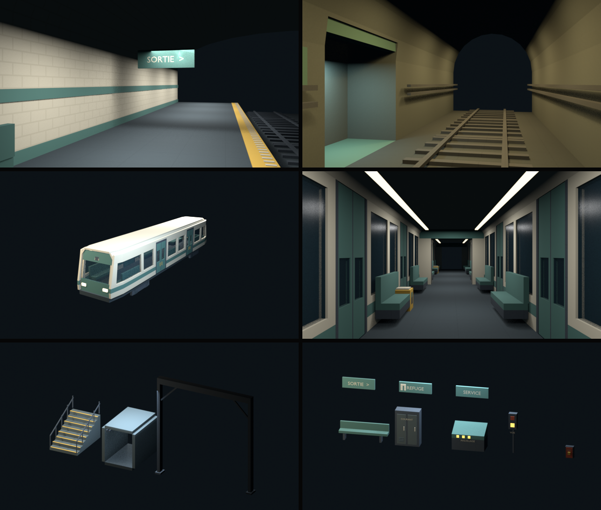

# Métro — kit modulaire N3

**Candidat visuel à juger.** Le [board N1](board-metro.md) et le
[tracé N2](plan-metro.md) guident ses proportions. Le 6 octobre 2026,
l'utilisateur donne son accord pour poursuivre après le plan.

[Ouvrir la présentation](kit-metro.html).



## Intention

La station est claire : carrelage ivoire, frise pétrole, voûte et bord de
quai visible. Le tunnel remplace le carrelage par du béton, des câbles et
des points chauds. La niche se distingue par son retrait et son sol pétrole.

La voiture de ligne a un nez resserré, un pare-brise incliné, un toit à pans
et deux phares. Sa silhouette reprend le rythme des baies du board, avec une
livrée originale. Le fret est plus large : sièges sur les côtés, vue
traversante et portes terminales ouvertes. Aucun nom de réseau proposé dans
le cadrage n'est fixé par le kit.

## Pièces

Les 26 collections sont marquées comme assets dans
`assets_src/library/lib_metro_N3.blend`, catégorie **Métro**.
La scène du fichier est vide ; les collections sont conservées comme
données de bibliothèque, disponibles dans l'Asset Browser.
Les vues de présentation assemblent des instances de ces collections.

| Famille | Pièces / cotes utiles |
|---|---|
| Tube | droit de 4 m ; version avec niche ; version large de 7 m |
| Courbes | R32 et R24, sections nominales de 7,5°, largeur 7 m |
| Station | mur carrelé de 4 m ; voûte de 18 m ; quai 5 × 4 m ; voie 4 × 4 m |
| Accès | escalier de 8 marches, dénivelé 2 m ; escalier de quai de 3 marches, dénivelé 0,75 m |
| Service | galerie 2,5 × 4 × 3 m libres ; garde-corps de 2 m ; portique de dépôt 8 × 8 m libres |
| Rames | voiture de ligne 15 × 2,8 × 3,2 m depuis rail ; fret de 15 × 3,75 m ; soufflet de 0,5 m |
| Mobilier | banc de 3 m ; armoire de service ; pupitre d'aiguillage |
| Signalétique | luminaire de 2 m ; signal de voie ; arrêt d'urgence ; panneaux sortie, refuge et service |

Les sols de quai et de rame sont à **0,75 m du rail**. Les marches font
0,25 m, le giron 0,5 m. La niche laisse 3 × 1,5 × 2,75 m au-delà du mur.
Les câbles restent en dehors de son volume de recul.

Le fret laisse **2,35 m entre sièges**, au-dessus de la cible d'allée de 2 m.
Ses portes terminales laissent 2,25 × 2,5 m. Le sol intérieur est continu
avec celui du soufflet. La couronne du fret atteint 3,9 m depuis le rail ;
la hauteur intérieure au centre dépasse 3 m.

## Assemblage et collision

L'origine des collections est le coin du sol, axe longitudinal **+Y**.
Les murs et voûtes peuvent déborder de l'origine par leur épaisseur.
Les courbes gardent comme origine le coin de leur entrée ; leur sortie et
son angle sont enregistrés dans les propriétés de collection.

Le tracé N2 arrondit ses points au quart de mètre. Les arcs du kit sont
nominalement circulaires : leur assemblage sur le tracé réel demandera des
raccords ajustés en N5, particulièrement aux élargissements et aux rampes.
Le kit ne prétend pas déjà assembler l'intégralité du plan.

Les proxies accompagnent chaque asset : `col_box_*` pour les volumes droits,
`col_hull_*` pour les voûtes, rampes et parties déformées. Les surfaces de
voûte sont découpées par mètre en longueur ; les sols courbes aussi.
L'escalier utilise une rampe, pas un collider par marche.
Les fenêtres des rames sont des panneaux vitrés avec un proxy séparé.
Elles ne sont pas encore des vitrages cassables branchés au jeu.

Les glyphes et luminaires sont décoratifs. Les boîtiers, signaux et pupitres
n'actionnent encore aucun système : T2 et N7 apportent ce câblage.
Les rames mobiles auront besoin de leurs groupes de collision propres ;
les proxies de cette bibliothèque ne suffisent pas à créer un train mobile.

## Surfaces

Quatre textures **originales de 128 × 128 px**, conservées et empaquetées dans
la bibliothèque : carrelage, béton, acier et sol.
Elles vivent dans `assets_src/library/metro/textures/`.
Les UV des surfaces droites couvrent 2 m par répétition, soit 64 texels/m.
Les UV des pans de voûte utilisent une projection locale : leur densité
sur une courbe reste approximative et sera confrontée au damier au pilote.

N4 corrige l’encodage sRGB des PNG et régénère cette bibliothèque ; les
premières textures assombrissaient le béton à l’import dans le moteur.

Les autres surfaces partagent des matériaux unis de la palette N1.
Le verre est transparent ; les feux sont émissifs. Les pièces sont composées
de meshes à un matériau chacun. Leur regroupement par matériau se fera
à l'assemblage du niveau ; le nombre d'objets de la bibliothèque n'est pas
un relevé de lots de dessin du jeu.

Les surfaces architecturales portent l'attribut `Col`, initialement blanc,
pour l'éclairage du pilote. **Aucun bake de niveau n'est déjà livré.**
Le rendu Blender utilise des textures en nearest. L'intégration runtime
conservera le nearest à l'agrandissement et les mipmaps à la réduction,
selon les règles actuelles du projet.

## Preuve et limites

[Inventaire produit depuis Blender](kit-metro/inventaire.json) :
26 pièces, environ 21 000 triangles de décor au total pour un exemplaire
de chaque pièce ; aucun n-gon de plus de quatre sommets dans le relevé.
Les colliders ne sont pas inclus dans ce nombre de triangles de décor.

Les huit vues sont rendues puis regardées : six vues en couleur,
une planche de silhouettes et les deux courbes. Les vues du quai, du tunnel
et du fret sont à hauteur d'yeux de 1,6 m au-dessus de leur sol.
L'échantillon de quai fait 24 m et celui de tunnel 16 m ; leurs extrémités
restent ouvertes dans cette présentation de modules.

**Il s'agit de rendus EEVEE à 640 × 360**, avec éclairage de présentation.
Le verre, les émissions, les couleurs, le bake et la collision devront être
confrontés au rendu du moteur et à Rapier dans N4/N5. Les Contrôleurs et
leurs projections ne sont pas encore exercés ici.

La [pièce pilote N4](../4-technique/pilote-metro.md) est préparée : un quai et
60 m de tunnel habillés, éclairés et sonorisés. L'utilisateur accepte
l'éclairage ; les flancs des rames sont repris après son retour sur les
portes cachées et les chevauchements. Le jugement de l'utilisateur sur cette pièce précède
l'habillage du reste du métro. N3b conserve son lot propre pour le quartier.

## Reproduire

La recette `C.metro_kit()` construit la bibliothèque et rend les vues.
Elle exige une session Blender neuve ; elle refuse un fichier déjà ouvert.

```bash
/Applications/Blender.app/Contents/MacOS/Blender -b --factory-startup \
  -P tools/blender/cassandre_cli.py -- metro_kit
```

Le générateur est `tools/metro/kit/produce_kit.py`, les pièces dans
`tools/metro/kit/modules.py`, les helpers dans `tools/metro/kit/geometry.py`
et les surfaces dans `tools/metro/kit/materials.py`.
Le paramètre `out` change le dossier des captures et de l'inventaire ;
la bibliothèque et les textures sont régénérées à leurs chemins canoniques.

Le niveau jouable n'est pas remplacé par cette recette.
[Journal de production et corrections](../journal/metro-kit-2026-10.md).
