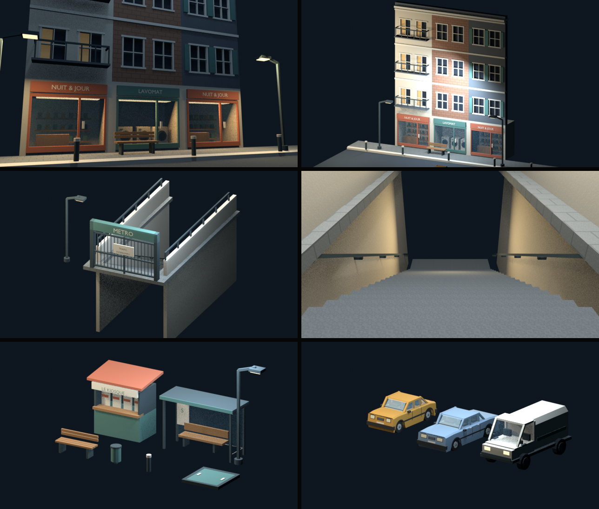

# Quartier — kit modulaire N3b

La bibliothèque N3b prépare la rue avant la descente dans le métro.
Elle suit la [charte N1 validée](board-metro.md) et les cotes du
[plan N2](plan-metro.md). La [galerie](kit-quartier.html) montre les vues
individuelles, les silhouettes et la tour.



## Direction

Façades mates et verticales, fenêtres en retrait, vitrines chaudes au niveau
du trottoir et nuit ardoise. La référence de rue est la
[photo de Joanna Lemanska](https://www.misscoolpics.com/blog/2016/11/7/paris-in-the-rain-1)
déjà choisie dans N1. Elle est rouverte pour la production N3b.
Les photos ne deviennent pas des textures du jeu.

Trois profils de façade donnent un rythme : balcon sur enduit clair, brique,
et volets pétrole sur ardoise. Les boutiques ont un volume intérieur visible :
machines dans la laverie, étagères et comptoir dans l'épicerie.
Le mobilier reste au bord du cheminement dans la présentation.

## Pièces

La bibliothèque contient **22 assets** : 20 pièces originales et les deux
voitures déjà validées. Chaque collection est marquée comme asset dans le
catalogue **Quartier** du navigateur Blender.

| Famille | Pièces | Cotes de construction |
|---|---|---|
| Façades | balcon, brique, volets, mur aveugle | largeur 4 m, hauteur d'étage 3,5 m, profondeur de mur 0,5 m |
| Finitions | corniche | module de 4 m ; terminaison à hauteur de 3,5 m × nombre d'étages |
| Commerces | laverie et épicerie | 4 × 2 × 3,5 m ; devanture et intérieur séparés par du vitrage |
| Sols | trottoir, chaussée | trottoir 4 × 2,5 m, chaussée 4 × 4 m ; bordure de 0,25 m |
| Métro | bouche et grille séparée | bouche 6 × 12 m, descente de 5 m, grille de 5 m |
| Mobilier | abribus, kiosque, banc | abribus de 4 m, kiosque 3 × 2 m, banc de 2 m |
| Rue | lampadaire, borne, corbeille, trappe | lampadaire de 5 m, borne de 0,75 m, trappe 2 × 2 m |
| Véhicules | fourgon original, citadine et berline réemployées | fourgon d'environ 5 m ; gabarits validés conservés pour les voitures |
| Repère | tour originale | empreinte 24 × 18 m, hauteur 56 m ; repère distant hors parcours |

Les textes des commerces sont inventés. Le « S » de l'abribus reprend la
proposition de ligne du cadrage ; cette présentation ne valide pas un nom de
réseau ni un nouveau symbole de plateforme.

## Assemblage et collision

L'origine est au coin du sol. Les façades regardent vers **−Y**, les modules
de descente vont vers **+Y**. Les véhicules gardent leur avant vers **+Y**.
Les saillies de balcon et de corniche débordent devant l'origine ; leur
enveloppe réelle figure dans l'inventaire.

Le dessus du trottoir est à z = 0 et celui de la chaussée à z = −0,25 m.
Il faut éviter d'ajouter une dalle sous la bouche de métro : son escalier
descend de z = 0 à z = −5 m, avec **20 marches de 0,25 m**, giron 0,5 m.
Les murs latéraux retiennent le terrain ; le passage central fait 4 m.
Les mains courantes descendent contre les murs, hors de ce passage.

L'escalier fournit un proxy de rampe convexe, séparé des marches rendues.
Le trottoir fournit des proxies de dalle et de bordure. Les autres collisions
sont des cuboids. Les colliders ne suivent pas chaque barre des garde-corps.
Le fourgon utilise des proxies de caisse et de cabine simplifiés ; la tour
distante n'a pas de collision.

La grille et la trappe sont des assets séparables. **Aucune interaction n'est
branchée dans cette bibliothèque.** N4b extraira leurs panneaux en `door_*`
et les commandera avec des `use_*` placés dans le niveau.
Les vitres ne sont pas encore des objets cassables du runtime.

## Surfaces

Cinq textures originales **128 × 128 px** : enduit, brique, ardoise, chaussée
et pavés. Elles sont écrites en sRGB, chargées puis empaquetées dans la
bibliothèque. Les surfaces droites utilisent une répétition de 2 m,
soit 64 texels/m ; les projections sur les surfaces inclinées restent
approximatives. Aucun détail photographique n'est incorporé.

Les matériaux partagent la palette N1. Le verre est transparent, les lampes
et certaines fenêtres sont émissives. Les fenêtres chaudes restent rares
aux étages pour distinguer les commerces du reste des façades.
Les meshes sont regroupés **par matériau dans chaque pièce**. Les surfaces
de construction portent `Col`, initialement blanc, pour le bake du pilote.
Les voitures conservent leurs couleurs de sommets d'origine.

## Preuve et limites

L'[inventaire produit par Blender](kit-quartier/inventaire.json) compte
**18 684 triangles de décor**, pour un exemplaire de chaque asset.
Il exclut les proxies. Ce compte n'est ni celui d'un niveau assemblé ni un
relevé de lots du moteur. Les nouvelles pièces ne contiennent que des
triangles et des quads ; les véhicules réemployés conservent leurs n-gons
d'origine, que l'exporteur triangulera.

Les huit vues sont rendues puis regardées : rue de nuit à hauteur de joueur,
façades en entier, bouche fermée, descente ouverte, mobilier, véhicules,
tour et silhouettes. Une seconde passe recadre les façades et la tour,
reprend la cabine du fourgon et ajoute les mains courantes de l'escalier.

**Ce sont des rendus Blender EEVEE de 640 × 360**, éclairés pour la
présentation. Le sol de rue est à −0,25 m ; la caméra de rue est à 1,35 m,
soit 1,6 m au-dessus de lui. La caméra de descente est à 1,6 m au-dessus du
palier haut.

Le quartier n'est pas encore dans le jeu. Collision Rapier, éclairage cuit,
visibilité réelle de la tour, vapeur, accès de service et place restent à
assembler et à juger dans **N4b**. N5 construira ensuite le parcours complet.
Le magasin et les pilotes du métro conservent leurs fichiers existants.

## Reproduire

La recette `C.quartier_kit()` exige une session Blender neuve :

```bash
/Applications/Blender.app/Contents/MacOS/Blender -b --factory-startup \
  -P tools/blender/cassandre_cli.py -- quartier_kit
```

Elle produit `assets_src/library/lib_quartier_N3b.blend`, les textures dans
`assets_src/library/quartier/textures/` et les captures dans
`docs/assets/kit-quartier/`. `out` change le dossier des captures, sans changer
le chemin canonique de la bibliothèque.

Le générateur est `tools/metro/quartier/produce_kit.py`. Les pièces,
géométrie, matériaux et réemplois de véhicules ont chacun leur module privé.
La géométrie et la composition d'images réutilisent les helpers du kit N3.
[Journal de production](../journal/quartier-kit-2026-10.md).
