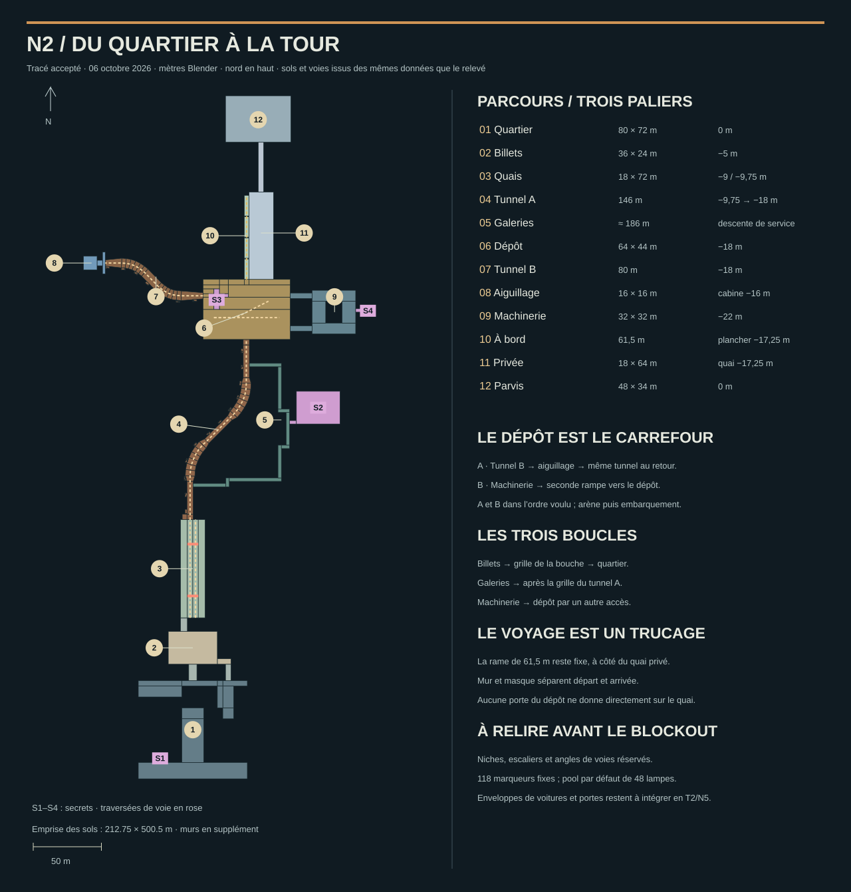

# Métro — plan de masse N2

**Tracé accepté pour poursuivre le 6 octobre 2026**, issu du [board validé](board-metro.md).
Ce lot produit le tracé et son relevé calculé ; le blockout jouable vient
en N5. Il ne remplace pas le magasin ou les salles d'essai des trains.



[Ouvrir le SVG](plan-metro.svg) · [Relevé des calculs](plan-metro-releve.json).

## 1. Parcours et intentions

La rue est à 0 m. La salle des billets est à −5 m. Les quais publics sont
à −9 m, leurs rails à −9,75 m. Le tunnel descend progressivement au dépôt
à −18 m ; la machinerie est à −22 m. Le retour à la surface se fait après
la station privée, dont le quai et le plancher de fret sont à −17,25 m.

Le dépôt donne accès à deux objectifs indépendants : l'aiguillage à l'ouest
et le courant à l'est. On choisit l'ordre. L'aiguillage demande le seul
aller-retour obligatoire, par le tunnel B ; la machinerie se traverse en
boucle, avec deux accès au dépôt. Les deux objectifs obtenus, on revient à
la rame, on affronte l'arène, puis on déclenche le départ.

La rame de fret et la station privée occupent des secteurs voisins : c'est
le trucage validé de T4. **Un mur ferme tout accès direct depuis le dépôt
au quai privé**. L'arrivée n'est accessible que par une porte latérale de
la rame, après la séquence. Le décor et les lampes des deux ambiances
doivent suivre l'état départ/voyage/arrivée.

## 2. Emprises et dimensions

Repère Blender : X est, Y nord, Z haut ; 1 unité = 1 m. Les axes de voies,
emprises rectangulaires, paliers et dimensions du kit suivent la grille de
0,25 m. Les bords orientés des courbes et les altitudes intermédiaires des
rampes sont dérivés de ces cotes ; ils ne sont pas arrondis séparément.

| Espace | X / Y ou longueur | Altitude | Usage |
|---|---|---|---|
| Quartier | X −40…40, Y 0…72 | 0 | cinq masses de bâtiments laissent 2 432 m² de rues, place et cour |
| Descentes | public X −3…3 ; service X 24…28 ; Y 72…84 | 0 → −5 | trappe au nord de la cour ; grille publique ouverte depuis les billets |
| Billets | X −18…18, Y 84…108 | −5 | guichet arrière, portiques et borne ; passage de service à l'est |
| Escalier des quais | X −9…−4, Y 108…118 | −5 → −9 | passage large, pente équivalente de 21,8° |
| Station publique | X −9…9, Y 118…190 | −9 / −9,75 | deux quais de 5 m, deux bandes de voie de 4 m |
| Tunnel A | axe de (−2,190) à (39,25,322), 146,35 m | −9,75 → −18 | deux courbes et trois tronçons droits |
| Galeries | départ Y 214 ; branche est en coudes X 62,5…71 ; retour Y 302…304,5 | ≈ −11…−17 | détour d’environ 186 m autour de la grille ; raccords inclinés |
| Dépôt | X 7,5…71,5, Y 322…366 | −18 | 64 × 44 m, voie de manœuvre, deux objectifs et embarquement |
| Tunnel B | (7,5,354) → (−64,25,378), 79,64 m | −18 | courbes en S ; pas de Contrôleur dans ce tube |
| Poste | secteur X −80,25…−64,25, Y 370…386 | −18 / −16 | lobby, montée de 4 m et cabine de 10 × 10 m |
| Machinerie | X 87,5…119,5, Y 326…358 | −22 | anneau autour du ventilateur ; accès de 16 × 4 m aux deux bouts |
| Fret | plancher X 37,75…41,25, Y 366…427,5 | −17,25 | quatre voitures de 15 m et trois raccords de 0,5 m |
| Privée | X 41,25…59,25, Y 366…430 | −17,25 | 18 × 64 m ; séparation côté dépôt, sortie au nord |
| Remontée | X 48…52, Y 430…466,5 | −17,25 → 0 | 4 m de large, pente ≈ 25,3°, habillage escalier mécanique |
| Parvis | X 24…72, Y 466,5…500,5 | 0 | 48 × 34 m, vapeur et hall de la tour |

L'emprise calculée est **212,75 × 500,5 m**. La surface brute des supports
de marche réservés est **14 650,25 m²**, voies, galeries et secrets compris,
avant retranchement du mobilier. Ce n'est pas une mesure de surface utile
finale. Le croquis initial annonçait 300 × 340 m et environ 13 000 m² : ses
longueurs successives n'y tenaient pas. N2 privilégie les cotes et la
séparation des paliers ; on jugera la durée en N5.

## 3. Voies, traversées et refuges

| Voie | Tracé réservé | Règle de construction |
|---|---|---|
| V1 | quai droit, axe X 2 sur 72 m | sens opposé à V2, sortie cachée à chaque bout |
| V2 | quai gauche, axe X −2, puis tunnel A | rames de face dans le tunnel ; grille après la première entrée des galeries |
| VB | tunnel B de 79,64 m | aucune rame à l'aller, trafic dans le dos au retour |
| M | dépôt, X 15,5…63,5 à Y 338 | 48 m visibles ; gare de manœuvre et masques aux limites |
| M déviée | embranchement à (31,5,338), vers (55,5,350) | réserve de sol disponible ; aiguille et raccord arrondi à finaliser en T2 |
| F | axe fixe X 39,5, Y 366…427,5 | défilement visuel, aucun portage du joueur |

Les traversées sont à Y 134 et Y 172 : la première mène au quai droit,
la seconde revient au quai gauche et à l'entrée du tunnel. Des barrières
et ouvertures guideront ces passages en N5/N7. Les rails restent exclus
du graphe ennemi, sauf traversées explicitement autorisées en T2.

Les tubes font 4,5 m dans les portions droites et jusqu'à 7 m dans les
courbes et leurs raccords. Les courbes théoriques de A ont un rayon de
32 m, celles de B de 24 m ; les points de contrôle sont arrondis sur la
grille. L'élargissement absorbe le débord d'une voiture rigide de 15 m.

**19 niches** sont réservées, tous les 12 m de chainage : 12 dans A,
7 dans B. Chaque ouverture fait 3 m et la niche avance de 1,5 m au-delà
du tube. Elles restent du même côté sur chaque tunnel, sans traversée
forcée, avec sol vide, pictogramme et lumière. Leurs emprises sont
recoupées avec les supports du tube pour éviter un deuxième sol.
Le budget théorique de fuite retenu est de 3,386 s : 12 m le long de la
voie, 4,25 m de recul dans une courbe large, marche à 9 m/s, 0,08 s
d’accélération, 1 s de réaction et 0,5 s de réserve. Il reste sous un
préavis de 4 s, sans constituer une preuve de playtest.
Les raccords inclinés exacts et le volume sûr de chaque niche se vérifient
sur les colliders en T2/N5.

Prévoir des tronçons hors vue aux limites des routes pour l'annonce et
l'effacement des rames : à 24 m/s, 5 s de préavis représentent 120 m,
plus 45 m de corps de rame. Ces prolongements ne sont pas des tunnels
supplémentaires à explorer et ne sont pas comptés dans l'emprise de marche.

## 4. Boucles, secrets et sols

Trois boucles : billets → quartier par la grille publique ; galeries →
tunnel A après la grille ; machinerie → dépôt par le second accès.
La grille du tunnel A se situe vers le milieu du tracé, entre ses deux
raccords aux galeries. Les positions des portes et commandes deviennent
des données de niveau au blockout.

| Secret | Réserve de plan | Altitude et accès |
|---|---|---|
| S1 | arrière-boutique X −28…−20, Y 12…18 | 0 m, derrière une façade de la place |
| S2 | station désaffectée X 76…108, Y 260…284 | −14,5 m, rampe depuis les galeries |
| S3 | toit de rame X 15,5…19,5, Y 344…359 | −14,75 m ; montée latérale de 6,5 m, NPC exclus |
| S4 | local X 124,5…132,5, Y 340…346 | −22 m, derrière le ventilateur, depuis l'anneau est |

Le relevé contrôle l'absence de superposition des **supports navigables**
dans leur projection XY, même si leurs altitudes diffèrent. Le toit S3
remplace donc la surface navigable sous la caisse pleine ; aucun passage
n'est prévu sous cette rame. La cabine du poste est à côté de la voie,
surélevée et vitrée, avec un escalier : pas de sol navigable dessous.
Le ventilateur occupe le trou central de la machinerie ; garde-corps
obligatoires autour, aucun sol praticable dans sa fosse.

Les plateformes, véhicules et fosses auront leurs colliders fermés en N5.
Le contrôle de plan ne remplace ni l'audit Blender ni le graphe Rapier.

## 5. Lignes de vue et lumière

Dans A, aucun tronçon droit ne dépasse 32 m ; dans B, 16 m. Les courbes
cachent les sorties. Les galeries ont des coudes, sans rétrécir leur
passage de 2,5 m. Le relevé mesure leurs vues axiales en plan : 40,75 m
au maximum horizontalement, 36 m verticalement. Les angles de visée
obliques, les portes et le mobilier se contrôlent dans le blockout réel.
Les deux quais offrent 13 m entre leurs axes de marche : distance compatible
avec les tireurs existants à 16 m. Des alcôves et bancs bas donnent des
appuis, en laissant libres les bandes de bord et les sorties des voies.

La tour reste un repère visuel original au nord, sans sol accessible N2.
Le quartier doit garder une fenêtre de ciel dans son axe. Sa silhouette
et la vue réelle depuis la place appartiennent au kit N3b et à la pièce
pilote N4b ; elles ne sont pas déclarées vérifiées ici.

| Zone | Marqueurs lumineux fixes proposés |
|---|---:|
| Quartier / billets / quais | 18 / 8 / 12 |
| Tunnel A / galeries | 16 / 12 |
| Dépôt / tunnel B / poste | 12 / 8 / 4 |
| Machinerie / fret / privée / parvis | 8 / 6 / 6 / 8 |
| **Total fixe** | **118** |

Le pool par défaut de `src/render/environment/lightPool.ts` sélectionne
48 lampes. Réserver quatre emplacements à la fois pour phares et signaux.
Les enveloppes de zones proposées totalisent 24 à 48 sources, y compris
ces quatre places ; au dépôt, elles incluent la rame, le quai privé et les
extrémités proches des tunnels. Les sources éloignées ont une portée finie.
Ce sont des budgets de placement, **pas une mesure de lampes actives ou de
performance**. Leur sélection réelle se mesure à la pièce pilote.

## 6. Contrôles produits

Le générateur de plan contrôle et consigne :

- axes de voies sur grille de 0,25 m ;
- 243 fragments de support, aucune projection XY superposée ni surface nulle ;
- pentes des voies ≤ 3,68° et dimensions des emprises ;
- échantillonnage du rectangle horizontal complet de voitures de 15 × 2,8 m,
  tous les 0,5 m au plus : 269 poses dans A, 136 dans B, aucun coin ni portion de rectangle hors tube ;
- budgets lumineux par zone ≤ 48 ;
- graphe de progression, surfaces par famille et longueurs des voies.

L'enveloppe de voiture est un contrôle de plan **échantillonné**, avec
8 m exclus à chaque extrémité. Il ne vérifie ni le volume 3D à chaque
instant, ni le tangage, ni les raccords glTF, ni l'aiguille M. T1 est encore
un prototype de salle plate : T2 devra adapter les contacts aux altitudes
du métro et intégrer les prolongements cachés des routes.

## 7. Reproduire le plan

Les données vivent dans `tools/metro/layout/plan_n2.py`. Les opérations de
projection sont dans `tools/metro/layout/geometry.py`. Le SVG et le JSON
sont produits ensemble par `tools/metro/layout/produce_plan.py` : les
modifier à la main introduirait une divergence avec le relevé.

```bash
python3 tools/metro/layout/produce_plan.py
```

Depuis Cassandre : `C.plan(niveau="metro")`. Un candidat isolé se produit
avec `C.plan(out="renders/metro_n2")`. Aucune scène Blender n'est remplacée.
L'atelier N0 garde son plan technique ; le plan N2 devient celui du
blockout après sa relecture, au lot N5.

**Accord utilisateur reçu le 6 octobre 2026** pour poursuivre avec ce tracé.
Ensuite viennent les kits N3/N3b et leurs pièces pilotes, avant le niveau
jouable complet. Aucune suite de tests automatisés n'est ajoutée ou exécutée.
