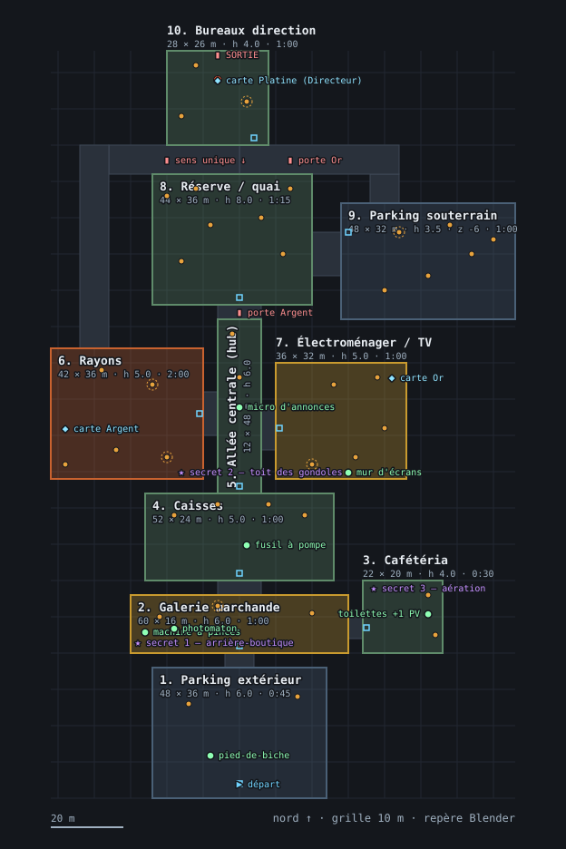
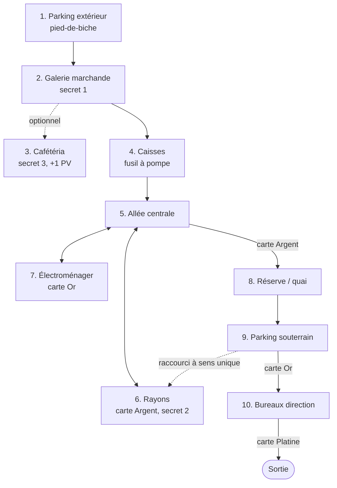

# Niveau v2 — plan de masse coté

Livrable du jalon N6 de [`PLAN_NIVEAU_V2.md`](../../PLAN_NIVEAU_V2.md) :
passer du schéma en boîtes à un plan coté, vérifié, **avant** de construire
quoi que ce soit. Rien ici n'est modélisé ; ce document se valide ou se
refuse sur plan, au moment où le changer coûte le moins cher.

> **Statut : proposition, échelle validée.** L'utilisateur a retenu l'échelle
> le 2026-09-12 et le budget de rendu a été tranché par la mesure (voir
> [Les deux arbitrages](#les-deux-arbitrages-tranchés)). Restent à valider la
> structure elle-même — le tracé des dix espaces, le parcours, les
> placements — avant le blockout du jalon N8.

Les cotes vivent dans `tools/level_v2/plan_de_masse.py`, pas dans ce texte :
les contrôles du jalon (« un seul sol praticable par colonne », « spawn hors
`attackRange` du point d'arrivée ») sont des calculs, refaits à chaque
modification. En cas d'écart entre ce document et le script, **le script fait
foi** ; le jalon N8 construira depuis ses rectangles.

```bash
python3 tools/level_v2/plan_de_masse.py --ascii
```

## Le plan en un coup d'œil



Repère de Blender : X vers l'est, Y vers le nord, Z vers le haut, mètres,
grille de 0,25 m. Points orange = Costards, point rouge = le Directeur, un
halo en pointillés = spawn volontairement à portée mais **sous couvert**.
Carré bleu = point d'arrivée du joueur dans l'espace. Les petites pièces
(toilettes, cachettes des secrets) ne portent que leur numéro sur le plan ;
leur nom et leurs cotes sont dans la légende du bas.

Le SVG se régénère depuis le script, jamais à la main :

```bash
python3 tools/level_v2/plan_de_masse.py --svg docs/game/images/niveau-v2-plan-de-masse.svg
```

| | |
|---|---|
| Emprise | **128 × 206 m** (x ∈ [−52, 76], y ∈ [−40, 166]) |
| Surface praticable | 11 776 m² d'espaces + 1 556 m² de liaisons = **13 332 m²** |
| Échelle | 42 × la salle d'essai de N4 (320 m²) |
| Effectif | 40 Costards + 1 Directeur (niveau actuel : 13 + 1) |
| Durée visée | 9:30, inchangée depuis le plan d'origine |

## Ce que le plan devait respecter

Toutes ces valeurs viennent du code, pas d'une intention :

| Contrainte | Valeur | Source |
|---|---|---|
| Vitesse du joueur | 9 m/s en marche, **13 m/s en course** | `moveConfig.ts` |
| Hauteur de saut | 1,1 m | `moveConfig.ts` |
| Hauteur des yeux | 1,6 m (joueur, Costard), 1,8 m (Directeur) | `moveConfig.ts`, `*Config.ts` |
| Portée de vue | 22 m | `suitConfig.ts`, `directorConfig.ts` |
| Portée d'attaque | 16 m (Costard), 14 m (Directeur) | idem |
| Portée d'un `use_*` | 2 m | `loader.ts` |
| Budget de rendu | 200 lots de dessin, **1 500 000 triangles, 48 lampes** | mesuré, [ADR 0026](../decisions/0026-visibilite-par-espace-et-pool-de-lampes.md) |
| Un seul sol praticable par colonne | — | pathfinding 2.5D, [Entités — Navigation](../systems/entites.md#navigation) |
| L'occlusion est fiable | une rangée couvre, une allée non | [ADR 0025](../decisions/0025-occlusion-lignes-de-vue-cause-racine.md) |

**C'est la vitesse qui fixe l'échelle.** À 13 m/s, la salle d'essai de N4 se
traverse en 1,5 s et le niveau actuel en une quinzaine de secondes. La
consigne du 2026-09-12 — « voir grand, l'exploration prime » — se traduit
donc en cotes : les espaces de combat font 35 à 45 m de côté, pas 16 × 20.

## Les dix espaces

### 1. Parking extérieur — 48 × 36 m, h 6 m, 0:45

Le spawn, dos au bâtiment. Ciel ouvert (pas de dalle, murs de 6 m, façade
en fond). **Pied-de-biche** sur le capot d'une voiture, à 12 m. Deux
Costards scellés au loin : premier contact visuel, jamais punitif — même
rôle qu'en Zone A aujourd'hui. Sortie au nord par les portes automatiques.

### 2. Galerie marchande — 60 × 16 m, h 6 m, 1:00

Long transit est-ouest sous verrière : la seule lumière naturelle du
niveau, à contraster avec la surface de vente. **Machine à pinces** et
**photomaton** à l'ouest ; le **secret 1** est l'arrière-boutique du
photomaton. Trois Costards, dont un posté derrière le kiosque central —
premier usage assumé de l'occlusion comme embuscade (ADR 0025).

### 3. Cafétéria — 22 × 20 m, h 4 m, 0:30 — optionnelle

Accessible par l'est de la galerie, jamais sur le chemin critique.
**Secret 3** : la bouche d'aération du mur nord, atteinte par une caisse de
1,0 m puis un distributeur de 1,9 m — deux sauts sous `jumpHeight`. Le
comptoir de self est l'un des trois objets sans équivalent CC0, monté en
volumes simples (exception actée en N2).

**Les toilettes (12 sur le plan)**, 8 × 10 m, derrière une porte « WC » du
mur est — une vraie pièce depuis le 2026-09-24, là où il n'y avait qu'un
`use_toilet` flottant au milieu de la salle. Carrelage aux murs, trois
cabines au nord (la deuxième est fermée, des chaussures dépassent dessous),
deux lavabos au sud, deux urinoirs à l'est. Le +1 PV du plan d'origine est la
plaque de chasse d'eau de la première cabine. Aucun Costard. Coût mesuré :
**2 lots de dessin** dans toute vue qui voit la pièce (ses murs carrelés et
sa porte) — son sol est d'un seul tenant avec celui de la cafétéria, son
plafond se fond dans le plâtre du mur voisin.

### 4. Caisses — 52 × 24 m, h 5 m, 1:00

Premier vrai combat, et le **fusil à pompe** au sol. Ligne de caisses en
travers à y ≈ 32, trouées de 2,5 m. Rappel mesuré : une caisse fait 1,10 m,
**sous** la hauteur des yeux — c'est un obstacle de déplacement, pas du
couvert, et aucun hitscan ne s'y arrête. Quatre Costards, tous au-delà de
16 m du point d'entrée.

### 5. Allée centrale (hub) — 12 × 48 m, h 6 m

Le carrefour du niveau, et le seul espace dont la lisibilité prime sur le
combat : rayons à l'ouest, électroménager à l'est, porte **carte Argent** au
nord. **Micro d'annonces** au milieu, sur une estrade. Deux Costards en
patrouille, très visibles.

### 6. Rayons — 42 × 36 m, h 5 m, 2:00

Le cœur du niveau, reprise directe de la salle d'essai de N4 : mêmes rangées
thématiques, mêmes néons, même densité. Deux allées **transversales**
(y ≈ 60 et y ≈ 72) — c'est là que se posent les embuscades, jamais dans
l'allée que le joueur regarde. **Carte Argent** derrière le comptoir du
rayon frais. **Secret 2** sur le toit des gondoles, accès par une caisse.
Six Costards, dont deux à portée mais couverts par une rangée.

### 7. Électroménager / TV — 36 × 32 m, h 5 m, 1:00

Vitrines, gros blancs alignés, **mur d'écrans** (géométrie seulement : le
rendu dans une texture reste au reliquat de la Phase 5). **Carte Or** dans
la cabine de démonstration, en hauteur, atteinte depuis un carton.
Cinq Costards.

### 8. Réserve / quai — 44 × 36 m, h 8 m, 1:15

La verticalité du niveau : mezzanine au nord à z = 3,0 m, racks de 6 m qui
font **du vrai couvert**. Sept Costards, dont deux sur la mezzanine — c'est
nouveau, et c'est le pathfinding 2.5D livré en M4 qui le permet (la Zone D
actuelle s'en interdisait, faute de chemin). La rampe de quai descend au
parking souterrain ; **son dessous est plein**, sinon la colonne porterait
deux sols.

### 9. Parking souterrain — 48 × 32 m, h 3,5 m, z = −6 m, 1:00

Pénombre, piliers tous les 8 m : la seule zone où l'occlusion fait tout le
travail, la ligne de vue y est coupée en permanence. Six Costards dispersés.
**Décalé à l'est de la réserve, jamais sous un espace praticable** — la
contrainte de colonne interdit de le glisser sous le magasin, aussi tentant
que ce soit.

### 10. Bureaux direction — 28 × 26 m, h 4 m, 1:00

Le **Directeur**, trois Costards, et la sortie. Comme en Zone E aujourd'hui,
le boss est volontairement **sous `attackRange`** : la révélation doit être
immédiate, pas une embuscade de couloir. Il lâche la **carte Platine**, qui
ouvre la porte de sortie derrière lui.

## Le parcours et les trois cartes



L'entrée est linéaire — un tutoriel qui ne dit pas son nom. À partir du hub,
le joueur choisit l'ordre entre les rayons et l'électroménager, donc entre
l'Argent et l'Or. Le **raccourci à sens unique** part du couloir des bureaux, monte une rampe
douce, longe le magasin par l'ouest et **débouche 3 m au-dessus des rayons**.
On saute dedans, on ne remonte pas : le sens unique est une conséquence de la
géométrie (saut de 1,1 m contre un décrochement de 3 m), pas un mécanisme —
le moteur n'a aucun système de passage à sens unique, et n'en a pas besoin.
Un joueur arrivé devant la porte Or sans la carte revient ainsi au hub sans
refaire tout le chemin.

## Vérifications

`tools/level_v2/plan_de_masse.py` les rejoue toutes ; état au moment d'écrire
ce document :

| Contrôle | Résultat |
|---|---|
| Toutes les cotes sur la grille de 0,25 m | ✅ |
| Aucun espace praticable au-dessus d'un autre | ✅ (le souterrain est décalé, pas enterré sous le magasin) |
| Aucun recouvrement à altitude égale | ✅ (une exception déclarée : la rampe de sortie, interne au parking, dessous plein) |
| Spawns hors `attackRange` du point d'arrivée | ✅ à découvert ; 6 spawns sont plus près **sous couvert déclaré**, à vérifier au blockout |
| Spawns dans l'emprise de leur espace | ✅ |
| Allées d'au moins 3 m | à vérifier au blockout — c'est une cote de mobilier, pas d'espace |
| Tout espace atteignable depuis le spawn | ✅ les 10 espaces sont reliés |
| Chaque porte à carte commande son secteur | ✅ sans le sas Argent, réserve/souterrain/bureaux sont hors d'atteinte ; sans le couloir des bureaux, les bureaux le sont |
| Jonctions de face, jamais de flanc | ✅ trois jonctions volontairement murées, déclarées |

Les six spawns « sous couvert » sont le dividende direct de N5 : avant
l'[ADR 0025](../decisions/0025-occlusion-lignes-de-vue-cause-racine.md), la
seule protection disponible était la distance, et tout ennemi proche était
un ennemi injuste.

## Les deux arbitrages, tranchés

### 1. L'échelle — gardée (utilisateur, 2026-09-12)

12 960 m² praticables, 40 × la salle d'essai : lecture littérale de « voir
grand », cohérente avec une vitesse de course de 13 m/s. L'alternative
proposée — raboter les cotes de 30 % sans toucher à la structure — a été
écartée. Ce que ça engage : **le volume de travail d'habillage du jalon N9**,
espace par espace, dans Blender. C'est désormais la seule contrainte sur la
taille du niveau ; le rendu, lui, ne l'est plus (voir ci-dessous).

### 2. Le budget de rendu — tranché, par la mesure

**Question posée** : le plan demande 1,45 million de triangles, contre
200 000 fixés au jalon N1. Réponse mesurée plutôt que supposée
([Ce que coûte une image](../systems/cout-de-rendu.md),
[ADR 0026](../decisions/0026-visibilite-par-espace-et-pool-de-lampes.md)) :

- **les triangles ne coûtent presque rien.** 1,45 million de triangles,
  carte entière dans le champ, aucun tri d'écart : **4,94 ms de GPU** sur la
  machine de développement, pour un budget d'image de 16,6 ms. Le chiffre de
  N1 avait été posé a priori, sans machine en face ; il passe à 1 500 000 ;
- **ce sont les lampes qui ont un mur.** Environ 0,03 ms par `PointLight`,
  et au-delà de **254 lampes allumées le shader ne compile plus du tout** —
  la géométrie disparaît, sans autre signe qu'une ligne en console. À la
  densité d'éclairage de la salle d'essai, ce niveau en demanderait 1 140.

D'où trois mesures, dans l'ordre : un **pool de 48 lampes** réaffecté aux
luminaires les plus proches, la **fusion du décor par espace** et non par
niveau (pour que le tri d'écart puisse enfin écarter quelque chose), et une
visibilité par espace tirée du graphe de pièces **si** la mesure sur la vraie
carte la réclame. Le chargement à la volée est explicitement écarté : tout
tient en mémoire, et il créerait l'apparition d'objets sous les yeux du
joueur qu'il est censé éviter.

**L'échelle n'est donc plus contrainte par le rendu.** Elle reste contrainte
par le travail d'habillage de N9.

## Ce qui n'est pas tranché ici

- **Le mobilier.** Ce plan cote des espaces, pas des gondoles. Les allées de
  3 m, les trouées entre caisses, la position exacte des piliers sont du
  ressort du blockout (N8).
- **L'éclairage.** Le régime par espace ([ADR 0024](../decisions/0024-eclairage-hybride.md) :
  temps réel, bake, hybride) se décide à l'habillage.
- **Les systèmes.** Bris de verre, écrans de surveillance, caddies
  poussables restent au reliquat de la Phase 5.
