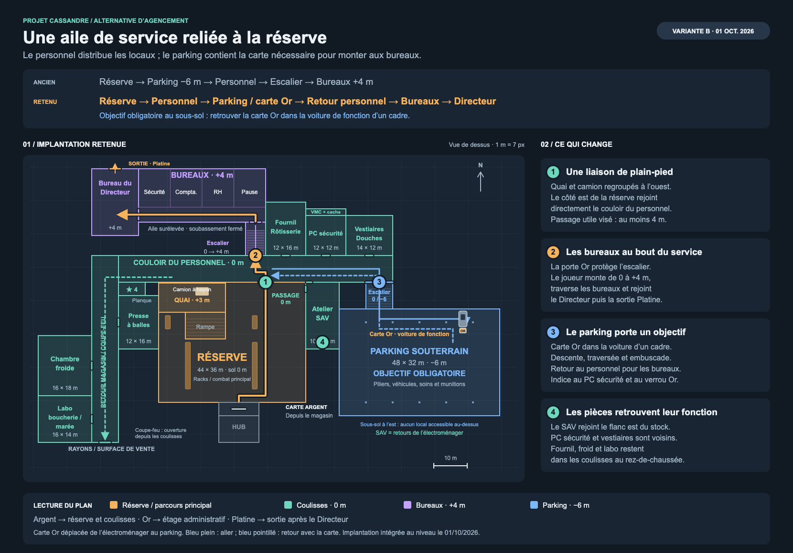

# Alternative de placement des coulisses et des bureaux

## Période

Proposition du 1er octobre 2026, après le retour sur le trajet imposé entre
réserve, parking souterrain et bureaux. La variante B répond au refus de
rendre le parking facultatif.

## Objectif

Donner aux locaux du personnel une relation directe avec la réserve.
Garder la montée vers l'administration et le combat final. Donner au parking
un objectif obligatoire : récupérer la carte Or qui ouvre les bureaux.

L’ancien plan imposait le passage par le sous-sol :
`tools/level_v2/plan_de_masse.py` scelle explicitement la jonction
`reserve` / `c_bu`. La plateforme pleine à +3 m occupe également presque
tout le fond de la réserve : ouvrir seulement le mur donnerait une mauvaise
jonction avec le couloir à 0 m. Les anciennes cotes venaient du plan et de
`tools/level_v2/espaces/reserve.py`.

## Livré et preuve

La variante B est approuvée par l’utilisateur (« ça me plaît, go ») et
intégrée le 1er octobre 2026 dans la source Blender et le GLB du niveau.
Le [plan SVG](../assets/proposition-coulisses-2026-10-01.svg) et son aperçu
reprennent les cotes retenues.

- Réserve : quai plein limité à X −24..−4, rampe déplacée à X −16..−4,
  garde-corps côté est et passage au sol de 4 m vers le personnel.
- Personnel : couloir étendu à X 46 ; PC sécurité et vestiaires permutés,
  gaine raccourcie, mobilier dégagé devant l’entrée de réserve.
- SAV : déplacé à X 20..30, Y 112..132, tourné vers la réserve,
  portes ouest et nord ; ancienne entrée ouest du bâtiment refermée.
- Parking : emprise et trame décalées de 2 m ; ancien accès depuis la
  réserve supprimé. Un escalier piéton de 24 marches relie le personnel
  au parking sur X 38..46, Y 124..132.
- Carte Or : ramassage unique devant une berline bleu acier de direction,
  X 67, Y 117,5, sol −6. Panneaux au verrou Or, au PC et au parking ;
  caméra existante orientée vers le véhicule, avec un éclairage local.
- Bureaux et Directeur : implantation et mobilier conservés.

La mise à jour locale est une recette reproductible
`C.rework_backstage(preview=…, inspect=False)` : sauvegarde temporaire de la
source et du GLB, candidat isolé, garde contre une source modifiée en cours
de travail et export par le pipeline habituel. Les recettes de construction
complète et le plan de masse reprennent la même implantation.

**Preuves visuelles** : planches de dessus, vues à hauteur d’œil, silhouette
et trois-quarts du véhicule dans `renders/coulisses-refonte/` et
`renders/_cassandre/coulisses_voiture_*.png`. Captures du rendu du jeu :
réserve, personnel, parking, SAV, PC et escalier. L’export confirme l’absence
de fuite de la bibliothèque dans le GLB.

**À jouer** : trajet complet avec les combats, ramassage Or et retour vers
la porte administrative ; confort de l’escalier et de l’atelier ; durée du
niveau. Ces points ne sont pas validés par les captures et N10 reste ouvert.
Aucune suite de tests n’a été exécutée pour ce travail.

### Parcours retenu

**Hub → porte Argent → réserve → couloir du personnel → parking et carte Or
→ retour au personnel → porte Or → escalier → bureaux → Directeur
→ sortie Platine.**

Depuis le couloir du personnel, un escalier descend au parking. La porte
administrative annonce la carte Or manquante. Les panneaux au verrou Or
et au PC sécurité signalent qu'un cadre laisse sa carte dans sa voiture de
fonction. La vue CCTV existante montre le véhicule et son emplacement.

La carte, auparavant dans la cabine de démonstration de l’électroménager,
rejoint le véhicule réservé au fond du parking. Elle reste un ramassage automatique,
visible devant le pare-chocs avant, accessible à pied. Aucun
nouveau système d'objectif, d'inventaire ou d'interaction de voiture n'est
nécessaire. Les piliers, les Costards et les véhicules structurent l'approche
de cette cible. Le joueur revient par le même escalier pour ouvrir les bureaux.

Les locaux de production et le raccourci vers les rayons
restent accessibles depuis les coulisses. La porte coupe-feu se débloque
d'abord depuis le côté du personnel, pour protéger le verrou Argent.

### Implantation

Repère Blender : X est-ouest, Y sud-nord, Z altitude du sol, en mètres.
Le SVG respecte ces emprises à raison de 7 pixels par mètre.

| Élément | Retenu | Intention |
|---|---|---|
| Réserve | Emprise conservée : X −24..20, Y 96..132, Z 0 | Réutiliser les racks, le grand combat et le bâtiment |
| Quai surélevé | X −24..−4, Y 123..131,75, Z +3 | Concentrer le camion et les portes de livraison à l'ouest |
| Rampe du quai | X −16..−4, Y 115..123, Z 0 → +3 | Rester raccordé au quai réduit ; déplacer le petit rack qui occupe cette bande |
| Sortie de réserve | Au nord, centrée en X 8, Y 132, Z 0 ; largeur 4 m | Dégager le côté est au sol, depuis l'allée jusqu'au personnel |
| Couloir du personnel | X −36..46, Y 132..140, Z 0 | Entrée centrale près de l'escalier ; branches latérales facultatives |
| Fournil | X 8..20, Y 140..156, Z 0, conservé | Garder le labo chaud proche du stock et des locaux du personnel |
| PC sécurité | X 20..32, Y 140..152, Z 0 | Le placer près du fournil, des vestiaires et de l'accès au parking |
| Vestiaires | X 32..46, Y 140..152, Z 0 | Regrouper l'arrivée des employés et les douches |
| Gaine VMC | X 20..32, Y 152..154, Z +2 | Raccourcir la route fournil / PC ; garder la cache et des accès par mobilier |
| SAV | X 20..30, Y 112..132, Z 0 | Replacer le traitement des retours sur le flanc est de la réserve, côté électroménager |
| Parking | X 30..78, Y 92..124, Z −6 | Décaler de 2 m vers l'est pour rester hors de l'emprise du SAV |
| Accès piéton au parking | X 38..46, Y 124..132, Z −6 → 0 | Décaler l’accès avec la trame du parking pour un escalier vers le personnel |
| Bureaux et Directeur | Emprises conservées à +4 m | Garder une aile administrative surélevée, avec soubassement fermé |
| Labo, froid, compacteur et secret 4 | Emprises conservées à l'ouest | Garder les compositions existantes et le retour vers les rayons |

### Ce que cela améliore

- Le passage réserve / personnel se lit comme une circulation de travail.
- Les bureaux se trouvent au bout d'un accès administratif identifié.
- Les entrées des locaux du personnel se découvrent avant la montée finale.
- Le parking porte une étape obligatoire de recherche et de combat.
- Le SAV retrouve une relation avec les retours et le stock d'électroménager.

### Points à régler dans la maquette

La réduction du quai demande de repositionner ses portes, le camion, les
palettes et les deux Costards postés en hauteur. La rampe et le passage à
0 m doivent avoir des protections visibles. Aucun sol accessible ne doit
subsister sous la plateforme pleine.

L'escalier du sous-sol tient dans une emprise de 8 × 8 m avec des marches
de 0,25 m et des mains courantes. L'escalier administratif conserve son
emprise de 6 × 10 m. La sortie de réserve fait 4 m ; les entrées des petits locaux conservent
les passages de 1,5 à 2 m, avec des vantaux automatiques.

Le parking conserve ses Costards et ses récompenses. Le trajet aller place
la cible derrière les piliers, loin de l'escalier. Le retour peut proposer
une seconde allée dégagée dans le même parking, sans ajouter d'accès qui
contournerait les cartes. La durée de 8–10 minutes et le confort de combat
restent à juger sur la maquette.

Déplacer la carte Or change aussi le rôle de l'électroménager : cette zone
conserve son combat, ses soins, ses munitions et son mur d'écrans, mais elle
ne constitue plus un verrou obligatoire. L’indice de progression se trouve dans le personnel et au PC ;
l’électroménager garde son combat et son butin sans nouvelle clé.
Cette conséquence fait partie de la proposition.

Les emprises de l'étage, de la gaine et du parking sont distinctes des
autres sols accessibles : le plan garde la contrainte du pathfinding à une
seule hauteur par colonne. Le soubassement des bureaux est fermé.
Les nouvelles portes ne doivent offrir aucun contournement des cartes.
Le plan et les rendus Blender/jeu ont été regardés. Les captures ne valent
pas validation du rythme de combat ou du trajet complet en jouant.

### Corrections après retour joueur du 1er octobre

Les murs du sas `c_hb_rs` et leurs collisions sont rétablis, avec ses deux
néons. La sélection de mobilier de `refresh_backstage.py` confondait le
suffixe `_rs_` avec celui du sas et supprimait ses murs ; elle protège
désormais cette zone et distingue les éléments de coque.

Les deux accès principaux du compacteur reçoivent un rideau métallique
manuel, avec rails et coffre : **E ouvre, E referme**, depuis les deux côtés.
Le passage dissimulé par les balles de carton conserve son fonctionnement.
Le raccord réserve / personnel reçoit une imposte à 3,25 m. Les panneaux du
SAV et de l'escalier administratif sont abaissés au-dessus de leurs portes ;
le portique du parking rejoint son plafond.

La recette `cassandre.repair_backstage(preview=…)` produit d'abord un candidat
isolé. Les vues Blender de dessus et à hauteur d'œil, puis les captures du
jeu, sont dans `renders/coulisses-corrections/`. Les deux rideaux ont été
regardés fermés, ouverts, puis refermés avec E. Ces captures portent sur les
corrections locales ; le rythme du niveau complet reste à jouer.

## Rejeté et raison

La variante A rend le parking facultatif ; l'utilisateur la refuse car cette
zone perd son rôle dans la progression. La variante B y place la carte Or.
Le parking sert ainsi de destination pour un objectif, tout en conservant
une liaison directe entre réserve et personnel.

Imposer le parking comme seule liaison physique réserve / bureaux conserve
l'incohérence signalée. Ajouter un simple passage au fond de la réserve laisse un
décrochement de 3 m à cause du quai existant.

Placer les bureaux au-dessus de locaux traversables demande de changer le
pathfinding. Cette proposition garde une aile accolée et un soubassement
fermé, conformément à la contrainte de colonne du projet.

## Leçons

La circulation principale doit suivre les fonctions du bâtiment : vente,
stock, personnel, administration. Le sous-sol peut porter une clé obligatoire
sans devenir la seule connexion entre les lieux de travail.
L'ouverture d'une façade se conçoit avec les hauteurs réelles de ses deux
côtés, y compris les plateformes à l'intérieur d'une pièce.
