# Métro — parcours complet N5

Le 7 octobre 2026, l'utilisateur valide le quartier N4b après les corrections
de la place et des parois de l'escalier. Le candidat N5 raccorde ce quartier
au [parcours complet](../assets/blockout-metro.html), jusqu'à la tour.
Le fonctionnement et la reconstruction sont dans la
[fiche technique](../4-technique/blockout-metro.md).

La passe de création est [clôturée le 9 octobre à la demande de l'utilisateur](#clôture-de-la-passe-de-création-9-octobre).
Les prochaines retouches attendent sa passe de playtest.

## Contenu livré pour revue

- Quartier conservé, billets à −5 m et quais à −9 m.
- Tunnel A, 19 niches et galeries de contournement avec commande de raccourci.
- Dépôt, tunnel B vers le poste d'aiguillage et machinerie à l'est.
- Deux objectifs requis pour partir ; VB se réveille après l'aiguillage.
- Quatre voitures fixes, voyage T4 de 60 secondes, sortie sur le quai privé.
- Remontée au parvis et commande de fin au seuil du hall.
- Quatre voies actives ou conditionnelles, signaux et arrêts d'urgence.

229 supports sont assemblés depuis N2. La recette exporte 3 648 objets
sans fuite de bibliothèque, environ 15 720 Kio. Le moteur relève 830 proxies
(226 boîtes et 604 enveloppes convexes, aucun trimesh), 169 lampes,
7 meshes de portes, 27 interactions, aucun ennemi ni secret comptabilisé.
Ces comptes ne sont pas des plafonds ; les espaces restent des volumes
provisoires à habiller en N6.

## Revue effectuée

La compilation TypeScript et Vite passe. Aucune suite de tests n'est
ajoutée ni lancée. Les quatre vues Blender sont rendues ; les vues des quais
et du dépôt sont inspectées, puis la revue se poursuit dans le moteur.

Le contrôle de lisibilité intégré au chargement passe après correction des
extrémités des voies. La grille A est temporairement désactivée pendant
ce contrôle, conformément à son ouverture au préavis. La ressource N5 est
transmise au `LevelHandle`, donc ses commandes et son pas fixe sont actifs.

Les observations manuelles via la page d'auteur :

| Action | Observation |
|---|---|
| Descendre l'escalier des quais | Déplacement de Y 106 à environ 116, altitude passant de −5 vers −9 m |
| Aller du tunnel à la galerie | Passage de X −2 à X 3,54 à Y 215, sans mur bloquant |
| Actionner le raccourci | Message d'ouverture et état permanent enregistré |
| Partir sans objectifs | Message de refus, phase `boarding` conservée |
| Actionner aiguillage et courant | Deux confirmations, objectifs enregistrés, VB activée |
| Entrer par la porte gauche | Déplacement de X 35,5 à X 39,95 à Y 368 |
| Partir avec les deux objectifs | Fermeture, accélération, croisière, freinage et arrivée après 60 secondes simulées |
| Sortir après l'arrivée | Porte droite ouverte ; déplacement de X 39,5 à X 43,86 à Y 424,5 |
| Remonter vers le parvis | Déplacement continu de Y 430 à Y 474,68 ; sol de −17,25 à 0 m |
| Actionner le seuil du hall | Écran « SORTIE DU MÉTRO » |

Les téléportations servent à rejoindre les segments et les consoles entre
ces observations. **Ce relevé n'est pas une partie complète à pied** et ne
valide pas la longueur ni l'orientation du parcours.

Relevés enregistrés : [quais](../assets/blockout-metro/quais.json), [arrivée](../assets/blockout-metro/arrivee.json),
[fin](../assets/blockout-metro/fin.json).

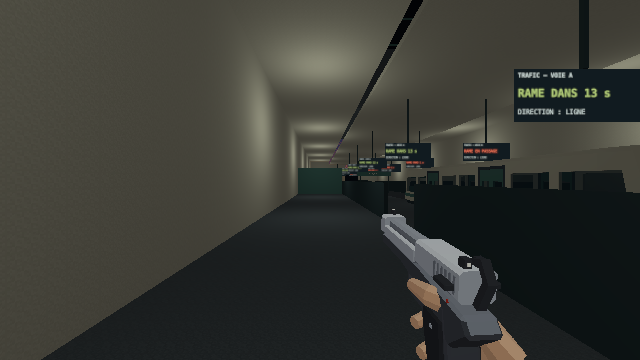

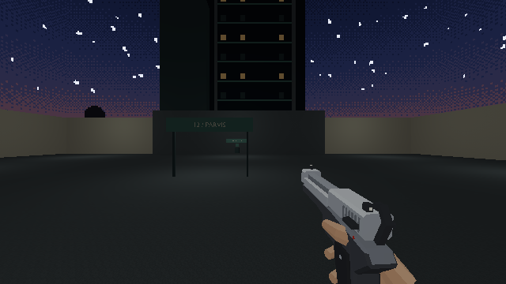

## Gate encore ouvert

L'utilisateur doit jouer de la rue au hall et juger la longueur, la lisibilité
et le rythme, notamment les deux branches du dépôt et le détour des galeries.
La grille A se lève aussi pour les trains : une traversée risquée peut
court-circuiter le détour avant d'activer son bouton de retour.

Les combats, récompenses, vrais secrets, l'habillage des salles et les
ambiances propres au métro restent aux lots N6/N7. Les plafonds souterrains
sont visuels dans ce blockout ; les parois latérales et supports portent les
collisions. Le voyage est observé à bord ; le hot reload conserve son état
par code, sans essai manuel de rechargement pendant le trajet dans ce relevé.

## Révision après le retour sur les tunnels

Le même jour, l'utilisateur signale des tunnels peu crédibles, des rames qui
apparaissent sans origine lisible, trop de panneaux et une sensation de
saccade malgré plus de 120 FPS. Il précise que cette sensation concerne
la marche **et** le train. Les observations précédentes décrivent le premier
export ; les captures ci-dessous décrivent sa révision.

Trois [photographies réelles](../assets/tunnels-references.md) sont regardées
avant la reprise : quai MF77, voies de Porte de Versailles et galerie de
Porte Maillot. La révision ajoute les voûtes, deux bouches séparées, rails,
traverses, câbles latéraux, suspentes et arrière-tunnels. Les jours autour
des bouches sont fermés après inspection dans le moteur.

Les grandes planches de repérage et d'arrêt disparaissent. Deux afficheurs
restent sur les quais ; les feux sont espacés de 14 m et regroupés dans deux
lots instanciés. Les petites plaques de refuge et les directions utiles
restent. L'arrivée VB emprunte un sas courbe distinct du poste. Les garages
ont des sorties piétonnes latérales ; une marche de X 39,25 à 43,56, à Y 325,
confirme le passage du tunnel A au dépôt. La commande d'aiguillage reste
utilisable et réveille VB.

Les voitures sont préparées et chauffées au chargement, puis réutilisées
pendant le trafic. L'orientation suit deux bogies plutôt que de changer
brutalement à chaque sommet du tracé. La marge de visibilité et de contact
s'étend de 13,5 m dans les arrière-tunnels. La voiture entière reste à
l'intérieur de leur enveloppe à sa création et à sa suppression, au-delà
des ouvertures piétonnes latérales. Les prolongements de rail restent horizontaux au niveau du garage. Les corps réactivés sont placés avant leur
activation. Ces corrections ciblent des coûts et discontinuités identifiés
dans le code ; elles ne prouvent pas à elles seules la cause du retour.

### Relevés de cadence

Mesures manuelles dans le navigateur intégré, avec la page d'auteur :

| Observation | Résultat |
|---|---|
| Avant révision, quais immobiles, trafic actif, 20 s | 2 401 images ; p95 8,8 ms ; maximum 9,4 ms ; aucune image au-delà de 33 ms |
| [Dernier export, quais, trafic actif, 20 s](../assets/blockout-metro/cadence-revision.json) | 2 396 images ; p95 9 ms ; maximum 33,3 ms ; une image au-delà de 17 ms, aucune au-delà de 34 ms |
| [Après révision, marche sans trafic, 2 s](../assets/blockout-metro/marche-revision.json) | 240 images ; p95 8,4 ms ; maximum 9,3 ms ; 121 déplacements physiques ; variation verticale maximale 2,08 cm par pas |
| Caméra pendant la même marche, après l'accélération | 211 images observées ; aucune position immobile ; déplacement horizontal de 6,75 à 8,37 cm par image |

Le relevé avec une mort sous le train est écarté : sa pointe de 100 ms
survient pendant la fin de partie et ne mesure pas une marche continue.
Le gel décrit par l'utilisateur **n'est pas reproduit comme une saccade
répétée** dans les mesures ci-dessus, même avant révision. Une pointe isolée
de 33,3 ms subsiste dans le dernier relevé ; sa cause n'est pas attribuée.
La fluidité ressentie sur sa machine reste à confirmer ; le compteur FPS
seul ne suffit pas à la conclure. Les clés des compteurs ont été renommées
selon leurs seuils réels (17 et 34 ms), sans changer les valeurs relevées.

La compilation de production et le contrôle des liens documentaires passent.
Aucune suite de tests n'est ajoutée ni lancée. Le contrôle de lisibilité
intégré au chargement passe avec les nouveaux raccords. Le dernier export
contient 3 632 objets, environ 18 910 Kio, sans fuite de bibliothèque. Le
moteur relève 957 proxies (242 boîtes, 715 enveloppes convexes), 165 lampes,
7 meshes de portes et 27 interactions. Cinq vues Blender sont rendues ;
les quais et le tunnel sont aussi regardés dans le moteur.

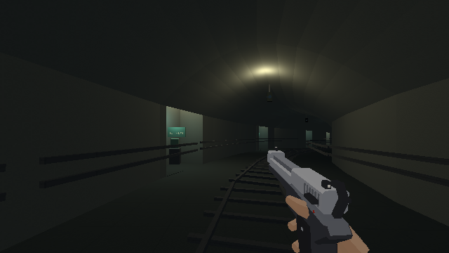

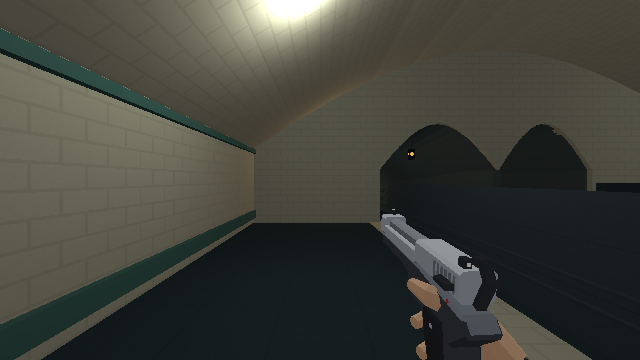

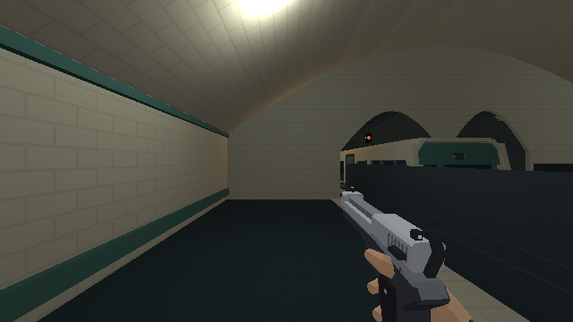

La réservation de toit S3 et le raccord de la voie de manœuvre M sont
différés à N7 ; M n'est plus déclarée dans ce blockout. Le sol du dépôt reste
continu. Les nappes de quartier restent provisoires. Le gate N5 de parcours,
orientation et fluidité reste ouvert ; N6 n'est pas lancé.

## Profondeur, galeries et encombrement — 8 octobre

L'utilisateur constate que le parcours est « beaucoup plus fluide ».
Il signale un accès aux galeries bloqué par une plaque noire, trop de
refuges et de signaux, des câbles mal rangés et la voûte qui dépasse dans
la salle située au-dessus. Ce retour ne valide pas encore tout le parcours.

Le fond noir du prolongement B était une poutre de section 4,5 × 4,5 m,
centrée à Y 214 : son volume traversait la galerie. La nouvelle paroi de
24 cm est posée à Y 212. La marche depuis X −2 jusqu'à X 2,45, à Y 215,
franchit l'ouverture sans saut ; la pose finale reste au sol à −14,43 m.
Le [relevé](../assets/blockout-metro/galeries-2026-10-08.json) et sa capture
décrivent cet export.

Les quais passent de −9 à −13 m, et les rails de −9,75 à −13,75 m. Les
altitudes du quartier, des billets et du dépôt sont conservées. Le tunnel A
et les galeries rejoignent toujours le dépôt à −18 m ; leurs lampes,
commandes, proxies et poses suivent la pente révisée. La voûte reste sous
le plancher des billets. Les données révisées sont isolées dans
`tools/metro/blockout/layout.py` ; les données et sorties N2 restent celles
de leur validation historique.

Depuis la salle des billets, une marche continue part de Y 106 et atteint
Y 123,95 sur le quai à −12,99 m. Le [relevé de descente](../assets/blockout-metro/descente-2026-10-08.json)
contient 240 images sur 2 s, un p95 de 8,4 ms et un maximum de 9,3 ms.
Le raccord des galeries actionne toujours le raccourci après changement
d'altitude. Ces observations utilisent les points de vue d'auteur pour
rejoindre les portions, elles ne constituent pas une partie complète.

| Élément | Export du 7 octobre | Export du 8 octobre |
|---|---:|---:|
| Niches A/B | 19 | 10 |
| Niches du sas VB | 2 | 1 |
| Feux compacts | 29 | 15 |
| Afficheurs publics | 2 | 2 |

Les refuges retirés sont réellement refermés ; leurs commandes et lampes
disparaissent aussi. Une goulotte continue fixée en haut d'une seule paroi,
avec consoles, remplace les câbles tracés à distance constante de l'axe.
Elle suit les élargissements et les courbes et libère le côté des galeries.

La recette rend sept vues Blender. La descente, la galerie et le tunnel
sont regardés dans Blender puis dans le moteur. L'export contient 3 261
objets, environ 17 057 Kio, sans fuite de bibliothèque. Le moteur relève
801 proxies (233 boîtes, 568 enveloppes convexes), 158 lampes, 7 meshes de
portes et 18 interactions. Le contrôle de signaux et de distances aux
refuges intégré au chargement passe. Aucune suite de tests n'est ajoutée
ni lancée.

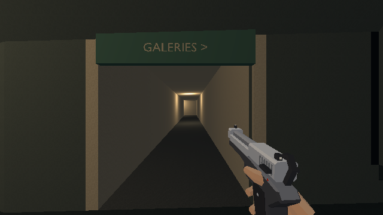

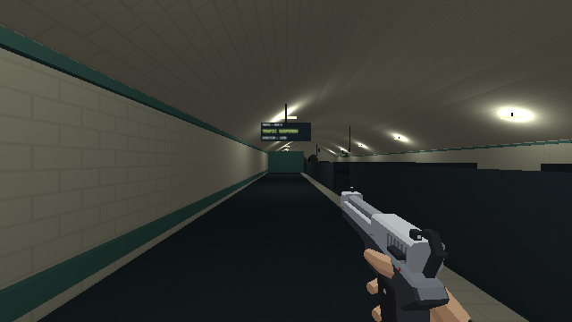

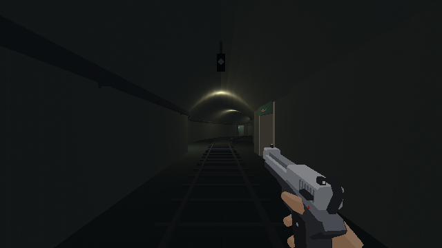

N5 reste en revue pour le trajet complet et son orientation ; N6 n'est
pas lancé. Les fonds de voie restent des volumes provisoires.

## Reprise zone par zone — tête nord de station

Le 8 octobre, après la correction des profondeurs, l'utilisateur demande
plus de cohérence dans l'assemblage et une reprise concentrée sur une zone
à la fois. Cette passe couvre le front nord du quai, son accès de maintenance
et l'entrée des galeries. Le dépôt et les autres salles ne sont pas repris.
Les [références et contraintes](../assets/tunnels-references.md#première-zone-reprise-tête-nord-et-accès-de-maintenance)
sont écrites avant la construction.

Trois problèmes précis sont identifiés : les ouvertures des voies ont une
forme pointue ; la paroi générique de fin du quai coupe la voie droite ; le
passage latéral s'arrête avant le premier renfoncement, sans sortie propre.
L'entrée des galeries possède une enseigne volumineuse dans l'ouverture,
sans encadrement ni seuil.

Le nouveau front maçonné réunit les revêtements du quai, deux ouvertures
arrondies et une ouverture de maintenance. Cette dernière dessert une rampe
qui rejoint le niveau des rails. Le seuil des galeries possède un cadre
métallique, une porte visuelle ouverte contre le mur et des appliques fixées.
Le grand panneau est remplacé par un petit écriteau au-dessus du passage.
La commande du premier refuge rejoint la paroi du fond. La portion finale
des garde-corps est ajourée pour dégager la vue sur les voies.

Trois reconstructions Blender sont rendues et regardées. La dernière
exporte 3 254 objets pour environ 17 147 Kio, sans fuite de bibliothèque.
La [fiche technique](../4-technique/blockout-metro.md#raccord-nord-de-la-station)
décrit la construction courante.

### Parcours observé

Le trafic est suspendu pendant la marche. Après le seul placement initial
sur le quai à X −6,5, Y 181, le trajet jusqu'à la galerie se fait à pied,
sans saut. Les rotations utilisent les boutons de revue ; ils reprennent
la pose courante, sans choisir un nouveau point de vue.

| Segment | Observation |
|---|---|
| Quai → rampe de maintenance | Arrêt à X −6,78, Y 197,09, pieds −13,91 m |
| Rampe → rails, après rotation à droite | X −3,09, Y 196,80, pieds −13,94 m |
| Rails → seuil des galeries | X −3,09, Y 214,90, pieds −14,43 m |
| Franchissement du seuil | X 1,36, Y 214,90, pieds −14,43 m |
| Retour par le même seuil | X −3,09, Y 214,90, pieds −14,43 m |

Le relevé des deux marches de 2 secondes ne contient aucune image de plus
de 34 ms ; leurs maxima sont 9,3 et 9,4 ms. Ce court relevé ne constitue pas
une mesure globale de performance. Le trajet est observé avant le dernier
ajustement visuel des garde-corps, puis la version finale est rechargée et
revue. [Relevé détaillé](../assets/blockout-metro/parcours-raccord-2026-10-08.json).
La marche depuis le quai est répétée sur l'export final : elle atteint
X −6,77, Y 197,09, pieds −13,91 m, sans saut ni blocage dans le passage.
[Relevé final](../assets/blockout-metro/rampe-service-finale-2026-10-08.json).
Le moteur relève 782 colliders, dont 233 boîtes et 549 enveloppes convexes,
aucun trimesh, 161 lampes et 233 lots de décor.
Aucune suite de tests n'est ajoutée ou lancée.

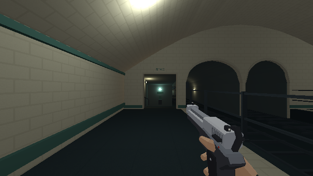

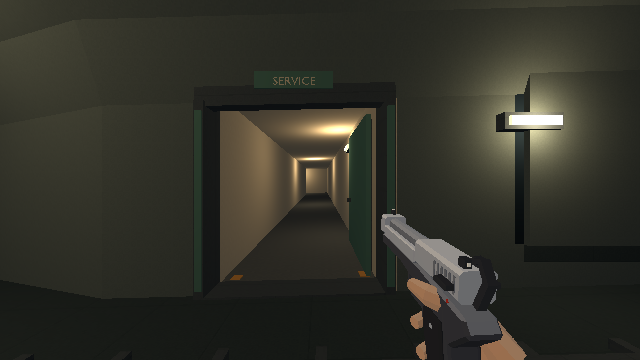

Le périmètre reste en revue utilisateur. La longueur totale, les raccords
plus profonds et les futurs habillages ne sont pas validés par cette passe.

## Correction des voûtes — 8 octobre

L'utilisateur demande de corriger les voûtes de la station et des tunnels.
La reprise porte sur leur géométrie et leurs raccords. Le reste de
l'agencement ne change pas.

Le profil précédent alterne entre une sinusoïde et une ellipse échantillonnée
uniformément en largeur. Les sections ont seulement douze bandes, des
normales plates et deux nappes non reliées pour représenter l'épaisseur.
Les murs de tête suivent une corde droite sur leurs grandes portions,
laissant des jours sous la courbe du plafond. Les suspensions sont calculées
contre une hauteur analytique qui diffère du maillage réel.

La construction utilise maintenant un profil demi-elliptique commun,
échantillonné tous les 7,5 degrés : 24 bandes. L'enveloppe de 12 cm est
fermée aux bords et aux extrémités, les normales des surfaces courbes sont
lissées et les UV suivent les arcs. Les portails utilisent les mêmes points.
Les fronts sont subdivisés aux points de la voûte de station ; les suspensions
suivent sa hauteur polygonale réelle. Les lampes de quai ont une marge de
55 cm contre toute la largeur de leur boîtier.

Les grandes plages noires dans les rendus Blender sont aussi des ombres
projetées par les boîtiers des lampes sur la voûte. Elles sont absentes du
rendu en jeu, qui n'active pas les ombres de ces lampes. Les aperçus Blender
de ces lampes désactivent donc leurs ombres, pour permettre une comparaison
fidèle des volumes. Ce réglage ne masque pas les jours : les murs de tête
sont bien reconstruits jusqu'au profil exact du plafond.

La compilation TypeScript et Vite passe (598 modules). L'avertissement de
poids du bundle reste présent. Aucune suite de tests n'est ajoutée ou lancée.
Les vues Blender du quai, du front et du tunnel sont regardées ; la revue
se poursuit sur ces mêmes points dans le moteur.

Le dernier export contient 3 360 objets pour 17 479 Kio. Le moteur relève
888 proxies (233 boîtes, 655 enveloppes convexes, aucun trimesh), 233 lots
de décor et 161 lampes. Aux vues fixes du quai, du front et du tunnel, le
trafic suspendu, les comptes de dessin sont respectivement 59, 61 et 58,
pour environ 51 484, 48 278 et 44 859 triangles.

Une marche de 2 secondes sous la voûte va de Y 207 à Y 225,10,
sans blocage. Le maximum est 9,4 ms, sans image de plus de 34 ms ; cette
mesure courte ne valide pas la performance du niveau entier.
[Relevé des vues et de la marche](../assets/blockout-metro/voutes-2026-10-08.json).
Les captures sont accompagnées d'[empreintes de pixels](../assets/blockout-metro/voutes-images-2026-10-08.json) ;
elles proposent une nouvelle référence, sans comparaison de régression
déterministe. La console conserve les messages `MutationObserver` déjà
présents avant cette passe ; leur origine n'est pas établie ici. Aucun gate
global de console propre n'est revendiqué.

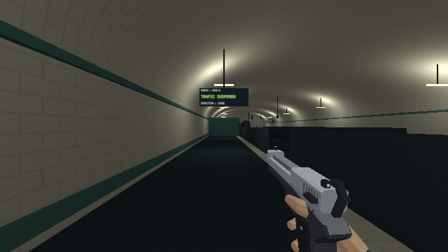

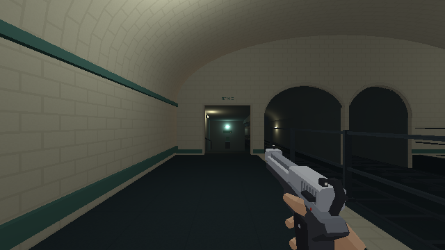

## Quai continu — 8 octobre

Après la reprise des voûtes, l'utilisateur signale un mur au bout du quai.
La vue depuis Y 126 montre la cloison pleine `n5_division_quai_gauche`,
placée à Y 153 : elle barre les cinq mètres de largeur du quai et masque
sa continuation. Cette cloison existe depuis le premier blockout ; la
reprise des voûtes la laisse en place à tort. Les revues à Y 181 et Y 207
ne permettent pas de constater ce blocage en amont.

La cloison et son collider sont supprimés. Le quai gauche conduit directement
au passage de maintenance, sans imposer un aller-retour artificiel sur le
quai droit. Les deux traversées restent présentes. Les bordures pleines des
deux quais deviennent des garde-corps ajourés : la lecture des voies et du
front de station se fait sur toute la longueur, avec les mêmes limites de
collision et les mêmes ouvertures de traversée.

La description de la page d'auteur est corrigée pour suivre ce trajet.
La reprise reste concentrée sur la station et son raccord au tunnel ;
le dépôt et les autres salles restent à reprendre séparément.

La nouvelle vue Blender est regardée depuis le début du quai, puis le
parcours est contrôlé dans le moteur avec le trafic suspendu. Le départ
se fait à l'escalier, X −6,5 / Y 106 / pieds −4,99 m. La marche traverse
successivement Y 124,10, 142,20, 159,93 (au-delà de l'ancienne cloison),
177,88 et 195,98, dans le passage de maintenance. Après rotation vers les
rails, elle atteint X −2,05 / Y 196, puis l'entrée de galerie à
X 1,60 / Y 214,42 / pieds −14,42 m. Aucune sélection de point de vue ni
aucun saut n'intervient entre ces points ; les boutons de rotation gardent
la position courante. [Relevé du trajet](../assets/blockout-metro/quai-continu-2026-10-08.json).

Le dernier export contient 3 354 objets pour 17 612 Kio. L'inspection des
noms du GLB ne retrouve ni la cloison ni son collider. Aucune suite de
tests n'est ajoutée ou lancée.

## Galeries de service — 8 octobre

À la demande de poursuivre zone par zone, cette passe couvre l'entrée à
Y 214, les neuf tronçons en coudes et le retour dans A à Y 302–304,5. Le
dépôt, les autres tunnels et la réservation du secret gardent leur état
provisoire. La photographie de l'atelier Porte Maillot est regardée avant
modélisation ; ses fixations et son alignement technique servent de repères.

Les parois passent au béton du kit métro. Deux conduites continues ont des
coudes arrondis, des colliers et des consoles. Une goulotte les accompagne
contre le même mur. Les points lumineux flottants deviennent des appliques
avec boîtiers et fixations ; la lampe devant l'accès réservé au secret est
décalée sur la paroi pleine. Deux coffrets peu profonds marquent le premier
tronçon et le retour. Aucune pancarte de direction supplémentaire n'est posée.

Les supports qui passent sur plusieurs pentes sont subdivisés à Y 222,
290 et 294. Les conduites et la goulotte reprennent les mêmes ruptures de
pente. Le retour dans A reçoit un encadrement ; sa commande est fixée au mur
nord avec une inscription courte et une liaison électrique visible.

Trois itérations sont rendues dans Blender. Les vues intérieur, nord et
commande sont regardées, puis le candidat est observé dans le moteur.
La marche commence dans A, à X −2 / Y 215, traverse le seuil puis tous les
coudes, et atteint la commande à X 42,42 / Y 303,87. Aucun saut ni sélection
de point de vue n'intervient entre le départ et cette commande ; les rotations
gardent la position courante. La touche E ouvre effectivement la grille.

La session navigateur se ferme avant l'observation du portail de retour.
Une seconde observation commence donc au point de revue de la commande,
X 44 / Y 302,35, puis franchit le portail vers X 39,46 / Y 302,47 dans A.
Ce dernier franchissement est vérifié séparément, sans le présenter comme la
continuation ininterrompue du premier parcours.
[Relevé des deux observations](../assets/blockout-metro/galeries-parcours-2026-10-08.json).

Les douze mesures courtes de marche ne montrent aucune image au-delà de
34 ms ; le maximum observé est de 26 ms sur l'une d'elles. Les passages
contre les murs aux coudes incluent volontairement des arrêts de collision,
et ne constituent pas un relevé de fluidité de déplacement continu.
Le moteur relève 897 colliders et 243 lots de décor. L'export contient
3 415 objets pour 18 381 Kio, sans fuite de bibliothèque. Aucune suite de
tests n'est ajoutée ni lancée. Le jugement de rythme et de longueur du niveau
entier reste ouvert.

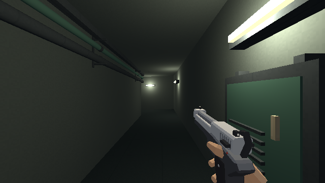

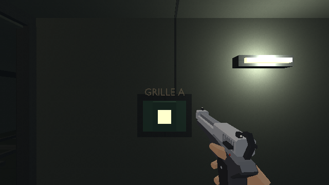

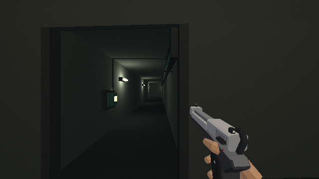

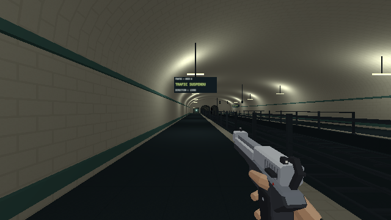

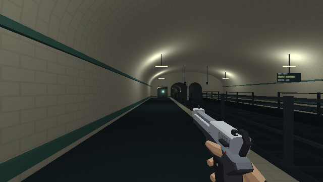

## Dépôt et embarquement — 8 octobre

Après l'accord utilisateur sur les galeries, la passe suivante se concentre
sur le dépôt et ses seuils. La photographie MF77 du board est regardée à
nouveau : charpente régulière, luminaires suspendus, voies de remisage et
équipements en bordure. Le reportage RATP sur La Villette complète les
fonctions d'atelier. Aucun matériau photographique n'est intégré au jeu.

Le dépôt reçoit trois travées porteuses, des poutres qui rejoignent le
plafond et des suspensions visibles. Les lampes hautes de la première
itération sont abaissées à 4,40 m ; des appliques éclairent les seuils et
les bords. Les parois reprennent le béton du kit métro. Les garages qui
masquent A et VB sont habillés comme des volumes fermés, en conservant leurs
ouvertures latérales et leurs collisions.

La rame de maintenance est placée à l'est, axe X 58,5 / Y 341–356, hors du
garage VB. Sa baie comprend des rails, un butoir, un palan fixé à la charpente
et un bogie déposé. Les établis et armoires sont groupés contre les murs.
Les rails décoratifs M qui traversaient la paroi du garage A sont retirés ;
le trafic et l'implantation M restent à N7. La réservation N2 du secret S3
reste exclue ; son implantation devra suivre la rame garée lors de N7.

La revue révèle que le mur nord du dépôt coupe l'ancien quai latéral. Le
support du quai est ajouté aux voisins utilisés pour découper ce mur.
L'escalier de trois marches rejoint un sas fermé sur ses côtés extérieurs,
avec un plafond raccordé et une porte latérale accessible dans la rame.
Les deux entrées de machinerie ont des encadrements et une fermeture
construite au-dessus du linteau. Les grands panneaux autonomes sont remplacés
par de courtes inscriptions sur les seuils.

Quatre itérations sont rendues et regardées. La dernière source et son GLB
contiennent 3 821 objets pour 20 098 Kio, sans fuite de bibliothèque. Le
moteur relève 1 072 colliders, dont 322 cuboid, 750 convex hull et aucun
trimesh ; 242 lots de décor et 179 lampes sur l'ensemble du niveau.

Quatre parcours manuels distincts sont observés, sans saut :

- Depuis A, X 39,25 / Y 325, franchissement de la sortie vers X 43,59,
  traversée du dépôt, montée des marches et entrée dans la rame à
  X 40,84 / Y 367,87 / pieds −17,24 m. Une tentative de couper la rampe
  latéralement par sa partie haute s'arrête sur son rebord ; le parcours
  reprend par le pied des marches, sans déplacement entre points de vue.
- Depuis X 44 / Y 329, passage par l'allée sud et la porte du garage VB,
  puis entrée dans le tunnel B à X −6,43 / Y 352,84.
- Depuis X 44 / Y 329, entrée dans l'accès sud de machinerie à
  X 74,56 / Y 329 / pieds −18,74 m.
- Depuis X 44 / Y 329, passage derrière la rame garée puis entrée dans
  l'accès nord à X 75,15 / Y 352,73 / pieds −18,89 m.

Les huit mesures courtes associées ont un maximum de 9,50 ms et aucune
image au-delà de 34 ms. Elles portent sur ces traversées, avec trafic
suspendu ; elles ne remplacent ni une partie complète ni une mesure de
performance avec combat. Aucun test automatisé n'est ajouté ni lancé.
[Relevé des parcours](../assets/blockout-metro/depot-parcours-2026-10-08.json).

La page d'auteur ajoute un petit pas de 0,1 s pour approcher les seuils.
Sa vue Dépôt montre désormais la baie de maintenance. La reprise des salles
d'aiguillage et de machinerie reste la prochaine étape ; les deux objectifs
ne sont pas actionnés lors de cette revue.

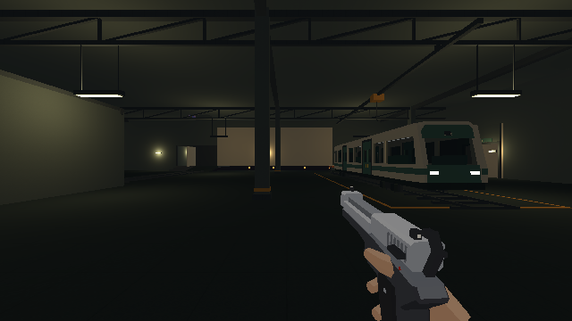

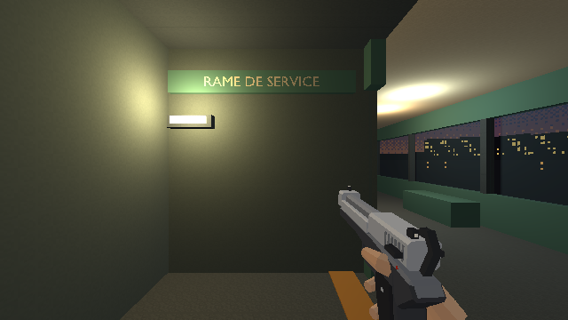

## Poste d'aiguillage — 8 octobre

La passe suivante reprend le poste, depuis l'entrée du dernier tronçon de B
jusqu'à la cabine, sans reprendre tout le tunnel. La photographie du poste
VAL des Archives nationales du monde du travail est ouverte et regardée :
pupitres inclinés, claviers bas, tableau de voies distinct des écrans.
Les photos du reportage maRATP à Massy montrent une visite et l'atelier ;
elles sont écartées comme référence visuelle du pupitre.

L'entrée est encadrée et refermée autour d'un passage de 2,80 m. Une porte
visuelle reste ouverte contre la paroi. Huit marches habillent la rampe,
avec deux mains courantes ; le collider incliné est conservé. Les appliques
ont des boîtiers fixés et les deux lampes de cabine rejoignent le plafond.
La première applique du lobby est replacée sur sa paroi pendant la révision.

Le pupitre incliné rassemble deux écrans et leurs claviers, le tableau de
voies original et la commande. Le schéma reste statique, sans prétendre
montrer la circulation réelle. Deux armoires et un bureau de maintenance
occupent les bords. Les portes des armoires sont tournées vers la pièce.
La borne isolée et son grand panneau sont retirés.

Deux itérations sont rendues dans Blender et regardées. La version finale
est exportée avec 3 846 objets pour 20 334 Kio, sans fuite de bibliothèque.
Le moteur relève 1 081 colliders : 331 cuboid, 750 convex hull, zéro trimesh.
Le niveau entier possède 250 lots de décor et 180 lampes.

Le parcours manuel commence dans B, à X −63,25 / Y 378 / pieds −17,99 m.
Il franchit l'entrée, atteint X −67,49 / pieds −17,32 m sur la montée,
puis X −71,23 / pieds −15,99 m dans la cabine. La commande est approchée
à X −72,94 / Y 379,69. E valide l'aiguillage ; le relevé montre également
VB active, avec son compte à rebours de départ. Le trafic est ensuite
suspendu pour observer le retour. La marche redescend et ressort dans B à
X −55,40 / Y 378,88 / pieds −17,99 m.

Aucun saut ni sélection de point de vue n'intervient pendant cet aller-retour.
La mesure courte du retour relève un maximum de 9,40 ms et aucune image
au-delà de 34 ms ; elle ne constitue pas un playtest du tunnel entier avec
trafic. Les vues de présentation sont prises séparément après le trajet.
[Relevé du poste](../assets/blockout-metro/poste-parcours-2026-10-08.json).
Aucune suite de tests automatisés n'est ajoutée ni lancée.

La progression TypeScript reste inchangée. La nouvelle vue « Accès du poste »
permet de refaire cette montée depuis B. La prochaine zone est la machinerie.

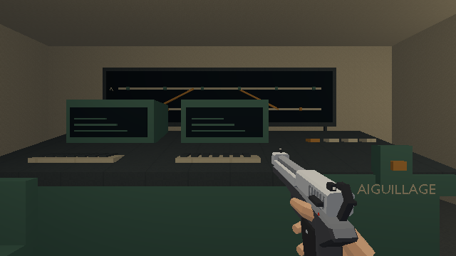

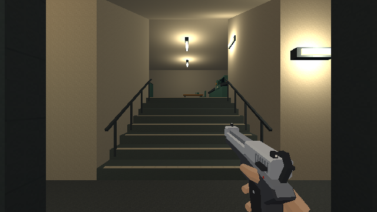

## Machinerie — 8 octobre

La reprise suivante se concentre sur la salle et ses deux rampes. La photo
du local ventilation publiée par Grand Paris Express est ouverte et regardée :
carter cylindrique, raccords de gaines, socles, garde-corps et réseaux fixés.
L'installation du jeu est originale, dimensionnée pour le parcours du plan.

Le plafond manquant au-dessus de la fosse est fermé à −17 m. Son cuvelage
rejoint le fond à −26 m. Les parapets opaques sont remplacés par des
garde-corps ajourés, avec quatre limites cuboid de 1,50 m. Le ventilateur
de 6,40 m, sa grille, ses sept pales et ses socles occupent la fosse ;
une transition et une gaine verticale raccordent son arrière au plafond.
Deux pompes et leurs conduites restent contre le mur ouest. Le réseau et
les pales sont statiques, sans animation ni nouveau son.

Les armoires du poste force occupent le mur nord-est. La commande de courant
est fixée sur leur face utile ; son nom reste `use_n5_courant`. Les rampes
reçoivent des mains courantes et des appliques murales. Les lampes de la salle
ont des supports visibles. Le premier rendu montrait la façade des armoires
trop sombre : les deux lampes nord sont suspendues devant elles. Une
dernière révision retire un volume de gaine superposé. Trois versions sont
construites et leurs vues regardées.

Le parcours manuel commence dans l'accès sud à X 75 / Y 330. Il descend
jusqu'au sol de la salle à −22 m, suit l'allée sud, puis le bord est
jusqu'à la commande. E à X 115,22 / Y 355,68 rétablit le courant.
Le retour passe au nord de la fosse, remonte la seconde rampe et rejoint
le dépôt à X 62,56 / Y 354,83 / pieds −17,99 m. Aucun saut ni changement
de point de vue n'intervient durant cette boucle. Les vues de présentation
sont prises séparément.

Les six mesures courtes du parcours ont un maximum de 9,40 ms et aucune
image au-delà de 34 ms, avec trafic suspendu. Elles décrivent cette boucle,
sans constituer un playtest du niveau entier ni du combat. Aucun test
automatisé n'est ajouté ou lancé.
[Relevé du parcours](../assets/blockout-metro/machinerie-parcours-2026-10-08.json).

L’export final contient 3 878 objets pour 20 977 Kio, sans fuite de
bibliothèque. Le moteur relève 1 093 colliders : 347 cuboid, 746 convex
hull, zéro trimesh ; 257 lots de décor et 183 lampes sur le niveau entier.
La commande est également actionnée sur cette dernière version.

La progression TypeScript reste inchangée. La réservation du secret 4
attend N7. La prochaine reprise concerne la rame de fret et son arrivée
au quai privé ; le gate N5 du parcours complet reste ouvert.

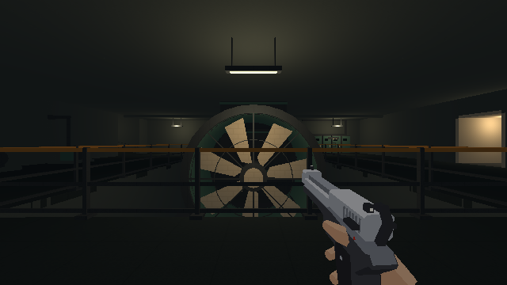

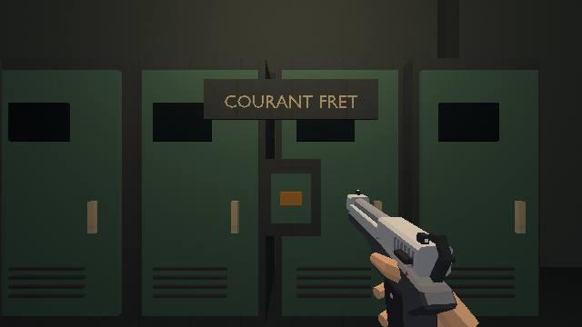

## Rame de fret et quai privé — 8 octobre

Cette passe reprend le véhicule jouable et ses deux environnements d’arrêt.
La photo MF19 d’Alstom publiée par IDFM est rouverte et regardée : toiture
à pans, vue traversante, sièges latéraux, mains courantes et éclairage
longitudinal. La rame de service du jeu conserve quatre voitures et ses
dimensions de combat, avec des charges arrimées en bordure.

Le modèle possède une caisse et une toiture propres, des fenêtres
encadrées et trois soufflets ouverts. L’allée garde au moins 2 m. Les
sièges et les charges occupent les côtés, les lampes ont des fixations et
la commande de départ est intégrée au pupitre de la dernière voiture.
Les portes coulissent dans des poches : entrée vers le nord, sortie vers
le sud, sans prolonger le vantail hors de la longueur de la rame.

L’inspection initiale montrait le ciel par les fenêtres à l’arrêt. Un
garage fermé appartient désormais au décor de départ ; une contre-paroi
et une couverture ferment aussi les vues ouest à l’arrivée. Le quai
privé reçoit une palette froide, des joints de dallage, quatre travées,
une rangée de poteaux et deux bancs muraux. Une inscription courte
accompagne le portail de remontée.

La première marche en jeu révèle encore le ciel au fond sud du quai :
la paroi de séparation était masquée avec le dépôt. Une paroi visuelle
propre à l’arrivée referme ce bord, en conservant le collider existant.
La dernière passe éclaire l’inscription de sortie. Trois versions sont
construites et regardées. Les vues Blender masquent alternativement le
garage et le quai, après l’export, pour éviter leur superposition.

Le parcours commence après activation des deux objectifs, depuis le pied
des marches à X 36,25 / Y 362,80 / pieds −17,99 m. Il monte au sas,
franchit la porte ouest, puis suit toute l’allée jusqu’à
X 39,65 / Y 425,68 / pieds −17,24 m. E lance la fermeture ; le trajet
atteint l’état d’arrivée à 60 s, distance simulée 1 296 m. Le relevé
montre l’entrée fermée et verrouillée, la sortie ouverte et libre.

Le joueur ressort à X 44,22 / Y 423,98, rejoint le portail et franchit
le début de la remontée à X 48,67 / Y 432,20 / pieds −16,16 m. Aucun
saut ni sélection d’un autre point de vue n’intervient entre les marches
et la remontée ; les objectifs sont préparés séparément par les vues
d’auteur avant ce parcours. Les trois mesures courtes dans les voitures
ont un maximum de 10,30 ms, sans image au-delà de 34 ms. Elles ne
mesurent ni le voyage entier ni un combat.
[Relevé du trajet](../assets/blockout-metro/fret-parcours-2026-10-08.json).
Aucun test automatisé n’est ajouté ou lancé.

L’export final contient 3 787 objets pour 23 493 Kio, sans fuite de
bibliothèque. Le moteur relève 1 101 colliders : 355 cuboid, 746 convex
hull, zéro trimesh ; 255 lots de décor et 173 lampes sur le niveau entier.
Les vues finales sont prises à l’arrivée sur cette dernière version.

La progression, le voyage et son panneau TypeScript restent inchangés.
La remontée, le parvis et le seuil de la tour attendent la prochaine
passe ; le gate N5 du parcours complet reste ouvert.

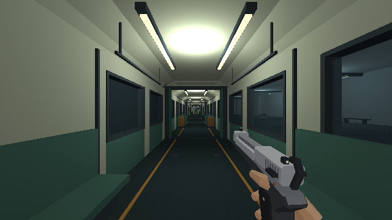

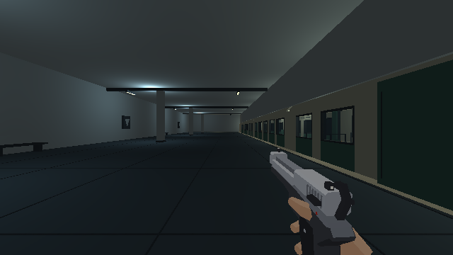

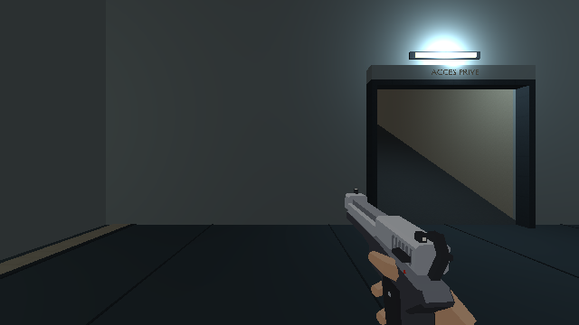

## Remontée et seuil de la tour — 8 octobre

La dernière passe architecturale reprend la montée et le parvis. La vue
de Canary Wharf du board N1 est rouverte et regardée : montée axiale,
parois continues, mains courantes et lumière au débouché. Le candidat
conserve l’emprise N2 de 4 × 36,50 m et le dénivelé de 17,25 m ; il
transforme la rampe en quatre volées de 18 / 17 / 17 / 17 marches,
de 25 cm avec un giron de 45 cm, et trois paliers.

Les sept supports de N5 suivent ces changements de pente. Les plafonds,
les mains courantes et les appliques suivent les mêmes altitudes. Chaque
volée possède un proxy incliné, sans collider par marche. Le débouché
reçoit un sas couvert et vitré dont la toiture, les parois et le linteau
sont raccordés.

Les murs opaques de 5 m autour du parvis sont remplacés par des limites
ajourées de 1,50 m. Un sol visuel extérieur entoure la zone, sans passer
à travers l’escalier et sans étendre la surface praticable. Deux grilles
techniques et quatre mâts lumineux occupent les côtés. L’axe X 50 reste
dégagé vers la tour. Le socle de son instance proche est remplacé par
une façade vitrée et une entrée sous marquise, avec consoles porteuses.
L’instance distante du quartier conserve son modèle. Le niveau finit
sur ce seuil, sans construire l’intérieur de la tour.

Trois versions sont rendues et regardées. La seconde ajoute le sol
extérieur ; la troisième rend l’inscription « HALL » émissive pour
qu’elle se lise sur la face extérieure de la marquise. La commande
`use_n5_fin` est intégrée à la porte. Le contrôleur TypeScript reste
inchangé. La vapeur et le passage du ciel à l’aube restent à la passe
d’ambiance finale.

Après préparation des deux objectifs et du voyage, le parcours commence
au pied de la montée à X 50 / Y 430 / pieds −17,24 m. Il atteint
X 50 / Y 443,68 / pieds −10,58 m, puis le troisième palier à
Y 457,82 / pieds −4,24 m. Il franchit le sas et rejoint le parvis à
Y 473,67 / pieds 0,01 m.

Une marche vers l’ouest est arrêtée à X 24,49 / Y 473,68, pieds toujours
à 0,01 m : la limite ne laisse pas marcher hors du sol. Le joueur revient
sur l’axe, rejoint l’entrée sous marquise et approche la commande à
X 50,36 / Y 498,38 / pieds 0,01 m. E positionne `completed` à vrai et
affiche « SORTIE DU MÉTRO ». Aucun saut ni sélection d’un autre point
de vue n’intervient entre le départ de la montée et l’action de fin.

Les sept mesures courtes ont un maximum de 25,10 ms lors du débouché
et aucune image au-delà de 34 ms. Les autres maxima vont de 9,40 à
10,40 ms. Ces relevés n’établissent pas une cadence parfaite et ne
remplacent pas un parcours complet avec combat. Aucun test automatisé
n’est ajouté ni lancé.
[Relevé de la montée et du seuil](../assets/blockout-metro/remontee-parcours-2026-10-08.json).
Les vues sont prises pendant les itérations et la marche ; la façade
montre l’enseigne de la dernière version.

L’export final contient 3 856 objets pour 25 572 Kio, sans fuite de
bibliothèque. Le moteur relève 1 130 colliders : 371 cuboid, 759 convex
hull, zéro trimesh ; 252 lots de décor et 178 lampes sur le niveau entier.
Le gate N5 reste ouvert pour le parcours utilisateur de bout en bout,
son rythme et son orientation. Cette passe ne lance pas N6/N7.

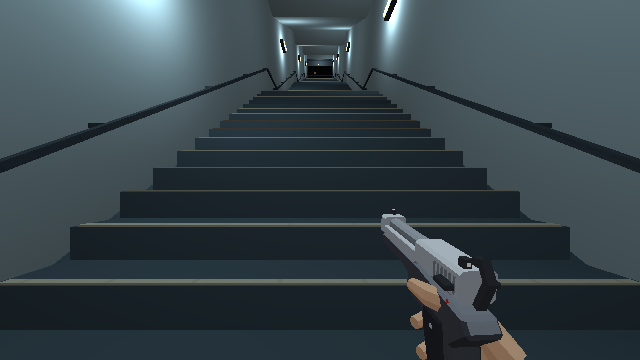

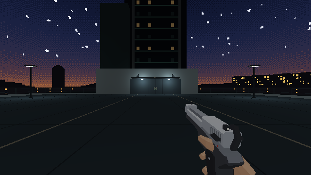

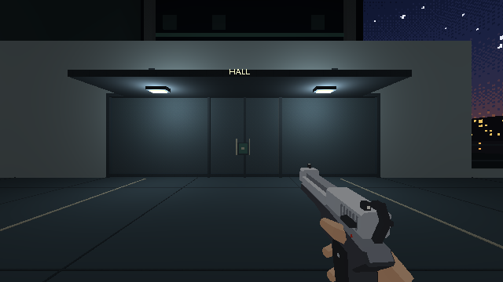

## Lecture des galeries et du dépôt — 8 octobre

L’utilisateur rejette la lecture globale : grands textes, dépôt trop vaste,
rails déconnectés, rame prise pour une pièce, local vide, trous et
chevauchements, sol des galeries perçu comme incliné de travers. N5 reste
un candidat ; les reprises antérieures ne constituent pas une validation.

La cause du dévers est identifiée dans `galerie_z` : l’altitude dépendait
de Y, y compris dans les couloirs est-ouest. Les nouveaux paliers restent
horizontaux ; seules deux rampes dans l’axe des couloirs descendent. Les
supports, plafonds, conduites et lampes partagent ces hauteurs. Le local
d’agents passe de 32 × 24 à 8 × 6 m : armoires, banc, point d’eau et lampe
fixée. Il n’ajoute ni secret comptabilisé ni récompense N7.

Le hall du dépôt passe à 24 × 44 m et 6,50 m de haut, avec un atelier et
un passage vers B à 4,70 m de haut. L’emprise totale des sols baisse de
2 816 à 2 336 m². La voie de maintenance isolée et sa voiture sont retirées ;
des bogies déposés et établis occupent l’atelier. La ligne A est prolongée
jusqu’au garage de la rame : retrait du mur et du butoir intercalés.
Le garage B reste fermé, avec ses accès piétons. Les doublons de paroi sur
la limite ouest sont retirés et l’habillage du garage B est refermé.

Le sas opaque d’embarquement devient un quai ouvert, avec marches,
garde-corps et marquise. Le front de la rame comporte un pare-brise,
phares et attelage. Les fronts suivent finalement le profil du toit : les
anciens rectangles dépassaient aux angles et laissaient un jour au centre.
Le linteau est relevé pour ne plus couper le toit. Les inscriptions de
refuge sont retirées ; l’écran N5 est réduit à 1,20 m de large et fixé au
pupitre. Les réglages de l’essai T4 restent inchangés.

### Observations de cette reprise

- Rendus Blender regardés : hall, atelier, rame, galeries et vestiaire.
- Marche continue des galeries depuis X 10 / Y 215,25 jusqu’à la commande
  du retour dans A, avec aller-retour dans le vestiaire. Le raccourci s’ouvre
  avec E. Aucun saut ; les rotations d’auteur conservent la position.
- La première tentative de retour sur la voie A est interrompue par une
  rame après un export : le rechargement réactive le trafic même si le
  bouton d’auteur indique « Relancer ». Ce cas n’est pas un blocage du sol.
- Sur la version reconstruite, accès A → hall parcouru de X 39,25 / Y 325
  à X 43,70. Hall → accès de machinerie parcouru jusqu’à X 76,48 / Y 330,28
  / Z −19,22. Hall → garage B → tunnel B parcouru jusqu’à X 3,41 / Y 352,56.
  Trafic suspendu pour ces observations, sans saut ni changement de vue
  dans chacun de ces trajets.
- Embarquement parcouru depuis X 36,25 / Y 362,80 : haut des marches à
  Y 367,01 / Z −17,24, entrée latérale à X 39,59 / Y 367,87, puis marche
  dans la voiture jusqu’à Y 372,47. Les dernières corrections de front et
  de linteau ne changent pas ces sols.
- Le relevé métrique des 173 supports ne trouve aucune superposition
  horizontale de sols. Les 13 supports de galerie sont coplanaires, sans
  dévers. Ce relevé ne prouve pas l’absence de défaut sur tous les décors.

Preuves : [relevé géométrique](../assets/blockout-metro/lisibilite-geometrie-2026-10-08.json),
[marche et accès](../assets/blockout-metro/lisibilite-parcours-2026-10-08.json),
[vestiaire](../assets/blockout-metro/vestiaire-reprise-2026-10-08.png),
[quai ouvert](../assets/blockout-metro/quai-service-ouvert-2026-10-08.png),
[front de la rame](../assets/blockout-metro/rame-depot-reprise-2026-10-08.png),
[pupitre réduit](../assets/blockout-metro/pupitre-service-reprise-2026-10-08.png).
Le dernier export aboutit : 3 494 objets, 24 492 Ko, sans fuite de collection
`_KIT` ou `_LIB`. Les deux dernières captures sont prises dans le moteur
avec cet export chargé.
Le [schéma d’enchaînement](../assets/parcours-metro-simplifie.svg) est sans
échelle ; le plan métrique N2 reste conservé comme document d’origine.

Le trajet complet, son orientation et son rythme restent à rejuger par
l’utilisateur. La voie de manœuvre, les rencontres et les secrets ne sont
pas lancés dans cette reprise. Aucune suite de tests n’est exécutée.

## Carrefour du dépôt — revue spécialisée du 8 octobre

L’utilisateur constate une amélioration et demande l’aide des skills et agents
pour poursuivre. Les agents `director`, `level-forge` et `qa-evidence` regardent
les captures récentes. Leur diagnostic commun : le hall reste un couloir sombre,
les branches sont masquées et le vitrage frontal donne encore l’impression
d’une entrée de pièce. La passe se concentre sur le dépôt et ses seuils.

Les références 04 à 06 du [board validé](../assets/board-metro.md#2-les-huit-images-et-ce-quon-en-tire)
sont rouvertes. Les contraintes reprises sont les allées latérales dégagées,
les ossatures ajourées, les équipements groupés et le vitrage de cabine sombre.
Les cotes de jeu restent 4 m pour les passages, 6,50 m sous charpente et 4,70 m
dans les annexes. Aucun nouvel itinéraire ni grand texte n’est ajouté.

### Changements et seconde lecture

- La partie centrale de la séparation orientale est ajourée au-dessus d’un
  soubassement de 1,10 m ; l’atelier se voit depuis l’arrivée.
- Les traits discrets bordent l’allée piétonne et s’arrêtent avant les rails.
  Coffrets, conduites et appliques sont fixés au garage, hors du passage.
- L’établi occidental passe contre le mur nord. La seconde lecture repère
  une caisse qui réduit l’approche de machinerie à 3 m : elle passe de Y 327
  à Y 324, libérant les quatre mètres du seuil sud.
- Le pare-brise frontal sombre, le montant et les essuie-glaces distinguent
  le nez de la rame. La cabine est séparée de l’allée ; l’accès latéral reste
  derrière cette séparation. Les vitres latérales gardent leur transparence.
- Le schéma corrige une erreur : un aller-retour vers le poste, une boucle
  de machinerie. Les deux commandes restent indépendantes de leur ordre.

Les vues de référence sont conservées aux mêmes poses :
[arrivée avant](../assets/blockout-metro/depot-avant-arrivee-2026-10-08.png),
[arrivée après](../assets/blockout-metro/depot-apres-arrivee-2026-10-08.png),
[carrefour après](../assets/blockout-metro/depot-apres-carrefour-2026-10-08.png),
[atelier après](../assets/blockout-metro/depot-apres-atelier-2026-10-08.png),
[rame après](../assets/blockout-metro/depot-apres-rame-2026-10-08.png),
[approche piétonne du quai](../assets/blockout-metro/depot-quai-revue-2026-10-08.png).
Le [manifeste des captures](../assets/blockout-metro/depot-captures-revue-2026-10-08.json)
consigne les poses ; seed et nombre de steps ne sont pas figés. Il ne constitue
pas une preuve de stabilité de hash exact.

### Observations dans le jeu

Depuis l’arrivée du dépôt, le trajet passe par l’atelier et la rampe sud,
active le courant à X 115,03 / Y 356,39, puis revient par la rampe nord
jusqu’à X 44,58 / Y 353,95. Il rejoint ensuite les portes du garage B,
revient dans le hall par le nord, monte les marches et entre latéralement
dans la rame, jusqu’à X 39,50 / Y 372,53. Aucun saut ni téléportation après
le point de départ ; trafic suspendu. Le poste d’aiguillage et le voyage
ne sont pas rejoués dans cette passe. Le [relevé de circulation](../assets/blockout-metro/depot-circulation-revue-2026-10-08.json)
conserve les segments mesurés et les positions de contrôle.

Deux reconstructions sont regardées. Le dernier export contient 3 520 objets
pour 24 704 Ko ; aucune fuite `_KIT` ou `_LIB`. La construction de production
aboutit, avec l’avertissement existant de taille du bundle. Aucun message
`error` ou `warn` n’est relevé dans la console de la page pendant la revue.
Aucune suite de tests n’est exécutée ; aucune gate globale n’est déclarée.
La destination du passage ouest et l’orientation du trajet complet restent
à juger par l’utilisateur. Les images noires ne suffisent pas à diagnostiquer
un trou, et cette passe ne prétend pas contrôler tous les raccords du niveau.

`qa-evidence` ouvre les cinq vues finales et le relevé : candidat local
présentable pour retour humain. L’entrée latérale reste masquée depuis
la vue diagonale distante, mais se révèle clairement au pied des marches.
Le relevé `retour_nord_2` contient un pic de 58,2 ms et deux images au-dessus
de 34 ms ; les segments de deux secondes ne prouvent ni fluidité uniforme
ni conformité d’un p99 sur trente secondes.

## Liaison dépôt → poste — reprise ciblée du 8 octobre

La demande « continue » prolonge la revue du carrefour. `director` et
`level-forge` relisent la branche occidentale : le mur axial cache le virage
vers la porte, et l’entrée ressemble à un cul-de-sac depuis le hall. La passe
garde le garage B et les masques nécessaires au trafic.

### Intervention

- Un cadre métallique ouvert marque le seuil, avec quatre mètres libres.
  Ses tiges rejoignent le plafond de l’annexe.
- Un coffret passif sur le mur du garage porte un petit diagramme de voies,
  visible du carrefour. Aucun bouton supplémentaire ni objectif fictif.
- Une conduite sur supports relie ce repère au coude. Une applique fixée à
  la paroi éclaire la véritable porte « POSTE » ; le libellé existant reste
  placé au-dessus de cette ouverture.
- La page d’auteur reçoit deux poses de revue et des rotations de 15° pour
  suivre les courbes à pied. Les commandes du jeu restent inchangées.

Deux rendus Blender et les captures du jeu sont regardés. Le dernier export
contient 3 532 objets et pèse 24 756 Ko, sans fuite `_KIT` ou `_LIB`.
Les vues conservées montrent le
[carrefour](../assets/blockout-metro/poste-liaison-carrefour-2026-10-08.png),
[virage réel](../assets/blockout-metro/poste-liaison-coude-2026-10-08.png),
[retour vers le hall](../assets/blockout-metro/poste-liaison-retour-2026-10-08.png),
[pupitre activé](../assets/blockout-metro/poste-liaison-commande-2026-10-08.png) et
[retour dans la rame](../assets/blockout-metro/poste-liaison-embarquement-2026-10-08.png).
Les captures ne sont pas des preuves de hash exact : seed et steps non figés.

### Parcours observé et limites

Le point initial est placé à X 46 / Y 348 par la page d’auteur. Ensuite, le
trajet suit à pied le seuil ouest, le garage B, les courbes, l’escalier du
poste, puis son pupitre : l’action E donne `aiguillage: true`. Le retour
repasse par B et son accès nord, rejoint le quai et entre latéralement dans
la rame à X 39,20 / Y 372,39 / Z −17,24. Aucun saut ni téléportation après
le point de départ. Une mauvaise orientation dans la courbe de retour mène
contre la paroi ; la rotation corrigée permet de suivre les rails. Ce détour
ne constitue pas un contrôle exhaustif de chaque mur.

Le [relevé](../assets/blockout-metro/poste-liaison-parcours-2026-10-08.json)
conserve les segments mesurés et les poses. Les trains sont suspendus ;
activer l’aiguillage réactive VB, aussitôt suspendue de nouveau pour la revue.
Le courant et le voyage ne sont pas rejoués dans cette passe. Les mesures de
deux secondes ne valident pas les performances du parcours complet.
L’orientation de cette liaison avec trafic actif reste à juger par
l’utilisateur. Aucune suite de tests ni gate globale N5.

`qa-evidence` ouvre les cinq vues et le relevé : lecture locale améliorée,
aucun raccord manifestement ouvert dans ces cadres. Risque de lecture à
observer en playtest : le coffret passif éclairé peut évoquer une console
utilisable malgré son absence de bouton. La construction de production
aboutit avec l’avertissement existant sur la taille du bundle ; les liens
documentaires sont conformes. Aucun message `error` ou `warn` dans la console
de la page pendant cette revue. Le candidat N5 reste en attente du parcours
complet de l’utilisateur.

## Billetterie, trafic et local de maintenance — 8 octobre

L’utilisateur demande un guichet et des portiques à l’entrée du métro,
une apparition crédible des trains, l’habillage du petit local de machinerie
et la fermeture du jour près de la rame de fret. La reprise emploie les
skills Blender, références et critique visuelle, avec une relecture
spécialisée de l’entrée et du réseau ferroviaire. Les photos du board métro
restent la référence du guichet. Le reportage des [ouvrages de service du
Grand Paris Express](https://www.grandparisexpress.fr/actualites/ouvrages-service-place-aux-amenagements-surface)
est rouvert pour la lecture des équipements et des conduites.

### Assemblage

- Guichet vitré raccordé à l’arrière-guichet, comptoir et bureau intérieur.
- Cinq caissons de validation définissent quatre passages, dont un passage
  large de 2,50 m aligné sur l’escalier. Les lecteurs restent passifs.
- Le local réservé au secret 4 devient un atelier de maintenance de 8 × 6 m :
  établi, outils, étagères, cartons, armoire et éclairage accroché. Le secret
  et sa récompense attendent N7.
- Le mur près du fret descend à −18 m. Son sommet reste à −11,25 m ; la
  fente de 75 cm sous l’ancien socle est fermée.
- Les routes conservent leur section principale. Leurs prolongements
  empruntent des coudes construits sur 72 m, avec une marge visuelle de 64 m.
  Les quais sud partagent une coque ; A côté dépôt et la sortie VB utilisent
  deux coudes. La branche du fret reste droite vers la voiture garée.
- Le retour du poste utilise l’accès sud « POSTE ». L’ancien accès nord est
  fermé par le nouveau coude de VB ; le hall reste accessible par Y 348.

La revue en jeu détecte une ouverture vers le ciel à droite de l’escalier
dans la billetterie. Le générateur reconnaissait une pièce voisine par son
emprise horizontale, même lorsque son plafond était sous le sol du hall.
Les voisins exigent désormais un chevauchement vertical. La soustraction
des supports ne retire que des sols coplanaires : le tunnel sous le hall
garde son plancher. Une seconde reconstruction et une nouvelle capture
confirment le mur fermé et la descente conservée.

### Observation locale

La recette `metro_blockout` sauvegarde la source et exporte **4 002 objets,
27 284 Ko**, sans fuite de bibliothèque. Les vues Blender de l’entrée,
du local et du dépôt sont regardées, puis comparées au moteur.

Le [relevé de marche](../assets/blockout-metro/entree-locaux-raccords-2026-10-08.json)
conserve la traversée des portiques et la descente à −13 m, l’entrée à pied
du local de maintenance, deux tentatives de marche contre le mur du fret
arrêtées à Y 365,39, et le retour sud depuis B jusqu’à l’embarquement.
La descente est rejouée sur le dernier export : Y 94 → 107,11 → 120,46.
Les marches de raccord sont parcourues trafic suspendu.

- [Portiques et descente](../assets/blockout-metro/guichet-portiques-2026-10-08.png).
- [Guichet](../assets/blockout-metro/guichet-detail-2026-10-08.png).
- [Local de maintenance](../assets/blockout-metro/local-maintenance-jeu-2026-10-08.png).
- [Raccord du mur fret](../assets/blockout-metro/mur-fret-contexte-2026-10-08.png).
- [Retour sud du poste](../assets/blockout-metro/retour-poste-sud-2026-10-08.png).

La page d’auteur propose « Observer une apparition » : sept vues encadrent
l’activation de la première voiture, à la pose réelle du joueur. Les
séquences [A dépôt](../assets/blockout-metro/train-apparition-A-depot-2026-10-08.json),
[B quais](../assets/blockout-metro/train-apparition-B-quais-2026-10-08.json)
et [VB origine](../assets/blockout-metro/train-apparition-VB-origine-2026-10-08.json)
permettent de comparer l’activation avec l’entrée effective dans le champ.
Les séquences sont rejouées sur le dernier export, trafic automatique
suspendu et passage unique demandé. A est observé depuis l’arrivée au
dépôt ; B depuis le quai gauche, vers les deux bouches sud ; VB depuis
le bord de sa voie technique. Les voitures sortent des coudes sur ces
angles de revue. Ces observations
locales ne couvrent pas tous les points de disparition ni chaque angle
d’accès au réseau.

La relecture `qa-evidence` juge les corrections locales acceptables :
portiques franchissables, ciel masqué, local meublé, mur solide et retour
sud documenté. La bifurcation ferroviaire n’a pas d’aiguille détaillée ;
cet habillage reste à N7. La construction de production aboutit avec
l’avertissement existant sur la taille du bundle. Aucune suite de tests
n’est lancée. Le parcours complet, le combat et le gate N5 restent ouverts.

La relecture finale confirme les trois séquences sur le dernier export.
Les quatre premières vues A et VB sont respectivement identiques, pixel
pour pixel, avant que la rame sorte du coude. Les vues B montrent une
variation diffuse de rendu ; leur entrée progressive est jugée visuellement,
sans revendication de hash stable. Les 21 captures ont un canvas non vide.
La page d’auteur isole désormais automatiquement la rame observée et
place la vue VB à l’écart des rails. Les liens documentaires sont conformes.
La console conserve trois erreurs `MutationObserver.observe` sans source
identifiée ; aucun appel `MutationObserver` n’est présent dans `src/` ni
cette page d’auteur. Ce relevé ne constitue pas un gate console validé.

## Sortie du guichet depuis l’accès de service — 8 octobre

L’utilisateur rejette la dernière reprise : la descente obligatoire par la
trappe arrive derrière le guichet et le joueur ne peut plus en sortir.
La revue précédente commençait dans le hall, devant les portiques ; elle
avait omis ce raccord obligatoire. Son verdict sur la circulation depuis
l’accès de service est donc incomplet.

### Reproduction et correction

Le parcours part du bouton Trappe, ouvre celle-ci par E, puis suit à pied
la descente de service. Au bas de l’escalier, le joueur arrive à X 25,85 /
Y 85,01 / Z −4,99. Il rejoint le poste à X 17,20 et tente de sortir vers
le hall : deux marches successives s’arrêtent à Y 89,14. Le vitrage nord
avait un proxy continu jusqu’à X 18. L’intérieur était visible à travers
la vitre, mais aucune issue n’était construite.

- [Relevé avant correction](../assets/blockout-metro/guichet-service-avant-2026-10-08.json).
- [Vitre et blocage](../assets/blockout-metro/guichet-service-bloque-2026-10-08.png).

La façade nord possède maintenant une ouverture permanente entre X 15,50
et 17,80, soit **2,30 m libres**, sous un linteau à 2,75 m. Le vitrage et
le proxy sont retirés sur cette portion seulement. Les montants restent
hors du passage. L’armoire est déplacée à X 14–15,20 ; la sortie éclairée
est visible depuis le couloir de service. Aucun nouveau bouton, aucune
carte et aucun saut ne sont nécessaires.

### Parcours corrigé

La page recharge le nouvel export. Le départ utilise seulement le bouton
Trappe ; toutes les positions suivantes sont obtenues en marchant, avec
des rotations de caméra, trafic suspendu :

| Étape | X | Y | Sol Z |
|---|---:|---:|---:|
| Bas de l’accès service | 25,85 | 85,01 | −4,99 |
| Poste avant la sortie | 16,80 | 85,01 | −4,99 |
| Sortie franchie vers le hall | 16,80 | 93,72 | −4,99 |
| Approche des portiques | −5,89 | 93,72 | −4,99 |
| Portiques franchis | −5,89 | 106,81 | −4,99 |
| Quai atteint | −5,89 | 120,16 | −12,99 |

Le [relevé après correction](../assets/blockout-metro/guichet-service-apres-2026-10-08.json)
conserve ces positions et l’état du niveau. La [sortie depuis le poste](../assets/blockout-metro/guichet-sortie-service-2026-10-08.png)
et l’[arrivée sur le quai](../assets/blockout-metro/guichet-service-quai-2026-10-08.png)
sont capturées dans le moteur. Deux vues Blender supplémentaires encadrent
l’arrivée de service et la sortie du poste. La relecture spécialisée porte
sur ce trajet réel, au lieu de se limiter à des vues du hall.

Le contrôle d’un changement de mobilier sur le chemin principal doit
commencer en amont de son raccord, ici à la trappe. Les boutons de pose
facilitent la composition mais ne valident pas la continuité du parcours.
La reconstruction sauvegarde la source et exporte 4 004 objets, 27 290 Ko,
sans intrus ni fuite de bibliothèque. Les deux vues Blender sont regardées.
La relecture `qa-evidence` confirme le passage libre, l’ouverture lisible
et la trace jusqu’au quai ; les deux captures moteur ont un canvas non vide.
Les liens documentaires sont conformes. Cette correction ne clôture pas le
gate N5 complet. Aucune suite de tests n’est lancée.

## Escalier public, commandes et mobilier de station — 8 octobre

L’utilisateur demande un escalier plus convaincant, la fermeture du mur
de descente, de véritables boutons et des assets plus détaillés dans les
lieux encore vides. La passe porte sur la station publique et les commandes
du parcours. Le hall central reste volontairement dégagé ; l’habillage
détaillé de tous les espaces n’est pas revendiqué.

### Construction et critique

L’ancien sol incliné devient deux volées de 16 marches de 25 cm, avec un
palier de 1,50 m. La largeur visible atteint 4,92 m. Les nez métalliques,
stries antidérapantes, bandes de seuil, mains courantes et consoles donnent
un escalier identifiable. Les murs carrelés et le plafond sont continus.
Les fixtures possèdent des tiges courtes. Le passage conserve des proxies
de rampe et de palier pour le déplacement.

La première vue depuis le quai révèle la coque du tunnel ferroviaire dans
le côté de l’escalier. Le coude sud est déplacé sous le hall, à Y 94. Le
prolongement reste droit sur 24 m depuis les quais, avec une coque de
7,50 m de large le long de la cage. La seconde vue confirme le côté fermé,
sans coque traversant les marches.

`level-forge` prépare deux modules spécialisés, puis ouvre les rendus :

- Coffrets à coins coupés et face en retrait, boutons ronds saillants,
  pictogrammes arrêt/courant/aiguillage/départ. Les anciens bandeaux qui
  chevauchaient les nouveaux coffrets sont retirés. Les identifiants et
  métadonnées des commandes existantes sont conservés.
- Bornes de billets à tête inclinée, écran, clavier, monnayeur et réceptacle ;
  plans graphiques encadrés, bancs à coques et pieds ouverts, corbeilles
  ouvertes et armoires/conduits muraux. Le mobilier est regroupé contre
  les parois, hors de l’accès service, des portiques et des traversées.

Les photos de station du board N1 sont rouvertes : frise, surfaces claires,
contraste mobilier/mur et circulation restent les contraintes. La critique
spécialisée trouve les silhouettes lisibles à 640×360. La relecture relève
ensuite des cadres et conduits décollés des murs : les origines murales sont
rapprochées et des entretoises explicites sont ajoutées. Les bornes de
billets et les plans restent décoratifs.

La reconstruction complète produit les vues, puis deux exports locaux
finalisent les attaches. `metro_blockout(apercus=false)` permet ces exports
sans rendre de nouveau toutes les zones ; les vues ciblées sont produites
par `shot` et par le moteur. Aucune suite de tests n’est lancée.

### Parcours et commandes observés

Le [relevé du parcours](../assets/blockout-metro/escalier-parcours-service-2026-10-08.json)
part de la trappe et conserve les marches jusqu’au quai : sortie guichet
X 17,24 / Y 93,71 ; passage des portiques à X −5,99 ; première volée
Y 106,92 / Z −5,21 ; palier atteint ; seconde volée Y 115,83 / Z −11,14 ;
quai Y 120,16 / Z −12,99. Le retour remonte les deux volées et rejoint
le hall à Y 100,33 / Z −4,99. Aucun saut ni déplacement par les boutons
de vue après le départ ; trafic suspendu sur ce trajet.

Les [commandes actionnées](../assets/blockout-metro/commandes-actionnees-2026-10-08.json)
montrent grille ouverte, aiguillage et courant rétablis, puis départ en
phase `closing`. La trappe est actionnée au début de la marche.
Le [relevé complémentaire](../assets/blockout-metro/mobilier-commandes-2026-10-08.json)
montre un arrêt de trafic A de 7,63 s restant et le raccourci ouvert.
La capture de grille révélait son dos depuis le hall ; son coffret est
retourné vers le côté réellement utilisé. L’ancienne inscription GRILLE A
est retirée lorsqu’elle touche le nouveau coffret RACCOURCI.

- [Escalier depuis le quai](../assets/blockout-metro/escalier-quai-bas-2026-10-08.png).
- [Mur fermé au palier](../assets/blockout-metro/escalier-quai-mur-2026-10-08.png).
- [Bornes et plan mural](../assets/blockout-metro/station-bornes-2026-10-08.png).
- [Bancs et corbeille](../assets/blockout-metro/station-bancs-2026-10-08.png).
- [Commande du courant](../assets/blockout-metro/commande-courant-2026-10-08.png).
- [Commande d’arrêt](../assets/blockout-metro/commande-arret-2026-10-08.png).

Les dernières vues confirment la circulation et les silhouettes détaillées.
Les plans graphiques et bornes de billets restent du décor. La densité du
hall central et le parcours complet avec combat restent à juger par
l’utilisateur ; aucune clôture globale N5 n’est prononcée.

La dernière source exporte **4 155 objets, 29 133 Ko**, sans fuite de
bibliothèque. Les fixations de luminaires, cadres, conduits et commande
de grille sont explicites. Le coffret de grille repose sur un potelet
au sol ; la [vue finale](../assets/blockout-metro/commande-grille-2026-10-08.png)
montre sa façade vers le hall. Le [gros plan d’aiguillage](../assets/blockout-metro/commande-aiguillage-face-2026-10-08.png)
remplace la vue oblique du pupitre qui cachait le poussoir. Le [dernier
relevé](../assets/blockout-metro/commandes-façades-finales-2026-10-08.json)
confirme de nouveau leurs actions E. Les liens documentaires sont conformes.

Une dernière vue du trafic sud révèle un petit jour entre les arches de
station et la coque commune. La voûte de cette coque est portée à 6,50 m
et des joues maçonnées ferment les portions non couvertes des arcs. Son
fond reprend aussi cette hauteur. La descente et les rails restent séparés.
L’apparition de B est observée de nouveau depuis le quai après ce raccord.

### Raccords de descente et boutons sans doublons — 8 octobre

Retour utilisateur : chevauchement dans l'escalier, disposition des arrêts
dans les refuges et anciens boutons visibles derrière les nouveaux.

- Les bandes pétrole avancent de 12 mm devant les murs carrelés : leurs
  faces ne sont plus coplanaires. L'intrados du plafond est réellement à
  2,75 m ; sa dalle de 20 cm se développe vers le haut. Les luminaires
  restent entièrement dessous. Les attaches de main courante sont
  dédoublonnées aux jonctions des volées et du palier.
- Chaque arrêt est fixé au fond de sa niche, face à l'ouverture ; les
  plaques flottantes et potelets centraux sont retirés. L'arrêt de l'accès
  A est posé sur la paroi ouest à Y 196,60, au-dessus de la main courante
  et décalé de son montant. Les volumes sûrs suivent les nouvelles poses.
- Le coffret, sa face et son carré ambre de l'ancien raccourci sont retirés
  du décor source. Deux traverses relient le nouveau coffret au mur. Le
  socle ancien de la trappe et son collider sont supprimés ; un seul
  support rejoint le sol. Les identifiants et fonctions sont conservés.

Vues locales : [raccords de l'escalier](../assets/blockout-metro/escalier-raccords-revision-2026-10-08.png),
[plafond et luminaires](../assets/blockout-metro/escalier-plafond-revision-2026-10-08.png),
[arrêt A](../assets/blockout-metro/refuge-arret-a-revision-2026-10-08.png),
[refuge en courbe](../assets/blockout-metro/refuge-courbe-revision-2026-10-08.png),
[refuge de service](../assets/blockout-metro/refuge-vb-revision-2026-10-08.png),
[raccourci sans doublon](../assets/blockout-metro/raccourci-sans-doublon-2026-10-08.png)
et [trappe](../assets/blockout-metro/trappe-sans-doublon-2026-10-08.png).
Les lectures des [actions initiales](../assets/blockout-metro/boutons-revision-2026-10-08.json)
et des [commandes repositionnées](../assets/blockout-metro/refuges-commandes-revision-2026-10-08.json)
conservent les états des portes et du trafic. Le dernier relevé attend le
relâchement de E : arrêt A et arrêt VB à 7,72 s restants, raccourci ouvert,
trappe en ouverture. L'arrêt en courbe partage le délai de réutilisation A ;
sa vue confirme la disposition, sans prouver un second déclenchement
distinct pendant ce délai. La planche Blender sans
altitudes explicites n'est pas exploitable ; les captures du moteur et
le rendu de refuge avec sol explicite servent à la relecture.

Le dernier export contient **4 142 objets, 29 111 Ko**, sans fuite de
bibliothèque. La révision reste locale ; aucune suite de tests ni clôture
globale de N5.

### Première galerie : point d'entretien — 9 octobre

La continuation porte uniquement sur le premier tronçon après le tunnel A,
X 0,80–26,75 / Y 214–220,50. Les photos des locaux techniques du
[Grand Paris Express](https://www.grandparisexpress.fr/actualites/ouvrages-service-place-aux-amenagements-surface)
sont rouvertes : réseaux raccordés, équipements adossés aux parois, socles
sombres et centre disponible. Le groupe vanne/manomètre et l'établi sont
des interprétations originales de cette logique, sans reproduction exacte
d'une machine de la photographie.

`gallery_service_bay.py` construit une dérivation reliée à la conduite
existante, avec volant ajouré, manomètre contrasté, brides et arrivée au sol
sur une grille de drainage visuelle. En face, un établi mural porte deux
tiroirs, un panneau d'outils, une boîte ouverte et un chiffon replié. Son
proxy cuboid s'avance de 38 cm dans un couloir de 2,50 m : plus de 2,10 m
restent libres. Deux plinthes non coplanaires clarifient le raccord sol/mur.
Aucun bouton supplémentaire ni inscription de direction n'est ajouté.

Les deux rendus Blender et les premières captures du moteur sont regardés.
Les outils se perdent sur le panneau sombre ; celui-ci devient ivoire et
reçoit une lampe de travail sur deux consoles. Son câble rejoint le coffret
voisin. Le reste des galeries conserve ses sources lumineuses. Le rendu
révisé et les trois captures finales sont regardés de nouveau.

- [Vanne et manomètre en jeu](../assets/blockout-metro/galerie-vanne-2026-10-09.png).
- [Établi éclairé en jeu](../assets/blockout-metro/galerie-etabli-2026-10-09.png).
- [Lecture de l'ensemble](../assets/blockout-metro/galerie-ensemble-2026-10-09.png).
- [Marche aller-retour](../assets/blockout-metro/galerie-parcours-2026-10-09.json).

Le départ se fait à X −2 / Y 215 ; six avances atteignent X 24,75, puis six
retours rejoignent X −1,79. Le sol reste à Z −14,44 dans le tronçon. Aucun
saut ni déplacement par les boutons de vue après le départ ; trafic
suspendu pendant cette marche. Ce relevé confirme le passage central, pas
une partie complète avec combats.

Export final : **4 153 objets, 29 315 Ko**, sans fuite de bibliothèque.
Les autres tronçons ne reçoivent pas ces assets par répétition. La vanne,
le manomètre et l'établi restent décoratifs. N5 reste en revue globale ;
aucune suite de tests n'est lancée pendant cette passe visuelle.

Relecture locale spécialisée favorable : équipements lisibles, fixations
cohérentes et allée libre dans les vues examinées ; aucune clôture globale.

### Galerie de distribution et première descente — 9 octobre

La passe suivante reste limitée au coude après l'établi, au tronçon est
et à la première descente, X 24,25–65 / Y 214–244,50. La photo des armoires
du local poste force du [Grand Paris Express](https://www.grandparisexpress.fr/actualites/ouvrages-service-place-aux-amenagements-surface)
est rouverte et regardée : portes claires, socle sombre, petites commandes
de façade, ouïes et alimentation par le haut. Le nouvel asset est original,
adapté à la largeur du couloir ; aucune photographie n'est intégrée au jeu.

`gallery_distribution.py` pose une seule armoire sur le mur sud, à
X 43,25 / Y 218. Deux portes, charnières, poignée, indicateur, disjoncteurs,
ouïes et petit pictogramme lui donnent une lecture électrique. Une
traversée suspendue à 2,81 m rejoint la goulotte existante ; sa descente
est bridée au mur. Le proxy cuboid garde plus de 2,15 m d'allée.
L'armoire reste décorative, sans nouveau bouton interactif ni texte de
direction. Les premières images montrent une façade trop carrelée :
sa peinture est reprise avec un matériau uniforme, puis rendue et regardée
de nouveau dans Blender et le moteur.

Une main courante ronde suit le mur est de la première pente, à 1,03 m
du sol ; supports muraux et retours aux extrémités sont visibles.
Les plinthes suivent les paliers et les changements de pente à Y 222 et
240. Les altitudes, le sol et ses collisions restent ceux du parcours
existant. L'éclairage général n'est pas modifié.

- [Distribution en jeu](../assets/blockout-metro/galerie-distribution-2026-10-09.png).
- [Descente en jeu](../assets/blockout-metro/galerie-descente-2026-10-09.png).
- [Retour depuis le palier](../assets/blockout-metro/galerie-palier-2026-10-09.png).
- [Relevé de marche aller-retour](../assets/blockout-metro/galerie-distribution-parcours-2026-10-09.json).

Le trajet est parcouru avec les commandes de marche, sans saut ni nouveau
point de vue après le départ : X 25,50 / Y 216,50 → X 63,66 / Y 219,11 →
X 63,66 / Y 241,37 → retour X 25,43 / Y 216,51. Le sol passe de Z −14,44
à −15,54 puis revient à −14,44 ; aucun blocage au meuble ou aux coudes.
Le trafic est suspendu pendant ce relevé puis restauré.

Export : **4 161 objets, 29 438 Ko**, sans intrus ni fuite de bibliothèque.
La relecture et ce relevé portent uniquement sur cette section ; ils ne
valident ni une partie avec combats ni le trajet complet N5. Aucune suite
de tests n'est lancée pendant cette passe visuelle.

Relecture locale spécialisée favorable : armoire identifiable, raccord
supérieur cohérent, conduites et main courante sans chevauchement apparent,
deux coudes et rampe franchis aller-retour. La pente reste discrète dans
ce couloir sombre ; la main courante la rend plus lisible que le sol.
Les trois captures sont non vides ; aucun défaut bloquant visible dans
ce périmètre. Aucune validation globale N5.

### Vestiaire des agents et accès latéral — 9 octobre

Cette passe porte sur l'accès X 71–76 / Y 260–262,50 et le vestiaire
X 76–84 / Y 258,25–264,25. Les photographies des
[casiers industriels Manutan](https://www.manutan.fr/fr/maf/vestiaire-industrie-salissante-1-a-3-colonnes-sur-pieds-manutan)
et du [lavabo suspendu Delabie](https://www.delabie.fr/nos-produits/appareils-sanitaires-inox/equipements-professionnels/188100-lave-mains-hygiene-avec-dosseret-haut)
sont regardées ; proportions et fonctions sont adaptées à la palette
existante, sans logo ni photographie intégrée au jeu.

Le mobilier quitte `service_galleries.py` pour sa recette locale
`agents_room.py`. Les quatre casiers ont des pieds, des ouïes hautes et
basses, une serrure et un porte-étiquette. Le dernier est ouvert, avec
penderie, gilet, casque et chaussures. Le banc à trois lattes et structure
ajourée laisse environ 1,30 m vers les casiers ; un vêtement replié occupe
un bout de l'assise. Le lavabo reçoit une cuve creuse, un dosseret, un
robinet, deux consoles, une évacuation vers le mur et un distributeur de
savon. Ce mobilier reste décoratif.

Deux battants ouverts accompagnent l'accès. Le linteau est fermé jusqu'au
plafond et le néon de la pièce reçoit deux suspentes. Une applique murale
éclaire l'accès ; son câble rejoint la goulotte de la galerie. L'emprise,
les altitudes et la lumière principale du vestiaire sont conservées.

Les rendus Blender et les images en jeu sont regardés. La première porte
ouverte masque le contenu du casier : son ouverture passe à 130° vers
l'espace libre, et ses ouïes reprennent celles des autres portes. Le
contenu est visible sur le second rendu. Un proxy supplémentaire couvre
l'emprise de ce battant pour éviter de le traverser.

- [Casiers et banc en jeu](../assets/blockout-metro/vestiaire-casiers-2026-10-09.png).
- [Lavabo en jeu](../assets/blockout-metro/vestiaire-lavabo-2026-10-09.png).
- [Seuil depuis la galerie](../assets/blockout-metro/vestiaire-acces-2026-10-09.png).
- [Tour du banc et retour vers la galerie](../assets/blockout-metro/vestiaire-parcours-2026-10-09.json).

Marche réelle depuis X 69,80 / Y 261,25 : seuil franchi, contournement ouest
du banc, passage entre banc et casiers à Y 262,95, contournement est puis
sortie vers X 70,16 / Y 260,81. Z reste à −15,54. Aucun saut ni nouvelle
vue après le départ ; trafic suspendu puis restauré. Le relevé confirme
l'accès et la circulation locale, pas une partie complète.

Export final : **4 167 objets, 29 629 Ko**, sans intrus ni fuite de
bibliothèque. Aucune suite de tests lancée ; N5 reste en revue globale.

Relecture locale spécialisée favorable : fonction du vestiaire lisible,
lavabo creux reconnaissable, accès sans trou visible et circulation
confirmée sur le trajet enregistré. Le robinet et ses raccords restent
peu contrastés. Les trois captures sont non vides ; la circulation près
du casier ouvert n'est attestée que par cette marche.

La console de l'outil signale des erreurs `MutationObserver` sans URL ;
leur origine n'est pas attribuée. Aucun usage de cet observateur n'est
retrouvé dans `src`, la page de revue ou les recettes métro examinées.
La console n'est donc pas déclarée validée. Aucun verdict global N5.

### Seconde pente et retour vers le tunnel A — 9 octobre

Cette passe reste limitée à X 41,50–65 / Y 272–304,50. La vue en jeu
de la première pente est rouverte pour conserver les proportions et la
palette des mains courantes. La nouvelle recette `gallery_return.py`
reprend uniquement la seconde pente et son débouché, sans modifier les
sols, les altitudes ou les lumières.

La main courante ronde reste à 1,03 m du sol, suit les changements de
pente de Y 273 et 299, puis tourne dans le dernier coude avec un rayon
de 25 cm. Consoles et retours d'extrémité rejoignent les murs ; elle
s'arrête avant le coffret du retour. Les plinthes suivent la pente et
le raccord des parois au coude.

L'ancien coffret à X 57 est supprimé et remplacé par une jonction compacte
avec façade peinte, charnières, poignée et ouïes. Son câble remonte au mur,
traverse le plafond sur suspentes et rejoint la goulotte existante.
Son proxy conserve une profondeur de 22 cm. Le cadre métallique du
débouché garde ses dimensions, avec faces ivoire, deux petits repères
ambrés au pied et une bande verte peinte au seuil. Aucun obstacle ni
nouveau panneau textuel n'est posé dans le passage. La commande du
raccourci et sa cible restent identiques.

Deux rendus Blender et quatre vues en jeu sont regardés :

- [Seconde pente](../assets/blockout-metro/retour-pente-2026-10-09.png).
- [Main courante dans le coude](../assets/blockout-metro/retour-coude-2026-10-09.png).
- [Coffret raccordé](../assets/blockout-metro/retour-coffret-2026-10-09.png).
- [Débouché dans A](../assets/blockout-metro/retour-portail-2026-10-09.png).
- [Marche et ouverture du raccourci](../assets/blockout-metro/retour-parcours-2026-10-09.json).

Le trajet est parcouru sans saut ni nouveau point de vue après le départ :
X 63,75 / Y 276 / Z −15,76 → coude à Y 302,63 / Z −17,47 → commande à
X 43,83 / Y 303,48. `E` lance l'ouverture de `door_n5_tunnel` ; le seuil
est franchi à X 39,38 / Y 303,48, avec la grille ouverte. Le retour passe
par le coude et remonte jusqu'à X 63,34 / Y 276,96 / Z −15,85. Le trafic
est suspendu pendant cette marche puis restauré.

Export : **4 171 objets, 29 785 Ko**, sans intrus ni fuite de bibliothèque.
Cette preuve reste locale ; aucune partie complète ni validation globale
N5. Aucune suite de tests lancée, console non déclarée validée.

Relecture `qa-evidence` favorable sur cette zone : aucun blocage constaté
sur le trajet enregistré, aucune ouverture ni superposition visible dans
les quatre captures. La pente et les repères au seuil restent discrets
dans l'obscurité. Ce verdict local ne clôt pas N5 ; le candidat reste en
revue utilisateur.

### Seuil du dépôt depuis A — 9 octobre

La passe reprend uniquement le franchissement de A et le raccord à l'allée,
X 36,45–48,30 / Y 324–328,50. La photo d'atelier MF77 du board est rouverte
pour les allées peintes, les rails visibles et les équipements en bordure.
Elle ne montre pas ce passage précis : le platelage est une proposition
originale adaptée au plan existant.

La recette `depot_entry.py` pose trois panneaux entre et autour des rails.
Leur surface à +17,5 cm rejoint les têtes métalliques ; des gorges de 5 cm
entourent chaque rail. Une boîte continue porte le joueur au-dessus de ces
gorges. Deux rampes convexes de 60 cm rejoignent le sol. Les protections
latérales ont semelles, boulons, deux lisses et une plinthe basse ; leur
espacement libre est de 3,42 m. Les traits rejoignent l'allée existante.

Le grand panneau « DEPOT > » est supprimé. La nouvelle lampe est fixée
au cadre et reliée à une petite dérivation murale. La première version
prolonge son câble vers le réseau du garage ; cette portion est retirée
parce qu'elle traverse une ouverture sans mur porteur. Les faces peintes
des jambages sont aussi rapprochées de leur support. Aucun nouvel objet
interactif, changement d'itinéraire ou modification du trafic.

Deux rendus Blender et trois vues en jeu sont regardés :

- [Première version avant correction des fixations](../assets/blockout-metro/depot-seuil-premiere-version-2026-10-09.png).
- [Franchissement vers le dépôt](../assets/blockout-metro/depot-franchissement-2026-10-09.png).
- [Seuil vu du hall](../assets/blockout-metro/depot-seuil-hall-2026-10-09.png).
- [Raccord à l'allée](../assets/blockout-metro/depot-raccord-allee-2026-10-09.png).
- [Parcours enregistré](../assets/blockout-metro/depot-seuil-parcours-2026-10-09.json).

La marche part du platelage à X 39,25 / Y 325,15 / Z −17,81. Elle descend
dans A jusqu'à Y 320,70, revient sur le passage, puis gagne l'allée à
X 45,16 / Y 325,09 / Z −17,99. L'aller-retour atteint Y 333,89. Une traversée
vers l'ouest descend ensuite à X 36,18 / Y 324,99 / Z −17,99, puis le retour
remonte les deux rampes et rejoint X 45,36. Aucun saut ni nouveau preset
après le départ ; les boutons de rotation gardent la position. Le trafic
est suspendu pendant cette marche, puis restauré (A et B actifs, VB
inactive). Aucun blocage observé sur ce trajet.

Export final : **4 179 objets, 29 921 Ko**, sans intrus ni fuite de
bibliothèque. Deux erreurs `MutationObserver.observe` sans URL restent
présentes dans la console de la page ; leur origine n'est pas attribuée.
Aucune suite de tests lancée. La console et N5 globale ne sont pas
déclarées validées.

Relecture `qa-evidence` favorable sur ce seuil : platelage et gorges
cohérents avec les rails, rampes raccordées, garde-corps et luminaire
assemblés, raccord à l’allée lisible. Aucun trou ni chevauchement visible
dans les vues, aucun blocage sur la trace examinée. Les trois captures
sont non vides ; leurs empreintes exactes consignent les vues actuelles,
sans comparaison à une référence approuvée. Marche avec trafic suspendu ;
le candidat reste en revue utilisateur, sans clôture globale N5.

### Poste d'ajustage oriental — 9 octobre

Cette passe reprend un seul établi du dépôt, contre le mur est. La planche
d'ajustage du reportage RATP La Villette est ouverte pour les profils de
rail, le serrage, les outils et le contrôle ; la vue de l'établi de la
première galerie sert pour les proportions et la palette. Le poste est
une création originale adaptée au jeu, pas une reproduction des machines
photographiées. Le reste de l'atelier conserve sa disposition.

`depot_fitting_bench.py` remplace l'ancien établi oriental. Son plateau
de quatre mètres est à 94 cm, avec jambes, renforts et tablette basse.
L'étau possède base, corps, deux mâchoires, vis et levier ; un profil de
rail de 80 cm est serré par son pied. Trois clés de tailles différentes,
un marteau, une pince et un tournevis remplacent les sept tiges répétées.
Le panneau clair, les tiroirs, le bac de pièces et le rangement inférieur
regroupent le matériel autour du travail.

L'armoire à deux portes passe au nord du plateau, à Y 336,65–337,65 ; elle
sort de la baie de machinerie Y 328–332. La lampe repose sur deux consoles
murales, avec câble et dérivation. Au premier rendu, le rail est trop
sombre : son métal et les faces des mâchoires sont éclaircis, puis la
lampe est avancée au-dessus du plateau. Aucun nouvel interactif.

Deux vues Blender finales et trois vues du moteur sont ouvertes :

- [Poste complet](../assets/blockout-metro/depot-ajustage-2026-10-09.png).
- [Étau et profil de rail](../assets/blockout-metro/depot-etau-2026-10-09.png).
- [Allée devant le poste](../assets/blockout-metro/depot-ajustage-allee-2026-10-09.png).
- [Marche enregistrée](../assets/blockout-metro/depot-ajustage-parcours-2026-10-09.json).

La marche part du hall à X 49,50 / Y 330 / Z −17,99. Elle traverse l'atelier
jusqu'à X 69,35, passe devant l'établi et au-delà de l'armoire jusqu'à
Y 338,42, puis revient à Y 329,58. L'accès de machinerie est franchi jusqu'à
X 73,80 / Z −18,55 ; le retour remonte et rejoint le hall à X 49,36 /
Y 329,58 / Z −17,99. Aucun saut ni nouveau preset après le départ ; les
rotations conservent la position. Le trafic est suspendu pendant la marche,
puis restauré : A et B actives, VB inactive. Aucun blocage observé.

Export final : **4 185 objets, 30 096 Ko**, sans intrus ni fuite de
bibliothèque. Deux erreurs `MutationObserver.observe` sans URL restent
visibles dans la console ; leur origine n'est pas attribuée. Aucune suite
de tests lancée. La console et N5 globale ne sont pas déclarées validées.
Relecture `qa-evidence` favorable sur ce poste : étau et rail reconnaissables,
outils et rangements lisibles, lampe et dérivation raccordées. La baie
de machinerie reste dégagée ; le parcours enregistré passe devant le poste
et l'armoire, entre en machinerie et revient au hall sans blocage. Les trois
captures sont non vides ; leurs empreintes exactes consignent les vues
actuelles, sans comparaison à une référence approuvée. Ce verdict reste
local et ne clôt pas N5 ; le candidat attend la revue utilisateur.

## Postes de révision des bogies — 9 octobre

Passe limitée aux deux anciens bogies de l’atelier oriental et à leurs deux néons. Les photographies Alstom du levage et de l’atelier de Sydney sont ouvertes ; la seconde est rouverte après les premiers rendus. [Références et contraintes](../assets/tunnels-references.md#révision-des-bogies--9-octobre).

Au sud, le bogie assemblé possède roues à jante distincte, essieux, longerons ajourés, traverses, pivot, suspensions, freins et moteur attachés. Au nord, le châssis est levé sur quatre chandelles ; ses deux essieux sont calés au sol à côté. Les deux néons sont recentrés, avec suspentes jusqu’au plafond. Les repères au sol se limitent aux angles des postes ; aucun texte, rail ou interactif ajouté. Caisses et autres établis conservés.

Après les premières images, les faces centrales des roues sont assombries. La relecture source repère un jour de 22,5 mm sous les suspensions secondaires : une semelle ferme ce jour. Tiges primaires et corps central des soufflets relient les anneaux. Deux rendus Blender finaux et trois captures du moteur sont ouverts :

- [Bogie assemblé](../assets/blockout-metro/depot-bogie-assemble-2026-10-09.png).
- [Châssis sur chandelles](../assets/blockout-metro/depot-bogie-revision-2026-10-09.png).
- [Essieux déposés](../assets/blockout-metro/depot-essieux-2026-10-09.png).
- [Marche autour des postes](../assets/blockout-metro/depot-bogies-parcours-2026-10-09.json).

La marche demande le preset de départ X 49,50 / Y 330. Le tout premier relevé précède son rafraîchissement et conserve la vue des essieux ; il est gardé comme relevé périmé, distinct de la commande demandée. Elle longe d’abord le mobilier de machinerie, entre jusqu’à X 87,97 / Z −21,99 puis revient dans l’atelier. Le parcours recentré longe les postes à X 68,72 jusqu’à Y 353,53 ; traverse au nord jusqu’à X 55,81 ; descend à Y 344,95 et passe entre les deux postes jusqu’à X 68,97. Le retour longe le jambage sud de la baie ; un petit pas vers le centre permet le franchissement et le retour au hall à X 47,30 / Y 330,96 / Z −17,99. Aucun blocage dû aux postes observé, aucun saut ni nouveau preset après le départ. Les premières lectures de cap après rotation sont antérieures au rafraîchissement du panneau ; les marches suivantes confirment la direction appliquée, et la trace le précise.

Trafic suspendu pendant la marche puis restauré : A et B actives, VB inactive. Export final : **4 202 objets, 30 559 Ko**, sans intrus ni fuite de bibliothèque. Deux erreurs `MutationObserver.observe` sans URL restent visibles ; origine non attribuée. Aucune suite de tests lancée. Console et N5 globale ne sont pas déclarées validées. Relecture `qa-evidence` favorable sur cette passe : distinction des deux états, appuis et luminaires lisibles, contact de suspension corrigé. La réserve sur le premier relevé de départ est explicitement annotée dans la trace et ci-dessus. Les trois buffers RGBA 640 × 360 sont non vides ; leurs empreintes exactes consignent ces vues actuelles, sans comparaison à une référence approuvée ni capture à seed et pas fixes :

- Assemblé : `e1097637a6a770ceaaab7b1136fc83ad9f87e0b3f954cf9daaccc60c8ec319ca`.
- Révision : `ccd58bc54bf969ead0d3d6abbade48e9daf98d1ce71cac9363a57459c3572f50`.
- Essieux : `6c714e92a9fe747181dbbe54e91aef732b54300a0640344d81780e5b62d88932`.

Ce verdict reste local, ne clôt pas N5 et laisse le candidat en revue utilisateur.

## Inspection du moteur au fond de l’atelier — 9 octobre

Seul l’ancien établi nord est remplacé. La planche des ateliers de Fontenay publiée par la RATP est ouverte avant la construction, puis rouverte après les premières images. Elle sert pour les silhouettes d’organes déposés et l’organisation des supports et rangements ; le banc précis est une interprétation originale. [Référence et contraintes](../assets/tunnels-references.md#poste-dinspection-du-moteur--9-octobre).

Le nouveau poste comprend un plateau à 94 cm, un piètement et une tablette basse ajourés, un moteur sur pieds avec corps nervuré, flasques, arbre et capot ventilé. Le comparateur est fixé au plateau ; sa touche est déplacée vers X local 1,10 pour mesurer l’arbre nu, entre clavette et palier. Un bac contient deux roulements et une petite pièce ; le rack latéral conserve une étagère partiellement vide. La lampe est portée par deux consoles rejoignant le mur nord, avec dérivation et attaches de câble. Un point lumineux local de puissance 5 et portée 5 m est ajouté. Aucun interactif ajouté.

La [capture avant](../assets/blockout-metro/depot-moteur-avant-2026-10-09.png) est prise après l’ajout des boutons de revue, avant le remplacement du modèle. Quatre rendus Blender finaux sont ouverts : vue générale, arbre/comparateur, capot et silhouette isolée. Quatre vues du moteur du jeu sont aussi ouvertes :

- [Poste complet](../assets/blockout-metro/depot-moteur-2026-10-09.png).
- [Arbre et comparateur](../assets/blockout-metro/depot-comparateur-2026-10-09.png).
- [Capot et rangement latéral](../assets/blockout-metro/depot-moteur-capot-2026-10-09.png).
- [Approche à pied](../assets/blockout-metro/depot-moteur-approche-2026-10-09.png).
- [Parcours enregistré](../assets/blockout-metro/depot-moteur-parcours-2026-10-09.json).

La marche démarre au hall à X 49,50 / Y 330 / Z −17,99. Elle longe l’allée est à X 68,23 jusqu’à Y 353,37, traverse vers X 55,24, puis rejoint le poste au nord. L’approche se termine à X 57,79 / Y 363,82 ; le passage devant le rack atteint X 63,94. Le retour repasse par Y 355,37, l’allée ouest et la baie sud ; arrivée au hall à X 46,55 / Y 331,17. Aucun saut, nouveau preset ni blocage observé. Tous les relevés sont lus après capture, y compris le départ et les rotations.

Trafic suspendu pendant la marche, puis restauré : A et B actives, VB inactive. Export final : **4 209 objets, 30 732 Ko**, sans intrus ni fuite de bibliothèque. Une erreur `MutationObserver.observe` sans URL reste visible ; origine non attribuée. Aucune suite de tests lancée. Console et N5 globale ne sont pas déclarées validées. Relecture locale `qa-evidence` favorable : moteur, comparateur et rangements reconnaissables, appuis raccordés et palpeur corrigé ; approche, passage devant le rack et retour sans blocage dans la trace. Le banc précis reste une interprétation, et ce verdict ne clôt pas N5. Les quatre captures RGBA 640 × 360 sont non vides ; empreintes des vues actuelles, sans comparaison à une référence approuvée ni seed/pas fixes :

- Moteur : `43458afd9fa79caa299b02c403760eded8762e4d87dd531fafbcb043c723e4bb`.
- Comparateur : `28c79f175ab254727ea1089008f37abbddfb2b43463662a29361657f8c0262b2`.
- Capot : `f74b55261c7acece31c468052c8aa445b3dcc596844e3b9dfade797cbec675e9`.
- Approche : `6b3acc4f7fa5bf6c73f9de96e1ff06f5b1c3fe3480f1c6bd8269151b8ff93549`.

Candidat en revue utilisateur.

## Maintenance électrique du passage ouest — 9 octobre

Le dernier établi générique du dépôt est repris. Les guides Omron sur relais et contacteurs sont consultés ; leurs deux schémas sont ouverts et regardés. Le schéma du relais est rouvert après l’itération de placement. Il sert pour bobine, noyau, armature et contacts ; la composition de l’établi est originale, sans reproduction d’un poste ferroviaire précis. [Références et contraintes](../assets/tunnels-references.md#maintenance-électrique-du-passage-ouest--9-octobre).

La [vue avant](../assets/blockout-metro/depot-relais-avant-2026-10-09.png) révèle l’ancien établi partiellement masqué par la paroi du garage VB. Son armoire à X 21,30–22,30 est proche des rails ; `cassandre find` relève notamment leurs centres X 22,40 / Y 364,43 et X 22,50 / Y 366. Le meuble est retiré du coude. Le poste remplaçant est placé à X 25,35–26,45 / Y 351,05–356,40, angle −90°. Il reste hors des traits de l’allée Y 346,05–350,10 et au-delà de la baie Y 345,92–350,27.

Le plateau porte un appareil de mesure à aiguille, un relais ouvert avec bobine cuivrée et armature attachée au noyau, cordons reliant les bornes, capot déposé et outils espacés. Tiroir bas, boîtes et armoire complètent le poste. Son cadre arrière se prolonge depuis le piètement ; la lampe est portée par deux consoles fixées à ce cadre. La dérivation et son câble descendent le montant et rejoignent l’armoire. Un point lumineux local de puissance 5 / portée 5 m est ajouté. Aucun interactif ni fonctionnement électrique simulé.

Premier candidat à X 24,40 : poste lisible de près, mais recul insuffisant devant le tube ; le preset général X 21,30 est dans sa paroi et produit une vue noire. L’établi est décalé d’un mètre vers l’est et les presets sont corrigés. Le contact de la lame de rappel et l’appui des outils sont ajustés avant l’export final. Trois vues matière et une silhouette Blender finales sont ouvertes, ainsi que quatre captures du moteur :

- [Poste complet](../assets/blockout-metro/depot-relais-2026-10-09.png).
- [Relais et appareil de mesure](../assets/blockout-metro/depot-relais-detail-2026-10-09.png).
- [Poste vu depuis l’allée](../assets/blockout-metro/depot-relais-passage-2026-10-09.png).
- [Approche à pied](../assets/blockout-metro/depot-relais-approche-2026-10-09.png).
- [Marche enregistrée](../assets/blockout-metro/depot-relais-parcours-2026-10-09.json).

La marche démarre à X 11,50 / Y 348,70 / Z −17,99 près du portail B. L’allée est franchie jusque X 28,65, puis l’approche du poste se fait par X 24,39 jusque Y 355,63. Le retour rejoint l’allée à Y 348,62 puis le portail à X 11,52. Celui-ci est franchi jusque Y 353,07 ; la sortie et le cadre du hall sont ensuite franchis au retour, jusqu’à X 29,02 / Y 348,62. Aucun saut, nouveau preset, blocage ni recentrage observé ; tous les relevés suivent une capture. La marche ne fait pas le trajet complet jusqu’au pupitre d’aiguillage.

Trafic suspendu pendant la marche puis restauré : A et B actives, VB inactive. Export final : **4 217 objets, 30 906 Ko**, sans intrus ni fuite de bibliothèque. Une erreur `MutationObserver.observe` sans URL reste visible ; origine non attribuée. Aucune suite de tests lancée. Console et N5 globale ne sont pas déclarées validées. Relecture locale `qa-evidence` favorable : relais, appareil et cordons lisibles de près, cadre et lampe soutenus, aucun chevauchement visible avec VB ; accès et retour franchis dans la trace. Le mécanisme perd du détail depuis l’allée distante, sans gêner la circulation. Verdict limité à ce poste ; N5 globale reste ouverte.

Les quatre captures RGBA 640 × 360 sont non vides. Empreintes des vues actuelles seulement, sans référence approuvée ni comparaison de répétabilité :

- Général : `4476e83130f7745ebec1646e9dbf6334cb79dcb9e282c490ab021c1f48ae7070`.
- Détail : `ac9620a87818e903b3ab892b38a5c0a97f081cbeef4fb462b79fd8265e6c8d6f`.
- Passage : `92c692b62bcd32a25cdd4d1128a104be35118b33262d2dba27fd9fe1d5bcbee4`.
- Approche : `a308c2deaec11f21717d7bdd5360dbcbc9549e44d0a81cfbd3c3cd92edb4043e`.

Candidat en revue utilisateur.

## Quai de service et appuis — 9 octobre

Le quai d’embarquement est repris après les trois postes d’atelier. La [vue avant](../assets/blockout-metro/depot-quai-avant-2026-10-09.png) montre les marches sans main courante et la paroi du garage masquant l’approche. La photographie Fortal d’une plateforme ferroviaire est ouverte, regardée puis rouverte après l’itération : elle sert pour les relations entre poteaux, traverses, consoles et garde-corps. La marquise et le quai fixe restent une composition originale. [Références et contraintes](../assets/tunnels-references.md#appuis-du-quai-de-service--9-octobre).

Les deux poteaux initialement hors du bord et suspendus au-dessus du sol bas sont recentrés à X 34,87, sur semelles entièrement dans le quai. Une main courante continue longe les trois marches et rejoint la protection du palier ; lisse intermédiaire, plinthes et nez de marche complètent l’ensemble. Traverses, consoles diagonales et attaches portent la marquise. Deux suspentes relient son luminaire à la couverture ; câble et boîtier suivent le montant. Les deux points lumineux existants sont conservés, celui du quai abaissé de 20 cm. Les sols, marches et portes gardent leur implantation.

La paroi occidentale du garage traversait l’emprise des marches. Une première réduction à Y 363,80 dégage celles-ci, mais laisse peu de recul visuel. Le dernier candidat s’arrête à Y 361,80, 2,20 m avant les marches. La paroi orientale et le coude amont masquant l’origine du trafic sont conservés. Les rendus Blender bruts superposaient les environnements de départ et d’arrivée : ils ne servent pas de preuve du quai. L’option `cassandre shot voyage=depart` permet les vues finales sans cette superposition et restaure la visibilité après le rendu. Trois vues matière et une silhouette sont ouvertes ; cette dernière isole les nouveaux accessoires, sans les volumes porteurs des marches existantes.

Les cinq captures finales du moteur sont ouvertes :

- [Marches et nez de la rame](../assets/blockout-metro/depot-quai-acces-2026-10-09.png).
- [Appuis et main courante](../assets/blockout-metro/depot-quai-appuis-2026-10-09.png).
- [Retour vers le dépôt](../assets/blockout-metro/depot-quai-retour-2026-10-09.png).
- [Approche à pied sur le palier](../assets/blockout-metro/depot-quai-approche-2026-10-09.png).
- [Intérieur après franchissement de la porte](../assets/blockout-metro/depot-quai-entree-2026-10-09.png).
- [Parcours enregistré](../assets/blockout-metro/depot-quai-parcours-2026-10-09.json).

La marche démarre à X 36,25 / Y 362,80 / Z −17,99. Un décalage à X 35,40 permet de longer la main courante. Les trois marches sont franchies jusque Y 367,01 / Z −17,24, puis la porte latérale est atteinte à Y 367,87. L’entrée atteint X 39,85, avec vue de l’intérieur ; la sortie revient à X 35,40 au même Y. La descente rejoint Y 363,42 / Z −17,99, puis le sol du dépôt à Y 362,57. Aucun saut, preset après départ, recentrage ni blocage observé ; chaque relevé suit une capture. Le voyage complet n’est pas relancé dans cette passe.

Trafic suspendu pendant la marche puis restauré : A et B actives, VB inactive. Export final : **4 226 objets, 31 065 Ko**, sans intrus ni fuite de bibliothèque. Une erreur `MutationObserver.observe` sans URL reste visible ; origine non attribuée. Aucune suite de tests lancée. Console, répétabilité des captures et N5 globale ne sont pas déclarées validées. Relecture locale qa-evidence favorable : marches et entrée lisibles, appuis raccordés et aucun chevauchement bloquant visible ; montée, entrée, ressortie et descente confirmées dans la trace. Ce verdict ne clôt pas N5.

Les cinq captures RGBA 640 × 360 sont non vides. Empreintes des vues actuelles, sans comparaison à une référence approuvée :

- Accès : `cda1ef075c148d77ca09083039cfd4eadfbc52a5afa2f2c81f8da240dde049f9`.
- Appuis : `747c5a681175b06471f9200eb3e1281b8849dc81252cb2ebb181ed10f26565bc`.
- Retour : `8bc99eea72340031ce8a953f6355be46d380a835ed765b79f1c7a63678072574`.
- Approche : `a6aa8df3f2d675f74bdbcac0adff4db80bbc0cacb51b7aa0424ce2f63095d5ad`.
- Entrée : `8882a1a0c0fdaebf27d19b423d52919bb091e9be8a8f7c8d7c87462c0da7f558`.

Candidat en revue utilisateur.

## Sièges de service de la première voiture — 9 octobre

La passe suivante porte sur les banquettes près de l’entrée de la rame. La photo intérieure MF19 d’Alstom publiée par Île-de-France Mobilités est ouverte et regardée, puis rouverte après les rendus. Assises séparées, coques claires, barres rondes et appuis sol/plafond servent de contraintes ; disposition et palette restent originales. [Référence et cotes](../assets/tunnels-references.md#sièges-de-la-première-voiture--9-octobre). La [vue avant](../assets/blockout-metro/rame-sieges-avant-2026-10-09.png) montre les anciennes banquettes rectangulaires.

Les quatre banquettes Y 371,20 et 374 deviennent quatre paires de sièges : coques à profil cassé, coussins distincts, consoles murales et charnières. Le second siège du groupe ouest Y 374 est relevé, avec un proxy rapproché du mur. Des accoudoirs ronds rejoignent les montants ; semelles au sol, barres longitudinales et suspentes sous la toiture raccordent l’ensemble. Les anciens blocs et segments de mains courantes de cette voiture sont retirés. L’allée entre accoudoirs mesure 2,172 m. Aucun nouveau texte, interactif, matériau ou point lumineux.

Trois rendus matière et une silhouette Blender sont ouverts, en configuration départ. Critique : coques et coussins se distinguent ; le siège relevé se lit de près, moins depuis l’entrée distante. Les quatre groupes sont symétriques ; la position relevée introduit une variation. La photographie de référence est rouverte pour comparer les proportions et les attaches. Quatre vues du moteur sont ouvertes :

- [Vue depuis le vestibule](../assets/blockout-metro/rame-sieges-2026-10-09.png).
- [Banquette ouverte](../assets/blockout-metro/rame-sieges-detail-2026-10-09.png).
- [Siège relevé](../assets/blockout-metro/rame-siege-releve-2026-10-09.png).
- [Vue depuis le premier soufflet, obtenue à pied](../assets/blockout-metro/rame-sieges-approche-2026-10-09.png).
- [Parcours et observations](../assets/blockout-metro/rame-sieges-parcours-2026-10-09.json).

La marche démarre au pied du quai X 36,25 / Y 362,80 / Z −17,99. Après montée et entrée latérale à Y 367,87, le premier aller reste trop près de l’est à X 40,55 : le contact avec la banquette ramène X à 40,17. Ce passage ne sert pas de preuve d’absence d’accrochage. Le soufflet est ensuite franchi à Y 382,55 et le joueur revient au centre X 39,32. Une approche du bord nord du siège relevé atteint X 38,47 / Y 375,54 ; ce seul pas ne démontre pas un arrêt sur son proxy.

Un second aller-retour central garde X 39,32 : Y 367,98 → 382,56 → 367,71, avec franchissement du soufflet et passage des deux rangées sans déviation latérale. La sortie latérale rejoint X 36,81, puis les marches ramènent au dépôt à Y 362,41 / Z −17,99. Aucun saut ni preset après départ ; chaque relevé suit une capture. Le trafic est suspendu pendant la marche, puis restauré : A et B actives, VB inactive.

Export final : **4 237 objets, 31 561 Ko**, sans intrus ni fuite de bibliothèque. Aucun avertissement ni erreur recueilli par le navigateur sur ce chargement. Aucune suite de tests lancée, aucun voyage complet relancé. Les vues ne servent pas de comparaison déterministe à une référence approuvée ; le gate global N5 reste ouvert. Relecture locale qa-evidence favorable : sièges et attaches lisibles, allée centrale et soufflet franchis aller-retour. L’arrêt contre le proxy du siège relevé reste non prouvé. Candidat en revue utilisateur.

Empreintes RGBA 640 × 360 des quatre captures non vides, sans comparaison approuvée :

- Sièges : `e11b597fa595de2e0e1bfbd2a2aa8d66422840f27f90a02a25ed02fb2cf51b76`.
- Détail : `15d30071eeefa81099a2e758724f2f5ff51528cfc079526fd01525930172271e`.
- Relevé : `f9a705b1313bd522f3b732665708ca379d4ea36e06a24fb9b42f0600fc072941`.
- Approche : `e4231bf4a8ebf1b3a7dff49330b2578bfb686be134f48a1856405013739b269e`.

## Charges de service de la deuxième voiture — 9 octobre

La reprise se poursuit avec les charges Y 386–388,40. La [vue avant](../assets/blockout-metro/rame-charges-avant-2026-10-09.png) montre deux blocs bois identiques dans des cadres. Deux photos de fabricants sont ouvertes et regardées : valise Pelican 1620 et enrouleurs Schill Classic Line. Coques, fermeture et poignées servent aux valises ; flasques, câble, prises, manivelle et pieds servent aux enrouleurs. La composition du transport et les socles sont originaux. [Références et cotes](../assets/tunnels-references.md#charges-de-la-deuxième-voiture--9-octobre).

Les deux anciens blocs de cette voiture sont retirés. Côté ouest, quatre valises en deux piles possèdent coques à coins cassés, nervures, fermeture sombre, loquets et poignées. Les valises supérieures reposent sur les nervures inférieures ; les sangles touchent les couvercles et rejoignent les plaques d’ancrage du socle. Côté est, deux enrouleurs possèdent flasques de couleurs différentes, tours de câble, prises et manivelle. Leurs pieds rejoignent le socle et portent axes et poignée ; des brides recouvrent les pieds et sont boulonnées au support. Les bases de 0,62 × 2,40 m laissent 2,16 m dans l’allée. Proxies distincts pour socles et équipements ; aucun nouveau texte, interactif, matériau ou point lumineux.

Les premières vues latérales à Y 387,10 coupent le bas des charges. Les poses sont reculées en diagonale à Y 384,40 pour voir les supports en entier. Trois rendus matière et une silhouette Blender finaux sont ouverts en configuration départ ; les photographies de référence sont rouvertes. Critique : valises et enrouleurs ont des silhouettes distinctes ; poignées, fermetures et brides se lisent de près, les petits éléments perdent leur détail depuis le soufflet distant. Les quatre vues du moteur sont ouvertes :

- [Vue depuis l’avant de la voiture](../assets/blockout-metro/rame-charges-2026-10-09.png).
- [Valises et sangles](../assets/blockout-metro/rame-charges-caisses-2026-10-09.png).
- [Enrouleurs et pieds](../assets/blockout-metro/rame-charges-enrouleurs-2026-10-09.png).
- [Retour vu depuis le soufflet, obtenu à pied](../assets/blockout-metro/rame-charges-parcours-vue-2026-10-09.png).
- [Marche et contacts enregistrés](../assets/blockout-metro/rame-charges-parcours-2026-10-09.json).

La marche démarre à X 39,50 / Y 383,20 / Z −17,24. Après passage central jusque Y 387,65, l’approche latérale des valises s’arrête à X 38,82 ; un second pas conserve cette position. L’approche des enrouleurs s’arrête à X 40,18 ; un second pas conserve également la pose. Le joueur quitte librement chaque contact puis rejoint X 39,33. Le soufflet vers la troisième voiture est franchi jusque Y 398,01, et le retour rejoint Y 383,08. Un nouvel aller-retour entre les charges garde X 39,33 : Y 383,08 → 391,85 → 383,10, sans déviation latérale ni variation de hauteur. Aucun saut ou preset après départ ; tous les relevés suivent une capture. Le trafic est suspendu pendant la marche puis restauré : A et B actives, VB inactive.

Export final : **4 251 objets, 32 192 Ko**, sans intrus ni fuite de bibliothèque. Les rendus matière Blender sont écrits avec code de sortie 0 ; la fermeture signale néanmoins un bloc mémoire non libéré de 0,062584 Mo, non diagnostiqué dans cette passe. Deux erreurs MutationObserver.observe sans URL figurent dans le relevé navigateur ; origine non attribuée. Aucune suite de tests ni voyage complet relancé. Les captures ne servent pas de comparaison déterministe à une référence approuvée. Console et N5 globale restent non validées. Relecture locale qa-evidence favorable : équipements et appuis lisibles, allée franchie sans dérive et collisions latérales confirmées par arrêts répétés. Candidat en revue utilisateur.

Empreintes RGBA 640 × 360 des quatre captures non vides, sans comparaison à une référence approuvée :

- Ensemble : `0aaa194d258d23848eb8ae66f01ee60ebbc6f0d1dda8194e92d26162d156b973`.
- Caisses : `3a71557a77c149cf1e0c2b491ec74c5806a66373d9e7b1bf4652ae73dbc10845`.
- Enrouleurs : `2923bc09cdf29e27bfe4edc46643d8245160c483c33813b023deee473b776be4`.
- Parcours : `0ee710ee4b53c300a7bc3e9b1acedde19eb38ae69baf9c56ea34b3850168268f`.

## Sièges de l’équipe dans la troisième voiture — 9 octobre

La reprise se poursuit avec les quatre banquettes Y 399,80 et 402,60. La [vue avant](../assets/blockout-metro/rame-equipe-avant-2026-10-09.png), prise à Y 398, montre les anciens blocs et montants. La photographie intérieure MF19 d’Alstom publiée par Île-de-France Mobilités est rouverte avant la construction puis après les rendus. Le mobilier conçu pour la première voiture est réemployé pour assurer une continuité d’équipement. [Référence et contraintes](../assets/tunnels-references.md#sièges-de-la-troisième-voiture--9-octobre).

Les quatre groupes portent deux sièges chacun, avec coques profilées, coussins, consoles et charnières. Une assise du groupe est Y 399,80 et une du groupe ouest Y 402,60 sont relevées. Les montants sont posés sur semelles au sol ; des barres continues Y 399,745–404,005 et des suspentes sous la toiture les raccordent. L’allée garde 2,172 m entre accoudoirs. Les anciens blocs, leurs montants et les segments de main courante de cette voiture sont retirés. Le helper de barres est extrait dans freight_entry_seating.py ; ses paramètres, noms et géométrie de première voiture sont conservés. Aucun nouveau matériau, texte, interactif ou point lumineux.

Trois rendus matière et une silhouette Blender finaux sont ouverts, en configuration départ. Critique : coques et coussins se distinguent, les assises relevées varient la disposition sans couper l’allée ; charnières et consoles restent surtout lisibles de près. Les quatre vues du moteur sont ouvertes :

- [Vue depuis l’avant de la voiture](../assets/blockout-metro/rame-equipe-2026-10-09.png).
- [Banquettes côté ouest](../assets/blockout-metro/rame-equipe-ouest-2026-10-09.png).
- [Assise relevée côté est](../assets/blockout-metro/rame-equipe-est-2026-10-09.png).
- [Retour vu depuis le dernier soufflet, obtenu à pied](../assets/blockout-metro/rame-equipe-parcours-vue-2026-10-09.png).
- [Parcours et contacts enregistrés](../assets/blockout-metro/rame-equipe-parcours-2026-10-09.json).

La marche démarre à X 39,50 / Y 397,55 / Z −17,24. L’approche du siège relevé côté est atteint X 40,47 / Y 400,10 ; un nouveau pas garde cette pose. Côté ouest, l’approche près du siège voisin provoque un glissement de 7 cm vers le nord, puis s’arrête à X 38,53 / Y 403,66 ; un nouveau pas garde cette pose. Chaque contact est quitté librement. Le dernier soufflet est franchi jusque Y 413,26. Un aller-retour central garde X 39,38 : Y 397,70 → 406,48 → 397,58, sans déviation latérale ni changement de hauteur. Aucun saut ou preset après départ ; tous les relevés suivent une capture. Le trafic est suspendu pendant la marche puis restauré : A et B actives, VB inactive.

Export final : **4 256 objets, 32 687 Ko**, sans intrus ni fuite de bibliothèque. Les rendus matière sont écrits avec code de sortie 0 ; Blender signale à la fermeture le même bloc mémoire non libéré de 0,062584 Mo, non diagnostiqué. Une erreur MutationObserver.observe sans URL est recueillie dans le navigateur ; origine non attribuée. Aucune suite de tests ou voyage complet relancé. Les captures ne servent pas de comparaison déterministe à une référence approuvée. Console et N5 globale restent non validées. Relecture locale qa-evidence favorable : sièges et barres lisibles, allée et soufflet franchis, arrêts latéraux cohérents avec les proxies relevés. Le glissement ouest de 7 cm reste documenté. Candidat en revue utilisateur.

Empreintes RGBA 640 × 360 des quatre captures non vides, sans comparaison approuvée :

- Ensemble : `ca30ac679dba3a614cc77acb74e69dacb014193365140feed4da0371afa6dc88`.
- Ouest : `c1926ff6fcfeb77f77639136d401b2a939921225ccc79eff13b6ffa6b3d0e9dd`.
- Est : `25ae9a51f498bd69de3c9eb98946fb31beb8daada36d44613522a648d098f016`.
- Parcours : `aa64db35ca0b88d1f78e15689344c37018da3abc3178341156c4a5ea7b107235`.

## Pupitre de départ de la dernière voiture — 9 octobre

La passe suivante porte sur le pupitre, qui empile des blocs dans la [vue avant](../assets/blockout-metro/rame-pupitre-avant-2026-10-09.png). Deux photographies de simulateurs physiques Alstom sont ouvertes. La réplique Aventra vue depuis l’extérieur montre trop peu le pupitre ; elle est écartée. La vue rapprochée des dispositifs de bureau montre cadran, commandes et écrans sur surfaces inclinées. Elle est regardée puis rouverte après les rendus. Le poste de service du jeu reste original. [Référence et cotes](../assets/tunnels-references.md#pupitre-de-la-dernière-voiture--9-octobre).

Les anciens blocs et le texte DEPART doublonné sont retirés. Un caisson profilé sur plinthe porte plateau incliné, façade ventilée et cadran ; levier et petites commandes de décor restent discrets. Le coffret interactif unique garde son identifiant et sa position X 39,50 / Y 426,04 / Z −16,24. L’encadrement du moniteur laisse entière la surface runtime de 1,20 × 0,375 m à X 39,50 / Y 426,08 / Z −15,30 ; deux montants rejoignent le plateau, un câble descend dans le caisson et une conduite touche la paroi arrière. Largeur maximale 1,50 m, passages latéraux de 1 m. Lumières, matériaux, conditions de départ et voyage sont conservés.

Trois rendus matière et une silhouette Blender finaux sont ouverts. Le moniteur y reste vide : son texte est généré par le moteur. Les quatre vues moteur de construction sont aussi ouvertes ; elles confirment le texte entier, l’absence de doublon de bouton et la lecture du cadran de près :

- [Vue frontale](../assets/blockout-metro/rame-pupitre-2026-10-09.png).
- [Côté droit et approche de la sortie](../assets/blockout-metro/rame-pupitre-droite-2026-10-09.png).
- [Façade et commandes](../assets/blockout-metro/rame-pupitre-commandes-2026-10-09.png).
- [Approche obtenue à pied](../assets/blockout-metro/rame-pupitre-parcours-vue-2026-10-09.png).
- [Parcours latéraux et refus du départ](../assets/blockout-metro/rame-pupitre-parcours-2026-10-09.json).

La première marche démarre à X 39,50 / Y 423,75 / Z −17,24. L’approche à Y 424,60 permet d’actionner E : le HUD affiche « Départ impossible : rétablissez l’aiguillage et le courant », et la phase reste boarding. Le passage gauche est parcouru à X 38,16 jusque Y 427,09 puis retour à Y 422,53. Le côté droit est parcouru à X 40,84 jusque Y 426,98 puis retour à Y 422,82. Ce relevé établit la marche sur chaque côté jusqu’au fond de voiture ; il ne franchit pas l’arrière du caisson. Le retour devant la commande atteint X 39,14 / Y 424,52. Aucun saut ou preset après le départ de cette marche ; trafic suspendu puis restauré avec A/B actives et VB inactive.

Un second relevé prépare les deux objectifs par leurs presets et actions E, puis démarre devant le pupitre. Ces téléportations préalables sont consignées séparément : ce relevé ne constitue pas une traversée du niveau. À X 39,50 / Y 424,60, E lance la fermeture. L’échantillon suivant est arrived, elapsed 60 s, distance 1 296 m et vitesse 0. Aucune phase intermédiaire n’est capturée. Le texte indique « Quai atteint — sortie droite » ; la porte est ouverte et déverrouillée, l’entrée fermée et verrouillée. Le franchissement de la sortie atteint X 43,65 / Y 424,60 / Z −17,24 sur le quai privé. Le retour par cette porte atteint X 39,20 au même Y. Aucun nouveau preset ni saut après la préparation. La fin de niveau n’est pas actionnée.

- [Fermeture après le départ](../assets/blockout-metro/rame-pupitre-depart-2026-10-09.png).
- [Afficheur à l’arrivée](../assets/blockout-metro/rame-pupitre-arrivee-2026-10-09.png).
- [Vue depuis le quai après franchissement](../assets/blockout-metro/rame-pupitre-sortie-2026-10-09.png).
- [Préparation, départ, arrivée et sortie enregistrés](../assets/blockout-metro/rame-pupitre-voyage-2026-10-09.json).

Export final : **4 259 objets, 32 764 Ko**, sans intrus ni fuite de bibliothèque. Les rendus matière sont écrits avec code de sortie 0 ; le même résidu mémoire Blender de 0,062584 Mo reste signalé à la fermeture, non diagnostiqué. Aucune suite de tests lancée. Les captures ne servent pas de comparaison déterministe approuvée ; le trajet utilisateur complet et N5 globale restent ouverts. Les deux relevés navigateur ne recueillent aucune erreur ni avertissement. Relecture locale qa-evidence favorable : bouton et afficheur lisibles, appuis raccordés, passages latéraux franchis, refus sans objectifs puis départ et sortie confirmés. Candidat en revue utilisateur.

Au final du relevé voyage, VB est active après la commande d’aiguillage, avec A et B actives. Cet état diffère de la restauration du trafic de la première marche latérale, qui garde VB inactive.

Empreintes RGBA 640 × 360 des quatre captures principales non vides, sans comparaison à une référence approuvée :

- Général : `37f6d65e2422a8ac359778285d3935d780023ba5a4ae9a0c0eb037e1677f92f1`.
- Droite : `8c8e1db0e51c3c219cdce8f349116aee70d1c355c8300cf95aa0c40104a9b66d`.
- Commandes : `e9ed480856a7a0bee27dc9c6bb73552ebfbf457dcf2e15f7578616ecd658a7f8`.
- Parcours : `0f48e508bbf71de30f1e28fcb9d65e7b9c8b34f9585a8d519b541a3b9fe56aa9`.

## Gare d’arrivée et parvis de la tour — 9 octobre

L’utilisateur valide le train de service et demande de concentrer les passes suivantes sur la gare et le parvis. L’idée de reprendre les dernières charges de la rame est abandonnée avant toute modification. Cette passe enrichit les lieux d’arrivée ; la caisse, les sièges, les charges, le pupitre et le voyage ne changent pas.

Les vues initiales montrent un quai aux murs nus et un parvis peu occupé. La planche photographique RATP de la ligne 14 et les vues 2–3 de Centene Plaza chez Clayco sont ouvertes et regardées, puis rouvertes pendant la comparaison. [Sources et cotes](../assets/tunnels-references.md#gare-darrivée-et-parvis--9-octobre).

Le quai privé est isolé dans `private_station.py`, appelé par l’assemblage de la rame. Les parements, une plinthe et une bande horizontale rythment le mur oriental ; deux dosserets en bois accompagnent les bancs de 2,70 et 3,60 m. Les blocs d’assise et motifs triangulaires anciens sont retirés. Le portail nord et sa lampe rejoignent le seuil de la remontée, avec un dallage d’approche et la seule inscription PARVIS. Les quatre mètres de montée restent libres. La relecture repère un panneau terminal débordant de 94 cm au nord : il est rogné à Y 429,80 avant l’export final.

Le parvis possède désormais un axe dallé de huit mètres vers la tour. Trois îlots plantés, en retrait des côtés, portent des assises tournées vers l’axe. Deux édicules ventilés remplacent les anciennes grilles sur blocs plats ; les quatre mâts et la marquise sont conservés. La première végétation à facettes se lit comme des blocs : des touffes de feuilles à contour découpé enrichissent sa silhouette. Les bordures hautes laissent une ouverture réelle au-dessus de la terre. Aucun nouvel interactif ni matériau.

Les premiers rendus Blender sont ouverts, ainsi que cinq vues moteur. La gare est lisible ; le parvis est trop sombre dans le rendu matière pour inspecter précisément les fixations. Une vue de travail éclairée et une silhouette sont donc rendues. Après la correction des plantes et du panneau terminal, ces vues sont régénérées et regardées.

Export final : **4 274 objets, 33 470 Ko**, contenu vérifié, sans intrus ni fuite de bibliothèque. Aucun test ni suite de vérification lancé. Les rendus sortent avec code 0 ; la première vue de travail signale à la fermeture le résidu Blender de 0,062584 Mo déjà rencontré. Le trajet utilisateur complet et N5 globale restent ouverts.

Les vues moteur finales sont ouvertes :

- [Sortie du quai vers le parvis](../assets/blockout-metro/privee-sortie-tour-2026-10-09.png).
- [Banc oriental du quai](../assets/blockout-metro/privee-bancs-tour-2026-10-09.png).
- [Parvis vers la tour](../assets/blockout-metro/parvis-tour-2026-10-09.png).
- [Jardinières et assises](../assets/blockout-metro/parvis-jardins-tour-2026-10-09.png).
- [Retour vers la gare](../assets/blockout-metro/parvis-retour-tour-2026-10-09.png).
- [Détail des plantes obtenu à pied](../assets/blockout-metro/parvis-assises-detail-2026-10-09.png).
- [Débouché obtenu par les quatre volées](../assets/blockout-metro/gare-parvis-debouche-2026-10-09.png).

Le voyage est préparé par les presets d’aiguillage, de courant et de pupitre avant cette marche. Une arrivée de 60 s est observée ; cette préparation ne prouve pas la traversée du niveau. Le [relevé gare–parvis](../assets/blockout-metro/gare-parvis-parcours-2026-10-09.json) commence à X 46 / Y 424,50 / Z −17,24. L’approche diagonale atteint X 49,15 / Y 427,65 ; puis la marche garde X 49,15. Les quatre volées atteignent Y 466,38 / Z −0,01, le parvis puis la marquise Y 498,08 / Z 0,01. Le retour franchit la sortie vitrée, les paliers et le seuil nord jusque Y 428,12 / Z −17,24. Aucun saut ni preset après le début du relevé. La commande de fin n’est pas actionnée.

Le [contact du banc](../assets/blockout-metro/gare-banc-contact-2026-10-09.json) s’arrête à X 57,84 / Y 414,40, avec pose stable après un nouveau pas ; le retrait atteint X 53,53 librement. Les [contacts des assises du parvis](../assets/blockout-metro/parvis-contacts-2026-10-09.json) s’arrêtent à X 45,05 côté ouest puis X 54,97 côté est. X reste stable après un nouveau pas, mais les caps 88° et 268° provoquent un glissement de deux centimètres en Y, consigné. Le retour atteint X 50,93 au centre. Les deux contacts ne sont pas un tour de chaque jardinière.

Une erreur MutationObserver.observe sans URL est recueillie sur la page de revue ; son origine n’est pas attribuée. Les captures ne sont pas une comparaison déterministe à une référence approuvée. Relecture locale qa-evidence favorable : sortie, bancs et axe lisibles, appuis cohérents, aller-retour des quatre volées prouvé et passage central libre. Les buissons restent sombres mais leurs contours découpés sont lisibles. Console et N5 globale restent non validées ; candidat en revue utilisateur.

Empreintes RGBA 640 × 360 des cinq captures principales, 230 400 pixels non noirs chacune, sans comparaison approuvée :

- Sortie : `5feadf61233624d5f310ee6ee5b5db33bd1b0269b0a9ea6d0ebc073c0267de5d`.
- Bancs : `d55ff877b69bf49ca9e32b5d7fe210c3ba37bc21cdadac8bb50cc02f55f64ab2`.
- Parvis : `5e108697ea48404be6a5c74cd611597b43c943dd1538ed6a3a66102c4b071f3f`.
- Jardins : `f990dfd778aa750ec80b8fa0519db93d702e64d94ecc8633ad1529d1e13b0a44`.
- Retour : `278220f6f72db3ca575965ddd4e32244c8927d9ce8c209ee0a7cbaaa3272eebe`.

## Fontaine du quartier — eau et jet TSL, 9 octobre

Demande utilisateur : remplir la fontaine et ajouter un beau jet d’eau en TSL.
La fontaine concernée est celle de la place avant le métro, X −2,5 / Y 56.
L’asset octogonal existant sert d’ancrage ; aucun export Blender n’est modifié.

### Ajout et preuves

Deux surfaces animées remplissent les vasques. Une buse alimente un jet
central qui monte à environ 4 m et retombe dans la vasque haute. Huit
cascades rejoignent le bassin inférieur. Les anneaux aux impacts, les
éclats et les 96 gouttelettes sont procéduraux TSL. L’horloge vient du pas
fixe et s’interpole au rendu ; en pause, elle reste à la fin du dernier pas.
Le fonctionnement et la possession des ressources sont décrits dans
[Rendu](../4-technique/rendu.md#fontaine-du-quartier-en-tsl).

Les trois vues moteur finales sont ouvertes :

- [Ensemble](../assets/blockout-metro/fontaine-ensemble-2026-10-09.png).
- [Cascades de côté](../assets/blockout-metro/fontaine-oblique-2026-10-09.png).
- [Bassin et impacts](../assets/blockout-metro/fontaine-bassin-2026-10-09.png).

Deux captures successives de la même vue en pause produisent le même
dataURL PNG ; la [seconde capture](../assets/blockout-metro/fontaine-oblique-pause-b-2026-10-09.png) est conservée.
Cela prouve l’immobilité de cette scène en pause, pas un rejeu complet ni
une comparaison à une référence artistique approuvée.

`pnpm build` réussit. L’avertissement habituel de taille du bundle subsiste.
Aucune suite de tests n’est lancée. Le [relevé avec et sans eau](../assets/blockout-metro/fontaine-rendu-2026-10-09.json)
donne **4 appels de dessin et 9 336 triangles supplémentaires**, aucune
texture ajoutée. Trois images par échantillon ne permettent pas d’estimer
finement une différence de temps GPU ; les durées de ce relevé restent indicatives.

La [cadence sur 30 secondes](../assets/blockout-metro/fontaine-cadence-2026-10-09.json)
à caméra fixe, trafic actif, rapporte 3 597 images : médiane 8,3 ms, p95
9,3 ms, p99 10,2 ms, maximum 25 ms ; une image au-dessus de 17 ms, aucune
au-dessus de 34 ms. Ce relevé concerne cette vue locale.

Les [trois vrais rechargements à chaud](../assets/blockout-metro/fontaine-rechargements-2026-10-09.json)
conservent une seule fontaine et, après le premier remplacement, **389
géométries / 24 textures / 29 programmes**, sans croissance entre les
remplacements suivants. L’état initial (231 géométries, 19 programmes)
n’est pas assimilé au régime après préparation complète du remplacement.
Le [journal console](../assets/blockout-metro/fontaine-console-2026-10-09.json)
dans la fenêtre du relevé ne contient aucune erreur Three ni warning ;
une erreur MutationObserver sans URL reste d’origine non attribuée.
La console globale et N5 globale restent non validées.

### Corrections issues de la revue

Le premier [relevé](../assets/blockout-metro/fontaine-rechargements-avant-correction-2026-10-09.json)
montrait 392 → 395 → 398 géométries. Le handler TSL appelle temporairement
`geometry.dispose()` après compilation puis réutilise la géométrie. Le
suivi général considère ce premier événement comme définitif. Un nettoyage
explicite des trois géométries assure leur vrai déchargement.

La saturation des groupes d’uniformes lors des remplacements est corrigée
par le rendu des surfaces en une passe, la suspension de l’ancienne
fontaine, le maintien de l’ancienne racine détachée pendant tous les
préchauffages et la libération des anciens programmes des effets persistants.
Les nouveaux shaders sont préparés sous le chargement, sans travail
asynchrone dans le pas fixe ou l’interpolation. Les matériaux de fontaine
ont aussi un nettoyage explicite après leur libération anticipée.

L’outil initial attendait la création d’une session de chargement, sans
attendre son contenu. Il est remplacé par `cassandre.level.reload()`, qui
attend un résultat `committed` et conserve la session courante.

Relecture indépendante locale : pas de défaut visuel supplémentaire,
nettoyage des ressources étayé et paire en pause identique. Le relevé
global de rendu contient 240 appels / 202 921 triangles, contre
236 / 193 585 sans la fontaine ; il ne constitue pas une validation
performance du niveau entier. Le relevé de reload rapporte un autre état
de scène (141 / 186 910) et n’est pas fusionné avec celui-ci. Le plafond
de lots est supprimé par l’ADR 0039 ; ces comptes restent des indicateurs.

Empreintes RGBA des captures finales, 640 × 360, 230 400 pixels non noirs
chacune ; aucune comparaison à une référence artistique approuvée :

- Ensemble : `500bbc23bdf112df07b8d70cf550d37fa479f519e47ba1486894e93f8c00563b`.
- Oblique et paire en pause : `871a0378255bda41e68d7a86130f36b24bb0998525fa667a5dd11ebcd16247e7`.
- Bassin : `ee4f7178bf0388de92a0e6a749f925345a63845a8672e4786bc77a5ba7d3b529`.

## Raccords du poste, de la voie B et de la trappe — 9 octobre

### Retour et corrections

Le vestibule du poste occupait 2 × 16 m et empiétait sur la branche nord de
VB. Il mesure désormais 2 × 4 m, aligné sur l'escalier. La porte ouverte,
son applique et les remplissages latéraux sont repositionnés dans cette
emprise. La cabine et son pupitre conservent leur position.

Les voûtes indépendantes du tunnel B et de son sas nord se traversaient.
`vault_junction.py` construit une toiture commune par union des volumes,
puis une peau de 12 cm. Les raccords des arrière-tunnels VB reprennent
la largeur de 7 m avant leur élargissement.

La trappe couvre son cadre et se rétracte vers le sud, sous la cour, au
lieu de traverser le mur est. Les marches de service rejoignent les deux
paliers. Un massif ferme leur dessous ; les murs du puits et le linteau
ferment la descente sans doubler les chants des dalles. La rampe de
collision est conservée. L'assemblage partagé est dans `service_access.py`.

### Preuve locale

- [Accès du poste](../assets/blockout-metro/poste-acces-apres-raccords-2026-10-09.png),
  [vestibule](../assets/blockout-metro/poste-vestibule-raccords-2026-10-09.png) et
  [jonction B](../assets/blockout-metro/poste-raccord-apres-2026-10-09.png).
- [Escalier de service vu du bas](../assets/blockout-metro/trappe-escalier-raccords-2026-10-09.png) et
  [panneau fermé avec son cadre, isolés dans Blender](../assets/blockout-metro/trappe-cadre-isole-raccords-2026-10-09.png).
- [Aller-retour à pied du poste](../assets/blockout-metro/poste-parcours-raccords-2026-10-09.json) :
  montée de −18 à −16 m, retour jusqu'à B, sans saut.
- [Ouverture de la trappe et descente jusqu'au guichet](../assets/blockout-metro/trappe-parcours-raccords-2026-10-09.json) :
  chute sur le palier à −2,25 m, marches jusqu'à −5 m, puis passage ouest.
- [Franchissement du raccord nord VB](../assets/blockout-metro/tunnel-vb-parcours-raccords-2026-10-09.json) :
  Y 410 à 423,21, altitude des pieds −17,99 m.

Chaque parcours commence par une pose d'auteur, puis utilise les entrées
ordinaires entre ses points enregistrés. Le trafic est suspendu pendant
la revue des voies puis rétabli. Les vues Blender de structure et les
captures moteur sont regardées. L'altitude des vues souterraines est
explicite dans `C.shot` et `C.sheet` grâce à `(x, y, sol, cap)`.

Export métro vérifié : 4 270 objets, 33 444 Ko. Le pilote du quartier est
reconstruit avec la même descente : 1 487 objets, 10 885 Ko. Le moteur relève
1 335 colliders (361 boîtes, 974 enveloppes convexes, zéro trimesh).
Cette revue porte sur ces raccords et leurs passages, sans validation
globale de N5 ni suite de tests supplémentaire.

Relecture indépendante locale favorable sur les vues et les traces ci-dessus.
Les [quatre vues de structure des branches B](../assets/blockout-metro/voie-b-raccords-structure-2026-10-09.png)
complètent les vues moteur sombres : depuis la voie principale, le coude nord
et les deux raccords extérieurs, sans trou visible.
La remontée par la trappe et sa fermeture ne sont pas revendiquées : son
contrat reste à ouverture unique. Le relevé VB porte sur le raccord droit
nord ; il ne couvre pas le trajet ferroviaire entier. Les vues moteur de B
sont sombres, complétées par les vues de structure Blender. Les captures
n'ont pas de référence artistique approuvée à laquelle les comparer.

## Clôture de la passe de création — 9 octobre

L'utilisateur demande de clôturer la création du niveau et prévoit une
passe de retours plus tard. La construction et l'habillage actuels sont
conservés : quartier, station, tunnels, galeries, dépôt, poste d'aiguillage,
machinerie, rame de service, gare d'arrivée et parvis. Les dernières
corrections du poste, de la voie B et de la trappe constituent cette base.

Les retouches de géométrie et de placement reprendront à partir de ses
retours de playtest. Aucun chantier supplémentaire n'est lancé. Cette
décision clôt la passe de création ; elle ne complète pas les preuves
techniques manquantes ni les rencontres et l'équilibrage prévus dans le plan.

## Première passe de rencontres — 9 octobre

À la demande de l'utilisateur, implantation des ennemis sur le parcours
construit. Cette passe utilise les trois espèces existantes, sans nouveau
Contrôleur : Costards dans le quartier, tireurs d'un quai à l'autre,
Vigiles dans les passages, Rampants dans les galeries et la rame. Le
[détail des effectifs et contrats](../4-technique/rencontres-metro.md)
reste la référence de cette première implantation.

Douze volumes réveillent les groupes au passage. Les deux entrées de la
machinerie partagent un seul réveil, pour éviter un doublon au retour.
Les vagues de la rame partent à 10 et 30 secondes, du bout opposé au joueur ;
les gardes du quai privé ne sont activés qu'à l'arrivée. Chaque ennemi
réveillé utilise la matérialisation existante. Aucune nouvelle porte ne
bloque la progression en attendant les kills.

Effectifs pour le trajet : **25 en Client, 33 en Habitué, 39 en Lanceur
d'alerte**. Les 44 marqueurs du GLB comprennent cinq alternatives de vagues
qui ne sont jamais réveillées ensemble. Treize ramassages de soins et
balles de pistolet ponctuent les pauses, dont une trousse avant le premier
combat. Ils ne représentent pas encore l'économie finale.

### Placement et observations

Le contrôle d'implantation sur les meshes de collision réels relève un
sol sous chaque position et le dégagement des capsules de chaque espèce.
Les deux premiers points trop proches du mobilier du quartier et d'un
mât du parvis sont déplacés. Le garde ouest du dépôt est repris après la
revue visuelle pour rejoindre l'axe du passage vers le poste, à Y 348,70,
plutôt qu'une poche en retrait à Y 362. Les marches et cabines restent
libres. Le [manifeste](../assets/blockout-metro/rencontres.json) contient
ces appuis et toutes les positions finales.

Les rencontres sont inspectées par poses d'auteur et mouvements ordinaires,
en difficulté Habitué. Les captures moteur sont regardées :

- [Billetterie](../assets/blockout-metro/rencontres-billets-2026-10-09.png),
  [quai nord](../assets/blockout-metro/rencontres-combat_quais_nord-2026-10-09.png)
  et [tireurs du quai sud en poursuite](../assets/blockout-metro/rencontres-quais-2026-10-09.png).
- [Première galerie](../assets/blockout-metro/rencontres-galerie-2026-10-09.png),
  [coude franchi](../assets/blockout-metro/rencontres-combat_galerie_coude-2026-10-09.png)
  et [retour](../assets/blockout-metro/rencontres-combat_galerie_retour-2026-10-09.png).
- [Dépôt](../assets/blockout-metro/rencontres-combat_depot-2026-10-09.png)
  et [entrée de machinerie](../assets/blockout-metro/rencontres-combat_machinerie-2026-10-09.png),
  [garde dans le passage ouest à sa position finale](../assets/blockout-metro/rencontres-combat_poste-2026-10-09.png).
- [Meutes de la rame](../assets/blockout-metro/rencontres-rame-vagues-2026-10-09.png),
  [tireurs du quai privé](../assets/blockout-metro/rencontres-arrivee-2026-10-09.png)
  et [garde du parvis](../assets/blockout-metro/rencontres-parvis-2026-10-09.png).

La première revue du dépôt avec trafic actif tue le joueur par contact avec
une rame : elle est abandonnée puis refaite, trafic suspendu. Les revues de
placement neutralisent les attaques et nettoient les acteurs entre les
zones ; ces morts de debug ne prouvent pas un combat gagné.

Un voyage avec IA active montre les Rampants partis à Y 371,50 et 375
rejoindre le pupitre : à 19,40 secondes, un acteur est en attaque et l'autre
en poursuite vers Y 424. Le joueur laissé immobile est tué à 27,58 secondes.
Un autre voyage, attaques neutralisées, atteint 60 secondes avec les deux
vagues réveillées et les deux Costards du quai privé. Il prouve les
déclenchements et l'arrivée, sans revendiquer une traversée victorieuse.
Les [observations moteur](../assets/blockout-metro/rencontres-revue-2026-10-09.json)
conservent ces limites. La variante nord des vagues reste à jouer.

La compilation de production passe. L'export comporte 4 339 objets et
33 487 Ko, sans fuite de bibliothèque. Aucune suite de tests lancée.
Une erreur `MutationObserver.observe` sans URL a été relevée dans le
navigateur ; origine non attribuée, console globale non déclarée validée.
La partie complète, les profils d'arrivée pauvre et riche, Contrôleur,
secrets, bornes et équilibrage final restent ouverts. Le candidat est prêt
pour une première passe de retours sur les rencontres.
