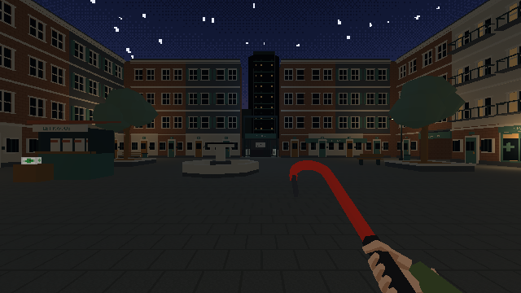
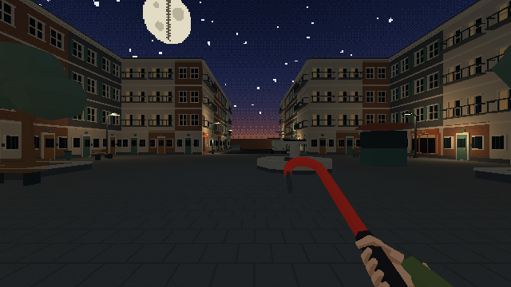
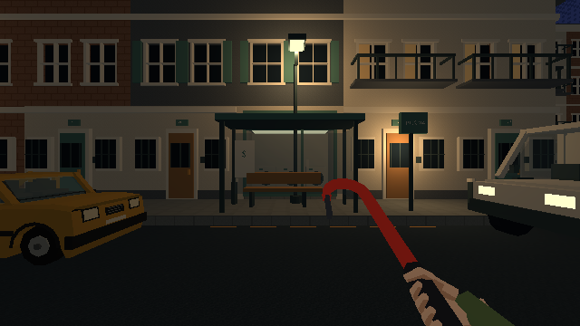
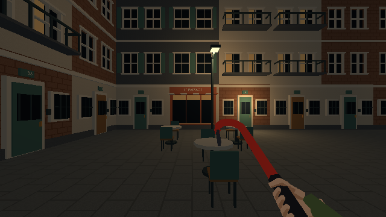
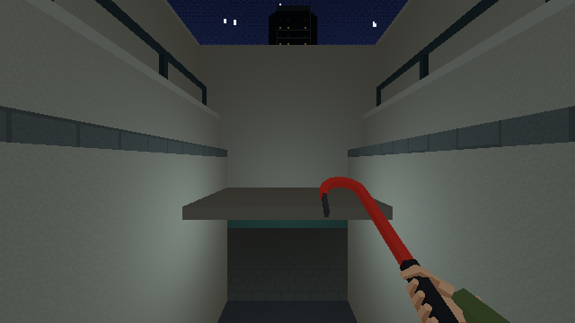

# Place pilote du quartier N4b

## Période

6 octobre 2026, après N3b. L'utilisateur demande de continuer le plan.

## Objectif

Juger les pièces du quartier en jeu et rendre concret l'accès aux billets :
grille publique fermée, cour de service, trappe, descente et retour par la grille.

## Livré et preuve

La recette `quartier_pilot` construit une scène dédiée et un GLB d'environ
11 Mo. La première version contenait 1 453 objets du view layer, sans fuite de la
bibliothèque. Le catalogue expose `?level=pilote_quartier` en développement.

La rue, la place, les commerces, les véhicules et la tour sont dans le moteur.
Vingt et une lampes utilisent le pool existant ; les fenêtres chaudes et les
luminaires conservent leur émission après conversion Lambert.
Le quartier reste éclairé en temps réel, avec `Col` blanc ; aucun bake n'est
présenté comme livré.

La trappe et la grille s'ouvrent avec les interactions existantes. La page
d'auteur injecte les entrées clavier dans le jeu. La revue constate la chute
depuis la trappe ouverte, le passage sous le mur, la descente à −5 m et
l'ouverture de la grille depuis les billets. Les points de vue permettent
de regarder les accès séparément ; cette revue ne remplace pas le parcours
et le jugement de l'utilisateur.

La remontée par l'escalier public atteint son palier à z = 0. Les retours
des façades de rue sont fermés sur les étages, après lecture de la vue retour.

Deux nappes originales sont produites en OGG et M4A. RMS décodé autour de
−31 / −35 dBFS, pas de bourdon tonal ni de sons de train. Les spectrogrammes
sont rendus puis regardés. Le premier raccord OGG du service présentait un
saut ; un fondu de 1,5 s aux bords le ramène sous la précision du relevé
à six décimales. L'écoute au casque reste ouverte.

La compilation de production passe ; aucune suite de tests automatisés n'est
ajoutée ni lancée. Les rendus Blender sont ouverts, puis la vue de la place
est capturée dans le moteur.

La première version comportait 284 proxies : 282 cuboids, deux convex hulls
et aucun trimesh. Le [relevé du moteur](../assets/pilote-quartier/releve-jeu.json)
est actualisé après la reprise de la place décrite ci-dessous.
Le contrôle des liens documentaires passe sans erreur ni avertissement.

La [page d'essai](../assets/pilote-quartier.html) et la
[fiche technique](../4-technique/pilote-quartier.md) exposent les limites.
Le gate utilisateur N4b reste ouvert ; N5 suit son jugement.

## Reprise après retour utilisateur

Le 6 octobre, l'utilisateur valide l'ambiance lumineuse et signale une place
grande et vide, les mêmes commerces en boucle, des jours entre certains
immeubles et un abribus sans rapport avec la chaussée.

Les positions, couleurs et intensités des 21 lampes sont conservées.
La place gagne une fontaine sèche basse et décalée, deux arbres dans des
jardinières et une terrasse de trois tables devant un café. Les bancs sont
regroupés près des arbres. Les axes vers le métro et le porche de service
restent libres. La fontaine est un décor sans interaction.

Laverie et épicerie ne sont plus répétées. Un café « LE PASSAGE », une pharmacie
et un atelier les complètent ; le reste des bases devient résidentiel avec
portes, interphones et fenêtres basses. Les variantes d'étages suivent des
travées de 8 m cohérentes sur toute leur hauteur.

Les jours d'un mètre aux angles nord sont remplis, avec retours, fonds et
toitures continus. Les étages, la corniche et un plafond passent désormais
au-dessus du porche de la cour. Le sol du passage reste ouvert.

L'abribus est sur le trottoir ouest, face à la chaussée ; panneau « BUS 24 »,
marquage d'arrêt et passage piéton expliquent sa place. Le fourgon se gare
en bord de chaussée avant la place.

La source Blender et le GLB sont régénérés : 1 454 objets exportés,
10 754 Ko, bibliothèque exclue. Les vues Blender sont rendues puis ouvertes.
Les captures du moteur montrent la place depuis ses deux extrémités, l'arrêt,
la terrasse et la cour. Le nouveau relevé constate 168 proxies : 166 cuboids
et deux convex hulls. La réduction vient des bases résidentielles fermées,
qui utilisent un proxy de mur par travée. Les 21 lampes et quatre meshes de
portes sont toujours présents. Aucun test automatisé n'est ajouté ou lancé.
Les nouveaux meubles ne font pas l'objet d'un parcours de combat dans ce lot.

La composition corrigée attend le jugement de l'utilisateur avant N5.

## Fermeture de l'escalier public

L'utilisateur signale qu'un saut depuis les côtés de la bouche permet de
tomber dans le vide. La place s'arrêtait à Y 72 ; les bandes de la bouche
continuaient jusqu'à Y 84, au-delà du sol extérieur. Les garde-corps n'avaient
pas de collision et les murets étaient franchissables.

L'enveloppe reçoit deux murs extérieurs continus jusqu'à 3,5 m au-dessus
de la place, un retour au fond, des soubassements latéraux et un socle fermé.
Le proxy de rampe existant est prolongé vers le bas ; un massif visible
remplit le dessous des marches. Un plafond rejoint les billets à Y 81,
avec 2,5 m libres au début. Les deux bords du palier inférieur sont complétés.

La source et le GLB sont régénérés : 1 477 objets, 10 869 Ko, aucune fuite
de bibliothèque. Le moteur relève 178 proxies : 176 cuboids, deux convex
hulls, aucun trimesh. Les 21 lampes et les quatre meshes des portes restent
présents. Aucun test automatisé n'est ajouté ou lancé.

La revue manuelle part du sommet des anciens murets, à z = 1 m. Un saut vers
l'extérieur est arrêté aux X −2,59 et 2,59, avec retour au sol sur le muret.
Les [relevés des rebords](../assets/pilote-quartier/rebords-escalier.json)
conservent les poses observées. La descente atteint Y 85,98 / z −4,99,
en passant sous le plafond ; après ouverture de la grille, la remontée
rejoint Y 68,64 / z 0,01 sur la place.
[Palier](../assets/pilote-quartier/palier-escalier.json) et
[retour](../assets/pilote-quartier/retour-escalier.json) sont conservés.

## Rejeté et raison

Construire le reste du quartier ou les rencontres maintenant : la méthode
demande que cette pièce pilote soit jugée avant leur habillage.
Réutiliser les nappes du quai dehors : leur bourdon ne correspond pas à la rue.

## Leçons

Deux mètres de hauteur libre laissaient le joueur bloqué sous le mur de la
cour. Le palier est abaissé à 2,25 m, puis onze marches rejoignent exactement
le sol à −5 m. Un linteau ferme également le jour visible entre plafond de
service et plafond des billets.

Les murs de fond restent derrière les intérieurs des vitrines. Une boîte
pleine de bâtiment les aurait avalés en silence.
