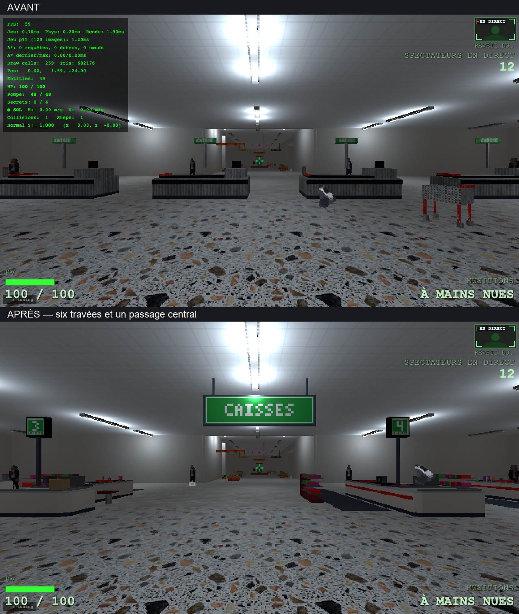
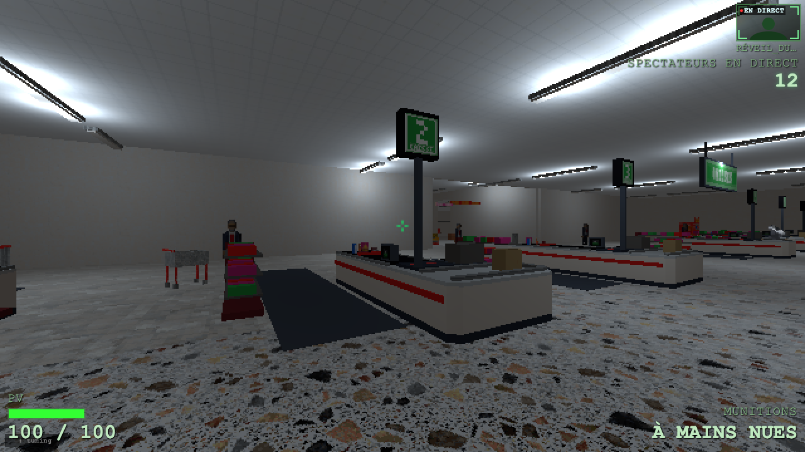
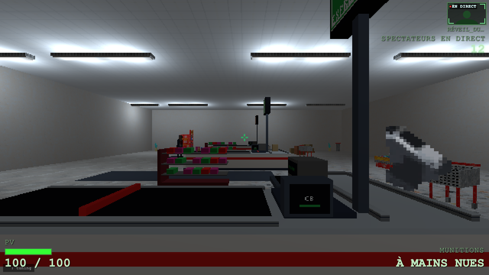
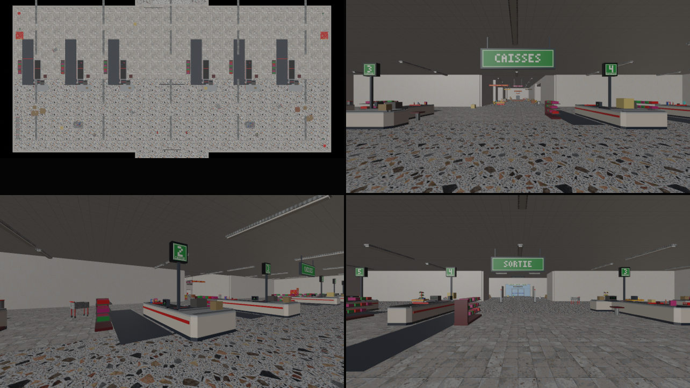

# Refonte de la zone des caisses

## Période

1er octobre 2026, après le retour sur l'aspect de la zone des caisses.

## Objectif

Remplacer les huit blocs métalliques transversaux par des postes identifiables.
Donner une direction aux files et garder un accès clair entre galerie et hub.
Les références locales de `refs/caisses/` montrent les comptoirs en L de Publix
et d'Aldi : tapis noir, espace du caissier, plateau d'ensachage, terminal et
numéro haut. Ces éléments structurent la nouvelle silhouette.

## Livré et preuve

- Six travées longitudinales, réparties en deux groupes de trois.
- Meubles crème, plinthes sombres, bande rouge et dessus chanfreinés.
- Tapis, scanner, écran tourné vers le caissier, clavier, terminal CB côté
  client, tabouret et zone d'ensachage.
- Présentoirs bas garnis, achats et sacs sur trois postes.
- Caisses 1 et 6 fermées ; caisse 4 express ; quatre files ouvertes.
- Files de 2 m entre tapis et présentoir ; paire antivol espacée de 4,5 m.
- Enseigne centrale CAISSES, avec SORTIE au revers. Le chemin central
  `x ∈ [-2, 2]` reste dégagé.
- Caddies rangés dans leur rail, caddies abandonnés et cartons déplacés hors
  des nouvelles files ; têtes de gondole reculées.
- Pistolet replacé sur l'ensachage de la caisse 4 : repère Blender
  `(5.5, 30.5, 1.25)`, origine centrée pour le ramassage.

La source `assets_src/blender/niveau_v2.blend` et son export
`public/assets/levels/niveau_v2.glb` contiennent cette disposition.
`tools/blender/lib_checkouts.py` est partagé par la mise à jour locale et
`tools/level_v2/build_niveau.py`. L'atlas ajouté mesure 128×128 pixels.

Deux compositions sont rendues dans Blender puis regardées dans le jeu à
640×360. Les captures finales viennent de l'export livré. Aucune erreur de
page n'apparaît pendant ces captures. Le contrôle interne de l'export retrouve
3 948 objets visibles, sans fuite de la collection `_LIB`.

Le panneau de développement indique 259 lots avant et 262 après depuis
l'entrée. Ce relevé ponctuel n'est pas un benchmark ; le budget historique
de 200 est déjà dépassé avant cette refonte. Aucun test automatisé n'est lancé.
Le passage en combat, le contournement des files fermées et le ramassage du
pistolet restent à apprécier en jouant. Le jalon N10 reste ouvert.

## Rejeté et raison

Le premier candidat place deux grands panneaux sur les côtés : ils sortent
du champ depuis l'entrée. Une seule enseigne suspendue au centre donne un
repère immédiat. Les îlots promotionnels hauts devant les caisses sont retirés
pour ouvrir les lignes de vue ; les petits bacs restent dans le dégagement sud.

## Leçons

Le comptoir en L et le couple tapis-présentoir se lisent mieux qu'une boîte
pleine. Le numéro haut organise la salle sans créer un mur. Lors d'une mise
à jour locale, la bibliothèque doit être exclue après l'ajout des produits,
avant la capture et la sauvegarde. Déplacer la géométrie d'un `use_*` ne suffit
pas : le loader utilise l'origine de l'objet pour son interaction.

La recette durable est `C.rework_checkouts(preview=...)` pour un candidat,
ou `C.rework_checkouts()` pour sauvegarder et exporter avec copie de sécurité.
Voir les [commandes Blender](../../tools/blender/README.md).
