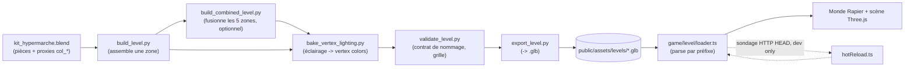

# Niveau — Blender vers glTF

Un niveau part d'un fichier Blender et finit en géométrie jouable : colliders
Rapier, points de spawn, portes, objets à ramasser. Entre les deux, une
chaîne d'étapes séparées (chacune un script headless indépendant) construit,
éclaire, vérifie et exporte la scène, puis un chargeur côté jeu la relit et
la traduit en monde physique + scène Three.js. `src/game/level/loader.ts` est
le SEUL endroit qui connaît la correspondance entre un préfixe de nom Blender
et son effet en jeu — voir [Conventions de nommage](../reference/conventions-nommage.md)
pour la table complète des préfixes et custom properties. Ce document couvre
la mécanique de chaque étape (pièges, hiérarchie des colliders, cycle de vie,
hot reload), pas le contrat de nommage lui-même.

## Vue d'ensemble du pipeline

Chaque flèche ci-dessous est un appel Blender headless séparé (voir
`tools/blender/README.md` pour la chaîne de commandes complète) — rien
n'appelle automatiquement l'étape suivante, c'est l'ordre documenté qui
protège le résultat, pas un enchaînement dans le code.

Trois points qui ne sont pas visibles dans le diagramme mais changent son
issue :

- **`validate_level.py` n'est jamais appelé par `export_level.py`** : c'est
  une étape manuelle séparée dans la chaîne documentée, pas une garantie du
  script d'export lui-même — un `export_level.py` lancé seul, sans
  validation préalable, exporterait un `.glb` non vérifié sans avertissement
  (écart connu, sans conséquence tant que l'ordre documenté est respecté).
- **`build_kit.py` (le kit source) tourne une seule fois**, séparément de
  cette chaîne — les étapes ci-dessus consomment `kit_hypermarche.blend` en
  lecture, elles ne le régénèrent jamais.
- **Le hot reload ne referme pas la boucle vers Blender** : il recharge un
  `.glb` déjà exporté quand son ETag/Last-Modified change, il ne déclenche
  aucune étape amont. Voir [Hot reload](#hot-reload) plus bas.

## Convention spawn_player

`SpawnPoint.position` est une position MONDE dont l'origine de l'Empty
Blender représente les PIEDS du joueur (le sol), pas les yeux — même
convention que `gym.spawn`, consommée par `player.spawn(x, feetY, z)`. Si un
pipeline Blender place un jour ses Empties `spawn_player` au niveau des yeux
plutôt qu'au sol, cette convention doit être ajustée à un seul endroit
(`loader.ts::extractSpawnPoint`), pas dans chaque appelant.

`SpawnPoint.yaw` suit la convention `main.ts`/`gym.ts` (Euler `'YXZ'`) :
`yaw = 0` → avant = `-Z`, la même dérivation que `wishX`/`wishZ` dans
`PlayerController.update` (`forward = (-sin(yaw), 0, -cos(yaw))`).

## Extraction et le piège des transforms

Un mesh `col_*`/`trig_*` peut être imbriqué n'importe où dans la hiérarchie
Blender (collections, empties parents...). Extraire
`geometry.attributes.position` SANS appliquer `mesh.matrixWorld` donne des
colliders qui matchent la géométrie LOCALE, décalée d'un offset constant par
rapport au mesh rendu dès que le mesh a un parent non identité.

Séquence correcte, appliquée uniformément via `worldSpaceGeometry` :

1. `root.updateWorldMatrix(true, true)` UNE FOIS avant toute lecture de
   `matrixWorld` — fait au tout début de `buildLevelResourceEffect`, couvre
   tout le sous-arbre en un seul passage.
2. Cloner la géométrie et lui appliquer `matrixWorld` AVANT de la passer à
   Rapier.

Symptôme si cette séquence est cassée : un niveau où toutes les collisions
sont décalées d'un offset constant — facile à diagnostiquer à tort comme un
bug de character controller plutôt que comme un problème d'espace de
coordonnées.

## Le nom tel que tapé dans Blender

`GLTFLoader` RÉÉCRIT `.name` de chaque nœud importé via sa méthode interne
`createUniqueName()` (nécessaire pour cibler l'animation). Deux Empties
nommés identiquement `spawn_player` dans Blender ressortent donc de l'import
comme `spawn_player` et `spawn_player_1` — un contrôle de préfixe/égalité
sur `obj.name` ne verrait JAMAIS ce doublon, silencieusement.

`GLTFLoader` préserve heureusement le nom BRUT du glTF dans
`node.userData.name` (assigné avant la réécriture). C'est cette valeur que
`blenderName()` lit pour tout ce qui touche au contrat de nommage — jamais
`obj.name` directement.

Exception délibérée : `findClipForObject` continue de lire `mesh.name`
(mangled) à dessein, parce que `GLTFLoader` construit les noms de piste
d'animation à partir de ce même nom réécrit — les deux restent cohérents
entre eux même après mangling.

`cleanExtras` retire la clé `name` que `GLTFLoader` injecte lui-même dans
`userData` pour tout nœud nommé — ce n'est pas une custom property Blender,
l'exposer dans `extras` polluerait la seule donnée qu'un futur consommateur
doit pouvoir lire telle quelle (`extras.target`, `extras.hp`...).

## Hiérarchie des colliders

Les sous-préfixes `col_box_*`/`col_hull_*`/`col_mesh_*` DOIVENT être testés
AVANT le `col_*` générique : un sous-préfixe est aussi un `col_*` valide
(`"col_box_test".startsWith("col_")` est vrai), donc tester le générique en
premier ferait tomber le routage dans le mauvais cas, silencieusement.

- **`col_box_*`** : cuboid inconditionnel — voir le skill
  `collision-proxy-authoring` (cuboid en tête de la hiérarchie de choix,
  coût minimal, pas d'arêtes internes donc pas de ghost collisions). On fait
  confiance au sous-préfixe donné par l'artiste, sans revalidation
  géométrique. Corps FIXED, groupe `WORLD` — jamais `TRIGGER`, jamais de
  sensor.
- **`col_hull_*`** : convex hull, sommets en espace monde. Si
  `RAPIER.ColliderDesc.convexHull` retourne `null` (hull dégénéré, sommets
  coplanaires), repli automatique sur un collider trimesh pour ce même
  mesh — un `col_hull_*` ne doit jamais rester silencieusement sans AUCUN
  collider.
- **`col_mesh_*`** : alias explicite du chemin trimesh (dernier recours) —
  un branchement nommé plutôt qu'un fallthrough implicite dans le `col_*`
  générique.
- **`col_*` nu** (rétrocompatibilité Zones A/B) : comportement historique
  trimesh, SAUF gain silencieux si la géométrie LOCALE s'avère être une
  boîte axis-aligned (même test que `trig_*`, réutilisé tel quel) → cuboid
  à la place. Pas d'avertissement dans ce cas : pur gain de perf/stabilité,
  pas une anomalie signalée.

`isAxisAlignedBox` : un mesh est une « box » si TOUS ses sommets sont sur un
coin de sa propre bounding box locale — plus robuste qu'une comparaison de
nom ou un `instanceof THREE.BoxGeometry` (Blender exporte toujours des
`BufferGeometry` génériques). Vérifié en espace LOCAL, pas monde : un cuboid
tourné par son parent reste une box valide (la rotation est portée par le
corps Rapier), une déformation non uniforme (cisaillement) échoue quel que
soit son alignement.

## Triggers et secrets

`trig_*` doit être une géométrie box axis-aligned (même test que ci-dessus)
— sinon le trigger est ignoré et signalé (avertissement bruyant, jamais
bloquant pour le reste du niveau). Sensor Rapier, groupe `TRIGGER`.

`secret_*` subit le même traitement géométrique côté extraction (bounding
box monde) mais SANS aucune exigence de forme box : un secret peut être une
zone irrégulière, sa détection appartient à `game/level/interactive.ts`/
`main.ts`, pas au loader.

## Portes

Collider DYNAMIQUE (pas `fixed()` comme `col_*`, pas non plus le
`KinematicCharacterController` réservé au joueur par l'invariant #6).
Verrouillé (translations + rotations, gravité neutralisée) tant qu'aucune
logique de jeu ne le pilote — une porte non pilotée ne doit ni tomber sous
la gravité −25 m/s² ni dériver au moindre contact avant que
`game/level/interactive.ts` ne la débloque explicitement pour l'animer.

**Piège** : `buildDoor` positionne le corps sur la translation MONDE BRUTE
du mesh, PAS sur le centre de sa bounding box locale comme le font
`buildCuboidCollider`/`buildTriggerEffect` pour `col_box_*`/`trig_*`. Voir
[ADR 0012](../decisions/0012-porte-collider-non-recentre.md) pour pourquoi
ce n'est pas corrigé ici mais côté Blender (recentrage du pivot de la copie
posée en niveau).

`DoorInfo.halfExtents` est exposé pour éviter à l'appelant de refaire ce
calcul afin d'animer une ouverture (ex. glissement vertical sur sa propre
hauteur, porte à badge de la Zone E). `DoorInfo.clip` est PARSÉ, PAS JOUÉ —
lire un mixer et déclencher l'ouverture est le rôle d'`interactive.ts`.

## Objets interactifs

**Extraction** (`loader.ts`) : portée 2 m, constante du contrat (voir
[Conventions de nommage](../reference/conventions-nommage.md)), jamais un
réglage par objet. La cible est lue dans `extras.target` (custom property
Blender `target`, string) ; son absence est un avertissement bruyant non
bloquant — l'objet est quand même retourné, avec `targetName: null`.

**Dispatch** (`InteractionSystem`, `interactive.ts`) : discipline de
déterminisme identique à `WeaponSystem`/`SuitManager` — `update()` doit être
appelé UNE FOIS PAR PAS FIXE, jamais au taux d'affichage. La détection de
proximité dépend de `player.position` (avancée par `player.update` ce
pas-ci) et le déclenchement dépend du front `use` consommé une seule fois
par `InputFrame.use` (`core/inputRecorder.ts`) : les rejouer au taux
d'affichage romprait le rejeu déterministe F9/F10, exactement comme pour les
armes.

Le dispatch se fait PAR NOM Blender exact, jamais par un système générique
indexé sur `targetName` : `use_exit_door`/`use_frozen_storage` référencent
chacun un `door_*` via `targetName`, mais le routage reste un `switch` sur
le nom de l'objet. Deux cas concrets ne justifient pas encore la
généralisation (invariants #8/#9 — pas d'abstraction avant que la douleur
de duplication soit réelle).

Les objets consommés (pickups à usage unique) sont suivis dans un
`WeakSet<THREE.Object3D>` PAR RÉFÉRENCE DE MESH, pas par nom. Effet de bord
documenté plutôt que résolu : un hot reload remplace tout `LevelHandle`
(donc tout mesh) — un `use_crowbar` déjà ramassé avant un rechargement
redevient, après coup, un objet entièrement nouveau, absent de ce
`WeakSet`, donc à nouveau visible et déclenchable. Cas limite dev-only
(itération Blender), pas un bug de la version jouée : un niveau ne se
recharge jamais à chaud en dehors du pipeline de dev.

`use_exit_door`/`use_frozen_storage` ne sont volontairement PAS marqués
consommés (contrairement aux pickups) : un essai refusé (porte verrouillée)
doit rester réessayable tant que le joueur reste à portée — `main.ts` garde
sa propre garde pour ignorer un ré-essai une fois la porte déjà
déverrouillée.

## Cycle de vie du LevelHandle

Depuis le jalon M2 (`PLAN_EFFECT_XSTATE.md` §4), `LevelHandle` est géré par
`Effect.acquireRelease`/`Scope` plutôt que par un flag `disposed` maintenu à
la main : `dispose()` est GARANTI idempotent par `Scope.close` lui-même
(no-op si le scope est déjà fermé), pas par une discipline de code à
maintenir.

Les 7 cas de dégradation déjà documentés plus haut (géométrie de collider
manquante, collider surdimensionné, `spawn_player` absent/dupliqué, trigger
non-box, `use_*` sans cible, hull dégénéré, échec réseau) sont modélisés en
`Schema.TaggedError`, avec un patron uniforme : chacun est un `Effect.fail`
immédiatement rattrapé au point même de sa détection, jamais laissé
remonter. Conséquence : `buildLevelFromGltf` ne peut jamais échouer
(`Effect<LevelHandle>` sans erreur visible), exactement comme avant cette
migration — sauf `loadLevel`, dont l'échec réseau/parsing
(`LevelFetchError`) a toujours été une vraie erreur propagée à l'appelant,
jamais un warning.

La frontière Effect→Promise/plain-JS est préservée à l'identique :
`buildLevelFromGltf` reste synchrone, `loadLevel` reste asynchrone, aucune
signature publique n'a changé — `main.ts` n'a pas eu besoin d'être modifié
par ce jalon.

Détail complet du raisonnement (pourquoi `Effect.acquireRelease` plutôt
qu'`Effect.scoped`, pourquoi un `Semaphore` en plus du mutex JS de
rechargement, remplacement du `setTimeout` récursif par
`Effect.repeat(Schedule.spaced(...))`) : `PLAN_EFFECT_XSTATE.md` §4 et le
skill `effect-xstate-cassandre`.

## Hot reload

Voir [ADR 0011](../decisions/0011-hot-reload-sondage-http.md) pour le choix
du mécanisme (sondage HTTP HEAD plutôt qu'un watcher fichier) et ses
alternatives.

**Préservation de la position du joueur** : `createLevelSession` ne touche
JAMAIS `player.position`/`player.velocity`. Un rechargement dispose
l'ancien `LevelHandle` et en construit un nouveau, point final. Le SEUL
moment où l'appelant (`main.ts`) est autorisé à repositionner le joueur est
`onLoaded` avec `info.isFirstLoad === true` — le tout premier chargement.

**Cas limite connu, volontairement non traité** : si le mur qu'on vient de
déplacer dans Blender finit par recouvrir la position courante du joueur,
celui-ci se retrouve embarqué dans le nouveau collider. Rien ne le
dépénètre activement. En pratique, le `KinematicCharacterController` du
joueur recalcule `computeColliderMovement` à CHAQUE pas fixe suivant à
partir de la géométrie réelle, donc un chevauchement se résorbe le plus
souvent tout seul dès le prochain déplacement volontaire — mais un joueur
immobile dans un mur fraîchement apparu peut rester visuellement coincé.
Documenté ici plutôt que contourné en douce : cas dev-only (itération
Blender), un niveau ne se recharge jamais à chaud en dehors de ce pipeline.

**Double mécanisme de mutex de rechargement** : une garde JS
(`reloadInFlight`, correcte par construction en JS mono-thread) assure le
COALESCING observable — un seul rechargement réseau pour N appels
concurrents à `reload()`. Un `Effect.Semaphore(1)` enveloppe en plus le
travail réel (`performLoadEffect`) comme garde-fou structurel
supplémentaire : un `Semaphore` seul SÉRIALISERAIT les appels concurrents
(chacun finirait par déclencher un vrai rechargement) plutôt que de les
coalescer, ce qui aurait changé le comportement observable. Les deux
mécanismes sont donc conservés, chacun pour son propre rôle — détail complet
dans `PLAN_EFFECT_XSTATE.md` §4.

## Kit modulaire et assemblage de niveau (côté Blender)

Cette section couvre `tools/blender/` — la moitié Blender du pipeline,
en amont du loader décrit plus haut. Détail complet des scripts et de la
chaîne de commandes : `tools/blender/README.md`.

### Piège instancing-vs-bake

`modular-kit-design` recommande de partager un même mesh-datablock entre
toutes les instances d'une pièce — correct pour la bibliothèque du kit
(`_KIT`, une pièce n'y existe qu'une fois), **faux pour un niveau assemblé** :
les couleurs de sommet (`"Col"`) vivent sur le mesh-datablock, pas sur
l'objet. Vingt-quatre murs partageant un seul mesh ne pourraient recevoir
qu'un seul bake, valide pour un seul d'entre eux.

`build_level.py::place_kit_piece` fait donc un `mesh.copy()` par instance
**rendue** placée dans un niveau (chacune bake sa propre exposition). Les
proxies `col_*`, jamais bakés ni rendus, restent partagés — correct et moins
coûteux en mémoire. Même règle appliquée par `build_door_leaf` pour le
vantail de porte (voir plus bas).

### Piège du parent inverse non réévalué

`build_kit.py` pose chaque proxy en enfant du mesh rendu de sa pièce, avec
une `location` locale nulle — jamais `proxy.location = location` combiné à
`matrix_parent_inverse = obj.matrix_world.inverted()`. `obj.matrix_world`
n'est réévalué qu'après un passage du depsgraph ; juste après avoir écrit
`obj.location`, l'inverse lu vaut encore l'identité, donc l'offset
d'étalage du kit est appliqué **deux fois** — le proxy atterrit à
`2 × location`, sur une autre pièce du kit, et scelle son bake (mesuré :
`kit_wall_1m`, `kit_vent`, `kit_camera` sortaient noirs).

`inspect_kit.py` a par ailleurs longtemps masqué ce même bug : sa
comparaison proxy/rendu passait par `c.location - obj.location`, qui
annule exactement le double-transform et affiche `0 warnings` sur un kit
dont 24 proxies sur 25 étaient mal placés. Corrigé en comparant par
`matrix_local` (repère de la pièce), qui est la vraie position du proxy —
**un vérificateur qui compense un bug le rend invisible.**

### Convention de placement des rangées (gondoles, racks, escalier)

`build_level.py::_build_row_run` (partagée par `build_gondolas` et
`build_racks`) et `build_mezzanine_stairs` tournent chaque pièce de +90°
pour aligner sa longueur locale sur l'axe des rangées. Deux conséquences
mécaniques, pas des décisions de layout :

1. **`row["x"]`/la position donnée est un COIN de la pièce, jamais un
   centre.** Centrer une gondole (profondeur 1.25 m) ou un rack (1.2 m) sur
   une coordonnée demanderait un décalage qui n'est pas nécessairement un
   multiple de la grille 0.25 m, et ferait échouer `validate_level.py`
   sous `--strict`. Utiliser la coordonnée telle quelle comme un bord
   garde chaque pièce sur la grille, au prix de rangées à des abscisses
   symétriques qui ne produisent pas des empreintes miroir l'une de
   l'autre (Zone C : couloirs 6.5 m/7.75 m au lieu de ~7 m des deux côtés ;
   Zone D : travée réelle X∈[-7.2,-6.0]/[2.8,4.0], pas centrée sur X=0).
2. **La rotation +90° décale l'empreinte vers -X, jamais vers +X.** Pour
   l'escalier double de la Zone D, un placement naïf des coordonnées du
   plan aurait fait atterrir les deux marches exactement sous le segment
   de rambarde voisin (collision réelle entre deux pièces, pas une
   asymétrie cosmétique). `build_mezzanine_stairs` compense en ajoutant la
   largeur locale de la pièce à chaque abscisse avant l'appel — la
   position de la brèche ne change pas, seule la valeur intermédiaire
   passée à Blender est ajustée pour l'atteindre.

### Vantail de porte recentré (kit_door_leaf)

`loader.ts::buildDoor` ne recentre pas la géométrie d'un `door_*` — voir
[ADR 0012](../decisions/0012-porte-collider-non-recentre.md) pour le
raisonnement complet côté runtime. Côté Blender, `build_level.py::
build_door_leaf` est la contrepartie de cette décision : c'est le **seul**
objet posé par ce script dont l'origine locale est recentrée sur le centre
de sa boîte englobante (par décalage direct des sommets de la copie posée
en niveau) plutôt que laissée au coin — le mesh-datablock `kit_door_leaf`
du kit lui-même reste inchangé, convention coin comme le reste du kit.

Placement du centre monde : Z au milieu exact de l'ouverture (vantail posé
au sol), X au centre de l'ouverture dans le repère local du cadre, Y **calé
sur la face intérieure du cadre** plutôt que centré dans l'épaisseur du mur
— un centrage dans l'épaisseur (0.25 m) donnerait un Y qui n'est pas un
multiple de la grille 0.25 m pour les dimensions de ce kit. Le centre local
est ensuite tourné de `rot_deg` autour de Z avant translation, exactement
comme `plan_wall_run` le ferait pour n'importe quelle pièce de mur postée à
ce même coin avec cette même rotation.

### Dalles sur-mesure et chevauchement dans le niveau combiné

`build_level.py::build_floor_patches` pose une dalle limitée à l'empreinte
réelle d'un besoin (ex. l'alcôve du secret 1, Zone B) plutôt que d'étendre
le rectangle englobant du `"floor"` existant. Étendre ce rectangle semblait
anodin sur la zone testée seule, mais une fois cette zone **translatée**
dans le niveau combiné (`build_combined_level.py`), l'extension peut
retomber exactement sur la géométrie d'une autre zone ou d'un connecteur —
mesuré en assemblant `hypermarche_complet` : la Zone B étendue à l'ouest
chevauchait exactement le connecteur A-B une fois translatée, dupliquant
une tuile de sol au même endroit (2 meshes noirs au bake, auto-occultation).
Une dalle sur-mesure, bornée à l'empreinte réelle du besoin, ne peut par
construction chevaucher rien d'autre.

### Mondes orphelins dans le niveau combiné

`geo_utils.wipe_scene()` ne touche jamais `bpy.data.worlds` (seulement
collections/objets/meshes/matériaux/lampes/images). `build_level.py::
build_lighting` crée un nouveau monde et le rend actif à chaque appel — sans
conséquence pour un fichier de zone isolée (un seul appel), mais
`build_combined_level.py` l'appelle cinq fois plus le monde par défaut de
`--factory-startup` : six mondes après assemblage, pas cinq. Les cinq mondes
de zone partagent la même couleur/force de fond, donc lequel reste actif
n'affecte pas le bake — `build_combined_level.py` supprime les cinq mondes
inutilisés après coup (comparaison par nom, pas par identité d'objet Python)
par propreté, pas par nécessité de correction.

### Occlusion des rangées de kit — écart connu

Voir [ADR 0022](../decisions/0022-occlusion-rangees-non-bloquante.md) :
poser un `spawn_suit_*` derrière une rangée de `kit_gondola_*`/`kit_rack_4m`
en comptant sur l'occlusion pour bloquer la ligne de vue ennemie s'est
révélé peu fiable en pratique (deux zones, deux pièces différentes),
malgré une géométrie et des groupes de collision corrects par relecture. La
cause racine n'a pas été identifiée — vérifier en jeu, pas seulement par
calcul, avant de compter dessus dans une future zone.

## Bake d'éclairage (vertex colors)

`tools/blender/bake_vertex_lighting.py` bake l'attribut `"Col"` (voir
[ADR 0005](../decisions/0005-eclairage-vertex-colors.md)) en Cycles,
Combined, 128 samples (procédure complète : skill
`vertex-color-sector-lighting`).

### Les proxies sont des occultants, pas seulement des non-cibles

Un proxy `col_*` est par construction coïncident avec la géométrie qu'il
double. Laissé visible aux rayons pendant le bake, il scelle la pièce :
zéro lumière directe, indirecte ou ambiante, et l'opérateur Cycles retourne
`FINISHED` sans rien signaler — l'attribut fraîchement créé reste au noir
de sa valeur par défaut. Retirer les proxies de la liste des **cibles** ne
suffit donc pas : il faut aussi les retirer des **rayons**. Le script masque
`col_*`/`trig_*`/`secret_*` du rendu le temps du bake et restaure l'état
d'origine dans un `finally` (`--keep-proxies` reproduit la régression pour
la mesurer : 19 des 25 pièces du kit sortent alors noires).

### Diagnostic d'un mesh entièrement noir

Pour chaque mesh sorti tout noir, le script tire un rayon depuis le centre
de chaque face échantillonnée (pas les sommets — un sommet est sur une
arête ou un coin, ses rayons s'échappent presque toujours et le verdict est
faux) et nomme la cause plutôt que de la laisser chercher :

- **occulté par un autre objet** → c'est cet objet qu'il faut masquer
- **occulté par lui-même** → faces coïncidentes ou géométrie intérieure,
  c'est le mesh qu'il faut corriger (voir `kit_crate` ci-dessous)
- **exposé mais noir** → seul cas où regarder les lampes est le bon réflexe

Les faces coïncidentes (deux faces coplanaires superposées regardant dans
le même sens) sont détectées séparément par comparaison de bounding box par
groupe de normale — c'est ce qui a identifié `kit_crate` : ses quatre
tasseaux d'angle, posés au ras du cube avec 16 paires de faces exactement
coïncidentes, produisaient un z-fighting garanti et un bake entièrement
noir. Corrigé en supprimant les tasseaux plutôt qu'en les décollant (les
décoller aurait fait déborder l'empreinte de 1×1, désynchronisant le proxy
cuboid du rendu) — `kit_crate` fait maintenant 24 sommets/12 triangles.

### Combined vs Diffuse

`--type combined` (défaut) bake la couleur de base ET la lumière ensemble ;
`COLOR_0` est ensuite **remultiplié par la base color** au rendu runtime
(piège de colorspace déjà noté dans [Textures](textures.md)) — sur un
matériau coloré, le doublement assombrit la surface au carré. Le kit utilise
des couleurs claires et peu saturées précisément pour que ce doublement
reste discret. `--type diffuse` bake la lumière seule (Direct + Indirect,
sans albédo) quand ce doublement devient gênant.

## Critère de validation

Déplacer un mur dans Blender, exporter, le voir en jeu en MOINS DE 60
SECONDES, chronométré réellement. C'est le livrable principal de ce
pipeline — pas encore vérifié en conditions réelles par un agent (pas de
serveur dev/navigateur dans cet environnement d'exécution), à valider en
jouant réellement.

Retour à la [carte de la documentation](../README.md).
