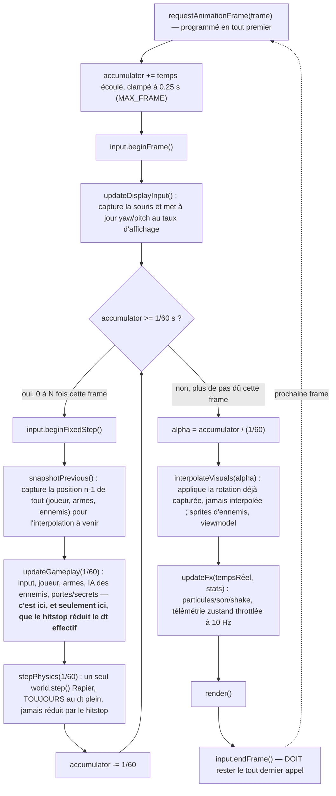

# Boucle de jeu

Le jeu tourne sur deux horloges différentes qui doivent rester synchronisées
sans jamais se marcher dessus. La première est l'horloge de **simulation** :
fixe, déterministe, 60 fois par seconde — elle fait avancer le joueur, les
ennemis et la physique. La seconde est l'horloge d'**affichage** : variable
selon le moniteur, elle dessine l'image. Ce découplage existe pour deux
raisons à la fois : un pas de simulation fixe garantit que le jeu se comporte
EXACTEMENT pareil quel que soit le taux de rafraîchissement de l'écran
(déterminisme, rejeu d'input, tests A/B) ; un rendu au taux d'affichage
garantit une image fluide même quand la simulation tourne plus lentement que
l'écran. Entre les deux, une interpolation lisse le mouvement affiché sans
jamais toucher à l'état simulé lui-même.

Ce document décrit l'ordre exact dans lequel ces deux horloges s'exécutent à
chaque frame (`src/core/loop.ts`) et les invariants qu'il tient. Cet ordre a
été choisi avec soin (latence d'input, cohérence du hitstop, invariant #1 —
« aucune logique de gameplay hors du pas fixe ») ; une inversion accidentelle
est le bug le plus facile à introduire par erreur dans ce fichier — voir
[ADR 0002](../decisions/0002-fixed-timestep.md) pour la décision de fond et
ses alternatives, ce document-ci ne couvre que le fonctionnement.

## Vue d'ensemble : ordre d'exécution d'une frame

Le diagramme ci-dessous est construit par lecture directe de
`src/core/loop.ts` et des callbacks qu'il orchestre
(`game/loop/updateGameplay.ts`, `stepPhysics.ts`, `interpolateVisuals.ts`,
`updateFx.ts`), pas de la prose qui suivait dans une version antérieure de ce
document.



Points à retenir avant les sections détaillées ci-dessous :

- **Le hitstop ne vit que dans `updateGameplay`.** `stepPhysics` reçoit
  toujours le pas fixe plein (`FIXED_DT`) — voir [Hitstop](#hitstop).
- **React ne pilote jamais la boucle.** Les publications zustand liées à un
  événement discret (ramassage, mort, récapitulatif) peuvent partir du pas
  fixe, mais aucune donnée n'est poussée vers React à chaque pas. La
  télémétrie continue reste regroupée dans `updateFx`, à 10 Hz maximum
  (invariant #2). Le détail par champ est documenté dans
  [Outils de debug — Champs de DebugState](debug.md#champs-de-debugstate).
- **Le bloc de pas fixes peut tourner 0, 1 ou plusieurs fois par frame
  d'affichage** (`steps` peut dépasser 1 à basse fréquence d'affichage, ou
  valoir 0 à très haute fréquence) — c'est l'accumulateur qui décide, pas un
  compteur fixe.

## Origine des modules `game/loop/`

Les callbacks de `startLoop` (`snapshotPrevious`, `stepPhysics`,
`updateGameplay`, `interpolateVisuals`, `updateFx`) vivent depuis le
2026-09-05 dans `src/game/loop/` (un fichier par callback ou paire de
callbacks) plutôt que comme fermetures internes à `main()` — extraction du
refactor qui a éclaté `main.ts` (2229 lignes) en modules. Chaque fonction
reçoit `engine: GameEngine` en paramètre explicite à la place de la
fermeture qu'elle avait sur le scope de `main()` ; la structure interne
(`Effect.gen` en phases nommées pour `updateGameplay` depuis le jalon M6,
pour `interpolateVisuals`/`updateFx` depuis M7) est restée inchangée par
cette extraction — un déplacement pur, pas une réécriture.

## Ordre des callbacks

```
snapshotPrevious → updateGameplay → stepPhysics
```

L'ordre naturel (physique puis gameplay) coûte une frame de latence au
déplacement : le controller calcule son mouvement après le step et le pose
via `setNextKinematicTranslation`, qui n'est consommé que par le step
SUIVANT — 16.6 ms de retard sur chaque input de déplacement, jugé
inacceptable.

En décidant le mouvement avant le step, la translation cible est appliquée
par le `world.step()` du même pas fixe : latence nulle, et le corps
kinématique acquiert une vitesse cohérente pour pousser les corps dynamiques
(`setApplyImpulsesToDynamicBodies`).

Contrepartie assumée : `updateGameplay` observe le monde tel qu'il est au
DÉBUT du pas (positions des corps dynamiques d'avant le step). C'est la
convention normale d'un controller kinématique, et elle reste stable — donc
déterministe.

**Ne pas inverser cet ordre** sans relire cette section.

## Ordre de la frame d'affichage

```
beginFrame → updateDisplayInput → [beginFixedStep, snapshotPrevious, updateGameplay, stepPhysics]* → interpolateVisuals → updateFx → render → endFrame
```

`endFrame` clôt la frame d'affichage et doit rester le DERNIER appel. Le
placer avant `interpolateVisuals` (erreur naturelle : il « appartient »
visuellement au bloc des pas fixes) rend les fronts montants invisibles à
`interpolateVisuals`/`updateFx` dès qu'un pas fixe a tourné dans la frame —
presque toutes les frames à 60 Hz, toutes à 30 Hz.

`updateDisplayInput` capture le delta de souris une seule fois, juste après
`beginFrame`. Le premier pas fixe de la frame enregistre donc le `yaw`/`pitch`
mis à jour : un clic accompagné d'un mouvement de souris tire dans la
direction visible sur cette même image. En rejeu, la souris physique est
ignorée et le pas fixe restaure la visée enregistrée.

## Ce que la boucle garantit à chaque frame

- un seul `world.step()` par pas fixe, jamais dans le rendu ;
- delta clampé à 0.25 s (`MAX_FRAME`, garde-fou anti spiral of death) ;
- snapshot n−1 avant toute mutation, interpolation au rendu via `alpha` ;
- la rotation caméra est capturée dans `updateDisplayInput`, au taux
  d'affichage et avant les pas fixes, puis appliquée par
  `interpolateVisuals` sans interpolation (invariant #3, latence de visée) ;
- `updateFx` reçoit le temps réel de la frame, pas `FIXED_DT`.

## Fin de partie pendant le pas fixe

Mort ou niveau terminé (Phase 6, `game/loop/updateGameplay.ts`) : le pas
fixe continue de tourner — la boucle ne s'arrête **jamais** (invariant #1)
— mais tout le contenu du gameplay (déplacement, tir, dégâts, interactions)
est ignoré dès que la partie sort de l'état `"playing"`.

Ce n'est **pas** une violation de l'invariant #10 (« aucune animation ne
bloque le joueur ») : cet invariant vise les animations non létales
(rechargement, etc.), pas une fin de partie légitime. Rien n'est mis à jour
ce pas-ci : le monde reste visuellement figé sur son dernier état
(`prev === curr` à chaque pas suivant), sans jitter d'interpolation.

## Filet de chute

Un niveau construit sans y jouer finit toujours par avoir un trou, et une
chute hors du monde est **sans retour** : rien ne rattrape le joueur, aucun
écran de mort ne se déclenche, la partie est simplement perdue. Le pas fixe
mémorise donc, juste après `player.update`, le dernier sol **réellement**
touché (`session.lastSafeGround`), et y remet le joueur au-delà de 12 m de
chute — plus que le plus grand décrochement voulu du niveau v2 (6 m, entre la
réserve et le parking souterrain). Logique et seuil :
`game/session/fallRescue.ts`.

« Réellement » n'est pas un détail : un joueur qu'on vient de téléporter
(chargement de niveau, rejeu d'input, console de debug) se déclare *au sol* le
temps d'un pas fixe, même en plein vide. Le sol n'est donc mémorisé que si le
character controller a rapporté au moins une collision ce pas-là
(`numCollisions > 0`). Sans cette garde, le vide devient lui-même le dernier
sol sûr et le filet y renvoie le joueur en boucle.

Ce n'est pas une mécanique de jeu : **il ne devrait jamais se déclencher**.
Quand il se déclenche, il écrit les coordonnées en console — c'est ainsi qu'un
playtest signale un trou, que `tools/level_v2/audit_niveau.py` sait ensuite
retrouver tout seul.

## Mesure des temps de frame (LoopStats)

Jalon M7 (`PLAN_EFFECT_XSTATE.md`, §9) : compteurs de temps par phase, en
millisecondes, pour `DebugPanel` — le filet de sécurité concret du risque de
perf assumé dans ce chantier (aucun budget fixé à l'avance, mais toute
dégradation doit être visible immédiatement).

- `gameplayMs`/`physicsMs` sont la SOMME sur tous les pas fixes exécutés
  PENDANT la frame d'affichage courante (`steps` peut dépasser 1).
- `renderMs` couvre `interpolateVisuals` + `updateFx` + `render` ensemble
  (tout ce qui tourne au taux d'affichage) — mais MESURÉ SUR LA FRAME
  PRÉCÉDENTE : la durée réelle de ces trois callbacks n'est connue qu'après
  leur propre exécution, dont `updateFx` (qui reçoit ces `stats`) fait
  partie. Décalage d'une frame assumé, sans conséquence pour un indicateur
  de debug déjà lissé (même principe que `fpsSmoothed`, `game/loop/updateFx.ts`).

## Entrée synchronisée au pas fixe

Un appui clavier/souris produit UN événement physique, mais deux couches le
lisent à des cadences différentes, et leurs besoins sont incompatibles :

- le pas fixe tourne 0, 1 ou N fois par frame d'affichage. Il lui faut un
  front RETENU jusqu'à ce qu'un pas fixe puisse le voir, et CONSOMMÉ pour
  qu'un seul pas fixe l'obtienne ;
- le code au taux d'affichage tourne exactement une fois par frame. Il lui
  faut un front qui décrive la frame COURANTE, ni retenu ni consommé.

Un seul `Set` ne peut pas satisfaire les deux : la rétention (nécessaire au
pas fixe) ferait rejouer l'appui sur plusieurs frames d'affichage, et le
nettoyage par frame (nécessaire à l'affichage) avalerait les appuis tombés
dans les frames sans pas fixe. D'où deux sets dans `InputManager`
(`src/core/input.ts`), alimentés par le même `keydown`, vidés selon deux
règles distinctes :

| Set | Vidé quand | Lu par |
|---|---|---|
| `edgesPendingFixedStep` | au moins un pas fixe a tourné dans la frame | `consumeJustPressed` (destructif — le pas fixe) |
| `edgesThisDisplayFrame` | inconditionnellement, chaque frame | `wasJustPressed` (non destructif — le taux d'affichage) |

Sans consommation côté pas fixe, un appui déclencherait N sauts sur une
frame lente (30 Hz d'affichage → 2 pas fixes → double saut).
`wasJustPressed` ne doit **jamais** être appelé depuis un pas fixe : son
contenu dépend du taux de rafraîchissement, ce qui rendrait la simulation
non déterministe.

`endFrame()` doit être le DERNIER appel de la frame (voir "Ordre de la
frame d'affichage" ci-dessus) pour la même raison : vider les fronts avant
que `interpolateVisuals`/`updateFx` ne les aient lus les rendrait aveugles.

Pour les bindings rebindables (`GameAction`) posés par-dessus ce moteur bas
niveau, voir [Contrôles et bindings](../reference/controles.md).

## Enregistrement et rejeu déterministe

`core/inputRecorder.ts` enregistre/rejoue l'input pas fixe par pas fixe, pour
deux usages seulement : le harnais A/B de `feel-tuner` (rejouer la même
course sur deux configs de déplacement différentes) et une preuve de
déterminisme (même séquence d'input, même état final).

Ce qui est enregistré est l'input TEL QUE CONSOMMÉ PAR LE PAS FIXE, pas les
événements bruts du navigateur : le yaw/pitch est produit au taux
d'affichage (variable), donc on mémorise sa VALEUR au moment du pas fixe, pas
seulement le delta souris. Rejouer des deltas souris bruts donnerait un
résultat différent à 60 Hz et à 144 Hz.

## Frontière Effect synchrone du pas fixe

Le pas fixe ET le rendu/l'interpolation passent exclusivement par
`runGameplaySync` (`src/core/runtime.ts`, `GameRuntime.runSync`) — voir
invariant #11 de `CLAUDE.md` et le skill `effect-xstate-cassandre` pour le
détail complet. Résumé mécanique : tout `Effect` exécuté dans cet arbre doit
être purement synchrone (zéro
`Effect.tryPromise`/`Effect.promise`/`Effect.async`/`Effect.sleep`). S'il en
existe un, `Runtime.runSync` lève un defect ; `runGameplaySync` l'intercepte
pour logger un message explicite en console avant de le laisser remonter —
un bug de ce genre doit être bruyant, jamais silencieux.

`GameLayer` (même fichier) est la SEULE racine de composition Effect du
jeu : chaque nouveau service (`RaycastService`, `PathfindingService`,
`RenderService`, ...) la rejoint via `Layer.mergeAll`/`Layer.provideMerge`,
jamais une Layer ad hoc construite ailleurs. `GameRuntime` est construit une
seule fois : en recréer un second pendant une partie perdrait l'état de tout
service à état et romprait le déterminisme.

## Hitstop

`GameClock.tick(fixedDt)` (`src/core/time.ts`) renvoie un dt gameplay
potentiellement réduit (`fixedDt * hitstopScale`) pendant
`hitstopRemaining` secondes après `triggerHitstop`. Seul le dt gameplay est
affecté — la physique et le pas fixe lui-même continuent à `FIXED_DT` plein
(invariant #1). Voir [valeurs de déplacement](../reference/valeurs-deplacement.md#impact)
pour la durée retenue (3 frames / 50 ms).

Ce `dt` scalé est aussi celui envoyé aux machines XState d'ennemis via
l'évènement `TICK` (`game/entities/enemyMachine.ts`) — sans lui, le hitstop
ne ralentirait pas les ennemis (invariant #13).

Retour à la [carte de la documentation](../README.md).
