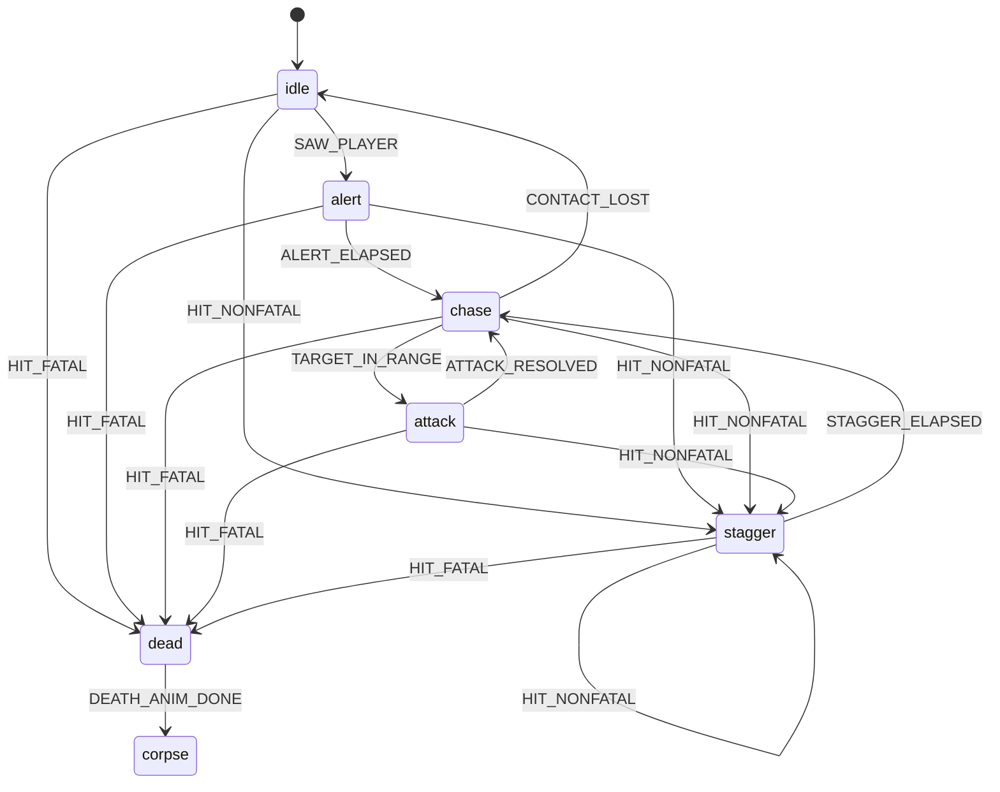

# Entités et IA

Le jeu oppose le joueur à deux sortes d'adversaires : le Costard, l'ennemi de
base rencontré en nombre, et le Directeur, un boss unique posé en fin de
parcours. Ce document explique comment l'un et l'autre perçoivent le joueur,
décident de leurs actions, et signalent ces décisions au joueur par des
indices visuels et sonores. L'objectif n'est pas une IA sophistiquée : c'est
un comportement **lisible**, où le joueur comprend toujours pourquoi un
ennemi lui tire dessus sans avoir à deviner un raisonnement caché — voir le
skill `enemy-state-machine` pour les quatre règles de lisibilité du combat
(télégraphie, attribution du danger, feedback triple, mort claire) qui
gouvernent ce système. Techniquement, Costard et Directeur ne sont pas deux
implémentations séparées : ils partagent une seule machine à états
(diagramme ci-dessous), et ne diffèrent que par leur gabarit physique, leurs
valeurs de tuning, et un comportement de révélation propre au Directeur —
voir [ADR 0009](../decisions/0009-machine-partagee-suit-director.md) pour la
décision de fond et son historique.

Ce document se lit dans l'ordre : d'abord la vue d'ensemble et le diagramme
d'états, puis le contrat minimal que toute entité doit remplir, ce que
Costard et Directeur ajoutent par-dessus, le fonctionnement interne de la
machine partagée, et enfin comment plusieurs ennemis sont gérés ensemble à
chaque pas fixe. Les valeurs de tuning (capsule, perception, durées, dégâts,
knockback...) ne sont **pas** ici : voir [Valeurs des ennemis](../reference/valeurs-ennemis.md).

## Vue d'ensemble et diagramme d'états

Un ennemi vivant traverse cinq états (`idle`, `alert`, `chase`, `attack`,
`stagger`), puis deux états terminaux de mort (`dead`, l'animation, puis
`corpse`, le cadavre figé). Le diagramme ci-dessous est construit par lecture
directe de la table de transition XState (`src/game/entities/enemyMachine.ts`),
pas de la documentation existante — chaque flèche correspond à un événement
réellement envoyé par le code.

Ce que chaque transition signifie, en langage clair :

- **`SAW_PLAYER`** (idle → alert) : le joueur est entré dans le champ de
  perception (distance sous `sightRange`) ET rien du niveau ne bloque la
  ligne de vue vers lui.
- **`ALERT_ELAPSED`** (alert → chase) : le délai d'alerte (`alertDuration`)
  s'est écoulé — transition inconditionnelle, sans re-vérifier la ligne de
  vue.
- **`TARGET_IN_RANGE`** (chase → attack) : le joueur est visible, à portée
  d'attaque, et le cooldown de tir est retombé à zéro.
- **`CONTACT_LOST`** (chase → idle) : le joueur est resté hors de vue plus
  longtemps que `lostContactTimeout` en continu.
- **`ATTACK_RESOLVED`** (attack → chase) : la fenêtre de télégraphie s'est
  écoulée et le tir (ou son raté) a été résolu.
- **`STAGGER_ELAPSED`** (stagger → chase) : la durée de recul
  (`staggerDuration`) s'est écoulée.
- **`HIT_FATAL`** : accessible depuis **n'importe quel état vivant**
  (idle/alert/chase/attack/stagger) — un coup qui ramène les PV à zéro ou
  moins tue immédiatement, quel que soit l'état en cours.
- **`HIT_NONFATAL`** : de même, accessible depuis n'importe quel état vivant,
  y compris `stagger` lui-même (un ennemi déjà sonné peut être ré-encaissé et
  reste en recul, sa vélocité de knockback est simplement recalculée).
- **`DEATH_ANIM_DONE`** (dead → corpse) : l'animation de mort a joué son
  nombre de frames prévu ; `corpse` est terminal, un ennemi n'en ressort
  jamais.

**Chaque état a une pose de sprite distincte** — un état invisible pour le
joueur est un état inutile, à supprimer plutôt qu'à implémenter (règle du
skill `enemy-state-machine`).

## Le contrat minimal partagé par toute entité (Entity)

`src/game/entities/entity.ts` définit ce que doit fournir n'importe quelle
entité de jeu pour exister dans le monde : un identifiant stable (`id`), et
une position au pas courant plus une position au pas précédent
(`previousPosition`, nécessaire à l'interpolation de rendu). C'est
volontairement le strict minimum — invariant #8 de `CLAUDE.md`,
`Entity[]` + `update(dt)` + `switch`, **pas d'ECS** avant 12 types d'ennemis.
`Suit` et `Director` l'implémentent tous deux aujourd'hui.

Rien ici ne doit ressembler à un système de composants génériques, ce serait
exactement l'erreur que l'invariant #8 interdit avant 12 types d'ennemis. Ce
contrat n'existe que pour donner un id stable et un point d'interpolation
commun ; ce n'est pas un point d'extension à enrichir par anticipation.

## Suit et Director : deux fines couches au-dessus de la machine partagée

Depuis le jalon M5, les classes `Suit` (Costard) et `Director` sont de fins
wrappers autour de la machine partagée décrite plus bas : elles ne portent
que ce qui est propre à chaque type d'ennemi — corps/collider Rapier, config
de tuning, PRNG dérivé de la graine de l'instance, l'acteur XState lui-même —
et délèguent tout le reste. Trois disciplines sont tenues à l'identique pour
les deux classes :

- **Pureté du cœur de simulation** : ni `suit.ts` ni `director.ts`
  n'importent quoi que ce soit de `render/`, `core/audio.ts` ou
  `game/state.ts`. `update()` ne fait qu'avancer la machine à états et la
  physique ; les managers (voir plus bas) lisent les champs `pending*` en
  sortie et traduisent en événements — jamais l'inverse.
- **Déterminisme** : tout tourne au pas fixe avec le `dt` de gameplay reçu en
  paramètre (jamais d'horloge murale). La seule source de hasard
  (`aimJitterDeg`, la dispersion de visée) passe par un PRNG mulberry32 seedé
  **par entité** (`createEnemyPrng`, obtenu via `DeterministicRandom`,
  invariant #12).
- **Character controller partagé** : une seule instance de
  `RAPIER.KinematicCharacterController` pour tous les Costards
  (respectivement tous les Directeurs), possédée par le manager
  correspondant et passée à chaque `update()` via le contexte.

`Director` porte en plus deux champs hors de la machine partagée, sur demande
explicite de la tâche du jalon M5 :

- `revealed` : passe à `true` une fois les PV sous
  `revealHpFraction * maxHp`, jamais remis à `false` (pas de soin dans ce
  prototype). Il pilote la teinte du sprite (costume humain → reptilien),
  pas `state` — orthogonal à la machine à états : un Directeur révélé
  continue de traverser idle/alert/chase/attack/stagger normalement ;
- le badge droppé à la mort, voir [Badge du Directeur](#badge-du-directeur)
  plus bas.

**Piège d'ordre à connaître avant de toucher `Director.applyDamage`** : le
garde-fou `isAlive` et la soustraction de PV sont délégués à
`applyEnemyDamageCore` (partagé avec `Suit`), puis `Director` lit `hp`
**juste après** cette soustraction pour calculer `revealed`/`justRevealed` —
**avant** que l'action `enterDead` (côté machine partagée) ne remette `hp` à
0 en cas de coup fatal. Inverser cet ordre casserait `justRevealed` sur un
coup qui tue et révèle en même temps.

## La machine partagée : ce qu'elle porte et où s'arrête sa responsabilité

`enemyMachine.ts` porte toute la logique indépendante du gabarit visuel/
Rapier exact de l'entité : la table de transition XState vue plus haut, les
durées d'état, la perception (ligne de vue), l'évitement local, le suivi de
chemin, le jitter de visée, le knockback, et l'intégration physique.

### Ce qui vit dans la machine partagée, ce qui reste dans Suit et Director

Vit dans `enemyMachine.ts` : tout ce qui ne dépend pas du type concret
d'ennemi. Reste dans `suit.ts`/`director.ts` : la construction du corps/
collider Rapier (identique entre les deux, factorisée via `createEnemyBody`,
mais l'instance elle-même est propre à chaque entité), la config
(`SuitConfig`/`DirectorConfig`, objets distincts), le PRNG dérivé de la
graine de l'instance, l'acteur XState lui-même (un par entité), et pour
`Director` seulement `revealed`/le badge.

### Deux catégories de données dans le contexte : minuteurs d'état et mémoire persistante

La plupart des durées (`alertDuration`, `attackTelegraphDuration`,
`staggerDuration`, `deathFrameDuration`) sont mesurées par un seul champ,
`context.stateTimer`, remis à zéro à **chaque** transition (via les actions
`resetStateTimer`/`enterDead`/`enterStagger`). Mais toutes les données du
contexte ne suivent pas cette règle : deux champs, `timeSinceLastSeen` et
`attackCooldownRemaining`, sont volontairement **persistants à travers
toutes les transitions** — mis à jour à chaque pas fixe indépendamment de
l'état courant, et remis à zéro seulement par des règles précises propres à
chacun, pas par une action d'entrée générique :

- `timeSinceLastSeen` : à l'entrée en ALERTE, en POURSUITE tant que la cible
  reste en vue, et à la sortie de RECUL (encaisser un coup révèle forcément
  la position du joueur) ;
- `attackCooldownRemaining` : remis à `cfg.attackCooldown` seulement quand
  une attaque résout (`ATTACK_RESOLVED`), jamais par une autre transition.

Un `context` XState peut très bien porter des champs qui ne sont pas des
« minuteurs d'état » au sens strict — c'est un choix délibéré, pas un oubli.

### Pourquoi le calcul de transition vit hors des gardes XState

XState évalue les gardes de plusieurs transitions candidates pour un même
événement dans l'ordre déclaré, jusqu'à la première qui passe. Or pour
`chase`, deux transitions candidates (perte de contact, entrée en TIR)
partagent la même quantité coûteuse à calculer (`inSight`, un raycast) et
doivent l'évaluer une seule fois par pas fixe — recalculer `inSight`
séparément dans deux `guard:` indépendants doublerait le nombre de raycasts
par Costard par pas fixe (régression de perf silencieuse, contraire au
budget « 20 ennemis à 60 fps » et à la discipline « profiler avant
d'ajouter »). XState ne permet pas nativement de partager un calcul entre
gardes sœurs sans le committer dans `context` en amont, ce qui revient à
faire exactement ce que fait `tickEnemy`, avec un niveau d'indirection en
moins.

Choix retenu : les fonctions de décision (`runIdle`/`runAlert`/`runChase`/
`runAttack`/`runStagger`) font tout le calcul une fois, mutent `context`
directement, et appellent `actor.send(...)` seulement quand une transition
doit réellement avoir lieu. La machine XState elle-même ne fait alors que
déclarer le graphe — pragmatique, documenté ici plutôt que déguisé en pureté
déclarative qu'il n'est pas.

### Réassigner l'état depuis les tests sans casser l'encapsulation

Le filet de sécurité de caractérisation (`test/game/entities/suit.test.ts`/
`director.test.ts`, écrit contre le code pré-refactor) affecte directement
`suit.state = "chase"` / `suit.stateTimer = 1.23` comme mise en place de
test — ce qu'un champ public mutable permettait avant le jalon M5. Un acteur
XState encapsulé n'expose normalement aucune façon supportée de
« téléporter » son nœud d'état courant sans passer par une transition
déclarée.

`forceEnemyState` comble cet écart via `StateMachine.resolveState` (API
publique et documentée de XState, prévue pour la persistance/reprise) pour
construire un snapshot valide, puis pose ce snapshot directement dans le
champ interne `Actor["_snapshot"]` — préfixé `_`, non exposé par les types
TypeScript, mais un champ JS ordinaire à l'exécution (aucun `#private`
réel). Vérifié empiriquement : contexte préservé par référence, mutations
visibles, un `send()` ultérieur depuis l'état forcé retrouve le comportement
normal de la table de transition. **Jamais utilisée par le chemin de
production** (`tickEnemy`/`applyEnemyDamageCore` ne l'appellent jamais) —
seuls les setters publics `state`/`stateTimer` de `Suit`/`Director` y
recourent, exclusivement pour cette commodité de test.

Risque documenté et accepté : si `xstate` renomme ce champ interne dans une
future version, seule cette fonction doit être revue.

### Discipline zéro allocation par pas fixe

`context` est construit une fois par entité (`createEnemyMachineContext`,
appelée par le constructeur de `Suit`/`Director`) et n'est plus jamais
réalloué : toutes les actions mutent `context` directement
(`context.stateTimer = 0`, jamais `assign(() => ({ stateTimer: 0 }))`, qui
allouerait un nouvel objet `context` à chaque transition). Vérifié
empiriquement contre `xstate` 5.32.6 : la référence de `context` reste
stable d'un `send()` à l'autre tant qu'aucune action `assign` n'est
utilisée. Seul un `send()` réel (une transition qui a effectivement lieu)
alloue un petit objet `MachineSnapshot` interne à XState ; un ennemi qui
reste dans le même état sans transitionner n'envoie **aucun** événement à
l'acteur (les fonctions de décision n'appellent `actor.send` que lorsqu'une
transition a lieu) — donc aucune allocation liée à XState dans le cas
dominant (un ennemi qui poursuit/observe sans changer d'état).

### Aucune transition retardée par temps mural (interdiction d'after)

Aucune transition retardée par temps mural (le mécanisme `after` de XState,
qui repose sur `setTimeout` réel) n'est utilisée ici. Toutes les durées
(`alertDuration`, `attackTelegraphDuration`, `staggerDuration`,
`deathFrameDuration * deathFrameCount`) sont comparées à
`context.stateTimer`, incrémenté manuellement par `tickEnemy` avec le `dt`
de gameplay reçu en paramètre — invariant #13 de `CLAUDE.md`. Sans cette
discipline, le hitstop ne ralentirait plus les ennemis ; voir [Boucle de jeu
— Hitstop](boucle-de-jeu.md#hitstop).

### Une formalité de typage TypeScript, pas une branche défensive réelle

XState type `event` sur l'union complète `EnemyEvent` dans chaque action
déclarée par `setup()`, même quand une action donnée (par exemple
`enterDead`) n'est en pratique référencée que par une seule transition
(`HIT_FATAL`). La vérification `if (event.type !== "HIT_FATAL") return;` en
tête de `enterDead` est donc une pure formalité pour affiner le type côté
TypeScript, pas une branche défensive qui peut réellement se déclencher.

## Navigation

Un vrai pathfinding 2.5D existe (`PathfindingService`,
`src/game/level/pathfinding.ts`, jalon M4) : un graphe de praticabilité baké
par niveau sur le gabarit du Costard (`suitConfig`, pas `directorConfig` —
un seul graphe partagé par les deux types). L'évitement local à 3 rayons
(avant, avant-gauche 30°, avant-droit 30°) décrit par le skill
`enemy-state-machine` **reste utilisé** en repli explicite
(`tryComputeChaseDirectionFromPath` retourne `false` si aucun graphe n'est
encore baké ou si aucun chemin exploitable n'est trouvé) — les deux
coexistent, ce n'est pas un remplacement.

Aucune zone existante n'a été retouchée pour exploiter ce pathfinding
(décision explicite, hors scope de M4) : poser un ennemi sur une mezzanine
ou dans un escalier reste une décision de level design séparée à prendre
consciemment, pas un acquis automatique du nouveau système.

## Les managers qui pilotent chaque type d'ennemi (SuitManager et DirectorManager)

`SuitManager`/`DirectorManager` possèdent respectivement `Suit[]`/
`Director[]`, bouclent dessus à chaque pas fixe, et traduisent les sorties de
chaque `update()`/`applyDamage()` en files d'événements accumulées **par
frame d'affichage** (`alertEvents`, `hurtEvents`, `deathEvents`...) — même
contrat que `WeaponSystem.fireEvents`/`hitEvents` : lecture non destructive,
plusieurs lecteurs, vidées une seule fois par frame via
`clearFrameEvents()`. Conforme à l'invariant #8 : c'est de l'organisation
autour d'un tableau, pas un système de composants génériques.

Les deux managers lisent le **même** tableau `weapons.hitEvents`, chacun
avec son propre curseur (`hitCursor`) et sa propre map
`colliderTo{Suit,Director}` — voir [ADR 0010](../decisions/0010-curseur-evenements-multi-pas-fixe.md)
pour le piège que ce curseur explicite évite (une comparaison de longueur
pour deviner une nouvelle frame perd silencieusement des impacts).

Différences délibérées de `DirectorManager` par rapport à `SuitManager` :

- pas de mécanique de gibs à bout portant : un boss qui explose en morceaux
  casserait la mise en scène de révélation/mort — l'agrégation de dégâts est
  donc plus simple (un seul `totalDamage` par Directeur touché) ;
- une file d'événements supplémentaire, `revealEvents`, pour la bascule
  visuelle costume humain → reptilien ;
- possède le badge droppé à la mort (`DirectorBadge`) et expose
  `tryCollectBadge`.

`Director[]` plutôt qu'un champ `Director | null` unique : un seul boss est
attendu en pratique, mais garder la forme tableau (même architecture que
`SuitManager`) ne coûte rien et évite un type spécial pour « exactement un
ennemi ».

`revealEvents` (bascule visuelle) et `tryCollectBadge` (ramassage du badge)
sont pleinement câblés et actifs en jeu : `revealEvents` est consommé dans
`game/loop/updateFx.ts`, `tryCollectBadge` est appelé depuis
`game/loop/updateGameplay.ts` — vérifié par grep sur `src/` le 2026-09-05,
après qu'une note périmée dans les en-têtes de `directorManager.ts` les
avait un temps décrits comme un câblage encore à faire dans `main.ts`.

## Badge du Directeur

`DirectorBadge` (`director.ts`) est un objet de logique pure — position,
rayon, état ramassé/non ramassé — sans aucune référence à `THREE.Scene`/
`THREE.Object3D`, même séparation que `Director`/`DirectorManager`
vis-à-vis du rendu.

Il n'utilise **pas** le contrat `use_*`/`UseObject`
(`game/level/interactive.ts`) : ce contrat est pensé pour des objets
pré-autorisés dans Blender (touche E, portée 2 m), pas pour un pickup généré
à runtime par la mort d'une entité. Le ramassage se fait par proximité
seule, via `tryCollect(playerPosition, pickupRadius, minAge)` — voir
[Valeurs des ennemis](../reference/valeurs-ennemis.md#badge-du-directeur)
pour `badgePickupRadius`/`badgePickupDelay` et l'historique du bug de drop
corrigé le 2026-08-23.

## Configuration et tuning à chaud des ennemis (SuitConfig et DirectorConfig)

`SuitConfig`/`DirectorConfig` sont deux objets mutables, tunables à chaud
(`cassandre.suitConfig.xxx = …`, `cassandre.directorConfig.xxx = …`), source
unique de vérité pour chaque type d'ennemi — aucun nombre de comportement/
combat codé en dur ailleurs que dans ces deux fichiers. `DirectorConfig`
duplique délibérément la forme de `SuitConfig` plutôt que de la réutiliser ou
de l'étendre — voir [ADR 0009](../decisions/0009-machine-partagee-suit-director.md).
Toutes les valeurs sont des points de départ, pas des choix de tuning
arrêtés, sauf mention contraire explicite (voir la note sur
`attackTelegraphDuration` dans [Valeurs des ennemis](../reference/valeurs-ennemis.md)).
L'arbitrage fin appartient à un futur passage `feel-tuner`.

Retour à la [carte de la documentation](../README.md).
