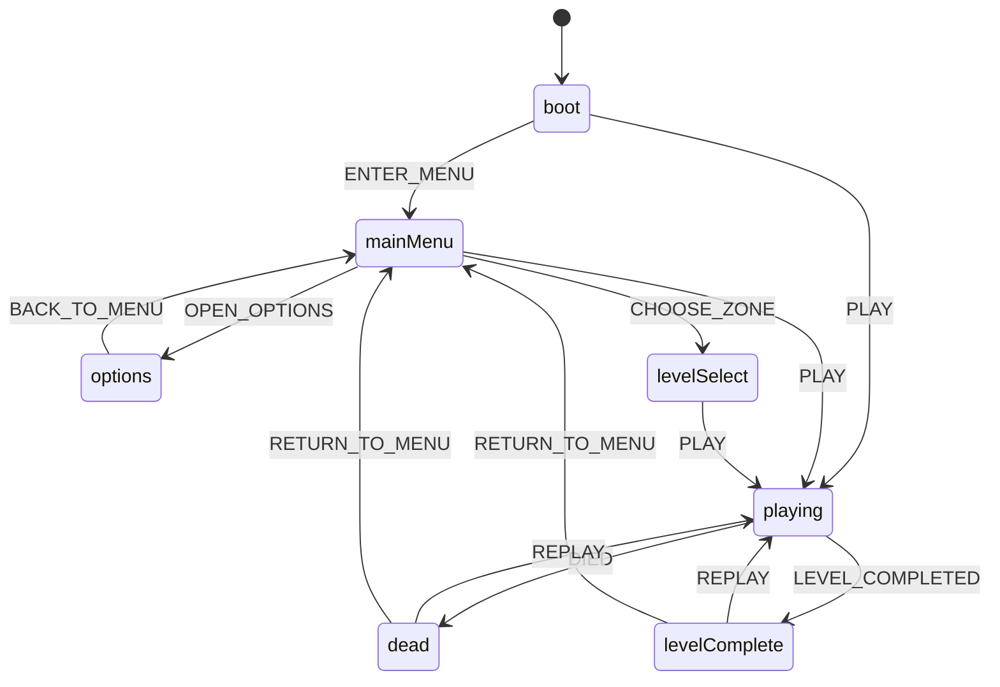

# HUD et interface

Le jeu a besoin d'un habillage React par-dessus la scène 3D : un menu au
lancement, un affichage de PV/munitions pendant la partie, un écran de mort,
un écran de fin de niveau, et un panneau pour rebinder les touches. Toute
cette couche vit dans `src/ui/`, séparée du reste du jeu par une règle
stricte (invariant #2 de `CLAUDE.md`) : React ne touche jamais le pas fixe
et ne fait jamais de `setState` par frame — il ne fait que lire un store
zustand mis à jour depuis la boucle de jeu à un rythme contrôlé. Le fil
conducteur qui organise l'écran (quel composant est affiché, à quel moment
du menu au jeu, de la mort à la reprise) est lui-même une machine à états,
distincte de celle des ennemis, décrite plus bas.

Ce document couvre la composition React elle-même : quels composants
existent, quand ils montent, qui décide quoi. Pour le mécanisme de ducking
musical déclenché par les répliques du héros, voir [HUD et
audio](hud-audio.md). Pour le déclenchement/cooldown des deux canaux de
message (`showHudMessage`/`triggerHeroLine`) et le cycle de vie d'une partie
(boot, reset), voir [Session de partie](session.md).

## Composition de App

`App.tsx` est la racine React montée UNE FOIS le niveau choisi, jamais
avant — `MainMenu`/`LevelMenu`/`RebindScreen` sont rendus directement par
`game/session/bootChoice.ts`, hors de cet arbre (voir [Session de partie —
Choix du niveau au boot](session.md#choix-du-niveau-au-boot)).

`Hud`/`HeroLine` (HUD de production) cohabitent avec `DebugPanel` (outil de
DEV, jamais transformé en HUD de prod) et `HudMessage` (canal système,
distinct du canal `HeroLine`, voir [Deux canaux de message](#deux-canaux-de-message-hudmessage-et-heroline)
plus bas). `DeathScreen`/`LevelCompleteScreen` restent montés en
permanence et rendent `null` tant que leur condition n'est pas remplie —
pas de montage/démontage conditionnel, plus simple et sans risque de rater
un changement d'état pendant que le composant serait démonté.

`root.render(createElement(App, ...))` (`main.ts`) a lieu APRÈS la
construction complète de `GameEngine`/`GameSession` : les callbacks
`onReplay`/`onReturnToMenu` ferment sur `engine`, qui doit exister avant
qu'ils puissent être invoqués — trivialement vrai puisqu'un clic
utilisateur ne peut survenir qu'après la fin de ce script synchrone.

## Flux d'écran

Le jeu passe par plusieurs écrans (menu, partie en cours, mort, fin de
niveau) et doit toujours savoir lequel afficher — y compris dans des cas
ambigus comme « le joueur vient de mourir pendant qu'un niveau se termine ».
Plutôt que de traiter ça par des booléens épars (`isDead`, `isMenuOpen`...),
cette logique est un vrai graphe d'états : `ui/gameFlowMachine.ts`, une
machine XState pure qui ne connaît rien du jeu lui-même (pas de
`PhysicsWorld`, pas de `scene`, pas de `bootGameSession`/`teardownGameSession`)
— voir [ADR 0019](../decisions/0019-machine-xstate-flux-ecran.md) pour la
décision complète (pourquoi une machine plutôt qu'un rechargement de page).

Ce diagramme est la table de transition testée (`test/ui/gameFlowMachine.test.ts`)
lue directement dans `ui/gameFlowMachine.ts`. Le câblage réel dans `main.ts`
est volontairement plus grossier qu'elle : seuls les événements `ENTER_MENU`,
`PLAY`, `DIED`, `LEVEL_COMPLETED`, `REPLAY` et `RETURN_TO_MENU` sont
réellement envoyés par l'application (`main.ts`, `game/session/lifecycle.ts`,
`game/session/doors.ts`, `game/session/feedback.ts`) — vérifié par grep sur
`src/`. Les états `options` et `levelSelect` existent dans le graphe et sont
couverts par les tests, mais ne sont **jamais atteints par l'acteur réel** :
`OPEN_OPTIONS`/`CHOOSE_ZONE` ne sont envoyés nulle part côté application
(`MainMenu`/`LevelMenu`/`RebindScreen` sont affichés directement par
`bootChoice.ts`, voir plus haut, sans passer par cette machine). Le graphe
reste néanmoins complet et testé pour rester correct si ce câblage évoluait.

`App`/`DeathScreen`/`LevelCompleteScreen` ne lisent que `state.flowState`
(poussé par `actor.subscribe(...)`), jamais l'acteur XState directement —
même pont zustand que le reste du HUD (invariant #2).

`flowActor` (créé dans `main.ts`) est construit AVANT même la résolution du
choix de niveau (voir [Session de partie — Choix du niveau au
boot](session.md#choix-du-niveau-au-boot)) : `boot` est l'état initial de la
machine, et `setFlowState` doit le refléter dans le store dès que possible,
pas seulement une fois la partie commencée.

`GameFlowState` (le type des 7 états) est DÉFINI dans `game/state.ts`, pas
dans `ui/gameFlowMachine.ts` puis importé : garder le sens de dépendance
déjà établi par ce fichier (`DeathScreen.tsx`/`Hud.tsx` importent déjà
`useGameStore` DEPUIS `game/state.ts`, jamais l'inverse) plutôt que d'en
ouvrir un second. `ui/gameFlowMachine.ts` réutilise ce type tel quel pour
ses clés d'état ; TypeScript vérifie la correspondance structurelle sans
qu'aucun des deux fichiers n'ait besoin de dupliquer la liste des 7 états.
Voir [ADR 0020](../decisions/0020-state-feuille-de-dependances.md) pour la
règle générale (`game/state.ts` n'importe jamais un autre module de
`src/game/*`).

## HUD de production

`Hud.tsx` est l'overlay de STREAM (webcam factice, badge « EN DIRECT »,
compteur de « vues ») — pas un HUD de FPS classique : direction artistique
du plan, le héros est un youtubeur complotiste, le HUD raconte le
personnage plutôt que d'afficher des chiffres neutres.

Sélecteurs fins PAR CHAMP (skill `react-hud-bridge`, anti-pattern « objet
complet en sélecteur ») : chaque `useGameStore((s) => s.debug.xxx)` ne
re-render ce composant que si CE champ précis change — contrairement à
`DebugPanel`, qui lit `state.debug` en entier (acceptable pour un panneau
de dev démontable, pas pour ce HUD). Chaque champ affiché a sa propre
discipline d'écriture (throttlée à 10 Hz ou ponctuelle à l'évènement) —
voir [Outils de debug — Champs de DebugState](debug.md#champs-de-debugstate)
pour le détail exact par champ, jamais un `setState` par pas fixe
(invariant #2).

**Webcam + compteur de vues en HAUT-DROITE, jamais haut-gauche** :
`DebugPanel` (dev, toujours monté à côté) occupe le coin haut-gauche depuis
la Phase 1. Un premier jet de ce HUD les avait superposés là — constaté
illisible en jeu (texte des deux composants entrelacé). Corrigé en
déplaçant ce bloc, jamais en touchant `DebugPanel`. Le commentaire à côté
du bloc webcam dans le code doit rester cohérent avec cette position — un
recul vers « haut-gauche » y a traîné un temps après le correctif de
position, sans que le code lui-même n'ait jamais régressé.

## Deux canaux de message — HudMessage et HeroLine

`HudMessage` (canal SYSTÈME, `state.hudMessage`) et `HeroLine` (canal
RÉPLIQUE, `state.heroLine`) sont volontairement séparés : l'un est une
INFORMATION factuelle (porte, badge, secret n/total), sans cooldown ;
l'autre est une RÉACTION de personnage, avec un cooldown global de 15 s.
Le déclenchement, le cooldown et l'auto-effacement des deux vivent côté
appelant (`showHudMessage`/`triggerHeroLine`, `game/session/feedback.ts`)
— voir [Session de partie — Feedback joueur](session.md#feedback-joueur)
pour le mécanisme complet, et [HUD et audio — Ducking pendant les
répliques](hud-audio.md#ducking-pendant-les-répliques) pour le ducking
musical déclenché par `HeroLine` uniquement.

Côté présentation, les deux composants ne font que lire le store et
retourner `null` si rien à afficher — jamais écrire dedans. `HeroLine` est
positionné comme une LÉGENDE DE STREAM sous la webcam factice de `Hud.tsx`
(c'est le héros qui commente sa propre vidéo) ; `HudMessage` reste centré,
plus haut à l'écran, fond neutre — la distinction visuelle reflète la
distinction information/réplique.

## Menu principal et écran de choix de niveau

`MainMenu.tsx` (Jouer / Options / Quitter) et `LevelMenu.tsx` (choix de
zone individuelle, outil de DEV) sont deux composants distincts,
volontairement jamais fusionnés. Le câblage exact entre les deux
(« Jouer » va directement au niveau complet sans passer par `LevelMenu`,
accessible uniquement via un lien discret « Choisir une zone (dev) ») est
documenté dans [Session de partie — Choix du niveau au
boot](session.md#choix-du-niveau-au-boot), qui fait référence. Les deux
composants sont purement présentationnels (aucun import `src/game/*`),
montés avant même que la scène Three.js/le monde Rapier existent.

`handleQuit` (`MainMenu.tsx`) tente `window.close()` puis bascule vers un
message de repli si ça ne fonctionne pas : un onglet ouvert normalement
(pas par script) ne peut pas se fermer lui-même, spec DOM — le bouton reste
honnête plutôt que de prétendre avoir fait quelque chose.

## Écrans de mort et de fin de niveau

`DeathScreen.tsx` et `LevelCompleteScreen.tsx` partagent le même pattern :
purement présentationnels, lisent `state.flowState`, retournent `null`
tant que l'état n'est pas le leur (`"dead"`/`"levelComplete"`).
`onReplay`/`onReturnToMenu` sont de VRAIES fonctions de reset
(`game/session/lifecycle.ts::replay`/`returnToMenu`) passées en props
depuis `App.tsx` — pas des rechargements de page. Voir [ADR
0019](../decisions/0019-machine-xstate-flux-ecran.md) pour la décision, et
[Session de partie — Rejouer et retour au
menu](session.md#rejouer-et-retour-au-menu) pour le mécanisme de reset
lui-même. `LevelCompleteScreen` n'a pas de chrono — le plan le marque
explicitement optionnel, pas construit ici.

## Rebinding

`RebindScreen.tsx` consomme l'API de rebinding de `core/input.ts`
(`getAllBindings`/`rebind`/`resetBindings`/`formatKeyCode`) sans la
modifier. Accessible uniquement depuis le menu principal (« Options »),
donc toujours AVANT `input.attach(canvas)` — un import direct du module
`input` reste sûr malgré cet ordre : `getAllBindings`/`rebind`/
`resetBindings` ne touchent jamais `this.canvas`, seuls des listeners
`window` temporaires posés par ce composant captent la touche suivante.
Voir [Contrôles et bindings](../reference/controles.md) pour le contrat
complet de `core/input.ts`.

`input.getAllBindings()` n'est PAS réactif (pas du zustand) : l'état local
`bindings` du composant est une copie, resynchronisée explicitement après
chaque rebind/reset — même philosophie que le panneau de tuning ci-dessous.

**Piège corrigé, toujours documenté dans le code** : un `KeyboardEvent.code`
vide (jamais produit par un vrai clavier physique, mais possible via des
évènements synthétiques) corrompait silencieusement le binding avant
qu'un garde (`if (!e.code) return;`) ne soit ajouté — voir le commentaire
en place dans `RebindScreen.tsx`, gardé en entier dans le code plutôt que
migré ici : c'est un piège concret pour quiconque serait tenté de retirer
cette garde comme « dead code ».

## Panneau de tuning à chaud

`TuningPanel.tsx` expose des sliders à chaud pour `moveConfig`/
`weaponConfig`/`suitConfig` (skill `game-feel-tuning`) — sans ça, tuner
exige la console pendant qu'on court. Invariant #2 tenu strictement : ne
touche jamais le pas fixe, mute les configs (objets simples, hors React)
sur interaction humaine uniquement, jamais dans une boucle ; l'état React
local n'est resynchronisé qu'à l'ouverture/au reset/à l'application d'une
variante.

Pointer lock : le jeu tourne verrouillé (`core/input.ts`), incompatible
avec les évènements pointeur d'un slider. Le panneau reste démonté (donc
sans interception de clic) tant qu'il n'est pas ouvert par la touche dédiée
`` ` `` (Backquote, sans conflit avec ZQSD/WASD, sprint, saut, ou les
touches de debug — voir [Contrôles et bindings](../reference/controles.md)
pour la liste complète). L'ouverture appelle `document.exitPointerLock()` ;
la fermeture ne fait rien de plus côté pointer lock, le canvas reprend la
main au premier clic (`core/input.ts`), dupliquer cette responsabilité ici
casserait la source unique de vérité du pointer lock.

Les harnais A/B eux-mêmes (recul, impact, hitmarker, réticule, knockback,
flash) sont documentés avec leurs tables de profils dans [Armes du joueur —
Harnais A/B](armes.md#harnais-ab), [Joueur — Harnais A/B —
FEEL_VARIANTS](joueur.md#harnais-ab-feel_variants) et [Outils de debug —
Harnais A/B — protocole général](debug.md#harnais-ab-protocole-général) ;
`TuningPanel.tsx` n'en est que la façade UI, il ne tranche aucune valeur.

**Dette de conception à surveiller** : ce fichier fait ~950 lignes et
mélange cinq domaines de tuning indépendants (déplacement, impact/shake,
hitmarker, réticule, Costard) dans un seul composant. Aucune découpe
entreprise dans cette passe (restructuration éditoriale, pas une tâche de
code) — signalé comme candidat à un futur découpage en sous-composants par
domaine.

Retour à la [carte de la documentation](../README.md).
