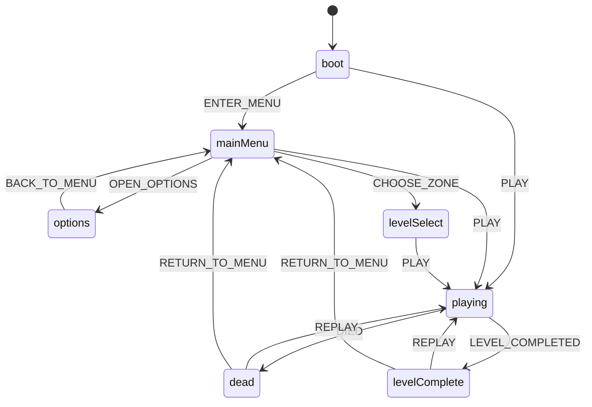

# HUD et interface

Le jeu a besoin d'un habillage React par-dessus la scène 3D : un menu au
lancement, un affichage de PV/munitions pendant la partie, un écran de mort,
un écran de fin de niveau, et un panneau pour rebinder les touches. Toute
cette couche vit dans `src/ui/`, séparée du reste du jeu par une règle
stricte (invariant #2 de `CLAUDE.md`) : React ne touche jamais le pas fixe
et ne fait jamais de `setState` par frame — il ne fait que lire un store
zustand mis à jour depuis la boucle de jeu à un rythme contrôlé. Le fil
conducteur qui organise l'écran (quel composant est affiché, à quel moment
du menu au jeu, de la mort à la reprise) est lui-même une machine à états,
distincte de celle des ennemis, décrite plus bas.

Ce document couvre la composition React elle-même : quels composants
existent, quand ils montent, qui décide quoi. Pour le mécanisme de ducking
musical déclenché par les répliques du héros, voir [HUD et
audio](hud-audio.md). Pour le déclenchement/cooldown des deux canaux de
message (`showHudMessage`/`triggerHeroLine`) et le cycle de vie d'une partie
(boot, reset), voir [Session de partie](session.md).

## Composition de App

L'organisation de `src/ui/` (un dossier par domaine : `components/`, `hud/`,
`screens/<écran>/`, `dev/`) et les règles d'écriture du React sont fixées par
[React — structure et rangement](../reference/react-structure.md) et ses trois
règles sœurs ; cette page décrit ce que font les écrans, pas comment les écrire.

`App.tsx` est la racine React montée UNE FOIS le niveau choisi, jamais
avant — `MainMenu`/`LevelMenu`/`OptionsScreen` sont rendus directement par
`game/session/bootChoice.ts`, hors de cet arbre (voir [Session de partie —
Choix du niveau au boot](session.md#choix-du-niveau-au-boot)).

`Hud` (HUD de production) cohabite avec `DebugPanel` (outil de DEV, jamais
transformé en HUD de prod) et `HudMessage` (canal système, distinct du canal
`HeroLine`, voir [Deux canaux de message](#deux-canaux-de-message-hudmessage-et-heroline)
plus bas). `HeroLine` n'est pas monté par `App` mais par `Hud`, en dernier
enfant du coin haut-droite (`HudCorner`) : la webcam, le compteur de spectateurs et
la réplique s'y empilent dans le flux, si bien que la réplique suit la
hauteur RÉELLE de ce qui la précède. Elle a longtemps été un bloc `fixed`
indépendant posé à une hauteur en dur, qui aurait recouvert le compteur à la
première retouche de la webcam — même défaut, déjà corrigé une fois, que
celui de la légende contre le compteur. `DeathScreen`/`LevelCompleteScreen` restent montés en
permanence et rendent `null` tant que leur condition n'est pas remplie —
pas de montage/démontage conditionnel, plus simple et sans risque de rater
un changement d'état pendant que le composant serait démonté.

**Build de production** : `DebugPanel` et `TuningPanel` n'y sont pas
montés (`import.meta.env.DEV`, constante au build — ils quittent le bundle).
À la place de `DebugPanel`, au même coin haut-gauche, `FpsCounter` affiche
le seul chiffre qui intéresse un joueur, lu dans `state.debug.fps` avec un
sélecteur arrondi à l'entier. Voir [Outils de debug](debug.md).

`root.render(createElement(App, ...))` (`main.ts`) a lieu APRÈS la
construction complète de `GameEngine`/`GameSession` : les callbacks
`onReplay`/`onReturnToMenu` ferment sur `engine`, qui doit exister avant
qu'ils puissent être invoqués — trivialement vrai puisqu'un clic
utilisateur ne peut survenir qu'après la fin de ce script synchrone.

## Flux d'écran

Le jeu passe par plusieurs écrans (menu, partie en cours, mort, fin de
niveau) et doit toujours savoir lequel afficher — y compris dans des cas
ambigus comme « le joueur vient de mourir pendant qu'un niveau se termine ».
Plutôt que de traiter ça par des booléens épars (`isDead`, `isMenuOpen`...),
cette logique est un vrai graphe d'états : `ui/gameFlowMachine.ts`, une
machine XState pure qui ne connaît rien du jeu lui-même (pas de
`PhysicsWorld`, pas de `scene`, pas de `bootGameSession`/`teardownGameSession`)
— voir [ADR 0019](../decisions/0019-machine-xstate-flux-ecran.md) pour la
décision complète (pourquoi une machine plutôt qu'un rechargement de page).

Ce diagramme est la table de transition testée (`test/ui/gameFlowMachine.test.ts`)
lue directement dans `ui/gameFlowMachine.ts`. Le câblage réel dans `main.ts`
est volontairement plus grossier qu'elle : seuls les événements `ENTER_MENU`,
`PLAY`, `DIED`, `LEVEL_COMPLETED`, `REPLAY` et `RETURN_TO_MENU` sont
réellement envoyés par l'application (`main.ts`, `game/session/lifecycle.ts`,
`game/session/doors.ts`, `game/session/feedback.ts`) — vérifié par grep sur
`src/`. Les états `options` et `levelSelect` existent dans le graphe et sont
couverts par les tests, mais ne sont **jamais atteints par l'acteur réel** :
`OPEN_OPTIONS`/`CHOOSE_ZONE` ne sont envoyés nulle part côté application
(`MainMenu`/`LevelMenu`/`OptionsScreen` sont affichés directement par
`bootChoice.ts`, voir plus haut, sans passer par cette machine). Le graphe
reste néanmoins complet et testé pour rester correct si ce câblage évoluait.

`App`/`DeathScreen`/`LevelCompleteScreen` ne lisent que `state.flowState`
(poussé par `actor.subscribe(...)`), jamais l'acteur XState directement —
même pont zustand que le reste du HUD (invariant #2).

`flowActor` (créé dans `main.ts`) est construit AVANT même la résolution du
choix de niveau (voir [Session de partie — Choix du niveau au
boot](session.md#choix-du-niveau-au-boot)) : `boot` est l'état initial de la
machine, et `setFlowState` doit le refléter dans le store dès que possible,
pas seulement une fois la partie commencée.

`GameFlowState` (le type des 7 états) est DÉFINI dans `game/state.ts`, pas
dans `ui/gameFlowMachine.ts` puis importé : garder le sens de dépendance
déjà établi par ce fichier (les écrans et les widgets du HUD importent déjà
`useGameStore` DEPUIS `game/state.ts`, jamais l'inverse) plutôt que d'en
ouvrir un second. `ui/gameFlowMachine.ts` réutilise ce type tel quel pour
ses clés d'état ; TypeScript vérifie la correspondance structurelle sans
qu'aucun des deux fichiers n'ait besoin de dupliquer la liste des 7 états.
Voir [ADR 0020](../decisions/0020-state-feuille-de-dependances.md) pour la
règle générale (`game/state.ts` n'importe jamais un autre module de
`src/game/*`).

## HUD de production

`hud/Hud/Hud.tsx` est l'overlay de STREAM (webcam factice, badge « EN DIRECT »,
compteur de « vues ») — pas un HUD de FPS classique : direction artistique
du plan, le héros est un youtubeur complotiste, le HUD raconte le
personnage plutôt que d'afficher des chiffres neutres.

`Hud` ne lit rien du store : il pose trois coins (`HudCorner`) et des widgets
dedans — `LiveCam`, `ViewerCount`, `HeroLine` en haut à droite,
`LoyaltyCards` et `HealthPanel` en bas à gauche, `AmmoPanel` en bas à droite.
**Chaque widget sélectionne exactement ce qu'il affiche** : quand les
munitions changent, seul `AmmoPanel` re-rend (voir [React —
composition](../reference/react-composition.md#chaque-feuille-lit-ses-propres-données)).
`AmmoPanel` pousse l'idée jusqu'au bout avec un sélecteur qui rend
directement la chaîne affichée (`ammoLabel`, `hud/lib/hudFormat.ts`) : il ne
re-rend que si le TEXTE change. `DebugPanel`, lui, lit `state.debug` en
entier — acceptable pour un panneau de dev démontable, pas pour ce HUD.
Chaque champ affiché a sa propre
discipline d'écriture (throttlée à 10 Hz ou ponctuelle à l'évènement) —
voir [Outils de debug — Champs de DebugState](debug.md#champs-de-debugstate)
pour le détail exact par champ, jamais un `setState` par pas fixe
(invariant #2).

**Tout le HUD est dimensionné en pixels virtuels** (`--vpx`,
`theme/tokens.css`) : il grandit avec la fenêtre dans la même proportion que
l'image 640×360 du jeu. En `px` fixes, ses libellés faisaient 0,93 % de la
hauteur d'écran en 1080p et deux fois moins en 4K. Mesuré après passage à
l'échelle puis réduction : chiffres vitaux à 4,4 % de la hauteur, bloc
webcam + compteur à 19,6 %, identiques en 1280×720, 1920×1080 et 2560×1440.
La webcam (`LiveCam`) est en 16:9 et réutilise le cadre à coins des menus
(`CornerFrame`) ; la tête de la silhouette passe SOUS le badge EN DIRECT —
un cadre en 2,27:1 où le badge masquait 75 % de la tête se lisait comme
« écrasé ».

**Webcam + compteur de vues en HAUT-DROITE, jamais haut-gauche** :
`DebugPanel` (dev) occupe le coin haut-gauche depuis la Phase 1, et
`FpsCounter` le reprend en production. Un premier jet de ce HUD les avait superposés là — constaté
illisible en jeu (texte des deux composants entrelacé). Corrigé en
déplaçant ce bloc, jamais en touchant `DebugPanel`. Le commentaire à côté
du bloc webcam dans le code doit rester cohérent avec cette position — un
recul vers « haut-gauche » y a traîné un temps après le correctif de
position, sans que le code lui-même n'ait jamais régressé.

## Deux canaux de message — HudMessage et HeroLine

`HudMessage` (canal SYSTÈME, `state.hudMessage`) et `HeroLine` (canal
RÉPLIQUE, `state.heroLine`) sont volontairement séparés : l'un est une
INFORMATION factuelle (porte, badge, secret n/total), sans cooldown ;
l'autre est une RÉACTION de personnage, avec un cooldown global de 15 s.
Le déclenchement, le cooldown et l'auto-effacement des deux vivent côté
appelant (`showHudMessage`/`triggerHeroLine`, `game/session/feedback.ts`)
— voir [Session de partie — Feedback joueur](session.md#feedback-joueur)
pour le mécanisme complet, et [HUD et audio — Ducking pendant les
répliques](hud-audio.md#ducking-pendant-les-répliques) pour le ducking
musical déclenché par `HeroLine` uniquement.

Côté présentation, les deux composants ne font que lire le store et
retourner `null` si rien à afficher — jamais écrire dedans. `HeroLine` est
positionné comme une LÉGENDE DE STREAM sous la webcam factice (`LiveCam`)
(c'est le héros qui commente sa propre vidéo) ; `HudMessage` reste centré,
plus haut à l'écran, fond neutre — la distinction visuelle reflète la
distinction information/réplique.

## Menu principal et écran de choix de niveau

`screens/mainMenu/MainMenu/MainMenu.tsx` (Jouer / Options / Quitter) et
`dev/LevelMenu/LevelMenu.tsx` (choix de zone individuelle, outil de DEV) sont deux
composants distincts, volontairement jamais fusionnés. `MainMenu` ne sait
rien des outils de dev : il offre un emplacement `devTools`, que
`bootChoice.ts` remplit avec `dev/ZoneChooserLink/ZoneChooserLink.tsx` **en développement
seulement** — le lien, son texte, son CSS et `LevelMenu` quittent ainsi le
bundle de production. Le câblage exact (« Jouer » va directement au niveau
v2 sans passer par `LevelMenu`) est
documenté dans [Session de partie — Choix du niveau au
boot](session.md#choix-du-niveau-au-boot), qui fait référence. Les deux
composants sont purement présentationnels (aucun import `src/game/*`),
montés avant même que la scène Three.js/le monde Rapier existent.

`handleQuit` (`MainMenu`) tente `window.close()` puis bascule vers un
message de repli si ça ne fonctionne pas : un onglet ouvert normalement
(pas par script) ne peut pas se fermer lui-même, spec DOM — le bouton reste
honnête plutôt que de prétendre avoir fait quelque chose.

## Écran de chargement

`screens/loading/LoadingScreen/LoadingScreen.tsx` occupe l'écran entre le menu et la partie, et il attend
le niveau pour de bon : `main.ts` ne monte `<App/>` et ne démarre la boucle
qu'après `gltfLevelSession.firstLoadSettled`.

Avant lui (jusqu'au 2026-09-21), le menu restait affiché **figé** pendant les
29 Mo du niveau v2, puis le HUD apparaissait sur une scène vide, le joueur
tombant depuis la position transitoire `(0, 2, 0)` jusqu'à ce que `onLoaded`
le repose sur `spawn_player`. Le décor surgissait ensuite d'un coup.

**Pourquoi `firstLoadSettled` et pas `ready`** : `ready` ne se résout que sur
un SUCCÈS. Sur un `.glb` absent ou corrompu, l'écran de chargement resterait
affiché indéfiniment et cacherait l'erreur au lieu de la montrer.
`firstLoadSettled` se résout après le premier essai, qu'il ait réussi ou non.

**La progression est réelle**, pas une animation : `GLTFLoader` remonte les
octets par son `onProgress`, que `LevelSessionOptions.onProgress` fait
traverser jusqu'à `core/loadingProgress.ts`. Le `.glb` occupe la bande
0,30-0,85 ; le reste (physique, planches de sprites, construction du décor,
cuisson du graphe de navigation) se partage ce qui l'encadre. Les bornes sont
chez les appelants, parce que seul l'appelant sait ce qui vient après lui. Si
le serveur n'annonce pas de `Content-Length`, la fraction n'est pas calculable
et rien n'est publié — se taire vaut mieux que mentir.

**Deux détails qui font toute la différence quand le fil principal bloque.**
Construire les colliders et cuire le graphe de navigation sont synchrones :
- chaque étape s'annonce AVANT de commencer, et `letBrowserPaint()` rend la
  main deux trames pour que React ait le temps de peindre — sinon le nouveau
  libellé n'apparaît qu'une fois le travail fini, c'est-à-dire jamais ;
- le reflet qui glisse sur la barre est une animation CSS de `transform`,
  donc jouée par le compositeur et non par le fil principal. C'est la seule
  chose qui continue de bouger pendant le blocage, et donc la seule qui
  distingue « ça travaille » de « c'est planté ».

Les petites phrases (`LOADING_QUIPS`, `loadingQuips.ts`) ne décrivent JAMAIS ce que fait le chargement :
c'est le libellé au-dessus de la barre qui le dit. Les confondre rendrait la
vraie information invisible derrière la blague.

## Écrans de mort et de fin de niveau

`screens/death/DeathScreen/DeathScreen.tsx` et `screens/levelComplete/LevelCompleteScreen/LevelCompleteScreen.tsx`
partagent le même pattern, et les mêmes primitives (`Screen`, `CornerFrame`,
`StatusFlag`, `ScreenTitle`, `Button`) — le rouge de l'écran de mort vient du
seul `tone="alert"` posé sur `Screen`, que la cascade CSS transmet à tout le
reste :
purement présentationnels, lisent `state.flowState`, retournent `null`
tant que l'état n'est pas le leur (`"dead"`/`"levelComplete"`).
`onReplay`/`onReturnToMenu` sont de VRAIES fonctions de reset
(`game/session/lifecycle.ts::replay`/`returnToMenu`) passées en props
depuis `App.tsx` — pas des rechargements de page. Voir [ADR
0019](../decisions/0019-machine-xstate-flux-ecran.md) pour la décision, et
[Session de partie — Rejouer et retour au
menu](session.md#rejouer-et-retour-au-menu) pour le mécanisme de reset
lui-même. `LevelCompleteScreen` n'a pas de chrono — le plan le marque
explicitement optionnel, pas construit ici.

## Rebinding

`screens/options/controls/ControlsTab/ControlsTab.tsx` consomme l'API de rebinding de `core/input.ts`
(`getAllBindings`/`rebind`/`resetBindings`/`formatKeyCode`) sans la
modifier. Accessible uniquement depuis le menu principal (« Options »),
donc toujours AVANT `input.attach(canvas)` — un import direct du module
`input` reste sûr malgré cet ordre : `getAllBindings`/`rebind`/
`resetBindings` ne touchent jamais `this.canvas`, seuls des listeners
`window` temporaires captent la touche suivante (`useInputCapture.ts`, qui
les pose le temps d'une capture et lit l'état courant par `useEffectEvent`).
Voir [Contrôles et bindings](../reference/controles.md) pour le contrat
complet de `core/input.ts`.

`input.getAllBindings()` n'est PAS réactif (pas du zustand) : l'état local
`bindings` du composant est une copie, resynchronisée explicitement après
chaque rebind/reset — même philosophie que le panneau de tuning ci-dessous.

**Piège corrigé, toujours documenté dans le code** : un `KeyboardEvent.code`
vide (jamais produit par un vrai clavier physique, mais possible via des
évènements synthétiques) corrompait silencieusement le binding avant
qu'une garde ne soit ajoutée — voir le commentaire en place dans
`useInputCapture.ts`, gardé dans le code plutôt que
migré ici : c'est un piège concret pour quiconque serait tenté de retirer
cette garde comme « dead code ».

## Options — contrôles et affichage

`screens/options/OptionsScreen/OptionsScreen.tsx` est l'écran « Options » entier : deux
onglets (`OptionsTabs` : `CONTRÔLES`, ci-dessus, et `AFFICHAGE`,
`DisplayTab.tsx`) et un bouton RETOUR partagé — pas deux écrans séparés à
naviguer depuis le menu principal. Chaque réglage est une `OptionSection`
(titre, explication, contrôle) qui compose un `ChoiceGroup` ou un
`RangeField`. L'onglet Affichage expose quatre réglages graphiques et visuels,
choisis explicitement (pas un panneau générique) :

1. **Filtrage des textures lointaines** (`nearest`/`mipmap`/`aniso`,
   `render/renderer.ts::appliquerFiltrage`) — le plus important des quatre.
   C'est l'amendement de l'invariant #4 proposé par [ADR
   0027](../decisions/0027-filtrage-des-textures-reduites.md), en attente de
   la validation de l'utilisateur depuis le 13 septembre parce que trancher
   demandait jusqu'ici un appel console. Ce menu ne change rien côté rendu :
   il donne juste un accès humain à un réglage qui existe déjà. Les
   libellés décrivent l'effet à l'œil (« net même en rasant »), jamais le
   nom de la technique (mipmap, anisotropie).
2. **Résolution interne** (`render/renderer.ts::setResolutionInterne`,
   présentée depuis 640×360 comme l'ORIGINE du jeu, jamais comme une valeur
   basse à corriger — invariant #4).
3. **Champ de vision** — la valeur de BASE seule (`moveConfig.fovBase`) ;
   l'élargissement automatique à la course (`fovRunBoost`) s'ajoute
   par-dessus, inchangé.
4. **Intensité du screenshake** — un seul curseur (0 à 100 %, 100 % =
   intensité d'origine) qui met à l'échelle `weaponConfig.shakeAmplitude` et
   `weaponConfig.enemyShakeAmplitude` (impact générique et impact ennemi
   confirmé) depuis leurs valeurs d'origine, jamais de façon cumulative.

Logique non visuelle isolée dans `game/graphicsSettings.ts`, hors de `src/ui/` parce qu'elle pilote le moteur : persistance
`localStorage` (`cassandre.graphics`, même convention que
`cassandre.keybinds`/`cassandre.musicEnabled`), et deux fonctions
d'application. Le FOV et le screenshake sont de simples champs mutables lus
en continu par le jeu — les muter s'applique immédiatement, qu'un niveau
soit chargé ou non. Le filtrage et la résolution ont besoin d'un moteur
construit (`scene`/`camera`/`renderer`) : persistés au clic, ils ne
s'appliquent réellement qu'au prochain boot, juste après `buildGameEngine`
dans `main.ts` — le filtrage posé à cet instant devient le mode par défaut
de `configureRetroTexture` pour chaque texture chargée ensuite (premier
niveau, `replay()`, hot reload), sans qu'aucun de ces chemins n'ait besoin
d'y penser. **Limite connue, assumée** : il n'existe pas de menu de pause
(invariant #9) — les quatre réglages ne se changent que depuis le menu
principal, avant de jouer.

## Panneau de tuning à chaud

`dev/tuning/TuningPanel/TuningPanel.tsx` expose des sliders à chaud pour `moveConfig`/
`weaponConfig`/`suitConfig` (skill `game-feel-tuning`) — sans ça, tuner
exige la console pendant qu'on court. Invariant #2 tenu strictement : ne
touche jamais le pas fixe, mute les configs (objets simples, hors React)
sur interaction humaine uniquement, jamais dans une boucle.

Les curseurs sont des DONNÉES (`tuningFields.ts`) ; un réglage de plus est
une ligne de plus, pas un bloc de JSX recopié. Le panneau se compose par
domaine (`MoveTuning`, `HitFeedbackTuning` qui regroupe impact, hitmarker,
réticule et Costard, `DevCheats`). Aucune copie de config dans l'état React :
`useConfigEditor` lit l'objet mutable en direct et force le rendu après une
mutation — exception assumée à la règle générale, réservée à `dev/`. Un seul
éditeur par config, partagé entre les groupes : « Défauts » du groupe Impact
remet toute la config d'arme, et les groupes Hitmarker et Réticule doivent se
redessiner avec lui (vérifié).

Pointer lock : le jeu tourne verrouillé (`core/input.ts`), incompatible
avec les évènements pointeur d'un slider. Le panneau reste démonté (donc
sans interception de clic) tant qu'il n'est pas ouvert par la touche dédiée
`` ` `` (Backquote, sans conflit avec ZQSD/WASD, sprint, saut, ou les
touches de debug — voir [Contrôles et bindings](../reference/controles.md)
pour la liste complète). L'ouverture appelle `document.exitPointerLock()` ;
la fermeture ne fait rien de plus côté pointer lock, le canvas reprend la
main au premier clic (`core/input.ts`), dupliquer cette responsabilité ici
casserait la source unique de vérité du pointer lock.

Les harnais A/B eux-mêmes (recul, impact, hitmarker, réticule, knockback,
flash) sont documentés avec leurs tables de profils dans [Armes du joueur —
Harnais A/B](armes.md#harnais-ab), [Joueur — Harnais A/B —
FEEL_VARIANTS](joueur.md#harnais-ab-feel_variants) et [Outils de debug —
Harnais A/B — protocole général](debug.md#harnais-ab-protocole-général) ;
le panneau n'en est que la façade UI, il ne tranche aucune valeur.

Retour à la [carte de la documentation](../README.md).
