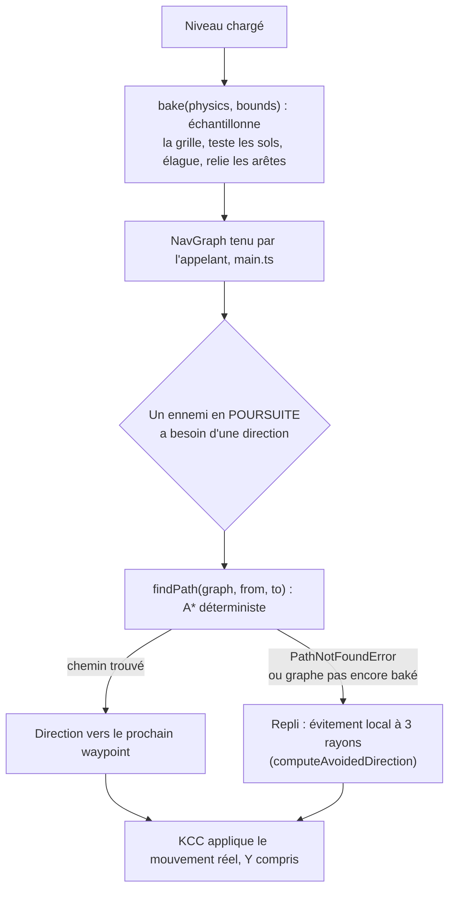

# Pathfinding

Un ennemi qui veut atteindre le joueur a besoin de savoir où aller quand la
ligne droite est bloquée par un mur, une gondole ou un escalier. Avant le
jalon M4, `Suit`/`Director` n'avaient aucune notion de chemin : seulement 3
rayons d'évitement local (`computeAvoidedDirection`, voir [Entités et IA —
Navigation](entites.md#navigation)) qui dévient la direction de poursuite
au coup par coup, sans jamais planifier un détour. Ça suffit pour contourner
un pilier, pas pour traverser l'escalier de la Zone D. `PathfindingService`
(`src/game/level/pathfinding.ts`) comble ce trou : un vrai graphe de
praticabilité, baké une fois au chargement du niveau, puis interrogé par un
A* déterministe à chaque fois qu'un ennemi a besoin d'un chemin. Les deux
mécanismes coexistent plutôt que le second ne remplace le premier : la
suite du document explique pourquoi.

## Du chargement du niveau à la direction de poursuite

Le diagramme ci-dessous suit ce qui se passe, dans l'ordre, entre le
chargement d'un niveau et la décision « dans quelle direction avancer »
prise par un ennemi à chaque pas fixe — construit par lecture directe de
`pathfinding.ts` et de `enemyMachine.ts::tryComputeChaseDirectionFromPath`.

Trois précisions sur ce diagramme :

- **`bake` a lieu une seule fois par niveau**, jamais dans le pas fixe — le
  coût de l'échantillonnage/des raycasts ne doit jamais retomber sur la
  boucle de jeu.
- **`bake` exige un `physics.refreshSceneQueries()` juste avant** : sans
  lui, les colliders du niveau qui vient d'être chargé sont invisibles aux
  rayons et le graphe sort vide. C'était le cas en production jusqu'au
  2026-09-11 — voir [Physique — Colliders invisibles aux rayons avant le
  premier pas](physique.md#colliders-invisibles-aux-rayons-avant-le-premier-pas).
- **Chaque colonne garde le premier sol touché en descendant.** Un plafond
  muni d'un collider devient donc « le sol » de toute la salle en dessous.
  Règle : **les plafonds n'ont pas de collider** (hors d'atteinte, ils ne
  bloquent rien en jeu ; `kit_ceiling_4x4` n'a plus de proxy depuis le
  2026-09-11). Le dessus des murs, des piliers et des racks ressort en
  îlots isolés à 5-6 m, sans arête vers le sol, donc sans effet sur les
  ennemis.
- **Le repli vers l'évitement local n'est pas une erreur** : c'est le
  comportement attendu tant qu'aucun graphe n'est encore baké, ou quand
  aucun chemin exploitable n'existe entre les deux points (composantes non
  connectées). Les deux systèmes coexistent délibérément, ce n'est pas un
  remplacement du second par le premier.

## Comment le graphe est construit

Graphe de praticabilité 2.5D, baké au chargement du niveau, en quatre
étapes :

1. **Échantillonnage** : une grille horizontale de pas `NAV_CELL_SIZE`
   (0.5 m, multiple de la grille de construction Blender 0.25 m) sur l'AABB
   fournie par l'appelant (`main.ts`) — le service ne lit jamais
   `LevelHandle`/`THREE.Object3D` lui-même.
2. **Hauteur de sol par cellule** : un rayon vertical descendant (via
   `RaycastService`) depuis un point haut jusqu'au premier collider
   STATIQUE touché. Une normale de hit trop inclinée (`normal.y` sous
   `MIN_FLOOR_NORMAL_Y`, cos(60°) = 0.5) est traitée comme « pas un sol » —
   évite qu'un rayon qui effleure l'arête supérieure d'un mur soit compté
   comme praticable.
3. **Élagage** : une cellule est rejetée si une capsule du gabarit d'un
   Costard posée DEBOUT sur ce sol chevauche un autre collider statique —
   pas assez de dégagement vertical pour qu'un ennemi s'y tienne.
4. **Arêtes** (8-connectées) : deux cellules praticables adjacentes sont
   reliées si (a) leur différence de hauteur de sol reste sous la marche
   verticale maximale acceptée (voir plus bas) ET (b) un rayon HORIZONTAL à
   hauteur de tête d'ennemi entre les deux cellules ne touche aucun mur.
   Chaque paire n'est testée qu'une seule fois, le résultat étant appliqué
   symétriquement aux deux cellules.

La requête elle-même est un A* déterministe : tas binaire array-based,
tie-break stable PAR INDEX DE GRILLE croissant, jamais par ordre
d'itération d'une `Map`/`Set` — condition dure du déterminisme de rejeu
d'input (`core/inputRecorder.ts`).

## Dimensionné sur le Costard, jamais sur le Directeur

Un seul graphe est baké par niveau, partagé par `Suit` ET `Director`. Il est
dimensionné sur le gabarit du Costard (`suitConfig.capsuleRadius`/
`capsuleHalfHeight`/`eyeHeight`), pas sur celui, légèrement plus grand, du
Directeur — choix explicitement demandé pour ce jalon. Conséquence assumée :
un couloir tout juste assez large pour un Costard mais pas pour un
Directeur serait marqué praticable alors qu'il ne l'est pas vraiment pour
ce dernier. Risque jugé faible en pratique : le Directeur est un boss
UNIQUE, posé dans une seule salle ouverte (Zone E), jamais dans un couloir
étroit — mais si un futur niveau pose un Directeur dans un passage exigu,
ce sera le premier endroit à vérifier.

## La marche verticale maximale entre deux cellules reliées (MAX_STEP_HEIGHT)

Le réglage qui fait passer l'escalier de la Zone D.

Le `KinematicCharacterController` (invariant #6) gère DÉJÀ la traversée
verticale réelle (autostep + gravité + résolution de pente) — ce graphe n'a
donc pas besoin de simuler une trajectoire Y : il décide seulement si deux
cellules adjacentes de la grille sont reliées par une surface que le KCC
peut gravir, sans jamais produire lui-même de Y.

Un rebord vertical est limité à `suitConfig.autostepMaxHeight` (0,35 m),
exactement comme le KCC ennemi. Une cellule de pente continue peut monter
plus haut si sa normale est franchissable et si le dénivelé reste sous
`tan(maxSlopeClimbAngleDeg) × distance horizontale`. La fixture de pente à
45° reste reliée ; celle d'un rebord de 0,8 m est refusée. Une diagonale
n'existe que si ses deux passages orthogonaux sont également ouverts, pour
éviter de couper l'angle d'un obstacle. Sur les arêtes plates, un balayage de
la capsule Rapier complète le rayon d'œil ; sur une rampe, ce balayage
horizontal donnerait un faux contact avec le sol montant.

Ce bake reste une approximation 2,5D, pas une simulation du KCC déplacé
sur chaque arête. Le ressenti et l'accessibilité des rampes du niveau exporté
doivent encore être vérifiés en jeu réel.

## Un service qui ne garde aucun état

`PathfindingService` ne stocke JAMAIS le graphe courant : `bake` le
construit et le RETOURNE, `findPath` le reçoit en paramètre. C'est à
l'appelant (`main.ts`) de garder une variable JS simple, rebâtie au
chargement de chaque niveau. `physics: PhysicsWorld` est un PARAMÈTRE de
`bake`, jamais stocké — même raison que
[RaycastService](physique.md#service-de-raycasting-raycastservice) :
`PhysicsWorld` naît après `GameLayer`/`GameRuntime`, et une Layer de test
doit pouvoir scripter un résultat sans jamais construire de monde Rapier
réel.

Le type public de `bake` est entièrement résolu (`Effect<NavGraph>`, aucune
dépendance visible) bien que l'implémentation consulte `RaycastService` en
interne : cette dépendance est fournie par le service lui-même
(`PathfindingService.layer`), jamais exposée à l'appelant.

## Limite verticale acceptée

Une seule hauteur de sol par cellule XZ — le premier collider statique
touché par le rayon vertical DESCENDANT. Une zone au sol entièrement
recouverte par un étage supérieur (ex. sous une mezzanine) ressort donc
comme la surface DU DESSUS, jamais celle du dessous. Un vrai navmesh
volumétrique serait nécessaire pour lever cette limite — explicitement hors
scope de ce chantier.

## Coût

Le panneau de debug lit `astarMetricsSnapshot()` : nombre cumulé de recherches
A* réelles, échecs, nœuds développés, durée de la dernière et durée maximale
en millisecondes. Les demandes dont la cellule de départ ou d'arrivée est
introuvable, ainsi que les demandes déjà dans la cellule cible, ne lancent
pas A* et ne sont pas comptées. Ces compteurs sont diagnostiques : l'horloge
ne change ni le chemin choisi ni le RNG. Leur état est cumulé depuis le
chargement de la page, y compris entre deux niveaux.

Le bake a lieu au CHARGEMENT du niveau, jamais dans le pas fixe. Un niveau
de la taille du niveau combiné (`hypermarche_complet.glb`) peut représenter
plusieurs dizaines de milliers de cellules ; non mesuré en conditions
réelles de navigateur.

Retour à la [carte de la documentation](../README.md).
