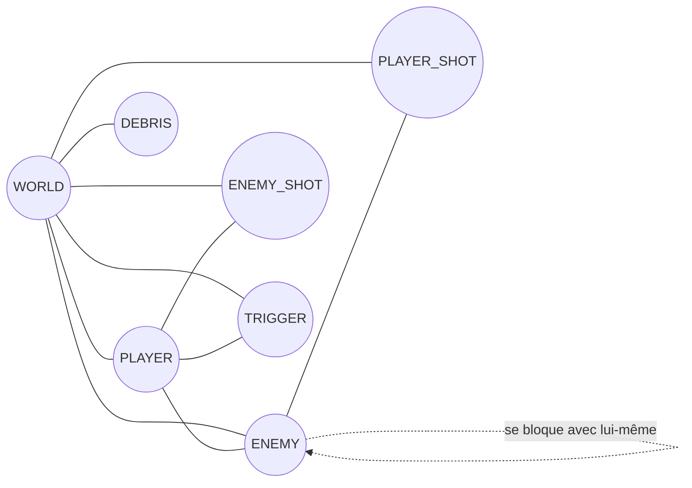

# Physique et collisions

Tout ce qui touche à la solidité du monde — le joueur qui ne traverse pas
les murs, un Costard qui bloque un couloir, un plomb de pompe qui s'arrête
sur une caisse — passe par un unique monde physique Rapier
(`src/physics/world.ts`). Ce document couvre deux choses distinctes que ce
monde rend possibles : **qui a le droit de toucher qui** (les groupes de
collision, une matrice de règles posée une fois pour toutes) et **comment le
jeu interroge ce monde** (le service de raycasting, utilisé aussi bien pour
la ligne de vue d'un ennemi que pour un tir de pompe). Le character
controller du joueur est celui de Rapier
(`KinematicCharacterController`) — jamais une implémentation maison, voir
l'invariant #6 de `CLAUDE.md` et le skill `rapier-character-controller`
pour la configuration de référence (autostep, snap-to-ground, pentes) ainsi
que les valeurs retenues dans
[Valeurs de déplacement](../reference/valeurs-deplacement.md). La gravité
est fixée à −25 m/s² (invariant #7), lue depuis une source unique,
`PhysicsWorld.gravityY`, jamais redéclarée ailleurs.

## Groupes de collision

Le jeu a besoin que certaines paires d'objets se bloquent (le joueur contre
un mur) et que d'autres se traversent sans effet (un tir de pompe contre le
joueur qui l'a tiré, deux douilles éjectées entre elles). Rapier résout ça
avec des **groupes de collision** : chaque collider appartient à un groupe
et déclare quels groupes il accepte de heurter. Le graphe ci-dessous est
construit par lecture directe de `COLLISION_GROUPS`
(`src/physics/world.ts`) — chaque trait représente une interaction
réellement configurée dans le code, pas une intention.



Ce que ce graphe dit en langage clair : le décor (`WORLD`) touche tout le
monde — c'est le sol, les murs, les portes. Le joueur (`PLAYER`) est bloqué
par le décor et par les ennemis, et peut être touché par leurs tirs
(`ENEMY_SHOT`) et déclencher des volumes de trigger. Un ennemi (`ENEMY`)
est bloqué par le décor, par le joueur, par les tirs DU joueur
(`PLAYER_SHOT`), et — fait notable, boucle sur lui-même dans le graphe —
par les AUTRES ennemis (voir plus bas pourquoi). Les tirs de chaque camp
(`PLAYER_SHOT`/`ENEMY_SHOT`) ne touchent que le décor et leur cible, jamais
leur propre tireur : c'est ce qui empêche le joueur de se blesser avec son
propre pompe. Les débris cosmétiques (`DEBRIS`) ne touchent que le décor —
sinon douilles et gibs bloqueraient les tirs pour zéro gameplay. Les
volumes de déclenchement (`TRIGGER`) ne réagissent qu'au joueur, en capteur
pur (`sensor`, aucune réponse physique).

Pour la correspondance exacte bit à bit :

| Groupe        | Interagit avec                          |
|---------------|-----------------------------------------|
| `WORLD`       | tout                                    |
| `PLAYER`      | WORLD, ENEMY, ENEMY_SHOT, TRIGGER       |
| `ENEMY`       | WORLD, PLAYER, PLAYER_SHOT, ENEMY       |
| `PLAYER_SHOT` | WORLD, ENEMY                            |
| `ENEMY_SHOT`  | WORLD, PLAYER                           |
| `DEBRIS`      | WORLD uniquement                        |
| `TRIGGER`     | PLAYER uniquement (sensor)              |

`ENEMY` s'inclut lui-même — voir [ADR 0008](../decisions/0008-collision-ennemi-ennemi.md)
pour le bug de billboards qui clignotaient (deux ennemis interpénétrés
convergeant sur le même point) qui a motivé cette décision, et ses
conséquences sur le feel en combat groupé.

Sous ce résultat visible, l'encodage Rapier tient sur 32 bits : 16 bits
d'appartenance (poids fort) et 16 bits de filtre (poids faible). Deux
colliders `a` et `b` interagissent si et seulement si :

```
((a >> 16) & b) != 0  &&  ((b >> 16) & a) != 0
```

La condition est **symétrique** : déclarer « `ENEMY_SHOT` touche `PLAYER` »
sans mettre `ENEMY_SHOT` dans le filtre de `PLAYER` ne produit aucune
interaction. C'est le piège principal de cette API — la matrice ci-dessus
est symétrisée par construction dans le code pour ne jamais s'y exposer.

> **État d'usage réel** (vérifié par grep sur `src/`, 2026-09-05, corrige une
> note périmée qui disait « seuls WORLD et PLAYER sont utilisés ») : `WORLD`,
> `PLAYER`, `ENEMY`, `PLAYER_SHOT`, `ENEMY_SHOT` et `TRIGGER` sont tous
> effectivement appliqués à un vrai collider quelque part dans le jeu.
> `DEBRIS` reste déclaré mais non utilisé — les douilles éjectées et les
> gibs utilisent une physique factice gérée en temps d'affichage plutôt que
> de vrais `RigidBody` Rapier (voir `src/render/fx.ts::spawnShellCasing`),
> décision documentée directement dans ce fichier.

## Colliders invisibles aux rayons avant le premier pas

Rapier ne range ses colliders dans la structure qui sert aux requêtes
(la broad-phase) qu'au moment d'un `world.step()`. Un collider tout juste
créé est donc **invisible** à `castRay`, `castRayAndGetNormal` et
`intersectionsWithShape` tant qu'aucun pas n'a eu lieu. Rapier 0.20
n'offre aucune autre façon de mettre ces requêtes à jour.

Le piège était connu des tests depuis les jalons M3 et M4 (chaque fixture
appelle `physics.step(0)` avant de lancer un rayon, voir la doc de tête de
`test/physics/raycast.test.ts`), mais **pas du code de production** : de
M4 (2026-09-03) au 2026-09-11, `loadGltfLevel` bakait le graphe de
navigation juste après la création des colliders, et **le graphe sortait
vide dans tous les niveaux** — 0 cellule praticable, les ennemis
retombaient toujours sur l'évitement local.

Correction : `PhysicsWorld.refreshSceneQueries()` fait un pas de durée
nulle (rien n'est simulé, le `timestep` est restauré), appelé par
`game/session/spawning.ts` avant le bake. Le chargement de niveau crée déjà
des corps hors du pas fixe ; ce pas nul ne fait avancer aucun temps de jeu,
l'invariant #1 n'est pas entamé. Test de non-régression :
`test/game/level/pathfinding.test.ts`. **Tout futur code qui interroge le
monde juste après avoir créé des colliders doit passer par cette méthode.**

Piste ouverte : ce même piège pourrait expliquer l'[ADR
0022](../decisions/0022-occlusion-rangees-non-bloquante.md) — voir la
section qui y a été ajoutée.

## Service de raycasting (RaycastService)

Beaucoup de systèmes ont besoin de poser une question géométrique au monde
physique : « est-ce que je vois le joueur ? », « qu'est-ce que ce plomb de
pompe vient de toucher ? », « qu'est-ce qui se trouve dans cette capsule
devant moi ? ». Plutôt que de laisser chaque système parler directement à
l'API Rapier, ces questions passent par un point d'entrée unique,
`src/physics/raycast.ts`, qui enveloppe en Effect les trois requêtes
physiques réellement utilisées par le jeu — `castRay`,
`castRayAndGetNormal`, `intersectionsWithShape`. Le jeu n'utilise pas
`THREE.Raycaster` (vérifié par grep sur tout `src/`, zéro occurrence) :
uniquement l'API physique de Rapier.

**`physics: PhysicsWorld` est un paramètre de chaque méthode, jamais stocké
dans le service.** Deux raisons :

- `PhysicsWorld` est construit après `GameLayer`/`GameRuntime` (init WASM
  Rapier asynchrone dans `main.ts`) — le service ne peut donc pas en
  dépendre à la construction de la Layer ;
- ça permet à `RaycastService.test` de fournir des résultats scriptés sans
  jamais construire de vrai monde Rapier, utile pour tester le
  comportement de `suit.ts`/`director.ts` de façon déterministe et rapide.

**Discipline zéro-allocation** : `ray`/`shapePos`/`shapeRot`/`shape` sont
fournis déjà construits par l'appelant (les `RAPIER.Ray` "scratch" de
`weapons.ts`/`suit.ts`/`director.ts`, réutilisés à chaque appel plutôt que
recréés) — ce service ne fabrique jamais de `RAPIER.Ray` en interne, il ne
fait que le transmettre à Rapier.

| Méthode | Miroir de | Utilisé par |
|---|---|---|
| `castRay` | `RAPIER.World.castRay` (hit/pas-hit, sans normale) | ligne de vue (`hasClearWorldPath`) et évitement local (`castAvoidanceRay`) de `suit.ts`/`director.ts` |
| `castRayAndGetNormal` | `RAPIER.World.castRayAndGetNormal` (hit détaillé, avec normale) | résolution d'attaque de `suit.ts`/`director.ts`, plombs du pompe (`weapons.ts`) |
| `intersectionsWithShape` | `RAPIER.World.intersectionsWithShape` | capsule du pied-de-biche (`weapons.ts`) |

`intersectionsWithShape` ne réexpose pas le callback natif de Rapier : les
colliders touchés sont collectés dans un tableau retourné, pour que la
méthode reste un `Effect.sync` direct plutôt qu'un point d'entrée
impératif exposé à l'appelant.

`RaycastService.test(overrides)` fournit une Layer de test scriptée,
indépendante d'un vrai monde Rapier : chaque méthode renvoie par défaut
« rien touché » (`null`/tableau vide), et un override par méthode permet de
scripter un résultat précis (voir `test/physics/raycast.test.ts`). Le
même pattern de Layer de test scriptée est repris par
[Pathfinding](pathfinding.md), pour la même raison — ne jamais forcer un
appelant à construire un vrai monde Rapier juste pour tester sa logique de
décision.

Retour à la [carte de la documentation](../README.md).
