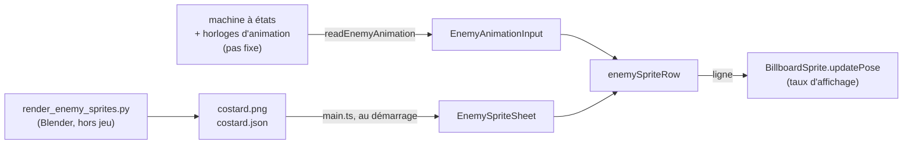
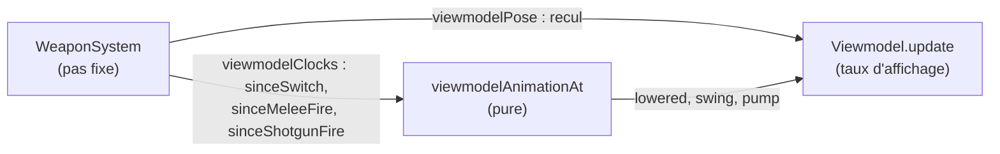

# Rendu

Le jeu vise délibérément un look « build engine » — une résolution basse
(640×360, upscalée), des textures nettes sans filtrage (`NearestFilter`,
aucun mipmap, invariant #4) et des matériaux plats sans aucun reflet
spéculaire (`MeshLambertMaterial` exclusif, jamais de PBR, invariant #5).
Ce document couvre deux choses : comment un niveau importé depuis Blender
(qui produit nativement des matériaux PBR) est reconverti pour respecter ce
look, et comment `src/render/` affiche les entités et les effets de jeu
(sprites billboard, effets de tir, overlays de debug) sans jamais dépendre
directement du code de simulation.

## Invariant #5 — reconversion depuis GLTFLoader

`GLTFLoader` matérialise CHAQUE primitive glTF en `MeshStandardMaterial` (le
modèle PBR metallic-roughness est natif au format) — importer un niveau tel
quel violerait donc silencieusement l'invariant #5. Le look « Build engine »
du jeu vient précisément de l'ABSENCE de spécularité.

`loader.ts::convertToLambert` reconvertit donc CHAQUE mesh importé (pas
seulement les `col_*`, qui de toute façon ne sont jamais rendus visibles) en
`MeshLambertMaterial`, en ne gardant que couleur de base + texture diffuse
(`map`) et en jetant roughness/metalness/normalMap/envMap. L'invariant #4
(`NearestFilter`, pas de mipmaps) est appliqué à toute texture survivante.

Si ce fichier est retouché plus tard : ne jamais retirer cet appel. L'erreur
qui en résulterait est silencieuse — le niveau importé « a l'air » normal
en dev, juste avec des reflets spéculaires qui ne devraient jamais exister à
l'écran dans ce projet.

## Filtrage des textures

Deux réglages se cachent derrière « ça pixelise », et ils n'ont rien à voir :

- la **résolution interne** (640×360) donne un gros pixel UNIFORME sur toute
  l'image. C'est le look, et il ne gêne personne au premier plan ;
- le **filtrage de réduction** décide de ce qui arrive quand une texture de
  128 px ne couvre plus que trois pixels à l'écran.

`configureRetroTexture` (`render/renderer.ts`) tient les deux bouts :
`magFilter` reste `NearestFilter` **toujours** — c'est lui qui fait le gros
pixel franc quand on colle une texture de près —, et la réduction suit le mode
courant (`FiltrageTexture`) :

| Mode | Réduction | Ce qu'on voit |
|---|---|---|
| `nearest` | `NearestFilter`, pas de mipmap | le réglage d'origine : les surfaces lointaines grésillent et rampent quand la caméra bouge |
| `mipmap` | `NearestMipmapLinear` | le grésillement disparaît ; un sol vu en fuyante floute à mi-distance |
| **`aniso`** | idem + anisotropie maximale | **défaut** — le sol rasant reste net. C'est le cas qui compte : ce niveau est fait de grandes salles qu'on traverse au ras du sol |

`cassandre.filtrage(mode)` rebascule toutes les textures chargées sans
recharger le niveau, et `cassandre.resolution(l, h)` change la résolution
interne : un défaut qui ne se voit qu'en mouvement ne se juge que comme ça, sur
la même vue, en basculant d'un mode à l'autre.

Coût mesuré sur le niveau v2 complet : 0,36 ms en `nearest`, 0,96 ms en
`aniso`, pour un budget d'image de 16,6 ms. Décision et alternatives :
[ADR 0027](../decisions/0027-filtrage-des-textures-reduites.md).

## Éclairage de secteur baké en vertex colors (COLOR_0)

Voir [ADR 0005](../decisions/0005-eclairage-vertex-colors.md) pour la
décision de bake en vertex colors plutôt qu'en lightmap, et le skill
`vertex-color-sector-lighting` pour le workflow d'auteur côté Blender. Cette
section couvre uniquement la reconstruction du matériau côté loader.

`GLTFLoader` mappe l'attribut glTF `COLOR_0` sur l'attribut de géométrie
Three.js `"color"` et positionne lui-même `vertexColors = true` sur le
`MeshStandardMaterial` qu'il construit. `convertToLambert`/`toLambert`
doivent relire ce flag et le reporter sur le `MeshLambertMaterial` de
remplacement, sous peine de le perdre silencieusement — le mesh resterait
éclairé de façon plate, sans qu'aucune erreur ne le signale. Le colorspace
linéaire de `COLOR_0` est déjà géré en interne par `GLTFLoader`, rien à
faire de plus côté loader.

## Éclairage de scène selon le niveau

La scène porte, depuis la Phase 1, une `AmbientLight` à 0.4 et une
`DirectionalLight` à 0.8 placée en (5, 10, 5)
(`game/session/gameEngine.ts`). C'est ce rig qui donne leur relief aux
boîtes blanches de la gym, qui n'ont aucune couleur cuite.

Sur un niveau baké, il fait double emploi — et pire, il fait tort. Le rendu
Lambert vaut `texture × couleur de sommet × éclairage temps réel` : un
niveau dont l'éclairage est déjà cuit dans ses sommets se retrouve éclairé
une seconde fois, par une direction arbitraire qui n'a rien à voir avec ses
propres néons. Une face tournée à l'opposé du soleil perd 60 % de sa
luminosité cuite ; une face orientée vers lui déborde. La modulation la plus
visible du niveau ne vient alors pas du bake mais d'un soleil hérité.

`LevelDef.lighting` (registre `game/level/levels.ts`) choisit le régime, et
`lifecycle.ts::applyLightRig` l'applique à chaque construction de partie :

| mode | ambiante | soleil | ce que le `.glb` doit fournir |
|---|---|---|---|
| `temps-reel` (défaut) | 0.4 | 0.8 | rien — gym et zones A-E |
| `bake` | 1.0 | 0 | une couleur de sommet portant TOUT l'éclairage |
| `hybride` | 0.18 | 0 | des `light_*` + une couleur de sommet d'OMBRE |

En `bake`, le rendu vaut exactement `texture × couleur cuite`, ce que le
pipeline vise depuis l'[ADR 0005](../decisions/0005-eclairage-vertex-colors.md).
En `hybride`, l'ambiante n'est pas nulle : les lampes ont une portée finie et
un recoin hors de portée de toutes tomberait au noir absolu.

**Pourquoi un réglage par niveau et non un correctif global** : les zones
A à E ont été éclairées à l'œil SOUS l'ancien rig. Les y basculer d'office
changerait l'aspect de tout le jeu sans que personne l'ait demandé. Seule
la salle d'essai du niveau v2 l'active aujourd'hui ; la bascule des zones
existantes se décidera au jalon N10 (`PLAN_NIVEAU_V2.md`).

### Éclairage hybride : lampes temps réel + ombre cuite

Depuis l'[ADR 0024](../decisions/0024-eclairage-hybride.md), un niveau peut
choisir un troisième régime, `lighting: "hybride"` : **le direct est rendu en
temps réel, l'indirect est cuit**.

Le niveau porte alors ses propres lampes. Elles sont posées dans Blender comme
des empties `light_*` et instanciées par `loader.ts::buildLevelLight` en
`THREE.PointLight`, attachées à la racine du niveau — donc détruites avec lui.
Extras lus, tous optionnels : `color` (« #rrggbb »), `intensity`, `distance`,
`decay`.

La couleur de sommet ne porte plus l'éclairage mais **l'ombre** : elle
multiplie la lumière temps réel au lieu de s'y ajouter. Un recoin à l'ombre
cuite reste donc sombre même sous une lampe proche — faux physiquement, juste
visuellement, et c'est ce qui remplace les ombres portées que trois.js ne
calcule pas ici.

`LevelStats.lightCount` donne le nombre de `light_*` réellement instanciées, et
`cassandre.lighting()` liste ce qui éclaire vraiment la scène — un `visible:
false` y marque une lampe éteinte par le pool ci-dessous, pas une lampe absente.

**Coût, mesuré** : 27 lampes sur la salle d'essai — 0,40 ms de rendu, 120 FPS,
18 draw calls.

### Le pool de lampes

three.js évalue **toutes** les lampes visibles pour chaque fragment, sous forme
d'uniformes. Passé un certain compte, le shader dépasse
`MAX_FRAGMENT_UNIFORM_VECTORS` et **ne compile plus du tout** : la géométrie
disparaît, sans exception, sans rien d'autre qu'une ligne en console. Mesuré
sur la machine de développement, le mur tombe à 255 lampes ; sur une machine
conforme au minimum de la spécification WebGL 2, il peut tomber vers la
cinquantaine. À la densité de la salle d'essai, le niveau v2 en demanderait
environ 1 140.

`LightPool` (`src/render/lightPool.ts`) n'en laisse donc que **48** allumées,
les plus proches du joueur, et éteint le reste. Il est construit à chaque
chargement de niveau (`session.lightPool`) et réévalué dans `updateFx`, au taux
d'affichage — c'est la caméra qui décide, et elle est lue à l'affichage
(invariant #3), jamais au pas fixe.

Deux détails qui ne sont pas des détails :

- **Le classement porte sur la sphère d'influence, pas sur la lampe.** Le score
  est `distance − light.distance`, c'est-à-dire la distance de la caméra au
  bord de ce que la lampe éclaire : une grande lampe lointaine éclaire
  peut-être ce que le joueur regarde, une petite lampe à la même distance non.
  Une lampe de portée nulle est illimitée côté three.js — elle n'est jamais
  éteinte.
- **Le classement n'est rejugé que tous les 2 m parcourus.** Le retard ne
  concerne que la lampe la plus lointaine du lot, celle dont l'extinction ne
  se voit pas.

Un niveau sous le budget (la salle d'essai et ses 27 lampes) n'est jamais
touché : tout reste allumé, et le pool ne fait plus rien.

`cassandre.lightBudget()` rapporte l'état ; avec un argument, il change le
budget (`null` = tout rallumer), ce qui sert autant à mesurer qu'à juger une
ambiance. Détail et chiffres : [ADR 0026](../decisions/0026-visibilite-par-espace-et-pool-de-lampes.md)
et [Ce que coûte une image](cout-de-rendu.md).

## Ciel

Un niveau peut déclarer un ciel : `LevelDef.ciel`, nom d'un dossier de
`public/assets/sky/`. `lifecycle.ts::applyLightRig` le pose en
`scene.background` avec la lumière du niveau, et l'efface pour un niveau qui
n'en a pas — la gym, un reset.

C'est une **cubemap**, pas un mesh : three.js dessine le fond avec son propre
shader, en un seul appel, derrière tout le reste. L'invariant #5 (Lambert
seulement) porte sur les matériaux du monde, qu'aucun ciel ne touche. Filtrée
au plus proche dans les deux sens et sans mipmaps (`render/ciel.ts`) : un ciel
n'est jamais vu en fuyante, il n'a pas le défaut de réduction que
l'[ADR 0027](../decisions/0027-filtrage-des-textures-reduites.md) corrige sur
les sols.

Le seul ciel existant, `nuit`, couvre le niveau v2 : il se voit au-dessus du
parking d'arrivée, à ciel ouvert, et derrière les verrières de la galerie.
Six faces de 256 px générées par `tools/textures/generate_ciel.py`, chaque
pixel calculé depuis sa DIRECTION et non sa place dans la face — c'est ce qui
raccorde l'horizon d'une face à l'autre sans couture. Peu de couleurs et une
trame ordonnée, comme les ciels du Build engine ; un horizon qui dit où l'on
est (une ville de province la nuit, château d'eau, ligne haute tension, antenne
relais) et une lune fermée par une fermeture éclair, celle des piles « Lune
truquée » du rayon bazar.

Coût : un lot de dessin par image, là où le fond n'était qu'une couleur.

## Découplage entre render et game

Tous les modules de `src/render/` qui rendent des effets de jeu (`fx.ts`,
`billboard.ts`, `crosshair.ts`, `hitmarker.ts`, `ballisticsDebug.ts`,
`viewmodel.ts`) partagent la même discipline d'import : rien de
`game/entities/*` ni `game/player/*`, jamais un import direct de
`WeaponSystem`/`Suit`/`Director`. Seules des primitives entrent en
paramètre (`THREE.Vector3`, `THREE.Camera`, `"melee" | "shotgun"`, des
nombres de config).

Le pont vit ailleurs :

- **construction/câblage** — `game/session/gameEngine.ts` instancie chaque
  classe de `render/` une fois, persistante à travers un reset (jalon M8) ;
- **appel par frame** — `game/loop/updateFx.ts` lit `weapons.fireEvents`/
  `hitEvents` et les files d'événements de `suitManager`/`directorManager`,
  puis dépaquette leurs champs vers l'API de `render/` ; `game/loop/
  interpolateVisuals.ts` fait de même pour la pose des sprites/du viewmodel,
  avec des grandeurs déjà interpolées (alpha).

Avant le refactor du 2026-09-05 (commit `7600662`), ce rôle de pont était
tenu directement dans le monolithe `main.ts` — un commentaire qui le nomme
encore est une référence obsolète, pas une description du câblage actuel.

## Temps réel contre pas fixe dans render

Toutes les classes de `render/` qui portent un état visuel transitoire
(`FxSystem`, `BillboardSprite` pour son flash de dégâts, `CrosshairOverlay`,
`HitmarkerOverlay`, `BallisticsDebugOverlay`) exposent une méthode
`update(realDt)` — appelée UNE FOIS PAR FRAME D'AFFICHAGE avec le delta
TEMPS RÉEL, jamais `FIXED_DT` du pas fixe. Ces méthodes tournent depuis
`game/loop/updateFx.ts`, jamais depuis `game/loop/updateGameplay.ts` — voir
[Boucle de jeu](boucle-de-jeu.md#ordre-de-la-frame-daffichage) pour l'ordre
exact des callbacks.

C'est un choix délibéré : ces effets sont purement cosmétiques (screenshake,
flash, gizmos de debug, marqueurs de hit) et ne doivent ni ralentir avec le
hitstop ni dépendre du déterminisme du pas fixe. `BillboardSprite.updatePose`
(position/orientation/case d'atlas), à l'inverse, est appelée depuis
`interpolateVisuals` avec des grandeurs DÉJÀ INTERPOLÉES (alpha) par
l'appelant — jamais les valeurs brutes du pas fixe, sous peine de faire
trembler le sprite au ralenti dès que le framerate d'affichage dépasse 60 Hz.

## Sprites billboard 8 directions

Voir le skill `billboard-sprites-8dir` pour les maths de sélection de
direction et le contrat général du système. Ce qui suit couvre ce qui est
spécifique à `src/render/billboard.ts`.

**Convention de direction** : `direction = 0` correspond à l'ennemi vu DE
FACE (le joueur regarde `forward` droit dans les yeux). Un décalage de
convention se traduit par un décalage de 4 cases dans l'atlas — erreur
difficile à repérer à l'œil ; si les sprites semblent tous « à l'envers »,
vérifier en premier que `forward` pointe bien dans le sens où l'entité
regarde, pas dans le sens opposé.

**Mapping V de l'atlas** : three.js flip l'axe V par défaut
(`texture.flipY = true`) — `v = 0` correspond au BAS de l'image source,
`v = 1` à son HAUT. `createPlaceholderAtlas` (et toute image standard)
dessine la ligne 0 en HAUT du canvas ; pour que `row = 0` sélectionne bien
cette ligne, son offset V doit donc être `1 - 1/rows`, pas `0`. Piège
classique d'atlas three.js, pas spécifique à ce projet.

**Deux canaux de teinte indépendants** : `setTint` (`material.color`,
multiplié avec les pixels de l'atlas) et `setFlash`/`updateFlash`
(`material.emissive`, flash blanc de dégâts) sont deux canaux distincts de
`MeshLambertMaterial`, combinables sans conflit : l'un module les texels,
l'autre s'additionne dessus. La bascule humain → reptilien du Directeur passe
d'abord par `setAtlas` (la peau `revele` de sa planche) ; la teinte ne sert
plus que de repli quand la planche ne s'est pas chargée.

**`setFlash` ne somme jamais** : si un flash est déjà en cours, prend le MAX
de l'intensité courante (déjà partiellement décroissante) et de la nouvelle
demande — même règle que `FxSystem.triggerShake` (voir plus bas). Plusieurs
plombs de pompe touchant la même entité dans le même pas fixe ne doivent pas
empiler un flash plus blanc que blanc.

**Clone de texture par instance** : voir [ADR 0017](../decisions/0017-clone-texture-sprite-billboard.md)
pour le piège de partage de texture évité et l'alternative écartée.

**Atlas placeholder** (`createPlaceholderAtlas`) : voir
[Textures](../pipeline/textures.md#atlas-placeholder-de-billboard) pour son
format et son rôle.

## Animation des sprites d'ennemis

`BillboardSprite` choisit la COLONNE (la direction) ; `render/enemySprites.ts`
choisit la LIGNE (la frame). Les atlas sont des rendus 3D réduits en pixels
([ADR 0028](../decisions/0028-sprites-ennemis-pre-rendus.md)), produits par
`tools/blender/render_enemy_sprites.py` avec un manifeste JSON qui nomme les
lignes.



**Ce qui fait avancer chaque animation** :

| Pose (état) | Frames | Avance selon |
|---|---|---|
| `idle` | 2 | l'horloge d'animation, à `fps` |
| `alert` | 2 | le temps passé dans l'état, étalé sur `alertDuration` |
| `chase` | 6 | **les mètres parcourus**, un cycle tous les `metersPerCycle` |
| `aim` (`attack`) | 1 | tenue pendant toute la télégraphie |
| `fire` | 1 | affichée `duration` secondes après un tir, par-dessus la course |
| `stagger` | 2 | étalé sur `staggerDuration` |
| `death` puis `corpse` | 6 | étalé sur `deathFrameDuration × DEATH_FRAME_COUNT`, puis dernière frame |

**La course suit la distance, pas le temps.** Un Costard qui bute contre un
mur cesse de courir au lieu de faire du surplace ; un ennemi ralenti par le
recul ralentit sa foulée. `strideDistance` cumule le déplacement horizontal
réellement accordé par le KCC, pas la vitesse demandée.

**L'éclair de tir se lit par-dessus la course.** La machine repasse en `chase`
le pas même où le coup part : sans cette priorité, la frame de tir ne serait
jamais affichée. `timeSinceShot` est remis à zéro quand le rayon part vraiment
(ligne de vue confirmée), touché ou non.

**Les horloges vivent dans le contexte XState mais ne décident rien.**
`animClock`, `strideDistance` et `timeSinceShot` avancent au pas fixe avec le
`dt` de gameplay : le hitstop fige l'animation avec l'ennemi, et le rejeu F9/F10
rejoue les mêmes frames. Aucune transition ne les lit, et elles ne consomment
pas de tirage aléatoire.

**Ancrage vertical** : le rendu interpole le CENTRE de la capsule. La ligne des
pieds de l'atlas (`feetFromBottom` pixels au-dessus du bas de la case) est posée
sur le bas de la capsule, offset du KCC compris — `enemySpriteQuad`. La case
fait 2,5 × 2 m au gabarit du Costard : un corps allongé en fin de mort a besoin
de la largeur.

**Planche absente** : `loadEnemySpriteSheetOrPlaceholder` retombe sur l'atlas
numéroté, avec une erreur en console. Le jeu reste jouable, jamais en silence.

### Éclairage des sprites

Un sprite est un quad vertical tourné vers la caméra, éclairé en Lambert comme
le reste. Or les lampes du niveau v2 sont des néons de plafond : leur lumière
arrive sur ce quad presque à l'horizontale, et `n · l` reste proche de zéro.
Les murs compensent par l'indirect cuit dans leurs sommets ; un sprite n'a rien
de tel, et sortait en silhouette noire dans le parking.

`BillboardSprite` accepte donc `normalTilt` : les normales du quad sont
inclinées vers le haut (45° pour les ennemis, `ENEMY_SPRITE_NORMAL_TILT` dans
`game/session/spawning.ts`), sans bouger la géométrie. Le quad capte alors la
lumière d'en haut comme le ferait un volume, et reste éclairé de face par une
lampe à hauteur d'homme (cos 45° ≈ 0,7).

### Lisibilité : ce que 360 pixels laissent

À 11 m, un Costard fait 38 px de haut. À cette taille, ni le filtrage ni la
densité de l'atlas ne changent rien : ce qui se lit, ce sont des masses et des
valeurs. Les sprites sont donc dessinés pour ça, dans
`tools/blender/render_enemy_sprites.py` : membres épaissis, tête agrandie,
veste gris ardoise plutôt que noire, plastron blanc, lunettes et cravate plus
larges que nature. Détail et mesures dans l'[ADR 0028](../decisions/0028-sprites-ennemis-pre-rendus.md#révision-du-2026-09-14--lisibilité).

## Effets visuels de tir (FxSystem)

`src/render/fx.ts` est purement cosmétique : screenshake, muzzle flash,
decals + particules d'impact, douilles éjectées, gibs de mise à mort à bout
portant. Tourne entièrement en temps réel (`update(realDt)`, voir
ci-dessus). Aucun `Math.random()` seedé ici — tout ce module est hors du
harnais de rejeu F9/F10 ; le shake ne modifie ni la position du joueur ni
aucun état de simulation.

**Trois régimes de pooling, volontairement pas uniformisés** :

| Catégorie | Régime | Pourquoi |
|---|---|---|
| Muzzle flash | Pool fixe de 2 (lumière + quad), round-robin | le pas fixe est clampé à 0.25 s et les cooldowns d'armes (≥ 0.5 s) rendent impossible plus d'un `fireEvent` par frame d'affichage en régime normal |
| Decals | Pool fixe de 24, round-robin | un joueur qui vide un chargeur ne doit pas accumuler des dizaines de quads invisibles pour toujours |
| Particules, douilles, gibs | Tableaux simples filtrés à chaque `update()`, pas de pool | durée de vie courte (< 2 s), volume par tir/mise à mort faible — un vrai pool serait de la sur-ingénierie à cette échelle |

**Screenshake** : décroissance exponentielle, `k = -ln(fraction) / duration`
(voir [Valeurs de déplacement — Impact](../reference/valeurs-deplacement.md#impact)
pour les valeurs retenues). Comme `BillboardSprite.setFlash`, PAS de
sommation entre déclenchements qui se chevauchent : le MAX de l'amplitude
courante (déjà partiellement décroissante) et de la nouvelle amplitude
demandée, relancé sur la durée pleine. Un impact à 9 plombs simultanés ne
secoue donc pas 9× plus fort qu'un seul.

**Physique jouet pour les débris cosmétiques** (particules, douilles, gibs) :
voir [ADR 0018](../decisions/0018-physique-jouet-debris-cosmetiques.md) pour
la décision de ne jamais toucher Rapier ici, et l'approximation de sol plat
assumée pour le rebond des douilles.

Les gibs (`spawnGibs`) réutilisent tel quel `ToyParticle`/`updateToyPhysics`
— seuls géométrie, couleur, quantité, vitesse et dispersion diffèrent des
particules d'impact, aucune duplication du pattern générique.

### Le pied-de-biche n'a plus de muzzle flash (2026-09-24)

Deux retours de playtest, corrigés ensemble : « ce carré blanc qui apparaît à
l'écran [au coup de pied-de-biche], ça fait mal aux yeux » et « les impacts
restent dans le vide [quand l'ennemi touché se déplace] ».

**Cause du carré blanc, vérifiée avant correctif** (pas supposée) :
`game/loop/updateFx.ts` appelait `FxSystem.spawnMuzzleFlash` pour CHAQUE
`fireEvent`, mêlée comprise, avec `event.muzzlePosition` — l'œil du joueur —
comme origine pour la mêlée (contrairement au pistolet/pompe, qui partent du
bout du canon AFFICHÉ). `spawnMuzzleFlash` place le quad à `position +
direction * preset.offset`, `offset` valant 0,15 m pour le preset `melee` :
un quad blanc (`color: 0xffffff` sur le matériau du quad, quel que soit le
preset — seul l'`emissive` change) à 15 cm de la caméra couvre l'essentiel du
champ de vision à 640×360. Pas un artefact : le comportement demandé, à
l'endroit et pour l'arme qu'il ne fallait pas.

**Correctif** : le pied-de-biche N'A PAS DE CANON, il n'a donc plus de muzzle
flash DU TOUT — `game/loop/updateFx.ts` n'appelle `spawnMuzzleFlash` que pour
`event.weapon !== "melee"`, et `MUZZLE_FLASH_PRESETS`
(`render/fx.ts`) n'accepte plus que `"pistol" | "shotgun"` (garde vérifiée à
la compilation, pas seulement à l'exécution — passer `"melee"` à
`spawnMuzzleFlash` est désormais une erreur de type). Le retour du coup passe
par ce qui existait déjà et reste inchangé : impact (particules), son,
hitmarker, screenshake. Pistolet et pompe gardent leur flash tel quel — seul
le branchement pour la mêlée a changé.

**Cause des impacts qui flottent** : un decal (`spawnImpactDecal`) est un quad
posé UNE FOIS au point d'impact, jamais reparenté ni suivi. `updateFx.ts` en
posait un pour CHAQUE `HitEvent`, y compris sur un ennemi (qui marche), un
`prop_*` (qui bouge), une porte animée, une vitre ou un sanitaire (qui
disparaissent à la casse) — la surface s'en va, le decal reste accroché à son
point du monde d'origine.

**Correctif, le plus simple qui ne laisse jamais rien flotter** : AUCUN decal
sur ces cinq cas, seulement des particules d'impact (déjà des objets libres,
jetables, courte durée de vie — rien à désolidariser). Deux vérifications
distinctes avant d'appeler `spawnImpactDecal` dans `game/loop/updateFx.ts` :

- **Ennemi** : `hit.material === FLESH_MATERIAL` (même test que la
  distinction de shake/hitmarker déjà en place) — pas de nouvelle donnée.
- **`prop_*`/porte/vitre/sanitaire** : `isMovableOrBreakableHandle(session,
  hit.colliderHandle)`, une fonction NOUVELLE qui construit un
  `Set<number>` de handles de colliders à partir de champs **déjà publics**
  du `LevelHandle` courant (`session.gltfLevelSession.current.doors /
  vitres / sanitaires / props`, chacun avec son `.collider`) — reconstruit
  UNIQUEMENT quand la référence du `LevelHandle` change (nouveau niveau, hot
  reload), jamais par frame. Aucun nouveau couplage vers `game/level/*` : les
  maps `byColliderHandle` internes de `PropSystem`/`DoorSystem`/
  `VitreSystem`/`SanitaireSystem` restent privées, `updateFx.ts` ne fait que
  lire des tableaux déjà exposés. `PROP` est déjà un groupe de collision
  séparé de `WORLD` (invariant existant), mais doors/vitres/sanitaires
  partagent TOUS `COLLISION_GROUPS.WORLD` avec le décor statique — les
  distinguer par groupe de collision seul est impossible, d'où cette
  seconde vérification par handle.

Une alternative existait (decal PARENTÉ au mesh, retiré à la casse) et a été
écartée : elle exige un retrait explicite dans CHAQUE système de casse
(`props.ts`/`vitres.ts`/`sanitaires.ts`/`doors.ts`) pour un gain cosmétique
mineur sur des surfaces déjà bien servies par leurs propres effets de casse
(débris, eau, givre). Le même raisonnement s'applique au joueur touché par un
ennemi (`suitManager.playerHitEvents`/`directorManager.playerHitEvents`,
toujours matière `"flesh"`) : il bouge en permanence, plus de decal là non
plus, seulement la giclée de particules — écart trouvé en même temps que le
reste, jamais signalé par playtest mais identique dans sa cause.

**L'impact se lit maintenant selon ce qu'il touche.** `spawnImpactParticles`
gagne un paramètre `material` (même chaîne que `HitEvent.material`, déjà
disponible, aucun changement au calcul du tir) : `"flesh"` sélectionne
`BLOOD_MATERIAL` (rouge sombre, `0x5a1418`), tout le reste garde
`PARTICLE_MATERIAL` (le gris/brun générique existant — sert de « poussière »
sur le décor). Pas d'étincelles dédiées au métal : aucun tag de matériau
n'existe pour le décor statique (`weapons.ts::PLACEHOLDER_MATERIAL` reste
`"concrete"` pour tout ce qui n'est pas un ennemi, délibérément — un vrai
système de tags par collider serait une sur-ingénierie hors scope de ce
correctif, voir le commentaire de tête de `PLACEHOLDER_MATERIAL`). `fx.ts`
duplique la chaîne `"flesh"` sous `FLESH_SURFACE` plutôt que d'importer
`FLESH_MATERIAL` de `game/player/weapons.ts` — même discipline de
découplage que le type `"melee" | "pistol" | "shotgun"` déjà en dur dans ce
fichier (voir « Découplage entre render et game » plus haut).

**Coût de rendu** : nul. `spawnImpactDecal` est appelé moins souvent qu'avant
(jamais sur un ennemi/prop/porte/vitre/sanitaire) — le pool de 24 decals
existant n'a pas changé de taille. Les particules restent des `THREE.Mesh`
jetables à durée de vie courte (< 0,4 s), déjà hors du calcul du budget de
lots (pire vue déjà mesurée sans elles). Aucun nouveau draw call permanent.

**Vérifié en jeu (2026-09-24/25)**, gym, en pilotant `WeaponSystem.update`
directement par les CHEMINS DE CODE RÉELS (le verrouillage du pointeur reste
hors de portée de l'automatisation) : un coup de pied-de-biche contre un mur
ne montre plus aucun carré/flash, sur des captures prises sur plusieurs
frames d'affichage consécutives après le tir (`renderer` en logiciel,
`--use-gl=angle --use-angle=swiftshader`, headless Chrome piloté par CDP sur
pipe — le port distant TCP est refusé par le bac à sable de cet
environnement). Un coup de pied-de-biche sur un Costard produit un vrai
`HitEvent` (`material: "flesh"`, confirmé en lisant l'état réel de
`WeaponSystem` après le tir) : avec le correctif, ce chemin de code ne peut
PAS appeler `spawnImpactDecal` (branche non atteinte, garantie par la
condition `!isEnemyHit`). **Non vérifié** : une capture visuelle directe du
flash pistolet/pompe (toujours présent, code inchangé) et de la giclée de
sang sur l'ennemi — la fenêtre de vie du flash (2 frames d'affichage) s'est
révélée plus courte que la latence d'aller-retour de l'automatisation CDP
utilisée ici, côté flash comme côté regression repro (code d'avant, même
technique, même résultat blanc/négatif) ; la preuve retenue pour le flash est
donc la lecture de cause (dérivation géométrique ci-dessus, confirmée
compiler-level par le nouveau type `"pistol" | "shotgun"`), pas un pixel
capturé en direct.

### Sanitaires cassés : gerbe jetable + fontaine permanente (`InstancedMesh`)

Casser un `sanitaire_*` ([ADR 0032](../decisions/0032-sanitaires-utilisables.md))
déclenche deux effets de nature différente, volontairement séparés en deux
méthodes :

- `spawnCeramicBurst(point, direction)` — éclats de faïence blanc cassé
  (`direction` = sens du coup) plus une gerbe d'eau initiale qui part
  toujours VERS LE HAUT (`UP_DIRECTION`, comme `spawnFrostBurst`, jamais vers
  `direction` : l'eau jaillit du tuyau cassé, pas dans l'axe du tir). Un
  évènement rare, réutilise `spawnChunks`/`ToyParticle` telle quelle (ADR
  0018) — allouer quelques `Mesh` à cet instant précis est sans coût, même
  raisonnement que `spawnGibs`/`spawnDebris`/`spawnFrostBurst`.
- `addWaterJet(origin)` — le jet PERMANENT qui reste après la gerbe, jusqu'à
  `clearWaterJets()`. Régime de coût opposé : ça tourne à CHAQUE frame
  d'affichage tant qu'un jet existe, donc zéro allocation tolérée en régime
  établi — pas de nouveau `Mesh` par goutte.

**Un seul `THREE.InstancedMesh` porte TOUS les jets actifs.** Pool fixe de
`WATER_MAX_JETS × (WATER_DROPLETS_PER_JET + WATER_SPLASHES_PER_JET)` = 8 ×
(28 + 6) = 272 instances (8 jets : marge au-delà des 5 sanitaires réels du
niveau), construit une fois au constructeur de `FxSystem`, jamais
redimensionné. Chaque goutte en vol et chaque éclaboussure au sol est une
instance dont la matrice est réécrite à la main (`setMatrixAt`) au lieu
d'être un `Mesh` séparé : **un jet actif coûte 1 lot de dessin, N jets actifs
coûtent toujours 1 lot** — `InstancedMesh` dessine tout son buffer en un seul
appel, indépendamment du nombre d'instances utilisées (voir
[Ce que coûte une image](cout-de-rendu.md) : « les triangles ne coûtent
presque rien », et le pire point de vue du niveau est déjà au plafond).

**Élagué comme un mesh ordinaire, sur une sphère tenue à la main.** three.js
calcule la sphère englobante d'un `InstancedMesh` UNE fois, au premier rendu,
quand toutes les instances sont encore à l'origine : elle ne couvrirait
jamais les jets. Plutôt que `frustumCulled = false` (qui dessinait le mesh
dans TOUTES les vues du niveau, pire vue comprise, même sans aucun jet),
`updateWaterBounds` recalcule la sphère autour des jets ACTIFS quand un jet
naît ou que tous s'éteignent — jamais par frame — et cache le mesh tant
qu'aucun jet n'existe : zéro lot sans sanitaire cassé, zéro lot hors champ.
Une instance inactive est cachée par une matrice à ÉCHELLE NULLE
(`ZERO_SCALE_MATRIX`, partagée en lecture seule) plutôt que retirée du pool —
la géométrie dégénère en un point, invisible, sans jamais changer le nombre
d'instances dessinées.

**Chaque jet a son propre plancher.** `origin.y` (bas-centre de la bbox de
l'appareil — au sol pour une cuvette, ~0,55 m pour un urinoir) sert à la fois
de point d'émission et de niveau où LES GOUTTES DE CE JET éclaboussent et
repartent, jamais un sol global comme `SHELL_GROUND_Y` (qui suppose `y = 0`
partout, faux pour un urinoir en hauteur). Une goutte qui retombe déclenche
une éclaboussure (round-robin parmi les 4 dédiées à son jet) puis repart
aussitôt du pied du jet avec une nouvelle vitesse aléatoire — jamais de
suppression, jamais de nouvelle allocation. À la naissance d'un jet, chaque
goutte est avancée d'une fraction aléatoire de son temps de vol : sans ça,
elles partent toutes ensemble et le jet naît comme une bouffée synchrone.

**Look retro assumé, pas un shader d'eau.** Gouttes et éclaboussures
partagent UNE géométrie (`WATER_GEOMETRY`, un cube de 5 cm) : « des gouttes en
petits carrés francs », comme demandé par le skill `build-engine-look` — pas
de flou, pas de sprite alpha, pas de simulation de surface. Les échelles
d'instance sont des FACTEURS de ce cube, jamais des cotes en mètres : la
première version multipliait 5 cm par 0,05 et dessinait des gouttes de
2,5 mm, bien présentes au compte de lots et invisibles à l'écran. Une goutte
est étirée à la verticale (`WATER_DROPLET_STRETCH`, 4 × 9 cm) — un filet qui
tombe se lit comme un trait —, et le matériau porte un peu d'émissif : dans
la salle sombre des toilettes, l'eau éclairée par la seule ambiance sortait
du même gris que le carrelage. Une éclaboussure
est le MÊME cube, aplati et élargi par l'échelle d'instance (jamais une
géométrie séparée — un `InstancedMesh` n'en porte qu'une), et grossit puis
s'évanouit PAR L'ÉCHELLE plutôt que par un canal alpha : le matériau reste
opaque, ce qui évite tout tri de transparence entre instances (three.js ne
trie pas les instances d'un `InstancedMesh` entre elles).

**Vérifié en jeu (2026-09-24)**, `cassandre.sanitaires.casser(...)` sur un
urinoir puis une cuvette : colonne d'eau lisible à 640×360 au-dessus de
l'appareil cassé, sphère d'élagage centrée sur les jets actifs, mesh caché
tant qu'aucun jet n'existe. Non jugé : le rendu en mouvement, en jouant.

**Vérifié hors-jeu, avant le correctif d'échelle** (scène de test jetable, capture par Chrome headless à
résolution interne 640×360, supprimée après coup — aucun fichier de test
resté dans le dépôt) : les 96 instances sont bien à échelle nulle au repos ;
`addWaterJet` fait apparaître des gouttes qui montent, retombent et
éclaboussent en continu (trajectoire Y suivie sur plus d'une seconde,
plusieurs cycles observés) ; deux jets simultanés cohabitent sans
interférence ; au-delà de 8 appels le jet le plus ancien est bien réécrit
(round-robin) ; `clearWaterJets()` désactive les 8 jets et remet les 96
matrices à zéro. `renderer.info.render.calls` confirme le compte de lots :
scène de test à 4 lots en régime établi (sol + 2 amers de test + LA fontaine,
quel que soit le nombre de jets actifs parmi eux).

## Overlays canvas 2D hors React (réticule et hitmarker)

Réticule et hitmarker sont deux canaux de feedback ajoutés après un retour
playtest de la Phase 3 (« le tir est assez hasardeux », « la sensation de
tir et de touché n'est pas bonne »). Les deux dessinent directement sur un
`<canvas>` 2D dédié, monté sur le même conteneur que `canvas#game`
(`100vw`/`100vh`, `image-rendering: pixelated`), à la résolution interne
`INTERNAL_WIDTH`×`INTERNAL_HEIGHT` (invariant #4) — jamais via React
(invariant #2) : un marqueur doit apparaître en UN frame d'affichage et
durer une centaine de ms, largement sous le throttle 10 Hz du HUD React.
Mis à jour depuis `updateFx(realDt)`, jamais le pas fixe.

**Position du réticule — garantie géométrique, pas une valeur tunable** : le
réticule est dessiné au centre exact du canvas interne. La caméra utilise
une projection perspective symétrique au même ratio d'aspect (aucun
`camera.setViewOffset` nulle part dans le projet), donc son axe optique s'y
projette TOUJOURS exactement au centre — une propriété géométrique de la
projection, jamais quelque chose que ce module recalcule. Seul le style
(croix/point, taille, épaisseur, couleur, pulsation) est tunable — voir
[Armes du joueur — Réticule permanent](armes.md#réticule-permanent-crosshair_variants).

**Hitmarker `"hit"` et `"kill"` : deux fenêtres indépendantes**, jamais de
sommation d'intensité — un `"kill"` prime visuellement s'il se chevauche
avec un `"hit"` encore affiché (voir [Armes du joueur — Confirmation de hit
à l'écran](armes.md#confirmation-de-hit-à-lécran-hitmarker_variants) pour
les profils).

## Gizmos balistiques de debug

Ajoutés sur demande explicite de playtest (« il faudrait rajouter des
gizmos pour voir sur quoi on tire »). Dessinent la forme EXACTE réellement
testée par la requête de hit courante (mêmes nombres que `WeaponSystem` :
portée, rayon, directions dispersées des plombs) — pas une approximation
pédagogique. Contrairement au wireframe (`KeyV`, désactivé par défaut), actif
PAR DÉFAUT en dev : il répond à un besoin de diagnostic immédiat, pas une
fonctionnalité cachée à découvrir. Éteint dans le build de production, où
`KeyB` n'est pas lu. `KeyB` bascule l'affichage à chaud — voir
[Outils de debug](debug.md) et [Contrôles](../reference/controles.md) pour
le câblage des touches.

Ce sont des objets 3D RÉELS ajoutés à la scène (pas un canvas 2D), avec des
matériaux NON ÉCLAIRÉS (`LineBasicMaterial`/`MeshBasicMaterial`),
délibérément PAS `MeshLambertMaterial` : l'invariant #5 interdit la PBR/le
spéculaire sur ce que le JOUEUR voit en jeu, mais ces gizmos sont un calque
de DIAGNOSTIC transitoire (quelques centaines de ms), pas du rendu de jeu
final — rester visible quelle que soit la direction de la lumière est le
comportement correct pour un outil de mesure, pas une entorse à l'invariant.

## Le mesh d'arme affiché à l'écran (Viewmodel)

Le mesh d'arme affiché à l'écran est un ENFANT de la caméra
(`camera.add(...)`), pas recalculé en world-space chaque frame : la pose que
renvoie `WeaponSystem.viewmodelPose()` est déjà exprimée dans le repère
local de la caméra. Prérequis côté appelant : la caméra doit elle-même être
un descendant de `scene` (`scene.add(camera)`, posé dans
`game/session/gameEngine.ts`) pour que three.js traverse ses enfants au
rendu — une caméra hors du graphe de scène rend ses propres enfants
invisibles, même correctement positionnés.

Conséquence ASSUMÉE de ce choix, pas un oubli : le viewmodel hérite du FOV
dynamique de la caméra (élargi en course, `moveConfig.fovRunBoost`) et
semble très légèrement « zoomer » pendant un sprint — comportement habituel
d'un FPS, pas une régression.

`activeWeapon` a trois valeurs explicites (`"none" | "melee" | "shotgun"`),
jamais un ternaire binaire : un ternaire melee/shotgun afficherait le pompe
par défaut sur `"none"` (arme fantôme à l'écran pour un joueur censé être
désarmé, Zone A avant ramassage du pied-de-biche) — bug visuel silencieux
évité en énumérant les trois cas.

### Les modèles : placés dans Blender, animés ici

Pied-de-biche et pompe sont des modèles basse définition tenus par les
avant-bras du héros ([ADR 0029](../decisions/0029-armes-en-vue-subjective.md)),
construits par `tools/blender/build_weapons.py` et exportés dans
`public/assets/weapons/armes.glb`. Les meshes `vm_*` y sont DÉJÀ exprimés dans
le repère de la caméra : **la place de l'arme à l'écran se règle dans le script
Blender** (`PRISE_*`, `AXE_*`), en regardant ses vues de contrôle, jamais par des
constantes en TypeScript. Le jeu n'ajoute que du mouvement autour d'un pivot.

Tout ce que le jeu doit savoir de la géométrie voyage dans les extras glTF :

| Extra | Nœud | Rôle |
|---|---|---|
| `prise` | `vm_crowbar`, `vm_shotgun` | poing droit : centre du recul et des changements d'arme |
| `bout_canon` | `vm_shotgun` | point de départ de l'éclair de tir |
| `axe_glissiere` | `vm_shotgun_pump` | direction le long de laquelle recule le fût |

**Jamais un extra nommé `pivot`** : `GLTFLoader` (three r185) le réserve à
`Object3D.pivot` et l'efface de tout nœud qui a des enfants — la pompe perdait
le sien, le pied-de-biche le gardait.

Un seul `MeshLambertMaterial` à couleurs de sommets pour toutes les armes : un
lot de dessin pour le pied-de-biche, deux pour la pompe (carcasse, fût mobile).

### Ce qui anime l'arme



| Geste | Déclencheur | Forme |
|---|---|---|
| Changement d'arme | `activeWeapon` change, d'où que ça vienne (touche, ramassage) | l'ancienne descend en 0,12 s, la nouvelle remonte en 0,18 s |
| Balayage | un coup de pied-de-biche part | frappe en 0,07 s, retour en 0,28 s, **autour du coude** |
| Pompage | un tir de pompe part | fût en arrière de 0,2 à 0,33 s, en avant jusqu'à 0,48 s |

**Aucun geste ne retient le joueur (invariant #10).** Les horloges avancent au
pas fixe, donc le hitstop fige aussi l'arme, mais aucune n'entre dans la
décision de tirer. Tirer pendant un changement remet l'arme en place aussitôt ;
le pompage se termine avant la fin du cooldown du pompe (0,8 s), un test y veille.

**Le balayage tourne autour du coude, pas du poing.** Autour du poing,
l'avant-bras remonte dans le champ et barre l'écran en fin de geste.

**Horloges finies, pas `Infinity`** : l'interpolation `prev + (cur - prev) × α`
d'une horloge « au repos » à `Infinity` donne `NaN`. Elles plafonnent à 1 000 s.

### Les armes passent devant les murs

La pompe dépasse d'un mètre devant l'œil, la capsule du joueur de 40 cm : collé
à un mur, le canon s'y enfonçait. Les meshes du viewmodel se dessinent avec
`gl.depthRange(0, 0.05)` (posé dans `onBeforeRender`, rétabli dans
`onAfterRender`) : leur profondeur est tassée dans les 5 % avant du tampon. Ils
passent devant tout ce qui est à plus de ~11 cm de l'œil et gardent leurs
propres occlusions (une main devant la carcasse). `WebGLState` ne pilote pas
`depthRange`, three.js ne le rétablit donc jamais à notre place — d'où le
rétablissement explicite. Écarté : une seconde passe de rendu, qui exigerait de
dupliquer toutes les lampes sur une couche dédiée.

### Ramassages au sol

`use_crowbar`, `use_pistol` et `use_shotgun` gardent leur boîte `.glb` (portée
d'interaction, contrat du loader) mais la rendent invisible ; `dressWeaponPickup`
(`render/pickups.ts`) y accroche un **billboard**, posé sur la surface
**réellement** sous elle, trouvée par un rayon au chargement — les boîtes
`use_*` du niveau v2 flottent à 25 cm du sol.

#### Armes au sol (2026-09-25)

Retour de playtest, mot pour mot : « je voudrais que ce soit plus visible […]
comme un billboard ». Avant cette passe, `dressWeaponPickup` posait le vrai
modèle `world_*` À PLAT sur le sol (`Matrix.Rotation(90°, Y)` dans
`tools/blender/build_weapons.py::armes_au_sol`) : de loin, la caméra ne voit
que son ÉPAISSEUR — 2,4 à 5 cm réels, le diamètre de la barre du pied-de-biche
ou la carcasse du pompe, jamais sa longueur. Chiffré avec le FOV vertical
75° (`moveConfig.fovBase`) et 360 px internes (invariant #4) :

```
pixelsPerMètre(d) = (360 / 2) / (d × tan(37,5°)) ≈ 234,6 / d
```

| Distance | px/m | Hauteur à plat (≈ 0,03 m) | Hauteur du billboard, pied-de-biche (0,8 m) |
|---|---|---|---|
| 5 m | 46,9 | 1,4 px | 37,5 px |
| 10 m | 23,5 | 0,7 px | 18,8 px |
| 20 m | 11,7 | 0,4 px | 9,4 px |

Ces chiffres restent une borne haute théorique (bounding box du billboard) :
la silhouette réelle à l'intérieur — même grossie par `dilater()` — n'occupe
pas 100 % du carré ; voir « Vérifié en jeu » plus bas pour des mesures
directes sur la vraie capture.

Aucun réglage de matériau ne corrige un objet sous-pixel : il fallait un vrai
billboard yaw-only (skill `billboard-sprites-8dir`), comme les ramassages de
Duke 3D — le sprite reste toujours face à la caméra, quel que soit l'angle
d'approche, plutôt que de se réduire à sa tranche.

**Première version (retirée le jour même) : icône procédurale par canvas +
disque d'ombre.** Vérifiée en jeu par `retro-render` (Chrome headless piloté
par CDP, `--use-gl=angle --use-angle=swiftshader`, voir plus bas) et
REFUSÉE : à 4 m l'icône ne faisait qu'un trait de quelques pixels (le dessin
procédural ne remplissait pas son propre quad), le disque au sol se lisait
comme un trou noir dans le bitume de nuit, et le pouls d'émissive
(0,18-0,6) était invisible au parking. Trois défauts, une seule cause
commune : personne n'avait regardé le résultat avant de le livrer.

**Ce que `dressWeaponPickup` pose désormais** (`render/pickups.ts`,
`WeaponPickupBillboard`) : une icône plane DRESSÉE (yaw-only, toujours face
caméra), **PRÉ-RENDUE depuis le vrai modèle** `world_*`
(`tools/blender/render_weapon_pickups.py`, régénérable) — la même arme que
celle tenue en main, pas un dessin. Le disque au sol a été RETIRÉ (option
offerte par la vérification : « retire-le, ou fais-en une lueur claire » —
le retrait est plus sûr qu'une lueur mal réglée sur un sol jamais vu
d'avance). `MeshLambertMaterial`/`alphaTest`/`transparent: false` (invariant
#5, contrat du skill : pas de tri de profondeur).

**Le cadrage du générateur, et pourquoi il roule à 45°.** Une arme posée à
plat est longue et fine dans les trois dimensions sauf une (0,7-0,85 m de
long, 2-5 cm de section) : une caméra de profil DROITE la cadre en rectangle
lame de rasoir, quelle que soit la taille du billboard — c'est très
exactement ce qui s'est produit dans la version dessinée à la main aussi.
`render_weapon_pickups.py::cadrage_profil` vise l'axe de plus petite
extension de la boîte englobante (l'épaisseur) et **roule la caméra de 45°**
autour de cet axe : la diagonale de l'arme couvre alors un cadre PROCHE DU
CARRÉ, mesuré exactement (pas une formule approchée) en projetant les 8
coins de la boîte sur les axes caméra une fois le roulis appliqué — même
geste que les icônes de ramassage de Duke 3D/Doom, qui montrent l'arme en
biais plutôt que droite. Un second passage, `dilater()`, grossit la
silhouette de ~1,8 cm par côté (4-voisins, sur le buffer SUPERSAMPLÉ avant
réduction) : à sa vraie épaisseur, même en biais, un pied-de-biche reste un
trait fin d'un bord franc à l'autre — la vérification en jeu l'a montré
illisible SANS ce grossissement. Bord toujours net après (la réduction par
bloc + seuil d'alpha 0,5 fait le reste), donc toujours dans le registre
build-engine-look (jamais de flou).

**Taille du billboard : lisibilité, pas échelle réelle.**
`WEAPON_SPRITE_SIZE` (0,8 m pied-de-biche, 0,8 m pistolet, 1,1 m pompe — relevés
le 2026-09-25 après vérification en jeu : à 0,5 m, le pistolet n'était qu'une
tache grise sur le terrazzo à 6 m) ne
respecte PAS les proportions relatives mesurées par le générateur (0,58/
0,28/0,75 m) — un pistolet à sa vraie taille se serait relu comme un pixel à
10 m, même défaut que la version à plat. Même liberté que Duke 3D/Doom, dont
les icônes de ramassage ne respectent pas non plus l'échelle relative des
armes entre elles.

**Émissif mesuré, pas décoratif.** Au parking de nuit (`niveau_v2`), le canal
DIFFUS d'un `MeshLambertMaterial` dépend de l'éclairage de scène et y tombe
quasi à zéro ; l'émissif, lui, s'ajoute indépendamment des lumières — c'est
le seul levier qui porte la lisibilité dans le noir. Relevé de 0,18-0,6
(invisible, retour de vérification) à 0,55-1,3. Mesuré en jeu (capture de 5
images espacées de 500 ms, moyenne du canal rouge sur la zone connue du
pied-de-biche) : 137 → 164 → 164 → 132 → 120 — un battement mesuré d'environ
35 % d'amplitude, pas une valeur statique.

**Partage obligatoire, pas seulement une optimisation.**
`loader.ts::disposeLevelResource` traverse tout `THREE.Mesh` sous la racine
du niveau et dispose sans distinction géométrie/matériau/texture. Un clone
par instance (le patron `BillboardSprite`, ADR 0017) serait donc libéré sous
les pieds des deux autres pickups au premier hot reload. Les trois pickups
partagent un atlas (chargé UNE FOIS via `THREE.TextureLoader`, qui rend la
`Texture` immédiatement et la peuple en tâche de fond — nécessaire :
`dressWeaponPickup` tourne SYNCHRONE dans le chargement de niveau, invariant
#11, et ne peut pas attendre un fetch), une géométrie par arme (UV figés
dedans, pas de `texture.offset` mutable) et un matériau de sprite — zéro
`.clone()`, même précédent que `sharedKit`/`sharedAmmo` du même fichier.
Conséquence : le pouls d'émissive (propriété du matériau partagé) est
GLOBAL aux trois pickups, avancé une seule fois par frame
(`advanceWeaponPickupClock`) ; seul le flottement, propriété du mesh
(position), varie par instance (déphasage dérivé de la position, déterministe
et hors invariant #12 — purement cosmétique, aucun RNG).

**Coût** : avant la toute première passe, 1 mesh par pickup (3 lots). La
version pré-rendue actuelle : 1 sprite par pickup, un seul matériau partagé
pour les trois — 3 lots, identique au compte d'origine (le disque d'ombre,
qui aurait ajouté 3 lots, a été retiré). Élagage par distance déjà acquis :
le sprite est enfant de la boîte `use_*`, `render/useObjectCulling.ts`
éteint le parent au-delà de 48 m et l'enfant avec lui — rien à câbler en
plus.

**Vérifié en jeu (2026-09-25, `retro-render`)** : Chrome headless piloté par
CDP en pipe HTTP (`--headless=new --use-gl=angle --use-angle=swiftshader`,
port de debug local — pas de dépendance `puppeteer`/`playwright` dans ce
dépôt, WebSocket natif Node 22 suffit), sur le serveur de dev 5173,
`niveau_v2`, `cassandre.notarget(true)`, `cassandre.player.spawn(-8, 0, 38)`
puis `(-8, 0, 32)` (10 m puis 4 m du pied-de-biche du parking). Captures et
mesures dans le scratchpad de la session : forme reconnaissable (crochet +
barre) aux deux distances, aucun disque noir, pouls mesuré (ci-dessus).
Console vérifiée sans nouvelle erreur/avertissement (le seul avertissement
Three.js observé pendant l'itération — « Texture marked for update but no
image data found », `WebGLRenderer` tentant un upload avant l'arrivée de
l'image — venait de `configureRetroTexture` appelée trop tôt ; corrigé en la
reportant dans le callback `onLoad` de `TextureLoader`). **Non vérifié** :
pistolet et pompe en conditions réelles (seul le pied-de-biche a été
positionné et photographié ; les deux autres partagent le même code et le
même atlas, contrôlés seulement par lecture de l'image générée).

**Repli** : si `armes.glb` ne se charge pas, `loadWeaponModelsOrPlaceholder`
reprend les boîtes historiques pour le VIEWMODEL (arme tenue) — sans effet sur
le ramassage au sol, qui n'en dépend plus. `armes.glb` garde ses nœuds
`world_crowbar`/`world_pistol`/`world_shotgun` (ADR 0029, inchangé) : c'est
maintenant `render_weapon_pickups.py` qui les rend (import direct de
`build_weapons.armes_au_sol`, pas de round-trip par `armes.glb`) ; une passe
future pourra retirer ces nœuds du `.glb` lui-même si aucun autre usage
n'apparaît.

## Bascule wireframe de debug

`createWireframeToggle` bascule `material.wireframe` sur les matériaux DÉJÀ
présents dans la scène (`scene.traverse`), rien d'autre — pas de matériau de
remplacement, pas de post-processing, pas de shader dédié : le wireframe
s'obtient sur le pipeline existant ou pas du tout (contrainte du skill
`build-engine-look`). Restreint à `MeshLambertMaterial` (invariant #5) : ce
n'est pas qu'une contrainte de style, c'est un garde-fou passif — un mesh
dont le matériau n'est pas Lambert est ignoré et signalé une fois en
console, ce qui ne devrait jamais arriver dans ce projet.

Limite assumée : seuls les matériaux présents dans la scène AU MOMENT du
basculement sont couverts ; un objet ajouté après coup (particule d'impact,
douille) démarre non wireframe. Sans conséquence pour l'usage visé
(géométrie statique du niveau + balle témoin de `game/session/lifecycle.ts`).

Retour à la [carte de la documentation](../README.md).
