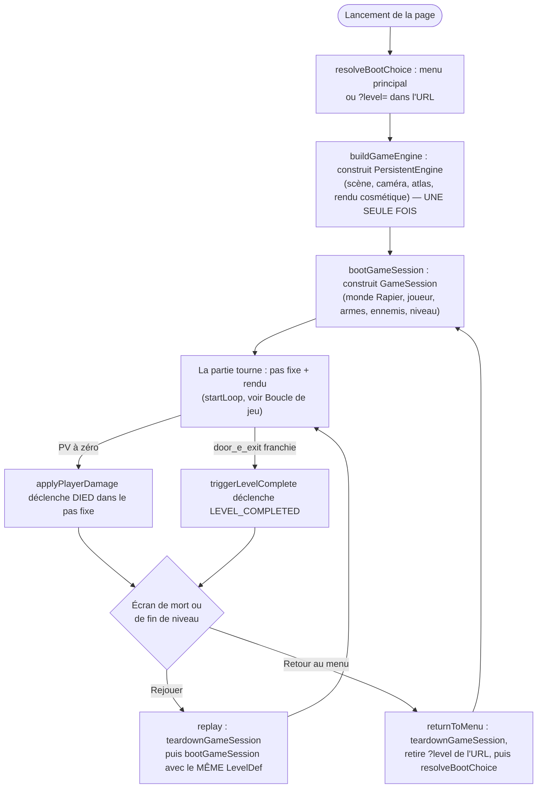

# Session de partie

Une partie a un cycle de vie complet : elle démarre (choix du niveau, mise
en place du monde), elle tourne (le joueur combat, ramasse des objets,
franchit des portes), et elle se termine (mort ou fin de niveau) sur un
écran qui propose de rejouer ou de revenir au menu — sans jamais recharger
la page. Ce document explique comment le code sépare ce qui doit survivre à
cette boucle (le moteur de rendu, les atlas de sprites, la caméra) de ce qui
doit être entièrement reconstruit à chaque partie (le monde physique, les
ennemis, la progression), et retrace le chemin exact que suit une partie du
boot au reset. Pour l'écran affiché à chaque étape de ce cycle, voir [HUD et
interface — Flux d'écran](hud.md#flux-décran) : ce document-ci couvre la
construction/destruction des objets de simulation, l'autre la machine
d'états qui décide quel composant React est monté.

## Le cycle de vie d'une partie, du boot au reset

Construit par lecture directe de `main.ts`,
`game/session/bootChoice.ts`/`gameEngine.ts`/`lifecycle.ts` :

Trois points que ce diagramme ne montre pas explicitement :

- **`buildGameEngine` n'a lieu qu'une seule fois pour toute la durée de
  l'onglet** — le rectangle « PersistentEngine » n'est jamais retraversé,
  contrairement à `bootGameSession`, rejoué à chaque « Rejouer »/« Retour au
  menu ». C'est tout le sujet de la section suivante.
- **`teardownGameSession` a lieu avant chaque reconstruction**, jamais
  après — une partie n'est jamais laissée à moitié détruite pendant qu'une
  nouvelle se construit.
- Le refactor du 2026-09-05 qui a fait émerger ce découpage est raconté
  dans la section [Origine des modules game/session](#origine-des-modules-gamesession)
  plus bas, pour qui cherche pourquoi le code vit à cet endroit précis.

## L'état persistant du process (GameEngine)

`GameEngine` (`gameEngine.ts`) rassemble tout ce que `main()` construisait
UNE SEULE FOIS avant le refactor du 2026-09-05, en variables locales : le
moteur de rendu, les atlas partagés, la caméra — tout ce qui n'a aucune
raison d'être reconstruit à chaque reset de partie. Construit une seule
fois par `buildGameEngine`, avant le tout premier `bootGameSession`, il
survit à un reset (`bootGameSession`/`teardownGameSession`), contrairement
à `GameSession` (voir plus bas).

Ce qu'il possède : scène/caméra/renderer, `clock` et les pools `fx` (objets
persistants dont l’état transitoire est remis à zéro à chaque boot), les
systèmes de rendu cosmétiques
(`fx`/`viewmodel`/`crosshair`/`hitmarker`/`ballisticsDebug`/
`wireframeToggle`), les atlas et géométries partagés entre TOUTES les
parties (`suitAtlas`/`directorAtlas`/`badgeGeometry`/`badgeMaterial` — voir
« LE PIÈGE DU PARTAGE DE TEXTURE » dans `render/billboard.ts`), la visée
(`look`/`lookDelta`, mutés en place et jamais recréés en objet neuf —
`interpolateVisuals.ts` ferme dessus par référence), `interaction`
(`InteractionSystem`, instance unique pour tout l'onglet), et enfin
`session`, la partie courante.

Ce qui n'y est délibérément PAS : les scratch vectors qui ne servent qu'à
UNE SEULE phase de boucle (ex. `eyePosition`/`cameraEuler`, module-locaux à
`interpolateVisuals.ts`), et les constantes qui ne changent jamais au fil
d'une partie (`HERO_LINE_*`, `VIEWS_*`, `DOOR_OPEN_DURATION`...) — les
rendre « persistantes » via `GameEngine` n'apporterait rien. Seule
exception : `ballPrevPos`/`ballPrevQuat`/`ballCurrPos`/`ballCurrQuat`
(scratch de la balle de test du chemin « gym ») reste sur `GameEngine` car
il est PARTAGÉ entre deux fichiers distincts (`loop/stepPhysics.ts` écrit
`ballCurr*`, `loop/interpolateVisuals.ts` lit les deux pour interpoler) — la
règle qui sépare « module-local » de « sur GameEngine » est le nombre de
fichiers qui lisent/écrivent la valeur, pas son ancienneté ou son
importance perçue.

`buildGameEngine` construit tout ça en une passe (scène, lumières, caméra,
systèmes de rendu cosmétiques, atlas, badge, scratch de balle, visée,
wireframe, interaction) et retourne un type un peu différent, sans le champ
`session` — voir la section suivante pour la raison.

## Un type intermédiaire pour éviter une dépendance circulaire (PersistentEngine)

`PersistentEngine = Omit<GameEngine, "session">` (`gameEngine.ts`) existe
pour résoudre un problème d'ordre de construction : `buildGameEngine` doit
exister AVANT que la toute première `GameSession` puisse être construite
(`bootGameSession` lit `scene`/`look`/`clock`/etc.), mais le type
`GameEngine` complet exige un champ `session` non nul — un vrai
« œuf et poule ».

`bootGameSession`/`teardownGameSession` (`lifecycle.ts`) et
`spawnSuitAt`/`spawnDirectorAt`/`loadGltfLevel` (`spawning.ts`) sont donc
typées pour accepter `PersistentEngine`, pas `GameEngine` : elles ne lisent
jamais `engine.session`, ce qui leur permet d'être appelées avant que la
toute première session n'existe. Un `GameEngine` complet reste assignable
partout où `PersistentEngine` est attendu, par sous-typage structurel
(champ `session` en trop, ignoré) — les appels ultérieurs (`replay`/
`returnToMenu`, qui possèdent le `GameEngine` complet) fonctionnent donc
avec les MÊMES fonctions, sans caster quoi que ce soit.

Voir [ADR 0014](../decisions/0014-gameengine-persistentengine-separes.md)
pour la décision de séparer les deux types plutôt que d'utiliser un unique
`GameEngine` avec un champ `session: GameSession | null`.

## Savoir si le monde physique est vivant (isPhysicsSessionLive)

Entre deux parties, `engine.session` peut pointer vers l’ancienne session
pendant que son chargement en vol se termine puis pendant sa démolition —
`isPhysicsSessionLive(engine)` (`gameEngine.ts`) répond à la
question « est-il sûr de toucher `engine.session.physics.world`
maintenant ? ». Elle est fausse dans deux cas : avant le tout premier
`bootGameSession` (`boot`/`mainMenu`/`options`/`levelSelect`, le monde n'a
pas encore été construit), et pendant la fenêtre transitoire de
`returnToMenu()` et `replay()` (`loading`/`loadFailed`). Le teardown attend
d’abord `LevelSession.stop()` puis libère Rapier ; la garde empêche donc la
boucle de toucher l’ancien monde pendant toute la transition, avant comme
après son `free()`.

Utilisée UNIQUEMENT par `loop/stepPhysics.ts` et le harnais F9/F10 —
`updateGameplay`/`interpolateVisuals`/`updateFx` ne touchent jamais Rapier
directement et n'ont pas besoin de cette garde. Voir [ADR
0013](../decisions/0013-garde-flux-vs-monde-physique.md) pour la
distinction complète avec la garde `flowActor`, une préoccupation
différente qu'il ne faut pas confondre avec celle-ci.

## L'état propre à une partie (GameSession)

`GameSession` (`gameSession.ts`) est TOUT l'état d'UNE PARTIE — détruit et
reconstruit à chaque `bootGameSession`/`teardownGameSession`. Avant le
jalon qui l'a introduit, tout ce qui suit vivait en variables locales de
`main()`, construites une seule fois au boot : aucun chemin de reset
n'existait (jugé disproportionné en Phase 6, voir `CLAUDE.md`). Au lieu
d'une vingtaine de variables mutables indépendantes, un seul objet
remplacé d'un bloc à chaque reset (`engine.session = ...`).

Groupes de champs :

- **Choix et simulation** : `choice` (le `LevelDef` de cette partie, pour
  que « Rejouer » reconstruise exactement le même), `physics`/`player`/
  `weapons`, `suitManager`/`directorManager` + leurs `Map<number,
  BillboardSprite>` (un sprite par entité vivante/cadavre, tenu côté
  session car le rendu n'appartient pas aux entités elles-mêmes — voir
  [Entités et IA](entites.md)).
- **Géométrie du niveau**, deux chemins mutuellement exclusifs : `gymRoot`/
  `ballMesh`/`ballBody` (chemin « gym » seulement, `null` sur le chemin
  glTF) vs `gltfLevelSession`/`currentNavGraph` (chemin glTF seulement).
  `gymRoot` regroupe TOUTE la géométrie de la gym (murs, rampes, marches) et
  la balle de test comme enfants d'un seul `THREE.Group` : un unique
  `scene.remove(gymRoot)` au teardown les retire tous, sans qu'aucun code
  de `gym.ts` n'ait besoin de retourner la liste de ce qu'il a créé.
- **Suivi de progression** : cartes de fidélité (`droppedCardMesh`/`cards`,
  voir [Cartes de fidélité](#cartes-de-fidélité)),
  portes (`unlockedDoors`/`doorSystem`/`exitDoorTracking`, voir
  [Portes et fin de niveau](#portes-et-fin-de-niveau)), secrets
  (`foundSecrets`, `WeakSet` par référence de mesh).
- **État du joueur et idempotence** : `playerHp`, `firstKillTriggered`/
  `lowHpLineTriggered` (répliques déclenchées une seule fois par partie),
  `deathHandled`/`levelCompleteHandled` (empêchent un double envoi d'
  évènement à l'acteur de flux si plusieurs coups arrivent dans le même pas
  fixe, voir [Feedback joueur](#feedback-joueur)), `lastHeroLineAt`
  (cooldown des répliques, PROPRE À la partie : une réplique juste avant la
  mort ne doit pas geler le canal de la partie suivante après « Rejouer »).

`ExitDoorTracking` (suivi de franchissement de `door_e_exit`/`door_exit`)
est un type satellite du même fichier — voir
[Portes et fin de niveau](#portes-et-fin-de-niveau) pour son usage.
`doorSystem`/`vitreSystem` (`DoorSystem`/`VitreSystem`) sont, eux,
reconstruits à chaque commit de niveau comme `propSystem`/`currentNavGraph` — voir
[Spawn et chargement de niveau](#spawn-et-chargement-de-niveau) et
[ADR 0031](../decisions/0031-portes-animees-et-vitres.md). `sanitaireSystem`
(`SanitaireSystem`, [ADR 0032](../decisions/0032-sanitaires-utilisables.md))
suit exactement le même sort ; `sanitaireReliefCooldown`, lui, est un état de
PARTIE au même titre que `lastHeroLineAt` juste au-dessus — un délai en
cours ne doit pas se réinitialiser au hot reload, seulement à un « Rejouer ».

## Construire une partie

`bootGameSession(engine, choice)` (`lifecycle.ts`) construit une partie
complète : remet `game/state.ts` à ses valeurs de boot, construit
`PhysicsWorld` puis `player`/`weapons`/`suitManager`/`directorManager` à
partir de lui, la géométrie du niveau (gym ou session glTF, mutuellement
exclusives), et tout l'état de suivi par partie. Appelée une fois au tout
premier boot, puis à nouveau à chaque « Rejouer »/« Retour au menu » — ce
réemploi est ce qui rend le reset possible.

`GameClock.reset()` et `FxSystem.resetSession()` sont appelés avant toute
construction : aucun hitstop, shake, flash, decal, particule ou jet d’eau ne
traverse une frontière de partie. `resetGameStore()` (`game/state.ts`)
reconstruit ensuite `debug` en un TOUT NOUVEL objet à chaque
appel (jamais `INITIAL_DEBUG` partagé par référence) — `setDebug`/
`setPlayerHp`/etc. ne mutent jamais leur cible en place, mais repartir
d'une copie fraîche à chaque reset reste la garantie la plus simple à
vérifier. Efface aussi les messages transitoires (`hudMessage`/`heroLine`)
sans toucher `flowState`, géré séparément par l'acteur de flux (voir [HUD
et interface — Flux d'écran](hud.md#flux-décran)).

Chemin « gym » : construit une géométrie de test (`buildGym`) et une balle
dynamique (témoin de collision et de
`setApplyImpulsesToDynamicBodies`) — sa position/vitesse initiales ont été
vérifiées par calcul pour qu'elle reste contenue dans le hub (44×44 m)
pendant toute une session, jamais éjectée vers une autre aile. Trois
Costards de test sont posés à 15-22 m du spawn (au-delà de la portée de
mêlée, en-deçà de `suitConfig.sightRange`) : positions de test de la gym
uniquement, sans rapport avec le contenu d'un niveau glTF.

Chemin glTF : le joueur est positionné provisoirement `(0, 2, 0)`, puis le
commit de `loadGltfLevel` le repositionne sur `spawn_player`. L’état de flux
reste `loading` pendant cet intervalle : aucun pas de gameplay ou de physique
ne le fait tomber dans le vide.

Ce qui n'est PAS reconstruit ici : tout ce qui vit sur `GameEngine` (voir
[L'état persistant du process](#létat-persistant-du-process-gameengine)). Les
objets persistants qui portent un état transitoire de partie exposent un reset
explicite ; les autres sont sans état de session ou s’auto-invalident (le
`WeakSet` d'`interaction`, par exemple).

## Démolir une partie

`teardownGameSession(engine, session)` (`lifecycle.ts`) détruit une partie
complète, dans un ordre précis : attend la session de niveau glTF (déjà
gérée par `LevelSession.stop()`), retire la géométrie propre à `session` de
`scene` (gym + balle de test, en un seul `scene.remove(gymRoot)`) puis
dispose géométries/matériaux, dispose les sprites billboard (Costards +
Directeur), retire le mesh de la carte lâchée s'il traînait, puis
`physics.world.free()` EN DERNIER.

Cet ordre EN DERNIER n'est pas arbitraire : libérer le monde Rapier libère
TOUS ses corps/colliders/`KinematicCharacterController` d'un coup — l'API
elle-même documente qu'il n'y a pas besoin d'appeler leurs `.free()`
individuellement (vérifié dans les types Rapier, même usage déjà en place
dans `game/devtools/testHarness.ts::simulateRecording`). Aucun nettoyage
Rapier séparé n'est donc nécessaire pour `player`/`suitManager`/
`directorManager`/`weapons`, qui deviennent simplement inatteignables et
sont ramassés par le GC JS normal.

## Rejouer et retour au menu

`replay(engine)` reconstruit exactement le même `LevelDef` que la partie
qui vient de se terminer (`session.choice`). `<App/>` reste monté : `REPLAY`
passe d’abord le flux à `loading`, le teardown asynchrone attend tout
chargement en vol, puis `waitForGameSessionReady` n’envoie `PLAY` qu’après le
premier commit réussi. Un échec affiche l’action « Réessayer » et conserve le
flux hors du jeu.

`returnToMenu(engine)` détruit la partie courante puis réaffiche le menu
principal en réutilisant `resolveBootChoice` telle quelle (même fonction
que le tout premier boot). Réplique une garantie de l'ancien
`reloadToMainMenu()` (`ui/screenNav.ts`, supprimé à ce jalon) : peu importe
comment la partie a démarré (`?level=...` ou le vrai menu), « Retour au
menu principal » doit toujours retomber sur le VRAI menu, jamais rejouer
silencieusement le même `?level=` bypass. Piège à ne pas réintroduire :
`resolveBootChoice` relit `window.location.search` fraîchement à chaque
appel, donc `returnToMenu` DOIT retirer `level` de l'URL (via
`history.replaceState`, sans rechargement de page) AVANT de la rappeler —
sans ce retrait, une partie démarrée via `?level=zone_a_parking` reviendrait
silencieusement au même niveau au lieu du vrai menu principal.

Le boot initial, le replay et le niveau choisi après ce retour convergent tous
vers `waitForGameSessionReady`. C’est l’unique frontière
`construire → attendre → activer`; elle distingue un premier chargement échoué
d’un hot reload échoué, pour lequel l’ancien niveau reste jouable.

## Choix du niveau au boot

Cette résolution a lieu TOUT EN HAUT de `main()` (`src/main.ts`), avant
`root.render(App)`, `input.attach`, `initAudio`/`initMusic` et la
construction de la scène/caméra/renderer/physique — l'invariant #2 (React ne
touche jamais la boucle) y est trivialement respecté : il n'existe même pas
encore de boucle à ce stade.

`resolveLevelChoice(root)` (`bootChoice.ts`) résout le `LevelDef` de boot
avant toute construction de scène/monde. Deux voies dans cet ordre :
`?level=<id enregistré>` bypasse tout menu ; `?level=<nom>` non enregistré
est traité comme un nom de fichier glTF brut (mode d'itération pour tester
une zone en cours d'export, avant qu'elle ait une entrée officielle dans le
registre — flexibilité délibérément préservée) ; sinon `LevelMenu` s'affiche
et attend le choix de l'utilisateur.

`resolveBootChoice(root)` enrobe `resolveLevelChoice` d'un menu principal
(Phase 6) sans jamais l'afficher quand `?level=` est présent — les deux
chemins historiques (`?level=` enregistré ou non) continuent de fonctionner
exactement comme avant, la logique n'est pas dupliquée, seulement enrobée.
Sans `?level=` : affiche `MainMenu` (Jouer / Options / Quitter). « Jouer »
résout DIRECTEMENT sur **`niveau_v2`**, le niveau habillé, sans passer par
`LevelMenu`. « Options » affiche `OptionsScreen`. Réutilisée par
`returnToMenu` (voir plus haut) — exactement comme au tout premier boot.

**Le choix de zone n'existe qu'en développement** (2026-09-21, resserré le
2026-09-23). `MainMenu` ne sait rien des outils de dev : il offre un
emplacement `devTools`, que `bootChoice.ts` ne remplit (avec
`ui/dev/ZoneChooserLink/ZoneChooserLink.tsx`) que sous `import.meta.env.DEV`. Le choix
lui-même est une fonction privée, `chooseZone`, atteinte seulement derrière
cette garde ; sans `?level=`, `resolveLevelChoice` rend le niveau principal
en production. Vite remplaçant la garde par une constante, le lien, son
texte, son CSS et `LevelMenu` quittent entièrement le bundle livré — vérifié
par recherche dans `dist/assets`. C'est un outil d'AUTEUR : il expose les
zones de test, les blockouts et la gym, qui n'ont rien à faire devant un joueur.
`?level=` continue de fonctionner partout — chemin d'outillage assumé, il
demande de taper une URL, pas de cliquer.

Jusqu'au 2026-09-21, « Jouer » lançait `hypermarche_complet` (les cinq zones
de la Phase 5 recollées). Ce niveau reste enregistré et jouable par le choix
de zone ou par `?level=`, mais ce n'est plus ce que voit quelqu'un qui appuie
sur Jouer.

## Spawn et chargement de niveau

`spawnSuitAt`/`spawnDirectorAt` (`spawning.ts`) prennent `engine`/`session`
en paramètres explicites plutôt que de lire `engine.session` : elles sont
aussi appelées DEPUIS `bootGameSession`, pendant la construction d'une
NOUVELLE session qui n'est pas encore devenue « la » session courante. Leur
faire lire `engine.session` pousserait alors l'entité dans l'ANCIENNE
partie (celle en cours de remplacement) — un bug de lisibilité silencieux
qui se lirait comme « l'ennemi n'apparaît jamais », pas comme une erreur
claire.

`loadGltfLevel(engine, session, name)` charge (ou recharge)
`public/assets/levels/<name>.glb` dans `session` via `createLevelSession`
(voir [ADR 0011](../decisions/0011-hot-reload-sondage-http.md) pour le
mécanisme de hot reload lui-même). Sa phase `prepare` construit localement un
`DoorSystem` et désactive les colliders de ses
groupes `auto` AVANT de baker le graphe de praticabilité (sinon un bureau
derrière une porte automatique fermée au chargement ne reçoit jamais
d'arête), les réactive juste après, puis rouvre silencieusement toute porte
déjà dans `session.unlockedDoors` (hot reload EN COURS DE PARTIE — voir
[Portes et fin de niveau](#portes-et-fin-de-niveau)). `VitreSystem` et
`SanitaireSystem`
[ADR 0032](../decisions/0032-sanitaires-utilisables.md)) sont préparés juste
après, comme `PropSystem` et `LightPool`. Tant que toute cette construction
n’a pas réussi, aucun champ de `GameSession` ne change. Le commit synchrone
publie ensuite l’ensemble, efface les jets d’eau de l’ancien niveau, met à jour
les secrets et surtout ne repositionne le joueur /
ne fait apparaître les Costards et le Directeur QUE si `info.isFirstLoad` —
un hot reload pendant une partie ne doit JAMAIS respawn le joueur ni
dupliquer un ennemi, c'est le cœur du contrat < 60 s du pipeline de niveau.
Si la préparation lève, le candidat est disposé et l’ancien niveau est
restauré avec l’état actif/inactif exact de chacun de ses corps.

Le `LightPool` du niveau (`session.lightPool`, voir
[Rendu](rendu.md#le-pool-de-lampes)) est reconstruit là aussi, à CHAQUE
chargement et non seulement au premier : un hot reload peut ajouter, déplacer
ou retirer des `light_*`. Il l'est avant la première image plutôt qu'à la
demande — une scène qui dépasse le mur d'uniformes de three.js ne lève aucune
exception, elle affiche du vide.

`debugFindPath(session, from, to)` est un wrapper console pour
`PathfindingService.findPath` sur le graphe courant de `session`.

## Cartes de fidélité

Trois cartes — Argent, Or, Platine — remplacent depuis le jalon N7 le booléen
`hasBadge` d'une seule clé. Elles vivent dans `session.cards` (un `Set`), pas
dans le store zustand : le store en est un **miroir** pour le HUD, recopié
ponctuellement par `syncCardsToStore` au ramassage, jamais par image
(invariant #2).

`game/session/cards.ts` tient les trois seules opérations : `hasCard`,
`grantCard` (qui refuse un doublon sans bruit — un hot reload remet les
`use_*` en place, le cas arrive) et `syncCardsToStore`. Quelle carte se
trouve où, et quelle porte exige laquelle, n'est écrit nulle part dans le
code : c'est déclaré dans le `.glb`, voir
[Conventions de nommage](../reference/conventions-nommage.md#cartes-de-fidélité).

Comme le badge avant elles, les cartes survivent à un hot reload : c'est un
état de PARTIE, pas de niveau chargé.

## Portes et fin de niveau

Depuis [ADR 0031](../decisions/0031-portes-animees-et-vitres.md), le
mouvement d'un vantail vit entièrement dans `session.doorSystem`
(`DoorSystem`, `game/level/doors.ts`) — reconstruit à chaque commit de niveau
(hot reload compris), au même titre que `propSystem`/`currentNavGraph`/
`lightPool` (voir [Spawn et chargement de niveau](#spawn-et-chargement-de-niveau)).
`session/doors.ts` n'est plus qu'un fin habillage par-dessus : feedback
(message HUD, son de carte), idempotence (`session.unlockedDoors`) et le
suivi de fin de niveau — il ne touche plus jamais un corps ou un collider
Rapier lui-même.

`unlockDoor(session, targetName, successMessage)` (`doors.ts`) délègue à
`session.doorSystem.open(targetName, session.player.position)` : cette
méthode résout le GROUPE de vantaux contenant `targetName` (une porte double
s'ouvre entière) et le rend `permanent` — une porte à carte/`use_*` ne se
referme jamais. Factorisée entre `tryOpenCardDoor` (porte gardée par une
carte) et `onFrozenStorageUse`/`onDoorUse` (portes libres) : même mécanique,
seule la condition d'appel diffère, décidée par l'appelant.

**Un hot reload rouvre silencieusement** toute porte déjà présente dans
`session.unlockedDoors` — sans quoi un rechargement de niveau EN COURS DE
PARTIE reverrouillerait visuellement une porte déjà ouverte (le nouveau
`.glb` reconstruit des corps/colliders neufs, toujours à l'état fermé). Voir
`session/spawning.ts::loadGltfLevel`.

`setupExitDoorTracking(session, doorName)` arme le suivi de franchissement
de `door_e_exit`/`door_exit`. L'axe de franchissement est dérivé par une
heuristique géométrique : l'axe local le plus fin du vantail (hors hauteur)
est son épaisseur, donc sa normale — la même heuristique que
`buildCuboidCollider`/`buildDoorEffect` dans le loader de niveau, parce que
les données Blender ne portent jamais un « axe de porte » explicite. Cet
axe local est ensuite transformé par la rotation réelle du corps Rapier
(désormais FIXE, donc toujours à sa pose fermée) pour obtenir l'axe monde.

`triggerLevelComplete(engine, session)` bascule vers l'écran de fin de
niveau (envoie `LEVEL_COMPLETED` à l'acteur de flux) et libère le pointeur,
comme à la mort — l'écran de fin de niveau a besoin du curseur pour ses
boutons.

## Feedback joueur

`showHudMessage(text)` (`feedback.ts`) et `triggerHeroLine(session, text)`
sont deux canaux séparés, voir [HUD et audio](hud-audio.md) pour le
mécanisme de ducking musical déclenché par le second. `showHudMessage` est
le canal FACTUEL (porte, badge, secret n/total...), sans cooldown,
indépendant de toute partie en cours (store global uniquement).
`triggerHeroLine` est le canal des répliques du héros — cooldown global de
15 s PROPRE À `session` (`session.lastHeroLineAt`) : une réplique juste
avant la mort ne doit pas geler le canal de la PROCHAINE partie après
« Rejouer ». Le `setTimeout` qui restaure le volume musical après le
ducking ne dépend lui d'AUCUN état de partie (juste du texte affiché et du
volume musique, tous deux globaux) : il reste correct même si un reset
(« Rejouer »/« Retour au menu ») survient pendant la fenêtre d'affichage
d'une réplique.

`applyPlayerDamage(engine, session, amount)` est appelée dans
`updateGameplay`, immédiatement après l'`update()` du manager qui vient de
produire un `playerHitEvent`. Elle ne lit que la tranche nouvellement ajoutée
pendant ce pas. Les PV, `stats.hpLost`, `deathHandled`, le récapitulatif et
l'événement XState `DIED` sont donc résolus dans le pas fixe, avant la
physique et indépendamment du nombre de pas regroupés dans l'image.

`presentPlayerDamage(session)` reste au taux d'affichage dans `updateFx`.
Cette fonction publie les PV au store, déclenche la réplique « PV bas » et
libère le pointeur à la mort ; ce sont des effets de présentation, avec
horloge murale ou DOM, et non des décisions de simulation. Un coup létal ne
déclenche pas la réplique de seuil : la mort prime.

L'idempotence (`session.deathHandled`) reste nécessaire malgré la garde de
`updateGameplay` (`flowState !== "playing"` → return) : plusieurs impacts
peuvent arriver dans le MÊME pas fixe. Le premier passage à zéro envoie
`DIED`; les suivants ne republient ni récapitulatif ni transition.

## Récapitulatif de fin de partie

`game/session/score.ts` construit le récap affiché par `DeathScreen`/
`LevelCompleteScreen` (`ui/components/RecapTable/RecapTable.tsx`) : kills,
secrets, précision, vandalisme, bonus de rapidité — traduits en points par
un barème à constantes nommées (`SCORE_SUIT_KILL`, `SCORE_DIRECTOR_KILL`,
`SCORE_SECRET`, `SCORE_ALL_SECRETS_BONUS`, `SCORE_ACCURACY_MAX_POINTS`,
`SCORE_VANDALISM_*`, `SCORE_PAR_TIME_POINTS_PER_SECOND`).

Le module se découpe en deux parties, séparées par une frontière
délibérée :

- **`SessionStats`** (compteurs bruts : kills, tirs/hits, casse, temps de
  gameplay écoulé) vit sur `session.stats`, avancée AU PAS FIXE, dans
  `game/loop/updateGameplay.ts` — jamais `Date.now()`/`performance.now()`,
  jamais un évènement lu au taux d'affichage (invariants #1/#12/#13). Les
  files d'évènements des managers (`suitManager.deathEvents`,
  `propSystem.destroyedEvents`...) s'accumulent sur toute la frame
  d'affichage et ne sont vidées que plus tard par `updateFx.ts` :
  `updateGameplay.ts` compare leur longueur AVANT/APRÈS chaque appel
  d'`update()` précis pour isoler exactement ce que CE pas fixe vient de
  produire, sans jamais les consommer lui-même. Un tir de pompe (plusieurs
  plombs, plusieurs `HitEvent` possibles) reste UN SEUL `shotsFired` — la
  précision compte des TIRS, pas des impacts.
- **`buildLevelRecap`** (le barème lui-même) est une fonction PURE : des
  `SessionStats` déjà figés en entrée, une liste de `RecapLine` (`label`,
  `detail` déjà formaté, `points`) et un total en sortie. Aucune ligne
  n'apparaît pour ce qui ne concerne pas le niveau (pas de Directeur sur un
  niveau qui n'en a pas, pas de secrets sur un niveau qui n'en a pas, pas de
  vandalisme si rien n'a été cassé) — l'écran n'affiche que ce que la partie
  a produit.

`publishLevelRecap(session, includeTimeBonus)` est le seul point d'entrée
IMPUR (il écrit dans `useGameStore`) : appelé par
`game/session/doors.ts::triggerLevelComplete` (fin de niveau,
`includeTimeBonus: true`) et par
`game/session/feedback.ts::applyPlayerDamage` (mort, `includeTimeBonus:
false` — récap PARTIEL, sans bonus de chrono pour une partie qui ne s'est
pas terminée par la sortie). `LevelRecap`/`RecapLine` sont DÉFINIS dans
`game/state.ts`, pas dans `score.ts` (même principe que `GameFlowState`,
voir [HUD et interface — Flux d'écran](hud.md#flux-décran)) : ADR 0020,
`game/state.ts` reste une feuille de dépendances.

`LevelDef.parTime` (`game/level/levels.ts`, secondes) fixe le temps de
référence du bonus de rapidité ; son absence (gym, zones de test) retire
simplement la ligne "Rapidité" du récap plutôt que d'afficher un temps
arbitraire.

## Pause

Un état `paused` de l'acteur de flux (`ui/gameFlowMachine.ts`), au même
niveau que `dead`/`levelComplete` : le monde Rapier reste vivant
(`isPhysicsSessionLive` inclut `paused`, voir [Savoir si le monde physique
est vivant](#savoir-si-le-monde-physique-est-vivant-isphysicssessionlive)),
le pas fixe continue de tourner (invariant #1), seul son CONTENU est
ignoré — `updateGameplay.ts` retourne tôt dès que
`flowActor.getSnapshot().value !== "playing"`, garde déjà en place avant
la pause et qui couvre `paused` sans modification. Les ennemis ne tirent
donc plus, la boucle d'eau positionnelle se coupe (déjà hors de `playing`,
voir [HUD et audio](hud-audio.md#boucle-deau-positionnelle)) : rien de
neuf à câbler là, seule la nouvelle valeur de `flowState` suffit.

**Déclenchement, PAS un bouton** : `main.ts` écoute `pointerlockchange` sur
`document` et envoie `PAUSE` dès que le verrouillage du pointeur est perdu
PENDANT `playing`. Échap libère toujours le verrouillage au niveau du
navigateur, mais ne livre pas nécessairement son évènement clavier à la
page (constaté selon le moteur de rendu) — la perte du verrouillage est le
signal robuste, celui qui couvre aussi bien Échap qu'un alt-tab ou un
changement d'onglet. `input.clearPendingEdges()` est appelé au même
moment : sans lui, une touche de gameplay pressée par erreur pendant le
menu de pause (ou pendant une capture de rebinding dans son onglet
Paramètres) resterait "juste pressée" au tout premier pas fixe après la
reprise — un appui fantôme.

`PauseScreen` (`ui/screens/pause/PauseScreen/PauseScreen.tsx`) affiche
REPRENDRE / PARAMÈTRES / QUITTER VERS LE MENU. "Paramètres" réutilise
`OptionsScreen` tel quel (même composant que le menu principal, `onBack`
pointé vers le menu de pause plutôt que vers `MainMenu`) plutôt que d'en
dupliquer le câblage — léger écart assumé à « un écran ne connaît pas un
autre écran » ([composition](../reference/react-composition.md)), justifié
parce qu'il s'agit d'une composition, pas d'un couplage de navigation
(`OptionsScreen` reste utilisable seul, ne sait rien de la pause).
"Reprendre" appelle `game/session/lifecycle.ts::resumeGame(engine)` : vide
les fronts en attente, redemande le verrouillage du pointeur (le clic sur
le bouton EST le geste utilisateur exigé par l'API navigateur) puis envoie
`RESUME`. "Quitter vers le menu" réutilise `returnToMenu(engine)` tel
quel — le pointeur est déjà déverrouillé en pause, aucun appel
supplémentaire à `exitPointerLock()` n'est nécessaire.

**Les quatre réglages d'affichage s'appliquent à chaud, y compris en
pause** — voir [HUD et interface — Options](hud.md#options-contrôles-et-affichage)
pour le mécanisme (`game/graphicsSettings.ts::registerRenderTarget`). Le
rebinding et la musique étaient déjà immédiats avant cette tâche.

## Harnais F9 et F10

`startRecording`/`startPlayback` (`recording.ts`) sont de fins wrappers
autour d'`inputRecorder` (voir [Boucle de jeu — Enregistrement et rejeu
déterministe](boucle-de-jeu.md#enregistrement-et-rejeu-déterministe) pour
le fonctionnement et l'usage du harnais lui-même). La détection des touches
F9/F10 vit dans `game/loop/updateFx.ts`, pas ici — ce fichier ne fait que
capturer/restaurer l'état initial du joueur (position, vitesse, yaw/pitch).

## Origine des modules game/session

Le 2026-09-05, `src/main.ts` (2229 lignes, une seule fonction `main()` de
~1530 lignes fermée sur ~35 variables locales par ~15 fonctions imbriquées
et les 5 callbacks de `startLoop`) a été éclaté en modules. Les fonctions et
types qui géraient le cycle de vie d'une partie ont rejoint
`src/game/session/` (`bootChoice.ts`, `doors.ts`, `feedback.ts`,
`gameEngine.ts`, `gameSession.ts`, `lifecycle.ts`, `recording.ts`,
`spawning.ts`) — extraction structurelle pure, chaque fonction reçoit
désormais `engine`/`session` en paramètres explicites à la place de la
fermeture qu'elle avait sur le scope de `main()`, sans changement de
comportement observable. `main.ts` (129 lignes après coup) reste
l'orchestrateur : il construit l'acteur de flux, résout le choix de niveau,
construit `GameEngine`/`GameSession`, monte `<App/>` et câble les callbacks
de `game/loop/`. Voir [Boucle de jeu — Origine des modules
game/loop](boucle-de-jeu.md#origine-des-modules) pour l'extraction
symétrique côté callbacks de boucle.

Même principe que le retrofit Effect de `loader.ts` au jalon M2 (principe
transverse #4, `PLAN_EFFECT_XSTATE.md` §1) : une extraction structurelle ne
change jamais le comportement observable, seule la testabilité/lisibilité
progresse.

Retour à la [carte de la documentation](../README.md).
